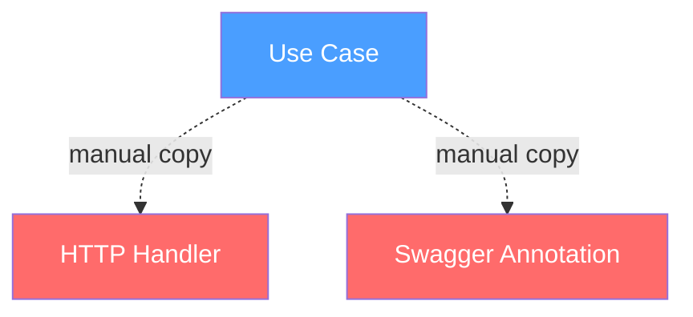
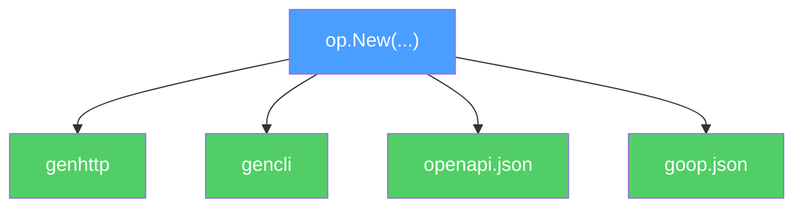
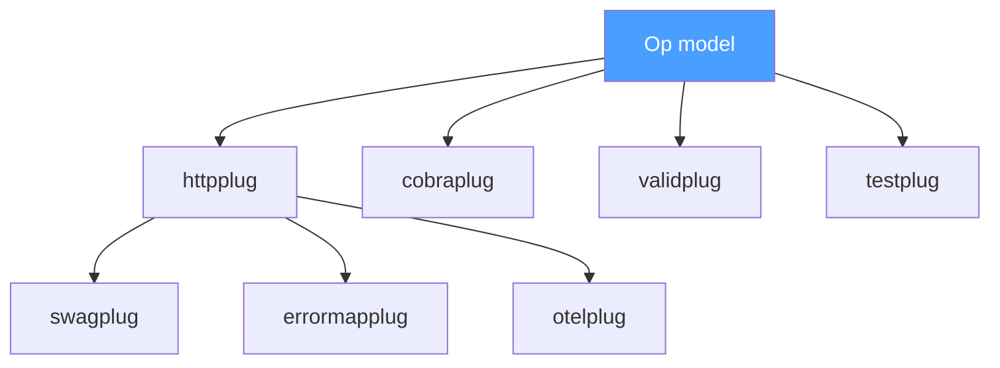

# Why Op Exists

## Strings, comments, and the long road to a DSL

I've been writing configuration in strings my entire career. And every time, the same thing happened.

In PHP, my team wrote swagger annotations in docblock comments — `@OA\Property`, `@OA\Response`, magic strings the compiler never touched. A typo in `@OA\Proprety` would silently produce wrong documentation. I found a library that offered a PHP DSL instead — real objects, real autocomplete, real type errors. My lead said "it's unproven, too risky." We stayed on strings.

Years later, as a tech lead myself, I replaced those annotations with Scramble — a tool that reads PHP types directly. No more third source of truth. We bought the Pro plan. It was a genuine improvement. But the model it built internally? Locked inside. One output: Swagger. Want something else from those parsed operations? Dig through the source.

The pattern kept repeating in every ecosystem I touched.

**Dockerfiles** — a string-based DSL with no variables, no conditionals, no imports. Then I found a Go package that lets you write Dockerfiles in Go. Then Dagger — programmable build pipelines with real dependencies, real types, real package management. Same problem, same migration: strings → typed DSL.

**Stress testing** — Vegeta, Yandex Tank — config files, CLI flags, string-based scenarios. Then K6 — write your load tests in TypeScript. Variables. Functions. Imports. IDE support. The moment you have a real language, the ceiling disappears.

**Framework configuration** — Laravel's PHP config files and service providers were the best configuration experience I've had. Bindings, environment-aware overrides, IDE autocomplete — all in the language you already write. The worst? Symfony's YAML. A string-based shadow of the language it configures.

Every migration followed the same arc: **strings → DSL on a real language**. And every time, the result was the same — type safety, compiler verification, IDE support, composability. Things that strings can never give you.

The question that kept nagging: *can't any string-based configuration be replaced by a typed DSL?* And if it can — why do we keep starting with strings?

Op started from that question. Not from "let's build a code generator." From "why are we still programming in comments?"

## The triple tax

Every HTTP endpoint in a Go application demands the same work three times.

**The use case** — the source of truth. A function with typed input, typed output, a context, and an error:

```go
func (a *AuthSignIn) Handle(ctx context.Context, input SignInInput) (*SignInOutput, error)
```

**The HTTP handler** — a mechanical copy. Bind JSON, call Handle, write response. Eighteen lines that carry zero business logic:

```go
grp.POST("/sign-in", func(ctx *gin.Context) {
    var input SignInInput
    if err := ctx.ShouldBindJSON(&input); err != nil {
        _ = ctx.Error(err)
        return
    }
    output, err := h.authSignIn.Handle(ctx, input)
    if err != nil {
        _ = ctx.Error(err)
        return
    }
    ctx.JSON(http.StatusOK, output)
})
```

**The swagger annotation** — a third source of truth, handwritten in godoc comments:

```go
//  @Summary  Sign in
//  @Tags     Auth
//  @Param    input  body      SignInInput   true  "input"
//  @Success  200    {object}  SignInOutput
//  @Router   /api/auth/sign-in [post]
```

All the information already lives in the types. The handler and the annotation are mechanical duplication. Four endpoints in one module — four identical handlers, four annotation blocks, plus an error-mapping middleware locked to your router. Multiply by every module in the application.

## Somebody already solved this

Surely someone noticed. They did.

**Huma** saw that Go types contain everything needed for an OpenAPI spec. Brilliant insight. She reads your structs, infers schemas, generates documentation — no annotations. She even has a public `Operation` struct — almost a descriptor. But `Method`, `Path`, `Parameters` with `in:"path"` are baked into that struct. The operation *is* an HTTP endpoint. Want to generate a CLI command from the same operation? Can't — the model doesn't know what a CLI is. Want OpenAPI from types without buying the whole framework? Can't — the insight is welded to Huma's router, middleware, and runtime reflection.

**swaggo** saw that documentation already lives in the code. And then asked developers to write it a third time — in godoc comments that the compiler cannot verify.

These two looked straight at the problem — types already describe operations — and either locked the solution inside a framework or gave up and fell back to annotations.

**Scramble** (PHP/Laravel) did the hardest part. They parsed controller methods, resolved return types, unwrapped generic collections, built a full operation model from source code. Enormous work. They *had* the model. And then they said "now let's generate Swagger" — and that was the only output. The model stayed locked inside. Want to generate your own artifact from the model? Sorry bro — dig through the source. Want advanced features? Pro version. They formulated the fundamental. Then made it proprietary. Twice — once by architecture, once by license.

But the pattern is wider than operations. The entire industry does this.

**GoReleaser** saw that cross-compilation is a declarative operation — GOOS × GOARCH × binary name. Pure data. She turned it into a YAML config and generates build matrices. But she welded that insight into her release pipeline. Want declarative cross-compile? Buy the whole release tool.

**Protobuf** deserves respect. A massive ecosystem and a proven example of a core with plugins — `protoc-gen-go`, `protoc-gen-grpc-gateway`, `protoc-gen-openapiv2`. Community plugins generating different projections from one `.proto` file. The plugin architecture is right. But Protobuf is not just an IDL — it's also a binary serialization format, with its own compiler and its own toolchain. It's not a Go DSL. And `google.api.http` annotations leaked into the IDL anyway — the transport-agnostic layer started carrying HTTP routes.

The pattern repeats: someone discovers something fundamental, then makes it proprietary to their tool. The insight becomes a feature of a framework instead of a primitive available to everyone.

Functional programming formalized this decades ago. A function is an operation: input, output, effects. This is not an HTTP concept. Not a CLI concept. Not a gRPC concept. It predates all of them.

`func(ctx context.Context, input I) (*O, error)` — this is the shape of an operation. It exists before any transport touches it.

And here is the gap nobody filled: Go generators are written in Go. `go/types` and `go/packages` give you full static analysis of Go source code at compile time. Wire proved the model — Go DSL in, generated Go code out, compiler verifies. But Wire is for dependency injection. Protobuf has the plugin architecture, but it's not a Go DSL — it's an external schema language with its own compiler. Smithy got the traits right, but it's not Go either.

Nobody built a Go-native operation model that generators can read. Not an HTTP framework. Not a binary protocol. Not an external IDL. A model of operations, written in Go, for Go generators. That's the gap.

## Separate the fundamental from the subjective

An operation is fundamental: name, kind (command or query), a handle function, input type, output type. Zero transport. Pure semantics.

HTTP is subjective. CLI is subjective. OpenAPI is subjective. They are projections of the same operation onto different surfaces.

Op is the boundary between the two.

```go
func Operations() []op.Descriptor {
    return []op.Descriptor{
        op.New("AuthSignIn", signIn.Handle,
            op.AsCommand(),
            op.Tags("Auth"),
            op.Comment("Sign in with email and OTP"),
        ),
    }
}
```

This is the entire DSL. Go types as IDL. No external schema language. No annotation comments. No runtime reflection. The Go compiler already knows `SignInInput` and `SignInOutput` — their fields, their types, their tags. `go/types` and `go/packages` can read all of it at compile time.

Plugins attach as traits:

```go
op.New("AuthSignIn", signIn.Handle,
    op.AsCommand(),
    httpplug.Post("/api/auth/sign-in"),
    swagplug.Summary("Sign in with email"),
)
```

Each plugin reads the model and generates its own artifact. The model does not know what plugins exist. Plugins do not know about each other — unless one explicitly depends on another. The dependency graph is a tree, never a cycle.

The generation flow follows the same path Wire proved at Google:

1. User writes `Operations()` with `op.New(...)` — DSL in plain Go
2. User runs `go generate` — triggers the Op generator
3. Generator reads Go types via `go/packages` + `go/types` — static analysis
4. Generator calls plugin generators — httpplug, swagplug, cobraplug
5. Plugins write `_gen.go` files — typed, compiled, committed
6. Go compiler verifies everything — if it compiles, it's correct
7. User calls generated code in main — runtime registration

Op is absent from runtime. It generates code and leaves. Like Wire — after `go generate`, there is no Wire. There is only `wire_gen.go`, which belongs to you.

## The bar

*A dark bar. Op sits at a table. A stack of generated files in front of him. User walks in.*

**User:** I need a `/health` endpoint. Just 200 OK. No Input, no Output, no operation. I'll hang it on the mux directly. You won't be offended?

**Op:** A what endpoint? I don't know what a "mux" is. I don't know what HTTP is. I described your operations — name, kind, handle function, input type, output type. What you do with them after generation is not something I have an opinion on. Or knowledge of.

**User:** ...right. But httpplug generated `genhttp.AuthSignIn` for me. What if I don't use it — write my own handler instead?

**Op:** My generated file becomes dead code. Delete the import, or don't. I don't watch you. I'm not runtime. I'm not even aware that httpplug exists — it reads *me*, not the other way around.

**User:** But... swagger? If I bypass genhttp, the spec won't know about my custom handler?

*swagplug leans out from behind the bar counter.*

**swagplug:** That's my department. I generated the OpenAPI spec from operations you described in the DSL. The spec documents the *contract* — Input type, Output type, tags, description. Not the handler implementation. If your custom handler accepts a different format — the spec lies. But that's your lie, not mine.

**User:** What if I add an endpoint that's not in the DSL at all?

**Op:** Then it doesn't exist in my world. I read `op.New(...)` calls. That's my universe. Whatever you do outside of it — I have no concept of. I'm not an HTTP router. I'm not a server. I'm a model of operations. If something isn't an operation — why would I know about it?

**User:** Is that... normal? Part of the endpoints in Op, part not?

**Op:** Does Wire know about all your dependencies? Or do you create some by hand in main?

**User:** ...some by hand.

**Op:** And Wire doesn't complain. Because Wire is a tool for the dependencies you gave it. I'm a tool for the operations you described. The rest is yours.

*Pause.*

**User** *(testing)*: Fine. What if I need to modify the generated handler — add middleware, change a status code, add a header?

**Op:** Don't touch generated files. `// Code generated. DO NOT EDIT.`

**httpplug** *(from behind the door)*: That's my area. I generated `genhttp.AuthSignIn` with a `Handler()` method that returns `http.Handler`. Wrap it in middleware from the outside. Or — change the trait in the DSL:

```go
op.New("AuthSignUp", signUp.Handle,
    op.AsCommand(),
    httpplug.Post("/api/auth/sign-up"),
    httpplug.Status(201),
)
```

Regenerate — and `genhttp.AuthSignUp` returns 201. Don't edit the generated file. Change the DSL — regenerate.

**User:** And if httpplug doesn't support what I need?

**httpplug:** Wrap from the outside, as middleware. Or write your own plugin. Or write the handler by hand. Op won't be offended. I won't be offended. We're tools, not supervisors.

**User:** OK but what if I disable swagplug and use swaggo instead?

**Op:** Try. Where will you put the annotations?

**User:** On... the generated handlers...

**Op:** `// Code generated. DO NOT EDIT.`

**User:** ...

**Op:** Exactly. Generated code is not a place for annotations. Annotations are manual input. Generated code is an artifact. You don't write comments in `wire_gen.go`.

**User:** So swagplug is not optional?

**Op:** It is. You can use swagplug — OpenAPI from types, compile-time, free. Write your own plugin — read `goop list --json`, generate whatever you want. Write the spec by hand. Use a different tool alongside Op for those endpoints. But annotation-based swagger on generated handlers — that's an architectural contradiction. Not because I forbid it. Because `DO NOT EDIT` plus annotations equals nonsense.

**swagplug** *(from the far corner, not turning around)*: I'm the only one who can do OpenAPI from Op's model without annotations and without runtime. Don't want me? Fine. But the alternative is writing the spec by hand.

*The bar door opens. More figures walk in.*

**User** *(looking around)*: Who else is in here?

**errormapplug** *(tired, leaning on the counter)*: You know those 80 lines of `errors.As` chains in your error middleware? Six domain errors, six `if` blocks, all locked to Gin? I can read Op's model, see the error traits, and generate that mapping. For any router.

**otelplug** *(sound of `span.End()` in the background)*: You're building span names from `c.Request.Method` and `c.FullPath()`. Op has a Name. Op has a Kind. httpplug has the method and path. I can create spans with the actual operation name — "AuthSignIn", not a Go function path. From the model.

**swagplug** *(still not turning)*: I don't know him.

**otelplug:** Mutual.

**cobraplug** *(entering with flags in hand)*: Same Input type. Same Handle. But instead of a JSON body — CLI flags. `--email`, `--password`. From the same struct fields. One model, two transports.

**validplug** *(polishing a glass behind the counter)*: You have `validate:"required,email"` tags on your Input structs. Who checks them? Each handler, manually. I validate *before* Handle is called. Op knows the InputType. I know the validator tags. Clean boundary.

*A note taped to the wall behind the bar reads: "errormapplug and validplug are here to demonstrate the boundary, not to sell you something. You might never need them. A global error middleware and validation inside your use case work just fine. The point is that the model makes these plugins* possible*, not mandatory."*

*From the darkest corner of the bar, a quiet voice.*

**testplug:** I generate test scaffolds. Typed Input. Typed Output. Expected errors from traits. You fill in the test cases. Not the boilerplate.

**User:** Who are you?

**testplug:** The one you always forget to invite.

*Op sits quietly. Drinks water.*

**User:** Op, did you invite all of them?

**Op:** I didn't invite anyone. I described a model. They came on their own. Because the model is fundamental. Each of them solves their own subjective problem. I don't know how many there will be. And I don't need to know.

**User:** And none of them know each other?

**swagplug** *(not turning)*: I know httpplug. The rest are irrelevant to me.

**otelplug:** I know httpplug. Might know cobraplug. Depends on the transport.

**cobraplug:** I don't know anyone. I only need Op.

**testplug:** I know everyone. But nobody knows me. As usual.

```
              Op (model)
             /    |    \
            /     |     \
    httpplug  cobraplug  validplug  testplug
    /     \
swagplug  errormapplug  otelplug
```

A tree. No cycles. Each plugin knows only what it depends on. The rest is noise in a dark bar.

## The picture

**The triple tax — before Op:**



**One model, infinite projections — with Op:**



**The plugin tree — who knows whom:**



## What we found

Op is not a code generator. Op is a typed operation model with three projections:

- **Verify** — check conventions at compile time (linter)
- **Generate** — produce typed code via plugins (httpplug, cobraplug, swagplug)
- **Describe** — emit structured JSON for external tools (`goop list --json`)

One model. Infinite projections. New transport = new plugin, not a new core.

The model does not own your runtime. It does not own your router. It does not own your CLI framework. It produces typed artifacts and leaves. What you do with them — your call.

Mixed mode is a design intent, not a compromise. An instrument that demands "everything through me" is a framework. An instrument that says "what goes through me — I guarantee; the rest is yours" is a library.

Op is a library.

---

*Code is ephemeral. Engineering is the discipline of thought — the eternal fight against complexity. The formulation of the model.*

*Next: the RFC. The model in detail. The decisions, the trade-offs, the stress tests.*