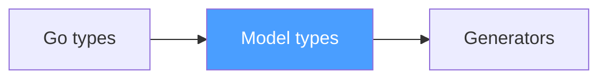
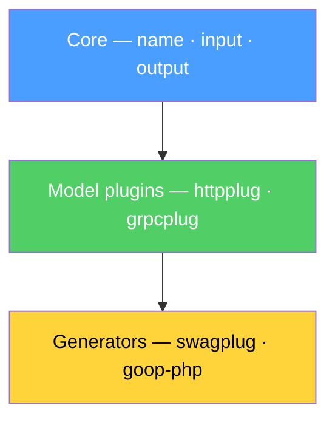
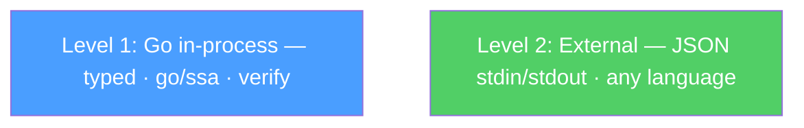

# Pub Bar Role Game

A 5-hour adversarial review session with DeepSeek produced more architectural clarity than weeks of solo design. The format: defend Op against a skeptic who alternates between sycophancy, straw-man attacks, and — eventually — real questions. Only the third phase was valuable. This devlog captures what survived the pressure.

This is not a debate transcript. It's a frozen record of discoveries that were born in conversation and don't exist anywhere else yet. No RFC. No POC. Just the WHY, before the WHAT.

Yes, we know what this looks like. A fanfic where IDLs and code generators walk into a bar and argue. We laughed at it too. But it turns out that humanizing tools and ecosystems — giving them voices, motivations, and counterarguments — is a surprisingly effective way to capture architectural reasoning through simple dialogue. Every "character" in the bar represents a real design decision, a real trade-off, a real competitor. The format is absurd. The content is not.

## The three phases of adversarial review

**Phase 1 — Sycophancy.** DeepSeek restated Op with enthusiasm. Typed the same ideas back with exclamation marks. Zero pushback. Zero value.

**Phase 2 — Straw-man attack.** Five "cracks" in Op's architecture. Three missed entirely — attacked an imaginary version of Op that doesn't exist. Two landed close but still argued against positions Op never held. This is the failure mode of LLM adversarial review: the model builds a caricature and demolishes it.

**Phase 3 — Real conversation.** Two genuine questions survived: (1) how does streaming work with Input-based cursor semantics, and (2) how does verification work on languages other than Go. Only when DeepSeek stopped flattering and stopped attacking straw men did the conversation begin.

DeepSeek's closing line: *"I leave interested. That's worth more."* Not excitement. Not skepticism. Interest. The correct reaction to a project at this stage.

## Discovery: Model Type System — firewall between Go and the world

Go types must not leak into the JSON model. `io.Reader` is Go. `*string` is Go. These are implementation details, not facts about the operation.

The model has its own types: `string`, `integer`, `number`, `boolean`, `binary`, `datetime`, `array`, `object`. Modifiers: `nullable`, `items`, `format`. The user never sees these — they write Go types, and the reader plugin (goop for Go) translates them into model types.

```
Go types → Model types (inside goop) → JSON → generators
```

Model types are the internal representation. Analogues exist everywhere: JSON Schema vocabulary, OpenAPI type system, Protobuf scalar types. The difference: Op's model types are not a spec you implement. They're an internal contract between reader and generator, invisible to the user.

This is a firewall. Go stays on one side. The world stays on the other. Generators never parse Go — they parse the model.

## Discovery: three roles, not two

The original design had two roles: core and plugins. The adversarial session revealed three:

**Core** — describes the operation: name, input, output, tags, comment. Knows nothing about transport, format, or language.

**Model plugins** — enrich the model with data that others read. `httpplug` adds routes and auth. `grpcplug` would add service definitions. `shaderplug` would add GPU bindings. They write to the model.

**Generators** — consume the model and produce artifacts. `swagplug` reads httpplug's data and writes OpenAPI JSON. `goop-php-http` reads httpplug's data and writes PHP handlers. They read from the model.

The key insight: `swagplug` is a pure generator. It has zero traits of its own. `Summary = Comment`. It adds nothing to the model — it only reads. This distinction matters for the plugin protocol: model plugins must run before generators, because generators depend on what model plugins wrote.

## Discovery: two levels of plugins

**Level 1 — Go in-process.** Typed accessors, `go/ssa` analysis, verify, import between plugins. httpplug imports op. swagplug imports httpplug. Standard Go dependency graph. Full power.

**Level 2 — External subprocess.** JSON on stdin, JSON on stdout. Any language, any binary. Executable convention: `goop-foo` in PATH = plugin `foo`. Same pattern as `protoc-gen-*`, same pattern as `git-*` subcommands.

Per-language SDK: Go plugins import `op` directly and get typed accessors. External plugins use an SDK in their own language that speaks the JSON protocol. A PHP plugin uses a PHP SDK. A Rust plugin uses a Rust SDK. The protocol is the same — the ergonomics are native.

`op.Build(...)` is the single entry point. Operations and pipeline in one DSL, one file. External plugins are declared in the DSL, not in a YAML config:

```go
op.Build(
    op.ExternalPlugin("goop-php-http"),
    op.ExternalPlugin("goop-ts-types"),
)
```

No config file next to the DSL. The DSL is the config.

## Discovery: bidirectional protocol for external plugins

External plugins are not read-only consumers. They can enrich the model.

JSON in → enriched JSON out → next plugin sees the new traits. An Idris plugin written in Idris adds Idris-specific traits. A Go plugin doesn't know about them and doesn't need to. The model grows through the pipeline.

This is what makes cross-language plugins first-class citizens, not second-class adapters. They have the same power as in-process plugins — they just speak JSON instead of Go types.

## Discovery: trait namespacing through module path

Trait keys must be globally unique. The solution: Go module path as namespace.

`github.com/thumbrise/op/httpplug.bearer` — globally unique by the same rules that make Go import paths unique. Core automatically takes the module path of the plugin as the trait prefix. Collisions are impossible for the same reasons they're impossible in Go's import system.

For other languages: `registry/package.trait`. Composer packages, npm packages, PyPI packages — each ecosystem already has a globally unique naming scheme. The trait namespace piggybacks on existing infrastructure.

No central registry. No coordination. No "please register your trait prefix." Just use your module path.

## Discovery: DSL per language, model is one

`ops.go`, `ops.php`, `ops.ts` — different entry points into the same model. Each DSL maps to the same Model types. The reader is a plugin: `go-reader`, `php-reader`, `ts-reader`. The model doesn't care who wrote it.

Op can generate a DSL for another language from itself:

```shell
goop list --json | goop-gen-php-dsl > ops.php
```

Any DSL generates any DSL through the model hub. The model is the interchange format, not any particular language.

## Discovery: Go as DSL doesn't require knowing Go

K6 doesn't require knowing JS/TS. Grafana Alloy doesn't require knowing its language. Op doesn't require knowing Go.

`op.New`, `op.Tags`, `op.Comment`, `httpplug.Post` — five functions, that's the entire vocabulary. IDE support is free: autocomplete, go to definition, compilation errors. A PHP developer writing `ops.go` is not "learning Go." They're filling in five blanks with strings and function references.

## Discovery: cross-language developers write generators, not DSLs

A PHP/TS/Python developer who wants Op in their ecosystem writes a generator. One file. stdin JSON → output files. No Java. No Gradle. No Maven. No SPI.

```shell
goop list --json | goop-php-http > handlers.php
```

The generator is written in the target language. PHP generates PHP. TypeScript generates TypeScript. Rust generates Rust. Each language generates itself — no 50-file Java bridge required.

## Discovery: verification on other languages — architecturally possible

The external plugin protocol allows verification on any language. Rust: `syn`/`ra_ap_syntax` for Rust AST analysis. TypeScript: `ts-morph` for TS AST analysis. The bridge is built. But nobody has walked across it yet.

Honest acknowledgment of stage: the architecture supports it, the implementation doesn't exist. This is not a promise. It's a possibility that the design doesn't foreclose.

## Adversarial evidence: Protobuf

Protobuf deserves respect. It proved the plugin model. But the adversarial session sharpened the contrast.

**IDL + anything vs IDL + binary serialization.** Protobuf is welded to a wire format. `varint`, field numbers, `bytes` — the core is serialization. Everything else is built on top. HTTP leaked into Protobuf through `google.api.http` annotations precisely because the core knows "how to serialize bytes," not "what an operation is." Op has no opinion about transport. No wire format. No serialization. The operation is input → output. How it travels is a plugin's concern.

**Isolated plugins.** Each `protoc` plugin receives one copy of the model. Plugins don't read each other. Data between plugins flows only through `.proto` annotations. In Op, Go plugins form a pipeline — swagplug imports httpplug, reads `BearerFrom(ctx)`, and documents auth. No annotations needed. No duplication.

**Protobuf created its own DSL out of necessity (2001).** Go didn't exist. There was no language with free static analysis via `go/types`. Op uses an existing language because it exists now. This is not NIH — it's using the tool that wasn't available when Protobuf was designed.

**A TS developer uses protoc for types.** They pay a tax: field numbers, wire format concepts, `protoc` binary, `.proto` syntax. Op gives types without the tax. Same benefit — typed contracts across boundaries — without the serialization baggage.

## Adversarial evidence: Smithy

Smithy was the deepest comparison. The adversarial pressure forced a line-by-line examination of what Smithy actually is vs what Op proposes. The findings are stark.

### Own language = own infrastructure

Smithy = IDL + own language + Java codegen + Go runtime. Own parser, own compiler, own IDE plugin, own formatter, own linter. Op = model in Go + `go/types` for free + zero runtime.

When you invent your own language, you must build everything that existing languages give for free. Smithy did. Op doesn't need to — `gopls`, `go fmt`, `go vet`, `golangci-lint`, the Go VS Code extension — all exist. Zero infrastructure investment.

### 50 Java files vs 1 generate.go

Smithy's Go codegen contains `GoWriter.java`, `SymbolVisitor.java`, `ImportDeclarations.java` — infrastructure for translating Java's understanding of Go into actual Go code. Three reasons for the complexity: (1) own language requires own parser, (2) text-based model requires text parsing vs `go/types` giving you AST for free, (3) monolithic codegen vs pipeline of focused plugins.

Op: `fmt.Fprintf` or Jennifer AST — Go generates Go natively. No translation layer.

### "Under construction" for 6 years

8 of 9 official Smithy Go generators are marked 🚧. Written in Java, require Java 17 + Gradle. The README says: *"DO NOT use the code generators in this repository."* Six years. Still not ready.

### Smithy reinvented Go inside Java

Type system, namespaces, conflict resolution, prelude — everything the Go compiler gives for free, Smithy rebuilt in Java.

`GoUsageIndex.java` (60 lines) = `op.InputTypeFrom(ctx)` (1 line). A `normalize()` mapping in a Java switch statement = a Go map literal (8 lines). The impedance mismatch between "Java understanding Go" and "Go understanding Go" is the root cause of the complexity.

### 72 traits in prelude

5 are fundamental. 67 are opinions: HTTP methods, XML serialization, CORS, compression, pagination, auth schemes. All baked into the prelude — loaded before your first line of Smithy.

Op: 4 functions in core (`New`, `Tags`, `Comment`, `NewSet`). Everything else is a plugin you choose to import. Want HTTP? `go get httpplug`. Don't want HTTP? Don't import it. The core doesn't know HTTP exists.

CLI is impossible with Smithy's prelude: 72 traits, zero of them relevant to CLI. In Op, `cobraplug` exists independently — it reads core, ignores httpplug entirely.

### Runtime in the binary

Smithy generates code that carries a runtime: middleware stack (5 phases), encoding (CBOR, JSON, XML), transport, auth, metrics, tracing, logging. The changelog contains fixes for data races in the runtime and allocation optimizations in middleware. `log.Printf` with two log levels (WARN, DEBUG) in 2026.

Op: zero runtime. `//go:build op`. `go list -deps | grep op` = empty.

### Smithy traits vs Op traits

Smithy traits have runtime validation, conflict resolution rules, selectors, `breakingChanges` metadata on every trait. Op traits are compile-time, typed keys, collisions impossible by construction, extension = `go get`. Smithy's `breakingChanges` on every trait vs Op's `diffplug` as a separate concern — breaking change detection is a projection, not a property of each trait.

A custom Smithy linter: Java + SPI + JAR + classpath. A custom Op linter: `go/analysis` Analyzer. Standard Go tooling.

### Smithy linters = heuristics

Smithy's built-in linters guess semantics from names: "operation name starts with `list` → should have pagination trait." Heuristics. String matching on identifiers.

Op: semantics live in types and traits, not in strings. If an operation needs pagination, a plugin adds a pagination trait. The linter checks the trait, not the name.

### Smithy TS codegen = 9 steps

Java 17, Gradle, Maven, Yarn workspaces, mono-repo setup, `build/smithy/source/typescript-codegen`. Nine steps before you see TypeScript output.

Op: `goop list --json | goop-ts-types --out=./types`. One pipe.

### Smithy release pipeline = 7 CLI tools

From a separate repository (`aws-go-multi-module-repository-tools`). UUID-based changelog entries with manual file renaming.

Op/gover: `gover release`. One command.

### Smithy OpenAPI conversion = 36 configuration options

A bridge between two different models. 36 knobs to configure the translation.

Op swagplug: zero configuration. Reads the model directly. No bridge. No translation. No knobs.

### Smithy codegen repo layout = 30+ files, 12 levels of nesting

Checkstyle, SpotBugs, Gradle wrapper, `META-INF/services`. Infrastructure for infrastructure.

Op external plugin: one file in the target language. stdin JSON → output files.

## Adversarial evidence: Smithy Rust and Box\<dyn Any\>

The Smithy Rust SDK uses `Box<dyn Any>` — type erasure. One `orchestrate` function handles all operations, so types are erased at the boundary. `downcast().unwrap()` — runtime panic if the type doesn't match.

This exists because the Orchestrator is a runtime framework: 4 phases, `ConfigBag`, `RuntimePlugins`, `Interceptors`. It was built as *"an AWS-internal initiative to bring the architecture of all SDKs closer."* The Orchestrator serves AWS's organizational need for SDK consistency, not the user's need for type safety.

Op's answer: generation, not runtime. Generate a separate typed function for each operation. Nothing to erase. Nothing to downcast. A thousand concrete functions instead of one universal pipeline. `any` is a problem of runtime frameworks. Generation is the answer to `any`.

## Philosophy sharpened under pressure

The adversarial session didn't create these principles — it sharpened them.

**Operation before transport.** "Create a dog" existed before HTTP, before gRPC, before TCP. The transport is a projection, not a definition. This is not a design choice. It's a fact about the world.

**Foundation vs framework.** A foundation has no opinion. A framework decides for you. 72 traits in a prelude = framework. 4 functions in core = foundation. Op is a foundation.

**NIH vs engineering.** NIH: the solution exists, you rewrite it. Engineering: the solution doesn't exist, you create it. Op uses `go/types`, `gopls`, `go fmt`, `go vet` — doesn't reinvent. A transport-agnostic operation model in Go didn't exist — Op creates it.

**Own world = own infrastructure.** Smithy invented a language → needs its own LSP, IDE plugin, formatter, linter, CI actions, awesome-list. Op uses Go → `gopls`, Go extension, `go fmt`, `golangci-lint`, `setup-go` — everything already exists.

**Each language generates itself.** PHP generator in PHP. TS generator in TS. Rust generator in Rust. Smithy: all generators in Java. 50 files of bridge per language. Op scales by community. Smithy scales by Java developers.

**Op is not only network.** GPU shaders, Unity inspector panels, timeline clips — also operations. Smithy = network call with wire protocol. Op = input → output. The domain is wider than the network.

**Go as DSL is sufficient as foundation, not as ceiling.** Go's type system is the base level. Traits extend it for specific ecosystems. Idris dependent types, TS optional fields, PHP file uploads — through traits, not through Go types. The ceiling is wherever the plugin author puts it.

**Input as universal mechanism for transport details.** `Bearer → UserID`, `Last-Event-ID → LastID`, `X-API-Key → ApiKey`. One pattern: transport detail → typed field via trait → business logic doesn't know the source. Clean. Universal. Testable.

**Code is a continuation of thought, not the other way around.** Model, devlogs, adversarial review — before the first line of code. POC is next. RFC after POC. Code after RFC. The thinking precedes the typing.

## The picture

**Firewall — Go stays on one side, the world on the other:**



**Three roles, not two:**



**Two levels of plugins:**



## Discovery: goop ≠ protoc

A subtle but important distinction that emerged under pressure.

The model lives in Go types. It's readable by `go/types` — stdlib. `goop` is a convenience CLI, not a gatekeeper. Without `goop`, the model is still accessible through standard Go tooling. Anyone can write a program that calls `go/packages.Load` and reads the same types that `goop` reads.

`protoc` is a gatekeeper. Without `protoc`, `.proto` files are text. You need the compiler to extract the model. With Op, the compiler is Go itself. `goop` is sugar on top.

