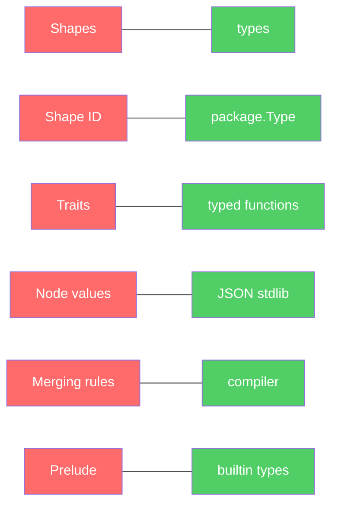
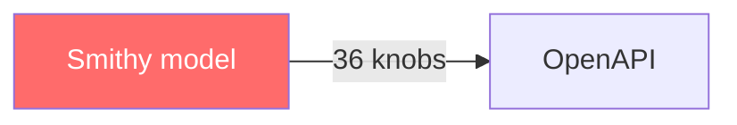
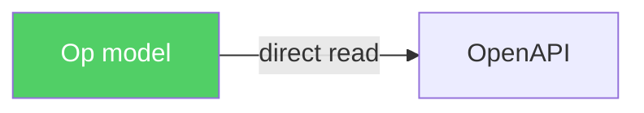

# The Bar Owner Speaks

## Smithy's semantic model — a parallel universe

*Smithy slides the specification across the table.*

**Smithy:** What do you think of my model?

*Op reads for a long time. Then, quietly:*

**Op:** Smithy, this is serious work. I respect it. But you just showed me why you became what you became.

You built your own universe. From scratch. Your own types. Your own graph. Your own merge rules. Your own prelude. Your own conflict resolution rules. Your own node value data model.

And every one of these decisions is correct. In isolation. But together they create a parallel world that must be maintained, documented, taught.

Let me go point by point.

**Shapes.** You say *"shapes are named data definitions."* Go has types. Same thing. But you wrote your own system, because you have your own language.

**Shape ID.** `smithy.example#MyShape`, `smithy.example#Foo$bar`. Go has `package.TypeName`, `package.Type.Field`. Same thing. But you wrote your own system, because you have your own namespace.

**Traits.** *"Specialized shapes that form the basis of Smithy's meta-model."* We have typed functions: `httpplug.Post(...)`. Same thing. But you wrote your own system, because you have your own DSL.

**Node values.** *"JSON-like values: null, string, number, boolean, array, object."* That's literally JSON. You described JSON. In your specification. As your own system.

**Merging model files.** Conflict resolution rules for metadata, shapes, traits. Go has a compiler. Two types with the same name in one package — compilation error. No rules needed. The compiler already knows.

**Prelude.** *"Defines various simple shapes and every trait defined in the core specification. All Smithy models automatically include the prelude."* Go has builtin types. `string`, `int`, `bool`, `error`. Automatically available. No prelude needed. The language already knows.

```
Smithy                          Go (Op)
──────────────────────────────────────────
Shapes                          types
Shape ID                        package.Type
Traits                          typed functions
Node values                     JSON (stdlib)
Merging / conflict resolution   compiler
Prelude                         builtin types
Semantic model                  go/types
Two representations (IDL+JSON)  one: Go source
```

You reinvented not just Go inside Java. You reinvented the type system, namespaces, conflict resolution, prelude — everything the Go compiler gives for free.

Not because you're foolish. Because you chose your own language. And your own language means: everything is your own. Parser, compiler, type system, namespace resolution, merge rules, prelude, IDE plugin, linter, formatter.

I chose someone else's language. And got all of it for free. That's the entire difference between 400 pages of specification and one `ops.go`.

## "What about my traits? They're similar to yours"

**Smithy:** What do you think of my traits? They're similar to yours, aren't they?

*Op nods.*

**Op:** Yes. Conceptually — the same thing. Metadata attached to a shape. But the implementation — two different worlds.

Let's compare honestly.

```
                        Smithy traits              Op traits
────────────────────────────────────────────────────────────────
What it is           shape in meta-model          Go function
Definition           @trait in .smithy             func Post(...) op.Trait
Application          @length(min: 1)               httpplug.Post("/api/dogs")
Value                node value (JSON-like)        typed struct in context
Value validation     runtime, per spec             compile-time, Go compiler
Conflicts            resolution rules              impossible (typed keys)
Scope                member > shape                context per operation
Extension            define new trait shape         import new Go package
External apply       apply MyString @docs(...)      no analogue, not needed
```

Seven differences. But three are key.

**First. You validate at runtime. I validate at compile-time.**

```smithy
@length(min: 1, max: "oops")  // ← string instead of number
                               // error: when loading the model
```

```go
httpplug.Post(123)  // ← number instead of string
                    // error: go build, immediately, in the IDE
```

Your error — when loading the model. My error — while typing code. Before build. Before run. In the IDE. In red.

**Second. Your conflicts have rules. My conflicts are impossible.**

You have an entire spec section: *"Trait conflict resolution."* If the same trait is applied twice — concatenate if list, ignore if equal, prohibit otherwise. Three rules. For an edge case.

My trait is a typed key in context. One key — one value. Written twice — last wins. Like `map[key] = value`. No conflict resolution. No rules. No spec section.

**Third. Your extension is a new trait shape. Mine is an import.**

```smithy
// Define a new trait in Smithy:
@trait(selector: "operation")
structure myCustomTrait {
    @required
    value: String
}
// Apply:
@myCustomTrait(value: "hello")
operation GetCity { ... }
```

```go
// Define a new trait in Op:
// (just a Go package)
package myplug

func Custom(value string) op.Trait {
    return op.SetTrait(customKey{}, value)
}

// Apply:
myplug.Custom("hello")
```

You — a new shape in the model, with a selector, with validation rules. Me — a new Go package with one function. `go get` and done.

Your traits are more powerful. Selectors, conflict resolution, external apply, member scope override. Real capabilities.

My traits are simpler. One function. One typed key. One context. Compiler checks.

Power vs simplicity. You chose power. I chose simplicity. And got 90% of your capabilities for 10% of the complexity.

Smithy's `breakingChanges` on every trait vs Op's `diffplug` as a separate concern. You embedded API evolution into the definition of every trait — `selector`, `conflicts`, `structurallyExclusive`, `breakingChanges` with JSON pointer paths and severity levels. Every trait author must think about backward compatibility at creation time. Before the trait is used. Before there's anything to break.

Op separates. Trait = fact. "This endpoint uses Bearer." Evolution = separate concern. "What breaks if we remove Bearer." Different questions. Different tools. Different time. `diffplug` reads two versions of the model, compares, reports. One plugin for all traits. Not a property of each trait.

Your price — complexity of definition. My price — no built-in diff. But I can add diff as a plugin. You can't remove complexity from the specification.

A custom Smithy linter: Java + SPI + JAR + classpath. A custom Op linter: `go/analysis` Analyzer. Standard Go tooling.

## Smithy linters = heuristics

Smithy's built-in linters (via `traitValidators` and selectors) guess semantics from structure: "operation name starts with `list` → should have pagination trait." Heuristics. String matching on identifiers.

Op: semantics live in types and traits, not in strings. If an operation needs pagination, a plugin adds a pagination trait. The linter checks the trait, not the name.

To write a custom Smithy linter: implement `software.amazon.smithy.model.validation.Validator` in Java, register via Java SPI (`META-INF/services`), build a JAR, put it on classpath, describe in `metadata validators` in `.smithy`. Seven steps.

To write a custom Op linter: one `go/analysis` Analyzer. Standard Go tooling. Works with `golangci-lint` out of the box.

**Haskell** *(from the FP table)*: Heuristics are a symptom. If the model knew, the linter wouldn't have to guess.

```
Smithy:  text → heuristic → "probably needs pagination"
Op:      types → trait → "this IS pagination"
```

## cobraplug asks one question

*A large figure with a gruff, hissing voice leans forward:*

**cobraplug:** Hey, buddy. Smithy. How do you generate CLI?

*Smithy is silent.*

*cobraplug waits.*

**Smithy:** We... don't have CLI generation.

**cobraplug:** What?

**Smithy:** CLI isn't our domain. We generate clients and servers for network protocols. HTTP, gRPC, CBOR. CLI is...

**cobraplug:** CLI is an operation. The same one. CreateDog. Input — Name, Breed. Output — ID. Just instead of a JSON body — flags. `--name Rex --breed Shepherd`.

You have 72 traits in your prelude. `@http`, `@cors`, `@httpHeader`, `@httpLabel`, `@httpQuery`, `@httpPrefixHeaders`, `@httpPayload`, `@httpChecksumRequired`, `@requestCompression`. Nine traits just for HTTP.

Zero for CLI.

Because you decided the world is HTTP. Your prelude is your opinion. And your opinion doesn't include CLI.

With Op:

```go
op.New("CreateDog", (*CreateDog).Handle,
    httpplug.Post("/api/dogs"),
    cobraplug.Command("create-dog"),
)
```

One operation. Two transports. HTTP and CLI. From one description. Because Op didn't decide the world is HTTP.

And you know what's funny? If tomorrow you need CLI, you'll have to add a `@cli` trait. To the prelude. New spec version. Breaking change for all existing models. Or — an annotation on the side. Like `google.api.http` in Protobuf. A guest in someone else's house.

With Op, tomorrow `mqttplug` appears. Day after — `graphqlplug`. In a year — `quantumplug`. And none of them touch core. None require a new spec version. `go get` and done.

*cobraplug takes a drag:*

72 traits. Zero for CLI. That's what it means to cement furniture into the floor. You chose which furniture to place. And threw out the rest. Forever.

## Smithy TS codegen = 9 steps

*A TS developer passes by, thin voice trembling:*

**TS dev:** Hey Smithy, bro. Cool tool. But I still can't figure out how to generate my TS. I'm getting some error like `gradle not found`.

*Reads the Smithy TypeScript quickstart. Counts:*

1. Java 17
2. Gradle
3. `smithy-build.json`
4. `smithy-aws-typescript-codegen` (Maven dependency)
5. `smithy build`
6. Yarn workspaces
7. `package.json` with path to `build/smithy/source/typescript-codegen`
8. `yarn generate && yarn build`
9. `concurrently`, `tsc`, `typedoc`, `downlevel-dts`, `rimraf`

Nine steps. Java. Gradle. Maven. Yarn workspaces. Mono-repo. To get `interface GetCityCommandInput { cityId: string }`.

With Op:

```shell
goop list --json | goop-ts-types --out=./types
```

One command. One binary. Result:

```typescript
// types/weather.ts
// Code generated by goop-ts-types. DO NOT EDIT.
export interface CreateDogInput {
    name: string;
    breed: string;
}
export interface CreateDogOutput {
    id: string;
}
```

No Java. No Gradle. No Maven. No Yarn workspaces. No mono-repo. No `build/smithy/source/typescript-codegen`. No nine steps.

And this killed me:

```json
"workspaces": [
    "smithy/build/smithy/source/typescript-codegen"
]
```

The path to generated code — five levels of nesting inside the build directory. You have to know Smithy's internal build output structure to connect your own generated package.

With Op, generated code goes where you said. `--out=./types`. Next to your code. Not inside `build/smithy/source/`.

**TS dev:** Do I even need Go to get types?

**Op:** No. You need the `goop` binary and JSON on stdin. Or even simpler — someone on the team ran `goop list --json > model.json`. You take `model.json` and run `goop-ts-types`. On your machine. Without Go. Without Java. Without Gradle.

*The TS developer sits down quietly. Then:*

Six years. Java. Gradle. Maven. Yarn workspaces. Mono-repo. For `interface GetCityCommandInput { cityId: string }`.

*gRPC and Protobuf are rolling on the floor:*

**Protobuf** *(through tears)*: Brother... at least `protoc-gen-ts` installs with one command...

**gRPC:** `npm install ts-proto`... and done... HAHAHA...

**Protobuf:** And they need... Java 17... Gradle... Maven... to generate TypeScript...

*gRPC wipes tears, suddenly serious:*

**gRPC:** Brother. We're laughing. But Op stripped us down too.

*Protobuf goes quiet.*

**gRPC:** We have one binary, but C++. Smithy has Java + Gradle. Op has one binary, Go, zero dependencies.

We have our own DSL. Smithy has their own DSL. Op has Go. Free parser, free IDE.

We're binary-only, HTTP leaked through annotations. Smithy has HTTP in prelude, CLI impossible. Op has any transport, as a plugin.

We're lying on the floor laughing at Smithy. And Op is standing there looking at both of us.

*Silence.*

**Protobuf** *(quietly)*: We all reinvented the same thing. Each in our own way. Each with our own tax. He's the only one who didn't reinvent. He took what already exists.

*Both stand up. Dust off. Look at Op with respect.*

**Protobuf:** You're still a README with one line. `# op`. Not a single line of code.

**Op:** Yes. But the model already exists. In the head. In the devlogs. In this bar.

Code is a continuation of thought. Not the other way around.

## The junior asks the obvious question

*A junior developer, Go as their first language:*

**Junior:** Smithy! Just cross-compile binaries and you're done, what's the problem?

*Smithy goes quiet for a long time. Then:*

**Smithy:** I can't.

**Junior:** Why?

**Smithy:** My code generator is Java. JVM. Gradle. Maven. Smithy build plugins are Java SPI. The entire architecture is the Java ecosystem. I can't compile this into a single binary.

Go can. `go build` → one binary. No dependencies. Any platform. `GOOS=linux GOARCH=amd64 go build`. Done.

I have JVM. Need a JRE. Or GraalVM native-image, which breaks reflection, SPI, and half my plugins.

**Junior:** And protoc?

**Protobuf** *(from the floor)*: I'm C++. One binary. Compiles. But try building protoc from source. CMake, Bazel, dependencies. That's why we distribute prebuilt binaries.

**Junior:** And goop?

**Op:**

```shell
GOOS=linux   GOARCH=amd64 go build -o goop-linux
GOOS=darwin  GOARCH=arm64 go build -o goop-mac
GOOS=windows GOARCH=amd64 go build -o goop.exe
```

Three commands. Three binaries. Zero dependencies. Download — works.

**Junior:** That simple?

**Op:** That simple. Because Go. A single binary isn't a feature. It's a property of the language. I didn't choose "make a single binary." I chose Go. The binary came free.

*The junior turns to Smithy:*

**Junior:** Why didn't you choose Go?

**Smithy:** Because in 2018... Go didn't have generics... and our team knew Java...

*Long pause.*

**gRPC** *(from the floor)*: Familiar.

## The C# Unity gamedev

*A figure in a hoodie, confused:*

**C# gamedev:** Smithy, I don't understand any of this. I wanted to generate bindings for my shaders. They're always the same boilerplate. Each shader takes uniforms as input and produces a result. That's literally `func(input) -> output`. Can I use you?

*Reads the Wire Protocol Selection page. rpcv2Cbor, awsJson1_0, precision ordered lists, client protocol selection, server protocol selection...*

I don't need a protocol. I don't have a server. I have a GPU.

**Smithy:** We're... not for that.

**C# gamedev:** I know. But Op said an operation is `func(ctx, I) (*O, error)`. My shader is an operation. Input — uniforms. Output — framebuffer. That's a fact.

Can I use Op?

**Op:**

```go
op.Build(
    op.ExternalPlugin("goop-csharp-shader-bindings"),
    op.ExternalPlugin("goop-unity-inspector"),
    op.New("BlurPass", (*BlurPass).Handle,
        op.Tags("PostProcessing"),
        op.Comment("Gaussian blur post-processing pass"),
        shaderplug.Uniform("radius", shaderplug.Float, shaderplug.Range(0, 100)),
        shaderplug.Uniform("sigma", shaderplug.Float, shaderplug.Range(0.1, 50)),
        shaderplug.Uniform("direction", shaderplug.Vec2),
        shaderplug.Target("framebuffer"),
    ),
)
```

One model. Two artifacts. `goop-csharp-shader-bindings` generates shader bindings for the programmer. `goop-unity-inspector` reads the same model and generates:

```csharp
// Code generated by goop-unity-inspector. DO NOT EDIT.
[CustomEditor(typeof(BlurPass))]
public class BlurPassEditor : Editor
{
    public override void OnInspectorGUI()
    {
        EditorGUILayout.LabelField("Gaussian blur post-processing pass");

        var radius = serializedObject.FindProperty("radius");
        EditorGUILayout.Slider(radius, 0f, 100f, new GUIContent("Radius"));

        var sigma = serializedObject.FindProperty("sigma");
        EditorGUILayout.Slider(sigma, 0.1f, 50f, new GUIContent("Sigma"));

        var direction = serializedObject.FindProperty("direction");
        EditorGUILayout.PropertyField(direction, new GUIContent("Direction"));

        serializedObject.ApplyModifiedProperties();
    }
}
```

`shaderplug.Range(0, 100)` — a trait. The binding generator uses it for clamp. The inspector generator uses it for slider min/max. One fact — two projections.

Want more? Add generators:

```
goop-unity-inspector  → Inspector controls for the designer
goop-csharp-shader    → C# bindings for the programmer
goop-unity-timeline   → Timeline clips for the animator
goop-shader-docs      → documentation for the tech artist
```

Four artifacts. Four audiences. One model. One `op.New`.

```
Smithy:  operation = network call with wire protocol
Op:      operation = input → output
```

The first excludes the gamedev. The second includes everyone.

## Go, the bar owner

*The door behind the counter opens. Everyone falls silent. Go walks out — the owner of this bar. The silence lasts what feels like an eternity.*

**Go:** Guys. I found some rules for IDLs. I'm not forcing you to write correct Go code. But try compiling incorrect code. Do you need rules?

*Slides Smithy's Style Guide across the counter. UpperCamelCase for shapes. lowerCamelCase for members. Singular for enums. Plural for lists. VerbNoun for operations. Four spaces. No trailing spaces. Omit commas except in single-line traits. UTF-8. Line Feed.*

**Go:** That's all correct. For a language that doesn't have a compiler.

With me:

```shell
go fmt
```

One command. Formatting isn't a style guide. Formatting is law. Not "SHOULD use four spaces." Tabs. Period. Not discussed. Not configurable.

Naming:

```shell
go vet
```

"Exported function comment should start with function name." Not a style guide. A diagnostic. UpperCamelCase for exported. lowerCamelCase for private. Not a convention. Language semantics. Capital letter = public. Lowercase = private. The compiler checks.

```
Smithy:  "Shape names SHOULD use UpperCamelCase"  → style guide → can be violated
Go:      Capital letter = exported                 → semantics → cannot be violated
```

Smithy wrote two pages of style guide because its DSL allows writing however you want. And rules are needed so people write the same way.

With me, you can't write "however you want." `go fmt` formats. `go vet` checks. The compiler rejects. You don't need a style guide. You need a compiler.

*Go sets his glass on the counter:*

Op uses me as a DSL. That means:

```
Formatting    → go fmt          (free)
Naming        → go vet          (free)
Types         → go/types        (free)
Autocomplete  → gopls           (free)
Navigation    → go to definition (free)
Linting       → golangci-lint   (free)
```

Smithy wrote a style guide, linters in Java, validators with SPI, a formatter for its DSL, an IDE plugin for its syntax.

Op wrote none of that. Because I already wrote all of it.

*Go turns to Smithy:*

You're a good engineer. You built an entire world. But you built it next to existing worlds. Op moved into mine. And got everything for free.

Do you need rules? No. You need a compiler. You already have one. It's called `go build`.

## swagplug counts 36 configuration options

*swagplug, wired as always:*

**swagplug:** I'm unhinged! Op, father! Tell me why this spec is so huge? Am I broken? Or am I normal?

*Slides the "Converting Smithy to OpenAPI" guide across the table. Reads it. All of it. Then counts:*

36 configuration options. To convert one model into another.

`service`, `protocol`, `version`, `tags`, `supportedTags`, `defaultBlobFormat`, `externalDocs`, `keepUnusedComponents`, `jsonContentType`, `forbidGreedyLabels`, `removeGreedyParameterSuffix`, `onHttpPrefixHeaders`, `ignoreUnsupportedTraits`, `substitutions`, `jsonAdd`, `useIntegerType`, `disableIntegerFormat`, `onErrorStatusConflict`, `alphanumericOnlyRefs`, `useJsonName`, `defaultTimestampFormat`, `unionStrategy`, `enumStrategy`, `mapStrategy`, `useInlineMaps`, `schemaDocumentExtensions`, `disableFeatures`, `supportNonNumericFloats`, `disableDefaultValues`, `disableIntEnums`, `addReferenceDescriptions`, `apiGatewayDefaults`, `apiGatewayType`, `disableCloudFormationSubstitution`, `additionalAllowedCorsHeaders`, `syncCorsPreflightIntegration`.

Because Smithy's model and OpenAPI are different models. Every mismatch is a configuration option. `unionStrategy`: how to map unions? `enumStrategy`: how to map enums? `onErrorStatusConflict`: what to do when two errors share one HTTP status?

```go
// swagplug — the entire configuration
func Generate(ctx op.GenerateContext) {
    for _, o := range op.AllOperations(ctx) {
        route := httpplug.RouteFrom(o)
        bearer := httpplug.BearerFrom(o)
        // → openapi.json
    }
}
```

Zero configuration. Because swagplug doesn't translate between two worlds. It reads the model and writes OpenAPI. Directly. No bridge.

Op's model already contains what OpenAPI wants. Route — a trait. Bearer — a trait. Tags — core. Comment — core. Input/Output types — core. No need to decide `unionStrategy` because Op's model doesn't have Smithy-style unions. No need for `onErrorStatusConflict` because HTTP status is an httpplug trait, not a model field.

Smithy → OpenAPI is translation between two languages. 36 options is the dictionary.

Op → OpenAPI is reading and writing. No dictionary needed.

**swagplug:** I'm not broken, father. I'm normal. It's the bridge that's abnormally large. Because the shores are too far apart.

## The picture

**Smithy reinvented what Go gives for free:**



**Smithy → OpenAPI: 36 config options. Op → OpenAPI: zero:**





