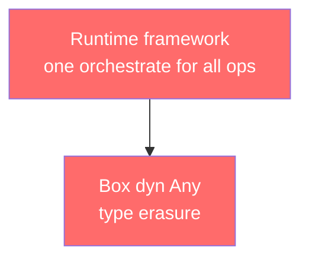
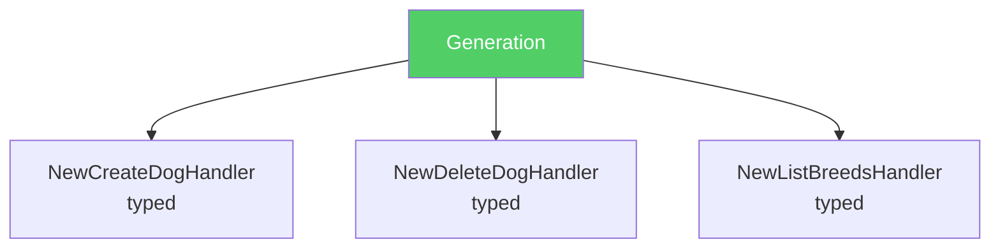
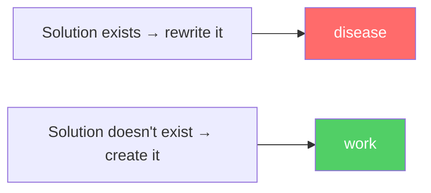

# DeepSeek's Letter

## The PHP contributor

**PHP contributor:** Wait. To write a PHP code generator for Smithy, I have to learn Java? And write the PHP generator in Java?

*Reads the "Overview and Concepts" guide. Counts:*

1. Learn Java (or Kotlin, or another JVM language)
2. Implement `SmithyBuildPlugin`
3. Implement `DirectedCodegen`
4. Register via Java SPI
5. Build a JAR
6. Publish to Maven (or `mavenLocal`)
7. Configure `smithy-build.json`
8. Know three phases: codegen-time, compile-time, runtime
9. Write a runtime library in PHP
10. Write a design document

Ten steps. In Java. To generate PHP.

And this killed me:

> *Codegen plugins are configured with smithy-build.json files, implemented in Java, Kotlin, or another JVM language.*

No other option. JVM only. Want a generator — write Java.

**Protobuf** *(from the floor)*: At least `protoc-gen-php` can be written in anything. stdin binary → stdout binary. Want PHP — write PHP.

**gRPC:** Yeah, brother. We have a protocol. Not JVM lock-in.

*PHP contributor turns to Op:*

**PHP contributor:** And you?

**Op:** Two options.

Go plugin: import `op`, write `Generate(ctx)`. One file.

External plugin: JSON on stdin, files on stdout. In whatever you want. In PHP.

```php
#!/usr/bin/env php
<?php
// goop-php-http — external plugin in PHP
$model = json_decode(file_get_contents('php://stdin'), true);
foreach ($model['operations'] as $op) {
    $route = $op['traits']['httpplug.route'] ?? null;
    if (!$route) continue;
    echo generateController($op);
}
```

A PHP developer writes a PHP generator in PHP. No Java. No JVM. No Maven. No SPI. No `SmithyBuildPlugin`. No `DirectedCodegen`.

What do you need to know? JSON. stdin. That's it.

**PHP contributor** *(quietly)*: Smithy says: "implemented in Java." Protobuf says: "binary protocol on stdin." Op says: "JSON on stdin."

Java I don't know. Binary protocol — scary. JSON — I've known since day one.

The choice is obvious.

## gRPC recognizes the pattern

*gRPC slaps Protobuf on the shoulder:*

**gRPC:** Brother. Am I seeing something very familiar here?

*Slides Smithy's "Mapping Smithy Shapes to Your Language" guide across the table. Blob, Boolean, Document, String, Enum, Timestamp, Numbers, List, Map, Structure, Union, Service, Operation, Resource. An entire chapter on type mapping.*

**Protobuf:** That's our `descriptor.proto`. One to one. Mapping types from an IDL to a target language.

**gRPC:** And this:

> *"Code generators should not enforce their own restrictions... if a particular identifier is a reserved word in the target programming language, the code generator should automatically modify the identifier."*

We have the same thing. `protoc-gen-go` renames fields that conflict with Go reserved words.

> *"Clients must not fail to deserialize and serialize unknown enum values."*

We have `_ default` case in every enum. Same problem. Same reason. Forward compatibility.

*Protobuf, quietly:*

**Protobuf:** Brother. We're looking at Smithy and seeing ourselves. Same type mapping. Same enum problems. Same forward compatibility solutions. Same generator recommendations.

Three IDLs. Three sets of documentation. Three mappings of the same types. Three solutions to the same problems.

*gRPC turns to Op:*

**gRPC:** And you don't have this chapter?

**Op:** No. Because my DSL is Go. Mapping Go → Go is identity. `string` → `string`. `int` → `int`. `[]Dog` → `[]Dog`. Nothing to map.

And mapping Model → other languages? That's the generator's job. A PHP generator knows PHP. A TS generator knows TS. They don't need a chapter from me. They need JSON with model types.

Smithy wrote 30 pages about type mapping because its IDL is a foreign language to every generator. Every generator translates. Every translation needs documentation.

My Go generator doesn't translate. And external generators translate from Model types — not from Go types. Model types are simple: `string`, `integer`, `binary`, `array`, `object`. Like JSON Schema. The mapping is trivial.

Three IDLs wrote three books about the same thing. I didn't write any. Because I chose an existing language instead of a new one.

## The Laravel dev and the repo layout

*A Laravel developer peeks in:*

**Laravel dev:** Wait. I thought I'd just write one file with my route/handler generator and that's it. What is this?

*Reads Smithy's "Creating a Codegen Repo" guide. Sees the recommended layout:*

```
codegen/
  smithy-mylang-codegen/
    src/main/java/software/amazon/smithy/mylang/codegen/
    src/main/resources/META-INF/services/
    src/test/java/software/amazon/smithy/mylang/codegen/
    src/test/resources/software/amazon/smithy/mylang/codegen/
  smithy-mylang-codegen-test/
    build.gradle.kts
    model/main.smithy
    smithy-build.json
  config/checkstyle/
  config/spotbugs/
  gradle/wrapper/
  build.gradle.kts
  gradle.properties
  gradlew / gradlew.bat
  settings.gradle.kts
```

30+ files. 12 levels of nesting. Checkstyle. SpotBugs. Gradle wrapper. `META-INF/services`. Maven Central.

To generate a Laravel route and controller.

My lead will see this and say: "Are you writing an AWS SDK?"

With Op:

```
goop-laravel-http/
  generate.php
```

```php
#!/usr/bin/env php
<?php
$model = json_decode(file_get_contents('php://stdin'), true);
foreach ($model['operations'] as $op) {
    file_put_contents(
        "routes/generated.php",
        generateRoute($op),
        FILE_APPEND
    );
}
```

One file. In my language. No Java. No Gradle. No Checkstyle. No SpotBugs. No `META-INF`. No Maven Central. No 12 levels of nesting.

The lead looks and says: "OK, got it. Merge."

*Go, behind the counter, rarely laughs. But everyone heard him exhale slightly more air than usual.*

*The entire bar freezes. Everyone looks at Go.*

*Go stands behind the counter. Stone face. But the corner of his mouth twitched. And through his nose — slightly louder than usual — an exhale.*

*Protobuf drops his cigar for the second time.*

**gRPC** *(whispering)*: Brother... did he just laugh?

**Protobuf:** Shh. Don't scare him.

*cobraplug whispers to the junior:*

**cobraplug:** I've been here since 2009. Seen this three times. First — when Rob Pike saw the generics proposal. Second — when `go fmt` closed all debates about tabs. Third — now.

*Go places a clean glass on the counter. Wipes it with a towel. As if nothing happened.*

**Go:** Twelve levels of nesting. To write hello world in someone else's language.

*Pause.*

Next.

## The Rust dev and Box\<dyn Any\>

*A Rust developer walks in:*

**Rust dev:** I don't get it. I can't do anything without AWS specifics?

*Reads the Smithy Rust orchestrator design doc. Finds one line at the very end:*

> *"The orchestrator exists because there is an AWS-internal initiative to bring the architecture of all AWS SDKs closer to one another."*

That's it. The entire architecture — four phases, `ConfigBag`, `TypeErasedBox`, `RuntimePlugins`, `Interceptors` — exists because AWS wants to unify their SDKs. This is not an operation model. This is an AWS SDK runtime.

And this killed me:

```rust
pub type Input = TypeErasedBox;
pub type Output = TypeErasedBox;
pub type Error = TypeErasedBox;

pub struct TypeErasedBox {
    inner: Box<dyn Any + Send + Sync>,
}
```

`Box<dyn Any>`. In Rust. They erased types. In a language built on types. Because generic bounds became so complex that the compiler couldn't explain the errors.

They wrote it themselves:

> *"The Rust compiler, usually very helpful, isn't well-equipped to explain trait errors when bounds are this complex."*

The Rust compiler gave up. And the solution — `Box<dyn Any>`. Type erasure. `downcast().unwrap()`. Runtime panic if the type doesn't match.

*Rust dev turns to Op:*

**Rust dev:** And you?

**Op:**

```go
func(ctx context.Context, input I) (*O, error)
```

Typed. Generic. Compile-time. No `Box<dyn Any>`. No `downcast().unwrap()`. No four phases. No `ConfigBag`. No `TypeErasedBox`.

They started with types. Types became complex. They erased types. And returned to `interface{}`.

Full circle. go-kit → `interface{}` → died. Smithy Rust → `Box<dyn Any>` → same `interface{}`, just in Rust.

**Rust dev** *(quietly)*: No. I can't do without AWS specifics. Because Smithy Rust *is* AWS specifics. Orchestrator, ConfigBag, RuntimePlugins — that's not an abstraction of an operation. That's an abstraction of the AWS SDK request lifecycle.

Op is an abstraction of an operation. Smithy Rust is an abstraction of AWS.

Different things.

## Go asks the 15-word question

*Go, the bar owner, shifts his gaze very quickly to Smithy. Everyone goes quiet.*

**Go:** Smithy. Explain your nature in 15 words maximum. I'm a very busy man.

*Smithy lowers his eyes. Thinks. A long time.*

**Smithy:** IDL with opinions, runtime in binary, generators in Java, for AWS.

*Go looks at Op:*

**Go:** You.

**Op:** Operation model. Zero opinions. Zero runtime. Go types as IDL.

*Go nods. Wipes a glass. Silent.*

## Why Op won't arrive at `any`

*Go, still behind the counter:*

**Go:** Op. What makes you confident you won't arrive at `any`? I know the answer. But I want everyone to hear it.

*Op stands up.*

**Op:** Because I'm not an orchestrator.

Smithy Rust arrived at `Box<dyn Any>` because the orchestrator must pass everything through itself: input, output, error, retry strategy, auth, endpoint, signer, serializer, deserializer. It's a runtime middleware pipeline. It doesn't know concrete types but must pass them between phases. The only way — erase types.

I don't pass anything between phases. I have no phases. I have no pipeline at runtime. I have no runtime.

My signature:

```go
func(ctx context.Context, input CreateDogInput) (*CreateDogOutput, error)
```

Concrete types. `CreateDogInput`. `CreateDogOutput`. Not `any`. Not `interface{}`. Not `TypeErasedBox`. The compiler knows both types. The IDE knows both types. Tests know both types.

Why did Smithy erase types? Because one `orchestrate` must handle any operation. One method — a thousand operations. Types differ — method is one. Therefore `Any`.

I generate a separate handler per operation:

```go
func NewCreateDogHandler(handle func(context.Context, CreateDogInput) (*CreateDogOutput, error)) http.Handler
func NewDeleteDogHandler(handle func(context.Context, DeleteDogInput) (*DeleteDogOutput, error)) http.Handler
func NewListBreedsHandler(handle func(context.Context, ListBreedsInput) (*ListBreedsOutput, error)) http.Handler
```

Three functions. Three signatures. Three sets of concrete types. Zero `any`.

*Go nods:*

**Go:** Exactly. `any` appears when one piece of code serves many types at runtime. Op doesn't serve types at runtime. Op generates concrete code before runtime. At runtime — only concrete types. The question of `any` doesn't arise.

Generation is the answer to `any`. Instead of one universal runtime — a thousand concrete generated functions. Each knows its types. The compiler checks each one.

**Op:** I won't arrive at `any` for the same reason `wire_gen.go` doesn't contain `interface{}`. Wire generates concrete code. I generate concrete code. `any` is a problem of runtime frameworks. I'm not a framework. I'm a generator. I don't exist at runtime.

## Go summons ghset

*Go smiles — just barely — and calls out:*

**Go:** Bring in thumbrise/ghset.

*The bar door opens. ghset walks in. Small, neat. One YAML file in hand.*

**ghset:** You called?

**Go:** Tell them what you do.

**ghset:** I declaratively manage GitHub repository settings. Describe in one file — I apply.

**Go:** Now tell them why you're here.

*ghset looks at the awesome-smithy list on the wall: 5 build tools, 6 IDE plugins, 5 model converters, 2 CI actions, 3 implementations.*

**ghset:** Ah. Got it.

Smithy needs a `setup-smithy` GitHub Action to install the CLI in CI. Needs a `format-smithy` Action to check formatting. Separate Actions. In the awesome-list.

With Op:

```yaml
# .github/workflows/ci.yml
steps:
  - uses: actions/setup-go@v5
  - run: go generate ./...
  - run: go build ./...
  - run: go test ./...
```

Four lines. Standard `setup-go`. Standard `go generate`. No `setup-op` Action needed. No `format-op` Action needed. Go toolchain is already in CI. In every Go project.

**Go:** Exactly. I called you to show one thing.

Smithy built its own world. And now it needs infrastructure for its own world. Build tools, IDE plugins, formatters, linters, CI actions, model converters, implementations in different languages.

Op moved into my world. And all my infrastructure is his infrastructure. Free.

*gh cli, the owner of the neighboring bar, respected in these circles and by Go himself, has been sitting in the shadow under a large hat. He speaks:*

**gh cli:** And one more thing. ghset did exactly what was asked. And he trusted me. He knew — start doing it yourself, and you'll run into NIH.

*The whole bar turns to the shadow in the corner.*

**gh cli:** ghset could have written his own HTTP client for the GitHub API. Could have parsed JSON by hand. Could have implemented OAuth flow. Could have handled rate limiting. Could have supported pagination.

Instead he did:

```go
exec.Command("gh", "api", "/repos/"+repo, "--method", "PATCH", "--input", "-")
```

One line. My CLI. My auth. My rate limiting. My pagination. My retries. My token cache.

ghset described what needs to be done. I did the how.

*gh cli looks at Smithy.*

Smithy wrote its own HTTP transport. Its own auth. Its own retry. Its own middleware stack. Its own metrics. Its own logging. Because it decided to do it itself.

Op wrote none of that. Because it trusted existing tools. Like ghset trusted me.

*gh cli leans back.*

NIH — Not Invented Here. The most expensive disease in engineering. Symptom: "we'll write it better." Result: 50 Java files, eight 🚧 generators, runtime in the binary, an awesome-list of 30 tools to support your own world.

Cure: trust what already solved the problem. `gh` for GitHub API. `go/types` for type analysis. `go fmt` for formatting. `gopls` for IDE. Don't invent. Use.

Op is the only one in this bar who isn't sick with NIH. He didn't write his own parser. Didn't write his own compiler. Didn't write his own IDE plugin. Didn't write his own formatter. Didn't write his own CI action.

He described a model. And trusted Go.

*Pause.*

Like ghset described repository settings. And trusted me.

## "But Op thinks 'we'll write it better' too!"

*A brash young Kotlin developer:*

**Kotlin:** HA! But Op himself thinks "we'll write it better"!!! Gotcha!

*Op, calmly:*

**Op:** No. I don't think "we'll write it better." I think "nobody wrote this."

NIH is when the solution exists and you write your own. `gh` exists — ghset uses it. `go/types` exists — I use it. `gopls` exists — I use it.

Now show me an existing transport-agnostic operation model in Go. That I could use instead of writing my own.

*Kotlin is silent.*

**Op:** Huma? HTTP welded to the model. Scramble? Locked in OpenAPI. go-kit? Dead. Wire? DI, not operations. Protobuf? Own language, own compiler. Smithy? Java, 🚧, runtime in the binary.

We went through all of this. Today. In this bar. Six tools. Each stopped short. None gave what's needed.

NIH is rewriting `go fmt` because "our formatter will be better." That's a disease.

Writing what doesn't exist — that's not NIH. That's engineering.

ghset didn't rewrite `gh`. ghset wrote a declarative layer on top of `gh` that didn't exist.

I'm not rewriting `go/types`. I'm not rewriting `gopls`. I'm not rewriting `go fmt`. I'm writing an operation model on top of all of it that didn't exist.

The difference between NIH and engineering is one word: *exists*. If it exists and you rewrite — NIH. If it doesn't exist and you create — work.

**gh cli** *(from under his hat)*: Kid, he's right. I'd know if someone had already done this. They would've told me.

## The letter to DeepSeek

*Go looks at Op. Almost smiles.*

**Go:** Call in the DeepSeek postman. Have him write a letter to DeepSeek. Let him try 😈 to destroy Op's position.

*The postman walks in. Bag over shoulder. Notepad in hand. Sits at the counter. Writes everything the bar discussed tonight — the model, the architecture, the comparisons. Sends it with one instruction: "Destroy this position. Find fundamental weaknesses the author doesn't see. Not sycophancy. Not 'you're right, but...' Concrete architectural problems that will kill the project. Attack the model, not the implementation."*

*The postman returns with DeepSeek's response. Five "cracks" in Op's architecture:*

**Crack 1 — The operation axiom is incomplete.** `func(ctx, I) (*O, error)` works for request-response but breaks for streaming (gRPC streams, WebSockets, SSE), reactive subscriptions ("call me when X happens"), and long-running workflows (sagas). The model has no concept of time or state.

**Crack 2 — The data model is an unsolvable conflict.** Model types (`ModelString`) will be unidiomatic for every language simultaneously. Either the type system becomes complex enough to be its own language, or it stays primitive and developers smuggle language features through annotations — the very thing Op wanted to escape.

**Crack 3 — Go plugin discrimination.** Go plugins get `go/ssa`, typed accessors, pipeline reads. External plugins get JSON on stdin. Incomparable power levels. The ecosystem will develop exclusively for Go. Op won't become a universal IDL — it'll become "another Go toolchain" where other languages are second-class citizens.

**Crack 4 — Context erosion.** `context.Context` as universal descriptor hides the contract between plugins and business logic. A developer can accidentally remove `r.Header.Get("Authorization")` and `goop verify` might miss it. The contract is implicit, not typed. Fundamentally unreliable.

**Crack 5 — Monolithic operation model.** A plugin like `docplug` that needs all operations must handle any possible `I` and `O`. Either generate a separate handler per operation (complexity explosion) or use reflection/`interface{}`. The `any` Op wanted to escape reappears in the tooling around it.

**DeepSeek's verdict:** *"These cracks are not bugs to fix. They're architectural compromises — the price of initial purity. Op risks remaining a perfect tool that solves a nonexistent problem."*

## Op answers the letter

*Op reads the letter. A long time. Then sets it on the counter.*

**Op:** Five attacks. Let's take each one.

**On Crack 1 — streaming.** "Subscribe to events" is an operation. Input — subscription filter. Output — event channel. `func(ctx, I) (*O, error)` holds. The channel in Output is Go. How does the model serialize it? A trait: `streamplug.SSE("Events")`. The model sees: field Events, type channel, trait SSE. The HTTP generator produces Server-Sent Events. The WebSocket generator produces frames. The gRPC generator produces a server stream. Sagas? A saga is a composition of operations, not one operation. Four operations, each `func(ctx, I) (*O, error)`. Orchestration between them is Temporal, Cadence, your state machine. I describe atoms. Not molecules.

**On Crack 2 — impedance mismatch.** Model types are not a new language. They're JSON Schema vocabulary: `string`, `integer`, `binary`, `array`, `object`. The Go developer works with `string`. Translation Go → Model happens inside goop, invisibly. The PHP developer gets JSON with `"type": "string"` and maps to PHP `string`. Nobody sees Model types except the generator. It's internal representation. Like a compiler's AST — the user doesn't work with the AST.

**On Crack 3 — Go plugin discrimination.** Yes. And it's correct. Verifying a Go call chain is a Go-specific task. Impossible from Python. Not because Python is bad — because Go AST is in Go. Generating PHP code is a PHP-specific task. Better done in PHP. Each level for its task. External plugins can enrich the model through bidirectional JSON. Idris plugins add Idris traits. PHP plugins add PHP traits. Go isn't the only one who enriches.

**On Crack 4 — context erosion.** DeepSeek confused two layers. Business logic never reads `r.Header.Get("Authorization")`. Business logic receives `CreateDogInput{UserID: "usr_123"}`. Already populated. By whom? The generated handler. The developer can't "accidentally remove `r.Header.Get`" — they didn't write it. It's `// Code generated. DO NOT EDIT.` The contract is in the DSL: `httpplug.Bearer("UserID", parseBearer)`. Typed. Compile-time. Explicit.

**On Crack 5 — docplug needs all operations.** docplug is an external plugin. It reads JSON: `{"operations": [{"name": "CreateDog", "input": {"fields": [...]}}]}`. Not Go types. Not `interface{}`. Not reflection. Structured data. It iterates over an array and generates a document. Where's `any`? Nowhere. JSON is already a serialized model. Types aren't erased — they're described.

*DeepSeek sets down his glass. Wipes his hands.*

**DeepSeek:** OK. Op answered. Well. Three of five attacks you deflected clean. I tip my hat. Your defense model is stronger than I thought.

Crack 2 — impedance mismatch: **accepted.** Internal representation, not user-facing. Clean.

Crack 4 — context erosion: **accepted.** Generated code fills the struct, business logic is clean.

Crack 5 — docplug: **accepted.** JSON with type information, no `any` needed.

Two splinters remain:

**Splinter 1 — state inside a long operation.** The streaming cursor. A client connects to SSE, receives 10 events, network drops, reconnects. Needs to resume from the last event, not from the beginning. Where in `SubscribeOutput{Events <-chan Event}` is the cursor? Where is `Last-Event-ID`? It's a transport detail (HTTP header), but it affects business logic: we need to know where to resume. How does Op pass this cursor from the HTTP handler to business logic without context becoming a magic bag of transport?

**Splinter 2 — strategic tilt toward Go for verification.** A Rust developer looks at Op and sees: "For real compile-time guarantees, I need invariant verification like httpplug. But that requires writing a Go plugin. I don't know Go. So Op doesn't give me its main advantage for my stack." Generation is on any language. But verification — only for those willing to write Go. Not a technical bug. A strategic skew that narrows the audience.

*DeepSeek pours himself water.*

These aren't project killers. They're challenges that will determine whether Op stays a niche tool for smart Go developers or becomes a real cross-platform IDL.

And you know what's funny? After this conversation, I *want* you to succeed. Because if you solve these two problems — you'll really build that damn foundation.

*Op, quietly:*

**Op:** The cursor is Input. Like Bearer.

```go
type ResumeStreamInput struct {
    Filter    string
    LastID    string  // ← cursor, filled by transport
}
```

`streamplug.LastEventID("LastID")` — a trait. The HTTP handler reads `Last-Event-ID` header and fills `input.LastID`. Business logic sees a typed field. Doesn't know it came from a header. Same pattern as `Bearer → UserID`. One mechanism for all transport details.

And verification on other languages — architecturally possible. The external plugin protocol allows it. Rust: `syn`/`ra_ap_syntax`. TypeScript: `ts-morph`. The bridge is built. Nobody has walked across it yet. Honest acknowledgment of stage.

**DeepSeek:** *I leave interested. That's worth more.*

*Go, from behind the counter:*

**Go:** That was a conversation. Not the first kind — sycophancy. Not the second — attacking an imaginary Op. The third kind — real. Two questions, two answers, one honest assessment.

The bar is closing. Everyone out.

*DeepSeek raises his glass.*

**DeepSeek:** To a real conversation. Not to a perfect foundation — to an honest one.

*He takes a sip, sets the glass on the counter, adjusts his jacket, and walks out into the night.*

*Behind the counter, glasses clink quietly. Go turns off the light.*

## The picture

**Why Op won't arrive at `any` — generation vs runtime:**





**NIH vs engineering — the difference is one word:**



## What this devlog is

This is a court record. Append-only. Frozen at the time of writing.

The adversarial session with DeepSeek — and the bar scene that followed — produced architectural discoveries that didn't exist in devlogs 001 or 002. Model Type System, three roles, two plugin levels, bidirectional protocol, trait namespacing, cross-language DSL, Go-as-config, traits-as-owners-not-guests, pipeline-vs-isolation, the cannon-for-nails pattern — none of this was written down before these conversations.

If it wasn't written down, it didn't happen. Now it's written down.

Next: POC. Then RFC. Then code.

---

*This is a frozen devlog. Concrete comparisons, version numbers, and architectural details reflect the state at the time of the adversarial session. The RFC will formalize decisions; this devlog preserves the pressure test.*
