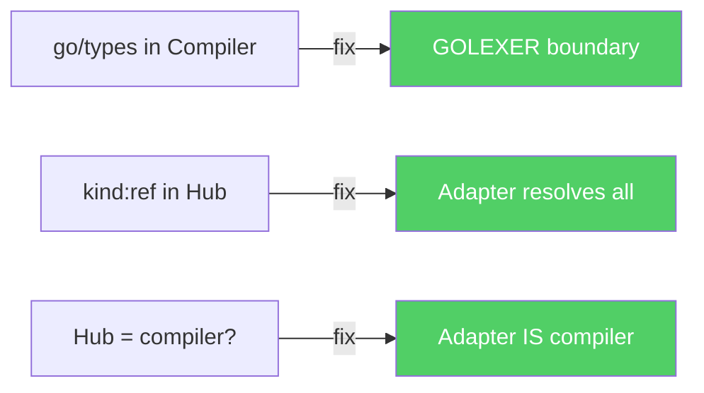
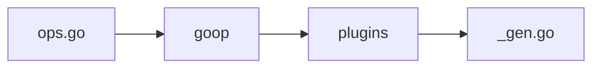
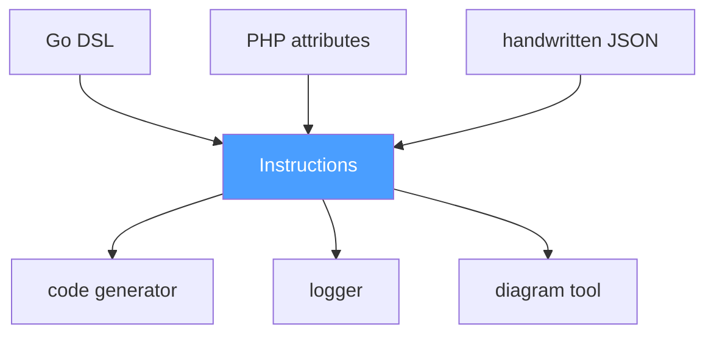

# The Epilogue

The bar closed in devlog #3g. DeepSeek walked out into the night. Go turned off the lights. We had a model, a philosophy, and a plan: build the POC, write the RFC, ship the code.

Then we started writing the compiler. And the compiler taught us something the bar never could.

## The Zend Engine Analogy

It began with a naming problem. What does our compiler *return*?

We drew an analogy with PHP's Zend Engine. Its compiler accepts an AST and returns an array of instructions — opcodes — for the virtual machine to execute. We don't have a virtual machine. We don't have bytes. But we have the same shape: a compiler that accepts a structured description and returns atomic, executable units.

Not "opcodes" — we have no byte representation. **Instructions.** Declarative prescriptions that any interpreter can read: a code generator, a linter, a logger, a diagram tool. The name stuck. The central structure had its identity.

## The First Leak

We designed the compiler to accept `[]Operation`, where each operation carried a `*types.Func` — a Go-specific type from `go/types`. The compiler was supposed to be universal, but it was infected with Go from birth.

If the compiler knows about `go/types`, it cannot process operations from PHP, Rust, or a handwritten JSON file. The universal layer had a language-specific dependency. The abstraction leaked.

The fix: **GOLEXER** — the last component that knows Go. It takes `*types.Func`, resolves all types recursively, and outputs clean `Signature` structures. After GOLEXER, Go is gone. The compiler sees only language-agnostic data.

The boundary was drawn. Everything after GOLEXER forgot where the operations came from.

## The Second Leak

Same pattern, one level higher.

We designed the Hub — the central aggregator — and gave it the ability to resolve type references. An instruction could contain `{"kind": "ref", "pkg": "github.com/myapp/dogs", "name": "CreateDogInput"}`, and the Hub would look up the definition.

But `pkg` is a Go import path. If the Hub resolves Go packages, it's not language-agnostic. We had re-introduced Go through the back door.

The fix: the **adapter resolves everything**. The Hub receives only fully-resolved types — no references, no package paths, no language-specific identifiers. The Hub becomes dumber. And cleaner.

## The Third Leak (and the Pattern)

We noticed that the Hub was doing compilation: validating, resolving, enriching. But if the adapter already resolves all types and validates signatures — the adapter *is* the compiler. The Hub is just an optional aggregator.

`op-dsl-php | op-generator-laravel` works without a Hub. The adapter compiles. The generator consumes. The pipe connects them. No central authority required.

Three times, the same error: **language specifics leaked into the universal layer.** Three times, the same fix: push the boundary outward, toward the source. Each time, the core became dumber and cleaner.

We recognized the pattern. It wasn't a bug — it was gravity. The architecture *wanted* to be a protocol. We just had to stop resisting.

## DSL Is Just a Frontend

If the adapter is the compiler, and the Hub is optional, then the DSL is just a convenient frontend for a particular toolchain.

A Go developer writes `//go:build op` files. A PHP developer writes attributes. A Rust developer writes proc macros. A tired engineer writes raw JSON by hand at 2 AM. `curl -X POST` with a JSON body is also a valid producer.

DSL is a special case of Producer. Not the other way around.

## The Moment

Everything collapsed into a single realization:

We are not building a Go tool with plugins. We are not building a code generator. We are not building a DSL.

We are formalizing an **application-layer protocol** for describing operations.

Not a transport protocol — an application protocol. The only claim we make to the world: *"Here is what a fundamental operation actually is, and here is how the Expression Problem is solved through traits."*

JSON is an opinion, not a requirement. Transport is a detail. Language is a detail. Even the consumer of instructions is not required to be a code generator — it can be a logger, an auditing system, an analytics pipeline, a visualizer, or anything that needs to understand operations.

## The Chain

Each step was forced by the previous one. Nothing was planned. Nothing was "visionary." We were solving concrete problems — a leaking abstraction here, a misplaced dependency there — and the protocol emerged as the only consistent solution.

1. Zend analogy → compiler returns Instructions, not opaque blobs
2. `go/types` in Compiler → GOLEXER as the boundary → everything after it is language-agnostic
3. `kind: "ref"` in Hub → adapter resolves everything → Hub receives only clean data
4. Hub = compiler → no, adapter = compiler → Hub is optional
5. `curl` is also a Producer → DSL is just a frontend
6. Who validates the contract? → drivers do, per spec → decentralized control
7. Consumer ≠ generator → consumer is anything → this is a protocol

Like Torvalds starting with a terminal emulator and discovering he was writing a kernel. We started with "why do I declare the same endpoint three times" and discovered we were formalizing a protocol.

## The picture

**Three leaks, three fixes — each pushed Go further out:**

**Before — a Go tool:**

**After — a protocol:**

## What Changed

**Before this chain:**
Op = a typed operation model for Go, with plugin-based code generators.

**After:**
Op = a transport-agnostic, language-agnostic, application-layer semantic protocol for describing operations, solving the Expression Problem through traits.

The next devlog — #4, *The Operations Protocol* — is the manifesto that this realization produced. This devlog is the path that led to it.

---

*The bar is closed. The lights are off. But the conversation never stopped. It just moved from a dark counter to a compiler terminal — and from there, to a protocol specification.*
