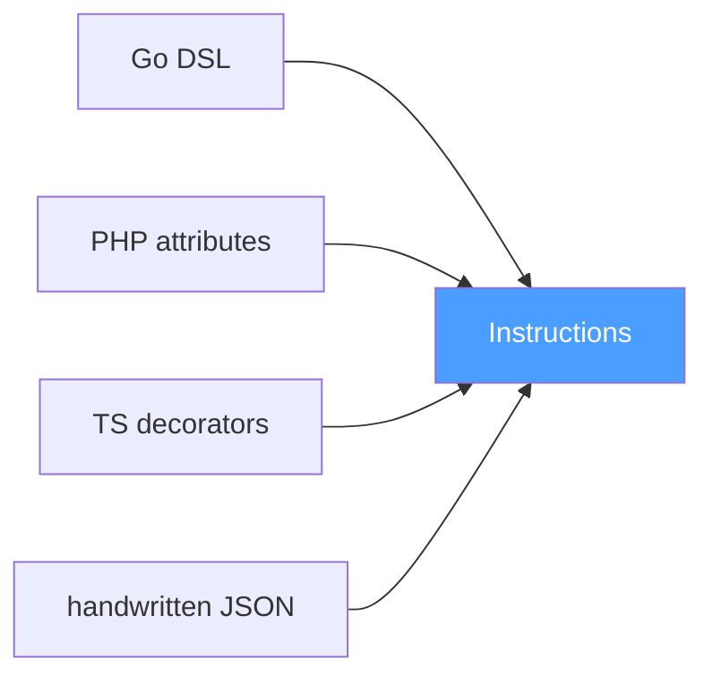
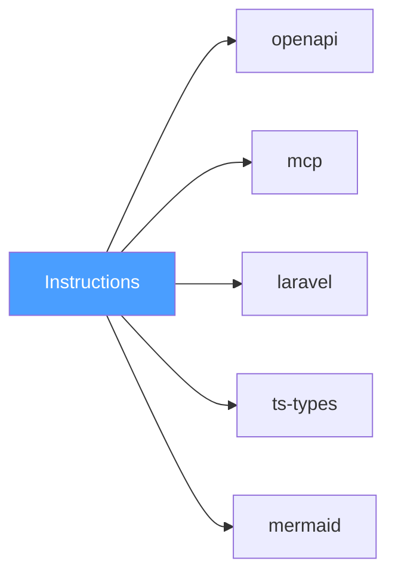

# The Operations Protocol: Formalizing the Missing Foundation

We started with a simple pain: writing the same endpoint three times. Handler, swagger annotation, CLI command — all describing the same operation. Every Go project we touched carried this duplication.

We assumed someone must have solved this. A transport-agnostic way to describe an operation once and generate everything else. We were wrong.

## The Research Trail

We combed through every technology that came close:

**GraphQL** — a full language with its own parser, linter, and IDE support. Transport-agnostic in theory, but its operations are forever bound to a data graph. Not a foundation — a projection.

**AsyncAPI** — protocol-agnostic and event-driven. Their v3.0 refactor explicitly separated channels from operations, proving that decoupling transport from semantics is the right path. Still, it lives in the event-driven domain. Not a foundation — a parallel universe.

**OpenAPI** — the trigger of our journey. An operation is an HTTP method + path. Everything beyond REST requires vendor extensions. Not a foundation — the most popular projection.

**Protobuf and gRPC** — Protobuf is an IDL for binary serialization; gRPC is an RPC framework bolted on top. HTTP/2 is baked in. Custom options exist but are guests in a house built for wire formats. Not a foundation.

**Apache Thrift** — a direct competitor to Protobuf with more flexible transports. Still anchored in RPC. Not a foundation.

**tRPC** — brilliant for TypeScript monoliths where TypeScript itself is the IDL. Attempts to cross languages lose the seamless typing. Not a foundation.

**FIDL** — Google's IDL for Fuchsia IPC. Designed for Zircon channels and wire format. Proof that the idea of language-agnostic interfaces is alive, but locked to an OS. Not a foundation.

**Smithy** — the closest in spirit. Traits, resources, operations. But it's a full language with a Java toolchain, AWS-specific semantics, and a prelude of 72 traits. The right categories, the wrong accessibility. Not a foundation — a parallel ecosystem.

**SBVR** — the OMG standard for business semantics. A meta-model for defining vocabularies and rules. Not a competitor — philosophical proof that standardizing semantics, not syntax, is a recognized need.

**CommonAccord** — structured legal agreements as object-oriented text. Another proof that semantic standardization transcends programming.

**MCP** — Anthropic's Model Context Protocol. Transport-agnostic, capability-based, and designed for LLM tool calling. Not a competitor — a sibling protocol from an adjacent universe, confirming the pattern.

**CORBA IDL** — the ancestor. Language-neutral, platform-independent. It failed due to complexity, but its core insight — separate interface from implementation — was correct.

## The Gap

Every researched technology either:
- Dictates a transport (HTTP, gRPC, IPC),
- Imposes a domain (RPC, events, data graphs),
- Introduces a new language with its own toolchain,
- Or embeds opinions that prevent true universality.

None of them answer: *What is an operation, fundamentally?*

They all build castles without agreeing on the foundation.

## The Formalization

```go
// MyOperation description
func MyOperation(context.Context, Input) (Output, error)
```

That signature is itself an opinion — the Go language's way of expressing cancellation
and deadlines. The foundational truth is simpler: an operation is a mapping from
input to output, with the possibility of failure.

```go
// MyOperation description
func MyOperation(Input) (Output, error)
```

Context is a best practice, not a requirement. A Go developer may choose to include it;
an Idris developer may encode effects in the type system; a PHP developer may rely on
a framework's dependency injection. The protocol does not care. It only records the
input and output types. The producer decides how to capture the rest.

And a smart producer can go even further. A Go DSL scraper, for instance, could
statically analyze the function body and extract the concrete error types the
operation returns:

```go
// MyOperation description
func MyOperation(*Input) (*Output, error){
	return &Output{}, errors.Join(ErrMy1, ErrMy2, ErrMy3)
}
```

That level of introspection is not part of Op itself — it is a DX feature of a
particular producer. The protocol does not mandate it; it simply provides a place
to record the result.

Even the surface syntax is up to the producer. A Go developer might prefer a plain
interface — no framework calls, no build tags, just types:

```go
type DogOperations interface {
    Buy(DogBuyInput) DogBuyOutput
    Wash(DogWashInput) DogWashOutput
}
```

The protocol does not break. The model does not break. How the producer extracts
operations from this interface is the producer's concern. Op only cares about what
comes out: a name, an input type, an output type.

An operation, stripped of all opinion, is:

- A name.
- A description.
- An input type.
- An output type.
- The possibility of failure.

That's it. No transport. No serialization. No wire format. No resource lifecycle. No CRUD semantics.

**This is the missing foundation.**

We call it **Op — the Operations Protocol**.

## Solving the Expression Problem

How do we add HTTP routes, gRPC services, authentication, pagination, or Idris-style dependent types without changing the core?

**Traits.**

A trait is a namespaced key-value extension attached to an operation. The core knows nothing about specific traits. Plugins add traits. Consumers read traits they recognize and ignore the rest.

This solves the Expression Problem:
- New transports? Add a trait plugin.
- New languages? Write a generator that reads relevant traits.
- New semantic constraints? Add a verifier plugin that inspects traits.

The core never changes. The ecosystem expands infinitely.

## The Protocol: A Decentralized Interface

Op defines a **decentralized interface** for operations. There is no central authority, no mandatory hub. Instructions can be produced anywhere, consumed anywhere, and transformed anywhere.

Op specifies:

1. **A semantic model** — name, description, input type, output type, tags.
2. **A type system** — primitives (`string`, `integer`, `boolean`, `float`, `binary`, `datetime`) and containers (`array`, `object`). Types are fully resolved; no external references.
3. **Traits** — globally namespaced extensions (e.g., `github.com/…/httpplug.route`). Plugins add them; consumers read them.
4. **Instructions** — versioned, fully resolved units containing all of the above. An instruction is the atomic unit of the protocol.

Instructions are independent of:
- **Language** — they can be produced from Go, PHP, TypeScript, YAML, or handwritten JSON.
- **Transport** — they flow through stdin, files, HTTP, gRPC, or message queues.
- **Serialization** — JSON is the recommended default, but the model is format-agnostic.
- **Consumer** — a consumer of instructions is not required to be a code generator. It can be a logger, an auditing system, an analytics pipeline, a visualizer, or anything that needs to understand operations.

Producers are free to define their own surface syntax. A Go developer might write:

```go
//go:build op

func Operations() []op.Operation {
    return []op.Operation{
        op.New("BuyDog", (*PetShop).Buy),
        op.New("WashDog", (*PetShop).Wash),
    }
}
```

Another team might prefer a single interface:

```go
type DogOperations interface {
    Buy(DogBuyInput) DogBuyOutput
    Wash(DogWashInput) DogWashOutput
}
```

A developer preferring configuration to code could write pure JSON:

```json
{
  "operations": [
    {
      "name": "BuyDog",
      "input": { "kind": "object", "fields": [{"name": "breed", "type": {"kind": "string"}}] },
      "output": { "kind": "object", "fields": [{"name": "orderId", "type": {"kind": "string"}}] }
    }
  ]
}
```

A TypeScript developer could use decorators:

```typescript
class PetShop {
  @Op({ name: 'BuyDog' })
  buy(input: BuyDogInput): BuyDogOutput {
    // ...
  }
}
```

<details>
<summary><b>More language examples: Rust, PHP, YAML, Python, Elixir</b></summary>

A Rust developer could use procedural macros:

```rust
#[op::operation(name = "BuyDog")]
fn buy_dog(input: BuyDogInput) -> Result<BuyDogOutput, OpError> {
    // ...
}
```

A PHP developer could use attributes:

```php
#[Op\Operation(name: 'BuyDog')]
class BuyDogHandler {
    public function __invoke(BuyDogInput $input): BuyDogOutput {
        // ...
    }
}
```

Or plain YAML for those who prefer configuration files:

```yaml
operations:
  - name: BuyDog
    input:
      kind: object
      fields:
        - name: breed
          type: string
    output:
      kind: object
      fields:
        - name: orderId
          type: string
```

A Python developer could use decorators:

```python
@op.operation(name="BuyDog")
def buy_dog(input: BuyDogInput) -> BuyDogOutput:
    ...
```

An Elixir developer could use macros:

```elixir
defoperation :buy_dog, input: BuyDogInput, output: BuyDogOutput do
  # ...
end
```

</details>

The means by which a producer gathers operations from the user does not matter. A Go interface, a Rust macro, a YAML config file — all are transient models, conveniences of a particular toolchain. The producer's sole responsibility is to translate that surface syntax into Op Instructions. Elegance of DSL or brevity of configuration is the implementer's prerogative, exactly as with any other application‑layer protocol. Only the contract and interoperability matter.

These examples are not production code. They are DSLs — a deliberate choice inspired by the pattern Google Wire established in the Go ecosystem. The files containing these definitions may live behind a build tag, in a separate module, or even in an entirely different repository. They exist only to describe operations; they are never compiled into the final binary.

This separation is not a requirement. A team may choose to annotate their existing production handlers directly and generate artifacts on the fly. The protocol imposes neither path. It accommodates both.

That is the essential character of Op. We provide a place for tools to interoperate without dictating anyone's workflow. The only things we insist upon are a sound foundational model of an operation, a solution to the Expression Problem, and guaranteed interoperability across languages and transports.

### Example Instruction Set (Current Draft)

The following JSON represents five operations as they might appear in the current
working draft. Field names and structure are subject to change as the RFC evolves.

```json
{
  "version": 1,
  "operations": [
    {
      "name": "BuyDog",
      "description": "Purchase a dog from the pet shop",
      "tags": ["pets", "commerce"],
      "input": {
        "kind": "object",
        "fields": [
          {"name": "breed", "type": {"kind": "string"}},
          {"name": "quantity", "type": {"kind": "integer"}}
        ]
      },
      "output": {
        "kind": "object",
        "fields": [
          {"name": "orderId", "type": {"kind": "string"}},
          {"name": "total", "type": {"kind": "float"}}
        ]
      },
      "traits": {
        "github.com/thumbrise/op/httpplug.route": {
          "method": "POST",
          "path": "/pets/dogs/buy"
        }
      }
    },
    {
      "name": "WashDog",
      "description": "Schedule a dog wash",
      "tags": ["pets", "services"],
      "input": {
        "kind": "object",
        "fields": [
          {"name": "dogId", "type": {"kind": "string"}},
          {"name": "serviceType", "type": {"kind": "string"}}
        ]
      },
      "output": {
        "kind": "object",
        "fields": [
          {"name": "appointmentId", "type": {"kind": "string"}}
        ]
      },
      "traits": {}
    },
    {
      "name": "ListBreeds",
      "description": "List all available dog breeds",
      "tags": ["pets"],
      "input": {
        "kind": "object",
        "fields": []
      },
      "output": {
        "kind": "object",
        "fields": [
          {"name": "breeds", "type": {"kind": "array", "items": {"kind": "string"}}}
        ]
      },
      "traits": {
        "github.com/thumbrise/op/httpplug.route": {
          "method": "GET",
          "path": "/pets/breeds"
        }
      }
    },
    {
      "name": "AdoptDog",
      "description": "Adopt a dog — requires authentication",
      "tags": ["pets", "auth"],
      "input": {
        "kind": "object",
        "fields": [
          {"name": "dogId", "type": {"kind": "string"}},
          {"name": "userId", "type": {"kind": "string"}}
        ]
      },
      "output": {
        "kind": "object",
        "fields": [
          {"name": "adoptionId", "type": {"kind": "string"}},
          {"name": "adoptedAt", "type": {"kind": "datetime"}}
        ]
      },
      "traits": {
        "github.com/thumbrise/op/httpplug.route": {
          "method": "POST",
          "path": "/pets/dogs/adopt"
        },
        "github.com/thumbrise/op/httpplug.bearer": {
          "field": "userId"
        }
      }
    },
    {
      "name": "GenerateReport",
      "description": "Generate a PDF report of all adoptions",
      "tags": ["reports"],
      "input": {
        "kind": "object",
        "fields": [
          {"name": "from", "type": {"kind": "datetime"}},
          {"name": "to", "type": {"kind": "datetime"}}
        ]
      },
      "output": {
        "kind": "object",
        "fields": [
          {"name": "reportUrl", "type": {"kind": "string"}},
          {"name": "generatedAt", "type": {"kind": "datetime"}}
        ]
      },
      "traits": {}
    }
  ]
}
```

This is a snapshot of work in progress. The final specification will be defined in the RFC.

## Why Not Just Generate Everything Manually?

You could trust existing tools. Write a custom script, glue together some OpenAPI generators, or hand‑roll a TypeScript client. The chance that a ready‑made solution exists for your exact stack depends entirely on adoption and ecosystem breadth.

We will build tools we find useful — and tools useful to others. But the real shift is this: instead of writing an entire generator from scratch, you could write *only* a parser for your Laravel attributes. Just the part that understands your framework's conventions and emits Op Instructions.

Maybe that attribute parser already exists. Maybe a Swagger generator for PHP already exists — one that reads Op Instructions and produces OpenAPI. Both are possible only if both tools target the same protocol.

Op provides that protocol. Write a parser once, and every generator that speaks Op becomes available to you. Write a generator once, and every DSL that emits Op can feed it. The protocol is the multiplier.

This is a many-to-many relationship.

Generators do not know who produced the instructions they consume. Emitters have no certainty about where the development team intends to send the resulting instructions — to a local file, a remote service, or another tool in a pipeline. Neither side is coupled to the other.

This creates absolute, independent decoupling. Producers and consumers evolve separately, deploy separately, and can be swapped without coordination. The protocol is the only contract.

Someone writes a Swagger generator. It does one thing well: reads Op Instructions and produces an OpenAPI specification. Anyone can pipe instructions to it. Any ecosystem. The Swagger generator continues doing its job well, unaware of whether the instructions came from Go, PHP, Rust, or a handwritten JSON file.

And this is merely the tip of the iceberg.

## Why Not Just Use OpenAPI as the Foundational Format? It's Already a Specification, It's Reliable, and We Could Just Write Generators That Target It.

OpenAPI as a foundation is like standardizing global freight transport around a single brilliant invention: the oil tanker. The tanker is robust, well‑specified, and undeniably effective. It has standard valves, grounding protocols, and compartmentalized storage. But try shipping gravel in it. Or a flock of sheep. Or a single porcelain vase. The tanker imposes a shape on its cargo — liquid — and a method of loading — pumping. It cannot help but dictate *how* things must be packed.

OpenAPI dictates that every operation is an HTTP method at a specific path with a request body and a response status code. That is its cargo shape. It is perfect for REST APIs and utterly silent on everything else.

Now, set the metaphor aside.

OpenAPI is a specification for describing HTTP endpoints. Its fundamental abstraction is the HTTP operation: a combination of method, path, headers, and a request/response body. This is not a universal definition of an operation; it is a definition of an HTTP exchange. When a developer attempts to use OpenAPI as the source of truth for a system that extends beyond REST, the impedance mismatch becomes immediately visible.

Consider a CLI tool. An operation here is a command with flags and arguments. There is no HTTP method, no path, no status codes. To generate a Cobra command from an OpenAPI specification, a tool must invent heuristics: map `GET` to a read command, `POST` to a create command, infer flag names from query parameters. These heuristics are brittle, vary between generators, and break when the API design does not follow strict REST conventions. The underlying problem is that OpenAPI lacks a primitive for "this is an operation." It only has a primitive for "this is an HTTP endpoint."

Consider gRPC. The operation is a procedure call with a typed input message and a typed output message. OpenAPI can be converted to gRPC, but the translation is lossy and requires a separate specification of how HTTP semantics map to protocol buffers. The industry has produced an entire ecosystem of annotations (`google.api.http`) precisely to bolt HTTP semantics onto Protobuf definitions. This is the inverse of the CLI problem, and it exists because neither OpenAPI nor Protobuf defines an operation independent of its transport.

Consider GraphQL. The operation is a query or mutation against a schema. There is no concept of a URL path or an HTTP verb at the model level. Generating an OpenAPI spec from a GraphQL schema is an exercise in approximation.

Consider asynchronous messaging. An operation in an event‑driven system is a message sent to a queue or a topic. OpenAPI has no vocabulary for this. The AsyncAPI specification was created specifically to fill this gap, and even it acknowledges the distinction between a channel and an operation.

In every case, the tooling is forced to compensate for the absence of a transport‑agnostic operation model. OpenAPI, for all its strengths, is a projection — a shadow of the operation cast onto the wall of HTTP. Op is the object that casts the shadow.

## So, How Are You Different from MCP and Its Generators?

We watched the MCP ecosystem explode with a mixture of awe and horror. Awe, because Anthropic built a genuinely elegant, transport-agnostic protocol that LLMs desperately needed. Horror, because of what happened next.

The industry, traumatized by the zoo of AI tools, collectively sighed, *"Finally, a standard!"* And then, instead of using it to describe the *semantics* of a tool, they started building an even bigger zoo of generators. The logic was: *"We have OpenAPI, let's build `openapi-mcp-generator`! We have GraphQL, let's build `graphql-mcp-server`! We have random code, let's build `mcp-anything`!"*

Do you see the pattern? They are building **projections of projections**. GitHub had to launch an official **MCP Registry** just to help developers find tools in this self-created chaos—a registry of hundreds of servers, a significant chunk of which are just thin wrappers over OpenAPI or GraphQL. They didn't reduce complexity; they moved it to a new directory.

And let's be brutally honest about what these generators actually do: they take an OpenAPI spec, which already has a JSON Schema, and they… copy-paste that JSON Schema into the MCP tool definition. That's not code generation; that's a glorified file copy with extra steps. It's like watching someone buy a universal travel adapter, only to plug it into a power strip already overflowing with other adapters. You fixed the plug shape, but you're still drawing power from the same overloaded, humming outlet.

MCP solved the *transport* problem beautifully. It completely missed the *semantic* problem.

This is where Op draws the line. MCP is a brilliant **runtime protocol** for calling tools. Op is the **compile-time protocol** for defining them.

Our `op-generator-mcp-server` doesn't care if the operation came from Go, Rust, PHP, or a handwritten JSON file. It reads the fundamental `Input` and `Output` types, resolves them once, and produces a clean, native MCP server implementation. No HTTP methods to guess. No regex parsing. No "maybe this is a tool" heuristics.

But the difference runs deeper. The industry isn't just fighting a zoo; it's trapped in a **combinatorial explosion**.

In the world, there are:
- **N** transport protocols (TCP, HTTP/2, gRPC, stdio, files…)
- **M** application protocols (REST, GraphQL, MCP, JSON-RPC…)
- **X** schema formats (OpenAPI, Protobuf, GraphQL Schema…)
- **Y** serialization formats (JSON, MessagePack, CBOR…)
- **Z** programming languages (Go, Rust, TypeScript, PHP…)
- **W** styles of description (annotations, YAML, macros, interfaces…)

Multiply them. Want an MCP server in Go from an OpenAPI spec described in YAML, with business logic in PHP? That's **N × M × X × Y × Z × W** possible paths. And for every single path, the industry is building a bridge, an adapter, another adapter for the adapter. It's a hamster on a wheel — legs blurring, heart pounding, absolutely certain it's making progress. The wheel spins faster. The hamster builds a tiny adapter to grip the bars better. Then an adapter for the adapter. The cage doesn't move. It never moved. But the hamster can't stop now — it has mass, it has momentum, and stopping would mean admitting the wheel was never connected to anything. They told us not to reinvent the wheel. They never said anything about running inside one.

Op is **not another axis**. Op is the **center of the Rubik's Cube**.

We say: *"Stop combining faces. Assemble the truth once in the center, and all projections will radiate outward in straight lines, not a cyclical labyrinth of adapters."*

**See it. Weep.**

Imagine a Laravel controller. The developer attaches an attribute, adds a couple of traits, and walks away. They just described an operation.

```php
use Op\Attributes\Operation;
use Op\Traits\Http;
use Op\Traits\MCP;

class DogController extends Controller
{
    #[Operation('BuyDog')]
    #[Http\Post('/dogs/buy')]
    #[MCP\Tool(description: 'Purchase a dog from the shop')]
    public function buy(BuyDogRequest $request): BuyDogResponse
    {
        // ...
    }
}
```

Then, a single shell command. One line. One stream of truth.

```bash
php artisan op:emit | tee \
    >(op-generator-mcp --out=./gen/mcp) \
    >(op-generator-jsonrpc --out=./gen/jsonrpc) \
    >(op-generator-trpc --out=./gen/trpc) \
    >(op-generator-openapi --out=./gen/openapi) \
    >(op-generator-tests --unit --out=./gen/tests) \
    >(op-generator-validator --zod --out=./gen/validators) \
    >(op-generator-mock-server --out=./gen/mock) \
    >(op-generator-postman --out=./gen/postman) \
    >(op-generator-docs --format=markdown --out=./gen/docs) \
    >(op-generator-graphql-schema --out=./gen/graphql) \
    >(op-generator-sql-migrations --out=./gen/migrations) \
    >(op-generator-artisan-commands --out=./gen/artisan) \
    > /dev/null
```

<details>
<summary><b>Wait, isn't this just like Protobuf?</b></summary>

No. And we already buried that argument. Protobuf generates code from a schema that is **itself an opinion**—a wire format, field numbers, binary serialization baked into the IDL. Its generators translate from one specific projection to another. Op generates from the **semantic truth** of the operation. The difference is the foundation, not the act of generation. (We dissected Protobuf at length in [devlog #2](/devlog/002-research-trail). The autopsy is public.)

</details>

Done. An MCP server. A JSON-RPC adapter. A tRPC router. An OpenAPI specification. Unit tests. Zod validators. A mock server. A Postman collection. Documentation. A GraphQL schema. SQL migrations. Artisan commands. All generated simultaneously from the exact same instructions.

The generators are dumb. They don't know about Laravel. They don't care about PHP. They see `BuyDog` with a `Post` trait and an `MCP\Tool` trait, and they do their one job.

You look at the `./gen` folder, filled with production-ready artifacts for a dozen different targets, and the only question left is why this didn't exist before.

How a specific generator works under the hood is a matter for its own documentation. How your emitter, your personal scraper for your toolchain and framework, operates is also a matter for its documentation. Some will offer extra flags, others will expose framework-specific attributes. That diversity is natural and healthy.

But none of that is the point.

The point is the single, unified interoperability protocol underneath. Not *an* MCP for AI tools. A protocol from which an MCP for AI tools—and everything else—can be generated. **Op is the foundation. Everything else is just a projection.**

## The Architecture

**Any producer emits Instructions:**



**Any consumer reads Instructions:**



```
[Producer] → [Instructions] → [Consumer]
↑             ↑              ↑
any source   pure contract   any action
```

- **Producers** (DSL adapters, handwritten JSON, scripts) emit Instructions.
- **Consumers** (code generators, loggers, diagram tools, database migrators, policy validators) read Instructions and act accordingly.
- **The Hub (optional)** can aggregate, validate, or orchestrate, but it is not required. The protocol is inherently peer-to-peer.

Everything composes via Unix pipes. Nothing requires a central server. Op is an interface without a runtime.

## What We Proved

1. **An operation is a fact, not an opinion.** `func(I) => O` predates every transport.
2. **Traits solve the Expression Problem.** Extensibility without core modification.
3. **Transport is a detail.** Op works over stdin, HTTP, gRPC, or carrier pigeon.
4. **Language is a detail.** Producers and consumers can be written in any language.
5. **This is not a tool. It's a protocol.** An application-layer semantic standard for operations.
6. **It is a decentralized interface.** Anyone can produce instructions, anyone can consume them, for any purpose.

## The Universality Demonstration

Op claims that any producer can emit Instructions, any consumer can read them, and any transport can carry them. To prove this is not rhetoric, we will implement several end-to-end flows. Some are intentionally contrived; others are genuinely useful. Together, they demonstrate that Op is not bound to any particular language, transport, or consumer.

1. **Go DSL → Multiple Generators (Practical)**
   - Parse Go files with `//go:build op`.
   - Enrich with traits for HTTP, OpenAPI, and CLI.
   - Generate: HTTP handlers, OpenAPI spec, TypeScript types, and Cobra CLI commands.
   - *Proves: One source, many useful outputs.*

2. **Handwritten JSON → Diagram Generator (Contrived but Valid)**
   - Manually write an `operations.json` file describing a few operations.
   - Consume it with a Mermaid diagram generator.
   - Output a visual graph of all types and operations.
   - *Proves: No DSL required; instructions can come from anywhere.*

3. **PHP DSL → SQL Generator (Contrived but Valid)**
   - Use PHP attributes to describe operations in a Laravel project.
   - Write a PHP adapter that emits Op Instructions.
   - Consume those Instructions with a generator that produces MySQL table schemas and PDO functions.
   - *Proves: Cross-language production and consumption work seamlessly.*

4. **Network Server → Remote TypeScript Generator (Practical)**
   - Build a Go server that exposes Instructions via HTTP, HTTP/2, and gRPC.
   - Write a local client (`op-ts-types`) that fetches Instructions over any of those transports and generates TypeScript type definitions.
   - *Proves: Transport independence; Instructions can flow over any protocol.*

These four flows demonstrate **universal interoperability**: any producer can emit Instructions, any consumer can read them, and the same Instructions work identically regardless of path. The protocol does not care about the journey, only the contract.

## The Name

**Op** — short for Operations Protocol.

It is not a framework, not a compiler, not a DSL. It is the missing layer between business logic and the infinite projections the industry demands.

## To Dima, Who Is Always Right

*— From the author, Ruslan*

I have a friend. A real one. His name is Dima. He's a frontend engineer with the kind of experience that makes frameworks tremble. He started when Angular.js was still version 1.x, Go was just a glimmer in Google's eye, and Smithy was a whisper in AWS corridors. He has worked with every library, every paradigm, every cursed bundler configuration known to humankind.

If I show him a generator that spits out TypeScript types, he'll nod and say, *"Nice. But I use Angular. I need an Angular fetcher."*

If I show him an Angular fetcher generator, he'll squint and say, *"Cool. But my architecture relies on RxJS observables. I need it to return an observable stream."*

If I show him an observable generator, he'll cross his arms and ask, *"Where does the request interceptor go? Before the call or after? Why did the author decide that for me? I need to inject logic at a specific point, and the generator's internals are a black box."*

And here's the thing: **he's right.** Every single time. Without fail. Dima is not being difficult; he's being precise. He has spent a career understanding that the difference between a good abstraction and a great one is the ability to control the edges.

In a world without Op, this conversation ends in exhaustion. I'd shrug and say, *"Then write your own generator, man."* And what would happen?

He'd refuse.

If I pointed him at Smithy, he'd stop being my friend. If I dragged him into the Protobuf ecosystem, he'd stop saying hello. If I forced tRPC down his throat, he'd never forgive me—because all he ever wanted was automatic generation from a single source of truth, without having to marry a specific transport, a specific framework, or a specific vendor's opinion about where interceptors go.

Dima, this is for you.

With Op, you don't have to accept someone else's closed generator. You don't have to fork a 50-file Java project just to change a function signature. You take the **pure Op Instructions**—the single source of truth from my backend—and you write *your own generator*. A generator that understands Angular fetchers. A generator that returns RxJS observables. A generator where you control exactly what happens before the call, after the call, and everywhere in between.

Because an Op generator is not a black box. It's a simple function that reads a clean, versioned, transport-agnostic contract and writes text files. You can write it in an afternoon. In TypeScript. With zero new languages to learn.

I will do everything I can to convince you: writing a generator on top of Op is nothing like the pain you've endured with previous tools. You're right, as always. So let's stop arguing about generators and start building one that actually listens to you.

## Next

- POC: `go-dsl-go` emitting Instructions, consumed by stub generators.
- RFC: formal specification of the model, types, and trait system.
- Demo: executing all four symmetry flows and publishing the results.

The foundation is laid. Now we build.

---

<details>
<summary><i>Post-credits scene (for those who actually read the whole thing)</i></summary>

**How this project started:**

> "A man came to fix a leaking faucet. Six hours later he had formalized an international standard for plumbing operations and proved that the pipe is just a special case of transport."

**How this devlog was born:**

> "Wanted to write a TODO app. Accidentally invented a protocol."

We laughed too. Then we realized neither of these is a joke.

</details>