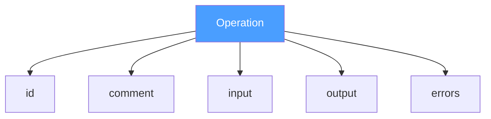
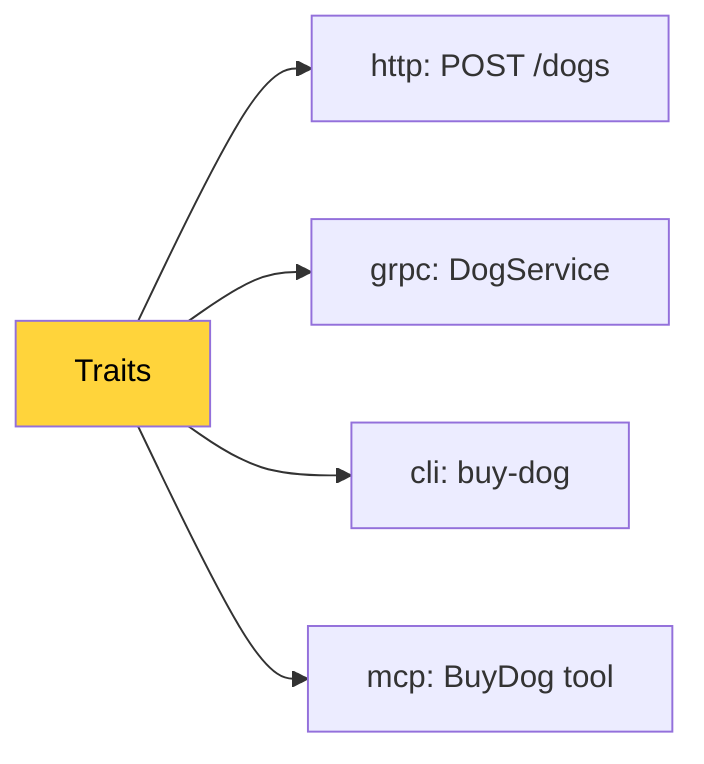
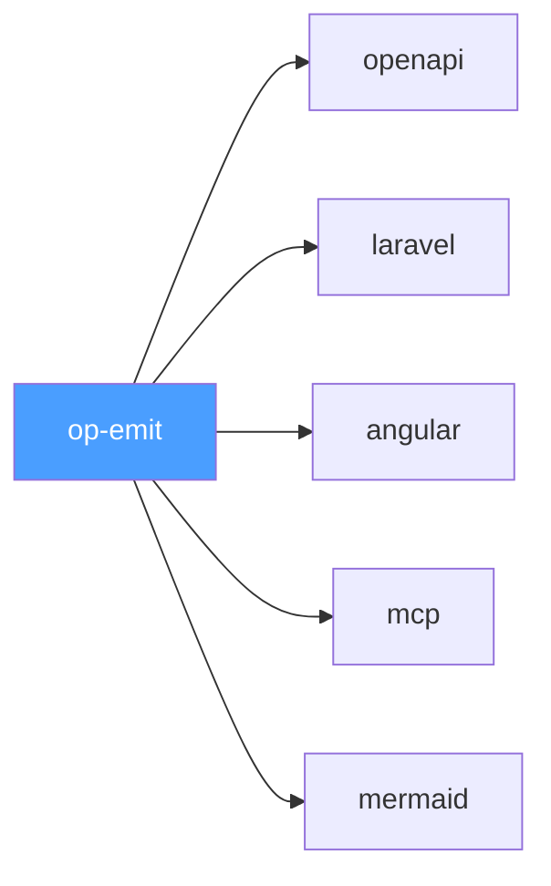

# The Contract That Wouldn't Break
We merged devlog #6. Fifteen historical attempts, all locked to their ecosystems. The essay was done. We thought we were done for the day.
Then we started talking. And couldn't stop.
What followed was a six-hour stress test of Op's contract — not against theory, but against every language, paradigm, edge case, and philosophical objection we could throw at it. We also detoured through IP headers, planetary energy consumption, and the economics of silicon. Everything turned out to be connected.
This devlog is the record of what we found.

## Error Without Opinion
The first discovery was the simplest and the deepest.
Error in the contract is not a code. Not an exception. Not an HTTP status. It is a typed path of failure. The same kind of data as Output, just on a different rail.
`Output: { dogId: string, price: int }` `Error: DogNotFound { breed: string, location: string }`

Both are data. Both are typed. Both are named. Neither carries an opinion about how to deliver the failure to the caller.
`404` is an opinion — the HTTP trait's opinion. `NOT_FOUND` is an opinion — the gRPC trait's opinion. `exit code 1` is an opinion — the CLI trait's opinion.
The fact is: the operation can fail, and when it does, here is what you get. The fact lives in the core. The opinions live in traits.
This eliminates the N×M sub-problem for errors. Each trait maps the fact to its own opinion independently, without knowing about other traits. N+M, not N×M.

## Proof by Generation
We generated three artifacts from one definition to verify.
The operation `BuyDog` with errors `DogNotFound`, `BudgetExceeded`, `BreedUnavailable`.

**OpenAPI receiver** — the `http` trait maps: `DogNotFound → 404`, `BudgetExceeded → 422`, `BreedUnavailable → 400`. The receiver generates response schemas with HTTP codes. Opinion of the trait.

**Laravel receiver** — generates a controller with `match(true)` over `instanceof` checks. Each error type becomes a `JsonResponse` with a status code. PHPStan guarantees exhaustive matching. Opinion of the receiver.

**Angular receiver** — generates a union type `BuyDogError = DogNotFound | BudgetExceeded | BreedUnavailable`. The client pattern-matches. Every path handled. Opinion of the receiver.

Three receivers. Three opinions. One contract. Zero conflicts.

## What Happens Without Error in the Core
We removed error from the contract and tried to generate the same artifacts.
OpenAPI — no error responses. The spec says the endpoint can only succeed.
Laravel — no try/catch. When the dog is not found, Laravel throws an unhandled exception. The client gets a 500 with an HTML "Whoops" page.
Angular — no error callback. The Observable throws an unhandled error. The component silently breaks. The user sees a blank screen.
Every generator faced a choice: be honest (generate broken artifacts) or lie (invent error handling from nothing). Without error in the core, each generator invents its own error model. Three generators, three different lies. N×M opinions about something that was never declared.
Error in the core is not the CORBA effect. It is the prevention of N×M errors.

## The CORBA Effect
We coined a term for a specific failure mode: the recursive expansion of the fundamental.
"Error is fundamental → the error type is also fundamental → the type has fields → the fields are also fundamental → the field types have sub-fields → ..."
Five iterations of this and you are building CORBA. Thousands of pages of specification because every layer "is also fundamental."
Op avoids this. Error is one bit of honesty: the operation can fail. Plus typed data describing the failure. No recursion into the error's error. No graph of failure semantics. Details — in traits.

## `func(Input) → (Output, error)` Is Not the Protocol
This was a quiet revelation.
The Go signature `func(Input) (Output, error)` appeared in every devlog as the canonical form of an operation. It felt like the protocol. It is not.
It is Go's opinion. One of many.
The protocol mandates Instructions — a JSON structure with fields. How the emitter extracts those fields from source code is the emitter's business.
Go reads a function signature. C reads a function definition. PHP reads attributes. Python reads decorators. Bash reads... well, bash.
`func(Input) → (Output, error)` is a literary metaphor. A coincidence with Go. A lucky one. But the protocol is Instructions. And Instructions are fields.

## Input and Output Are Fields, Not Types
This followed directly.

The protocol does not care whether you pass one argument or ten. Whether they are wrapped in a struct or spread as positional parameters. The protocol sees: the operation needs these named, typed fields.
```c
int buy_dog(const char* breed, int budget)
```

Two positional arguments in C. The emitter extracts:

```json
{
    "input": {
        "fields": [
            { "name": "breed", "type": "string" },
            { "name": "budget", "type": "integer" }
        ]
    }
}
```

Same Instructions as Go's func(input BuyDogInput). Same fields. Same names. Same types. Different packaging. The packaging is the language's opinion.

We tested: Go structs, C positional args, Python kwargs, Haskell curried args, Bash $1 $2, C# named tuples, C# unnamed tuples. All produce the same Instructions. The contract does not care about packaging.

## Go Emits Multiple Returns, Laravel Receives

```go
func InquireDog(input InquireDogInput) (name string, shelter string, status string, err error) {
```

Go returns four values. Three output fields, one error. No struct. The emitter extracts three fields into output.

Laravel receiver sees three fields. Generates:

```php
class InquireDogResponse extends JsonResource
{
    public function __construct(
        public readonly string $name,
        public readonly string $shelter,
        public readonly string $status,
    ) {}
}
```

Go spread returns into separate values. PHP collected them into a class. Instructions between them — identical. Three fields. Three names. Three types.

The protocol doesn't care. Fields are fields.

## Five Facts, Zero Opinions
We compared Op's operation with OpenAPI's Operation Object.

OpenAPI: input is split into parameters + requestBody — because HTTP separates query/path/header from body. HTTP's opinion baked into the structure. Output is inside responses keyed by HTTP status code — output doesn't exist without a code. Error doesn't exist without a code. security, tags, deprecated sit in the same flat object as operationId. Facts and opinions mixed. No boundary.

Op: Name — fact. Description — comment. Input — data in. Output — data out on success. Errors — data out on failure. Five facts. Plus Traits — a container for opinions. Clean separation. No opinion in the core.

## Comparing Error Handling Across 15 Systems
We examined how each system expresses DogNotFound:

OpenAPI — error = HTTP code. DogNotFound doesn't exist as an entity. There's 404 with a body. The error name is a string in description. Not machine-readable.

gRPC — error = status code. DogNotFound is not in the signature. It's somewhere in details, in google.rpc.ErrorInfo, at runtime. Not in the contract.

GraphQL — union type. DogNotFound exists as a type. Closest of all. But GraphQL doesn't distinguish success from failure. Both are just variants. The semantics "this is an error" — lost.

Thrift — throws clause. DogNotFound is an exception in the signature. Typed. Explicitly separated from output. Close! But exception is an opinion — it's "throw an exception," not "a path of failure." Mechanics baked in.

Erlang — {error, {dog_not_found, Breed, Location}}. A tuple. Two paths: {ok, ...} and {error, ...}. Error is data. No opinion about HTTP, no exception. But locked inside Erlang. And not formalized — it's a convention, not a contract.

Op — Errors: [DogNotFound { breed, location }]. Named. Typed. In the signature. Separated from output. No mechanics. No HTTP code. No exception. No transport. Data. Fact.

Op is the only one where error is a typed path of failure without opinion.

## GraphQL Stress Test — Both Directions
GraphQL receiver reads Instructions and must project errors. Three options: union types (typed but loses "this is an error" semantics), errors array (semantic but untyped), or both (redundant but honest). All three — the receiver's opinion. Contract survives.

GraphQL emitter reads a GraphQL schema and must extract errors. A union InquireDogResult = Dog | DogNotFound — which member is output? Which is error? GraphQL doesn't distinguish. The emitter decides by convention, annotation, or config. Lossy. Reverse projection. Shadow back to object. Contract survives.

## The Crazy Bash Developer
A bash developer writes:

```bash
buy_dog() {
    curl -X POST localhost:8080/dogs -d "{\"a\":\"$1\",\"b\":\"$2\"}"
}
```

A crazy emitter extracts: name buy_dog, input fields a (string), b (string). No output. No errors. Garbage. But structurally valid garbage.

This flows into 12 receivers. OpenAPI generates an endpoint with parameters a and b. MCP generates a tool. Docs generate documentation. Every receiver does its job. Correctly. By contract. The result is garbage. But garbage in, garbage out.

No receiver breaks. No receiver knows the source was crazy. Between them — the contract. The contract is valid — the receiver works. Always.

The problem is the emitter. Not the protocol. Not the receivers. The community says: "Dude, your bash emitter is garbage. Here's a good one."

Receivers are replaceable. Emitters are replaceable. The contract is one.

## IP, TCP/UDP, and the Enum That Shaped the Planet
We examined IP's Protocol field. TCP and UDP came to IP and said: "We need a router. There are two of us. We are the authority here." They closed the transport layer.

The enum in IP is not IP's decision from above. It's a contract from below. TCP and UDP declared a monopoly — and reality confirmed it for 44 years.

QUIC arrived and said: "I also want in." UDP replied: "You don't realize it, but you're just a wrapper." QUIC asked the right question: "Why am I your projection and not the other way around?"

QUIC is right semantically. But the enum is closed. Middleboxes, firewalls, NATs across the planet know only 6 and 17. QUIC masquerades as UDP packets. Not by right — by necessity. The price of a closed layer.

## The Enum Is a Circuit Board
IP's header is not an abstraction. It is a literal map of how electrical signals travel through silicon. Each bit — a physical location. The ASIC in a router reads 8 bits at offset 72 and routes in nanoseconds. No parsing. No interpretation. Hardcoded in silicon.

The enum at bit 72 is not a field in a data structure. It is a physical address on a chip.

## Planetary Cost
One uint8 instead of a modular descriptor system. This one choice saves megawatts of energy every day in 2026. Every packet on the internet passes through this field. Trillions of packets per day. On every router. On every hop.

If IP had been modular — every new protocol (QUIC, SCTP) would mean a new physical module × billions of devices × resources to manufacture each. The author of IP prevented an entire supply chain that never existed. Factories not built. Silicon not mined. Energy not spent.

The size of packets and the capacity of protocols affect Earth's ecosystem. Not a conspiracy theory. Mathematics.

## USB — OCP in the Physical World
USB proved that modularity is possible in hardware. One connector. Open container of descriptors. Keyboard, camera, flash drive — one port. New device class — no new port needed. USB device descriptor is literally traits.

IP chose enum — correct for 1981 silicon. USB chose open container — correct for 1996. Op chose traits — correct for software.

## Enum = Switch Everywhere
Enum in the foundation = switch in every consumer. Add a new case — update every switch. IP survived because a new transport protocol appears once per decade, barrier is OS kernel.

Op cannot afford enum. Barrier to creating a new trait is zero. New trait every day — every switch is outdated. Traits are polymorphism instead of switch. OCP literally.

Or as we put it: love riding enums — love hauling switches.

## The Boundary: Serializability
DeepSeek attempted to break the contract. The strongest attack: higher-order operations. applyTwice :: (a -> a) -> a -> a — a function that takes another function as input.

The contract's type system (string, integer, float, boolean, binary, datetime, array, object) has no type "function." This is the boundary.

But it is not Op's boundary. It is the boundary of every protocol. A function is not serializable. A channel is not serializable. A file handle is not serializable. A mutex is not serializable.

Over the wire, only bytes travel. Any "transmission of a function" over a network is really transmission of data (a name, a URL, a string of code) plus an agreement on how to interpret it on the other side. The function itself never leaves the machine.

Op describes operations over serializable data. Not "business data" — serializable data. This is physics, not opinion. Protobuf, GraphQL, MCP — all obey the same law. Op is simply honest about it.

## The Contract Does Not Validate Content
IP does not validate payload. The JSON specification does not contain json_validate. Crockford gave the contract — the ecosystem gave the tools. json_validate in PHP 8.3 was written by PHP contributors, not Crockford.

Op describes structure. Validation of Instructions — the ecosystem's responsibility. Linters, Schema Registry, strict-mode receivers — tools, not protocol. Out of scope.

## Links Between Operations — Opinion
An operation is atomic. It does not know about its neighbors. dogId in the output of InquireDog and dogId in the input of BuyDog — a coincidence of names, not a link.

The test: remove links — the operation is still fully described. Nothing lost. Workflow, orchestration, chaining — another layer on top of Op. Not the foundation.

## Backward Compatibility — Opinion
Kafka does not force you not to delete fields. Schema Registry does. Protobuf does not force you — the field numbers convention does.

Versioning operations — literally a new operation. Renaming a field — breaking change, the author's fault, not the protocol's. Deleting an operation — the author's fault, not the protocol's.

Compatibility policy is the ecosystem's opinion. The protocol describes facts. How facts change over time — not its jurisdiction.

## Casing — Opinion
InquireDog → inquire_dog → inquire-dog → INQUIRE_DOG → INQUIRE-DOG.

Lisp uses kebab. Ruby uses snake. Kotlin uses camel. SQL is case-insensitive. COBOL screams. All languages operate on the same thing: words. How to glue them — the language's opinion.

Instructions store the name. The receiver transforms.

## The Protocol Does Not Forbid Duplicate Names
Three errors named "error". Valid. Like JSON allows duplicate keys (SHOULD be unique, not MUST). "Names must be unique" — the linter's opinion. Not the protocol's.

## Stress Test: Every Language and Paradigm
Go multiple returns. C positional arguments. Bash unnamed $1. Haskell currying. Python **kwargs. C# named tuples. C# unnamed tuples. Rust sum types (enum as output/error discriminator). Swift optionals (Dog? — nil as absence). Java checked and unchecked exceptions. Variadic ...args (just an array). func() error with no concrete type. func() (error, error, error, error) from an idiot.

All expressible. All valid. Quality varies — the emitter's responsibility. The contract accepts everything. The pipe works.

## Binary — The Universal Type
Streaming, files, video, PDF — all binary. Interpretation — a trait. There is no language where binary is inexpressible. `char*`, `[]byte`, `string`, `bytes`, `byte[]`, `Vec<u8>`, `ArrayBuffer`, `ByteString`, `<<binary>>`, stdin, BLOB. Binary is the foundation of computation. It exists before languages.

## Gin and Laravel Bindings — For Free
From one set of Instructions, type-safe bindings are generated.

Gin:
```go
func RegisterBuyDog(r *gin.Engine, handler func(BuyDogInput) (BuyDogOutput, DogNotFound, BudgetExceeded, BreedUnavailable)) {
    r.POST("/dogs/buy", func(c *gin.Context) {
        var input BuyDogInput
        c.ShouldBindJSON(&input)
        output, notFound, budgetExc, breedUn := handler(input)
        switch {
        case notFound != nil:
            c.JSON(404, notFound)
        case budgetExc != nil:
            c.JSON(422, budgetExc)
        case breedUn != nil:
            c.JSON(400, breedUn)
        default:
            c.JSON(200, output)
        }
    })
}
```

The developer writes one handler. Gets router, validation, error mapping, type safety. The Go compiler guarantees: if the handler doesn't return all four types — it won't compile.

Laravel:

```php
class BuyDogHandler
{
    public function __invoke(BuyDogInput $input): BuyDogOutput|DogNotFound|BudgetExceeded|BreedUnavailable
    {
        // business logic
    }
}
```

PHP 8.0+ union types. PHPStan guarantees exhaustive matching. The developer writes one handler. Gets everything else generated.

HTTP codes 404, 422, 400 — the http trait's opinion. Different trait — different codes. Different framework — different binding. Same contract.

Whether to add a default case for unhandled runtime exceptions — the receiver's opinion. One receiver generates without default (strict). Another adds default => 500 (defensive). Both valid. Both work with the same Instructions.

## Operations Diff — The Most Important Line in a PR
Today, a tech lead reviewing a PR sees:

```
Tests:       47 passed, 0 failed
Coverage:    94.2%
Lines:       +1200  -800
```

Three numbers. None of them answer the most important question: what changed in my system's contracts?

The tech lead opens 47 files and reconstructs the answer in their head. From code. From diffs. From comments. Manually. Every time.

Op adds the missing line:

```
Operations:  +1  ~2  -1    ⚠ 1 breaking
Tests:       47 passed, 0 failed
Coverage:    94.2%
Lines:       +1200  -800
```

Which operations appeared. Which disappeared. Which inputs/outputs changed. Which errors were added. Which traits were affected. What will break.

One screen. Facts. No opinions. No code. A diff of two JSON files.

And this diff is the same for the Go team, the PHP team, the frontend team, the DevOps team. Everyone looks at one diff of facts. Not at diffs of their files. At a diff of operations.

A unified language of change for the entire company. For free. Because the protocol is dumb text.

## One Stream, All Artifacts

```bash
op-emit | tee \
    >(op-generator-aws-smithy --out=./gen/aws) \
    >(op-generator-grpc --out=./gen/grpc) \
    >(op-generator-openapi --out=./gen/openapi) \
    >(op-generator-mcp --out=./gen/mcp) \
    >(op-generator-laravel --out=./gen/laravel) \
    >(op-generator-angular --out=./gen/angular) \
    >(op-generator-gin --out=./gen/gin) \
    >(op-generator-mermaid --out=./gen/diagrams) \
    >(op-generator-idris --out=./gen/idris) \
    >(op-generator-cobol --out=./gen/cobol) \
    > /dev/null
```

One command. One stream of Instructions. Each receiver takes what it understands, ignores what it doesn't. AWS gets Smithy artifacts. Google gets gRPC. Anthropic gets MCP. Dima gets his Angular with Observables. The COBOL developer gets COBOL.

The protocol doesn't care. Five fields. A pipe.

## Round-Trips Are Not Needed — There Is No Circle
There is no path C# → Go. There is C# → Instructions and Instructions → Go. Two different tools. Two different authors. They don't know about each other.

A C# tuple (string name, int age, bool active) → Instructions (three fields) → Go generates a struct with three fields. Go didn't know it was a tuple. Go got fields. Generated an idiomatic struct.

Back? Go struct → Instructions → C# receiver generates whatever it wants. Tuple? Class? Record? Its opinion.

No circle. A tree. Instructions at the center. Arrows outward.

## Protocol vs Workflow
Developers want their own flow — git, email, Slack, a USB stick. The protocol doesn't care. Instructions are text. Text lives anywhere.

Crockford didn't say "store JSON in MongoDB." Op doesn't say where to store Instructions.

## Traits: Distribution Model

A trait is a key-value pair. The key is a globally unique identifier. The value is JSON. The emitter does not interpret traits — it copies them. Like IP does not interpret payload.

Three levels of usage, each a fallback for the previous:

**Level 1 — Typed SDK.** The trait author publishes a package for a specific language. `httpTrait.Post("/dogs/buy")` — autocomplete, type checks, documentation. Best DX.

**Level 2 — Raw attribute.** No SDK for your language? Use the base attribute with the global key: `Op\Trait('github.com/thumbrise/op/http', ['method' => 'POST', 'path' => '/dogs/buy'])`. Ugly. Works.

**Level 3 — Hand-written JSON.** No emitter at all? Write the trait directly into Instructions JSON. No tooling needed. The contract is text.

At every level, the receiver sees the same data. The same key. The same value. DX varies. The contract does not.

We expect trait authors to publish typed SDKs for popular languages — the same way service vendors publish client SDKs. A trait SDK is simpler: no logic, no HTTP calls. Just constants, types, and a global key. One file.

If a trait SDK doesn't exist for your language — contribute it, or use Level 2. No vendor lock. No blocked pipeline. The protocol does not break because an implementer didn't meet our expectations. It never breaks. That's the point.

**Why traits don't break.** A receiver reads traits it knows and ignores traits it doesn't. Collision is ignorance — the receiver has never heard of `"gtk"` and moves on. Dependency is knowledge — the receiver knows `"http"` and acts on it. Ignorance is safe. Knowledge is useful. Neither breaks the contract.

Add a hundred new traits tomorrow. Every existing receiver keeps working. Not because it was updated — because it never knew about the new traits and never needed to. OCP in its purest form: open for new opinions, closed for breakage.

**Why trait names don't collide.** A trait key is a globally unique identifier: `github.com/thumbrise/op/http`. This is a repository URL. It is either yours or it isn't. Package managers — Go modules, npm, Composer, Cargo — already solved global uniqueness. Op stands on their shoulders. No central registry. No coordination. No "please register your trait prefix." Just use your module path — the same rule Go uses for imports, and for the same reason.

## Even Without an Emitter, Op Wins

Before Op, every generator proposed its own flow. Its own payload. Its own vision of what an operation is. You wanted OpenAPI — learn the OpenAPI generator's DSL. You wanted MCP — learn the MCP generator's conventions. You wanted both — learn both. Write the same operation twice, in two different languages, for two different tools.

Op changes the economics even in the worst case — when no emitter exists for your language.

Write a JSON file by hand. Once. Five facts per operation. No DSL. No tooling. Just text.

From that one file, every receiver in the ecosystem works. OpenAPI receiver generates a spec. MCP receiver generates a tool. Angular receiver generates a client. Laravel receiver generates a handler. A catalog of standardized reactions to your set of operations. No "but." No "or." No "only if you also install."

Before Op: declare the operation three times — handler, swagger annotation, CLI command ([devlog #1](/devlog/001-why)). After Op, worst case: declare it once in JSON, pick receivers from a catalog. Best case: an emitter reads your code and you declare nothing at all.

## The AWS Conversation
AWS: "What can you give us? You're dumb as a cork."

Op: "Yes. Five fields. No opinions. Your Smithy has 72 traits in the prelude. GoWriter.java — fifty files to teach Java to speak Go. Every new language — a new writer. You maintain this. You pay for this."

AWS: "It works."

Op: "For you. Nobody outside AWS uses Smithy for their projects. Because Smithy is your opinion about how to describe operations."

AWS: "What do you propose?"

Op: "Describe the operation once. Five fields. Your 72 Smithy traits — let them live. In traits. Your generators — let them live. As receivers. But the foundation is shared."

AWS: "Why do we need a shared foundation?"

Op: "Same reason you need OTel. You could keep your own telemetry format. You chose a shared one. Because N×M is more expensive than N+M."

## Closed Questions
Links between operations — opinion, out of scope. Operations are atomic.
Validation depth — opinion of the ecosystem. Crockford didn't write json_validate.
Backward compatibility — opinion of the ecosystem. Schema Registry, not the protocol.
Name uniqueness — opinion of the linter. JSON allows duplicate keys.
Casing — opinion of the receiver. Instructions store words, not formatting.

## Open Question
Probability of referencing an entity from neighboring elements in Instructions — closed as "opinion" but kept in notes in case the POC reveals otherwise.

## What We Proved
We tried to break the contract for six hours. Positional args, unnamed params, multiple returns, empty inputs, empty outputs, binary streams, crazy emitters, higher-order functions, C# tuples, Rust sum types, Swift optionals, Java unchecked exceptions, Python kwargs, variadic args, duplicate names, seven identical errors from an idiot.

The contract survived everything.

Not because it's clever. Because it's dumb. Five fields. All data. All serializable. No opinions.

CORBA was clever — it broke. WSDL was clever — it broke. Smithy is clever — we'll see.

Dumb things live. Clever things break. Ousterhout was right.

## The Contract As We See It Now

After six hours, this is our current understanding of what an operation is.

An operation is five facts:

| # | Field           | What it is                                | What it is not                                           |
|---|-----------------|-------------------------------------------|----------------------------------------------------------|
| 1 | **Name**        | Identity of the operation                 | Not a URL, not a method, not a command                   |
| 2 | **Description** | Human-readable comment                    | Not documentation format — that's a receiver's opinion   |
| 3 | **Input**       | Named, typed fields going in              | Not a struct, not positional args, not a schema — fields |
| 4 | **Output**      | Named, typed fields coming out on success | Not a response, not a return type — fields               |
| 5 | **Errors**      | Named, typed paths of failure             | Not exceptions, not status codes, not error codes — data |

Plus **Traits** — an open container for opinions. HTTP routes, gRPC service definitions, CLI flags, auth schemes, pagination, caching, MCP tool metadata. Anything that is not a fact about the operation itself.

The type system is deliberately minimal: `string`, `integer`, `float`, `boolean`, `binary`, `datetime`, `array`, `object`. No `function`. No `channel`. No `handle`. The boundary is serializability — the same boundary every protocol obeys. Op is honest about it.

One operation, as JSON. The same BuyDog from every example in this devlog:

```json
{
  "name": "BuyDog",
  "description": "Purchase a dog from the pet shop",
  "input": {
    "fields": [
      { "name": "breed", "type": "string" },
      { "name": "budget", "type": "integer" }
    ]
  },
  "output": {
    "fields": [
      { "name": "orderId", "type": "string" },
      { "name": "price", "type": "integer" }
    ]
  },
  "errors": [
    {
      "name": "DogNotFound",
      "fields": [
        { "name": "breed", "type": "string" },
        { "name": "location", "type": "string" }
      ]
    },
    {
      "name": "BudgetExceeded",
      "fields": [
        { "name": "required", "type": "integer" },
        { "name": "available", "type": "integer" }
      ]
    },
    {
      "name": "BreedUnavailable",
      "fields": [
        { "name": "breed", "type": "string" },
        { "name": "nextAvailable", "type": "datetime" }
      ]
    }
  ],
  "traits": {
    "http": {
      "method": "POST",
      "path": "/dogs/buy",
      "errors": {
        "DogNotFound": 404,
        "BudgetExceeded": 422,
        "BreedUnavailable": 400
      }
    }
  }
}
```

Five facts. One container for opinions. That's the whole contract.

**What the contract guarantees:**
- Any emitter can produce Instructions from any language.
- Any receiver can consume Instructions for any target.
- Emitters and receivers don't know about each other. They share the contract, not a dependency.
- Garbage in, garbage out — but the pipe never breaks.
- Errors are first-class citizens, not afterthoughts.

**What the contract does not do:**
- Validate content — that's the ecosystem's job.
- Enforce naming conventions — that's the linter's job.
- Guarantee backward compatibility — that's the policy's job.
- Link operations to each other — that's the orchestrator's job.
- Have an opinion about anything — that's what traits are for.

The contract is a firewall between facts and opinions. Facts live in five fields. Opinions live in traits. The boundary is clear. The boundary is permanent.

## The picture

**Five facts, zero opinions:**



**Opinions live in traits — outside the core:**



**One stream, all artifacts:**



This is where we are. POC is next.

---

<details>
<summary><i>Post-credits scene (for those who actually read the whole thing)</i></summary>

> — But you have six fields in the header, not five.
>
> — Five.
>
> — What about Traits?
>
> — That's just your opinion.

</details>