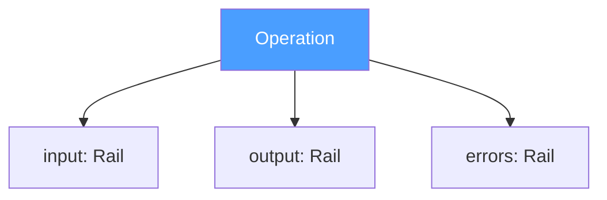
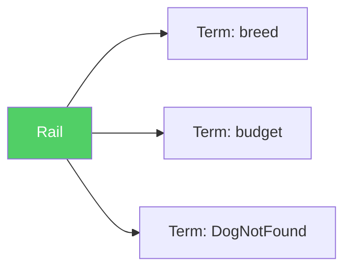
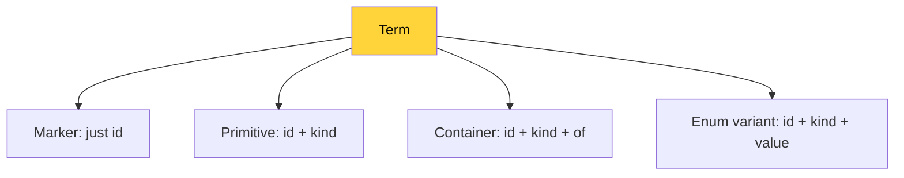
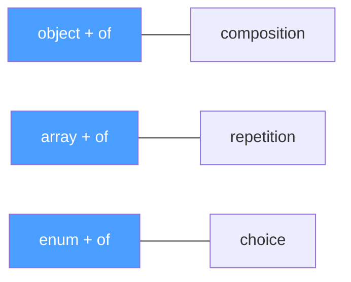

# Three Atoms
We broke the contract for six hours and it survived. We wrote devlog #7. We thought the hard part was over.

Then we sat down to write the JSON Schema. And discovered that we didn't actually know what we were describing.

The contract said "five fields." The schema demanded precision. Precision demanded decisions. Decisions demanded hours of debate about what a field is, what an error is, whether they are the same thing, and why Google buries facts under opinions.

This devlog is the record of how we found three atoms.

## The Naming Problem
The first schema draft used familiar words. name, description, type, fields. Every one of them collided with something.

`description` is a reserved keyword in JSON Schema. It means "human-readable explanation of this schema element." We needed it to mean "human-readable comment about the operation." Two meanings, one word. The IDE got confused. We got confused.

`type` is reserved in JSON Schema. It means "what JSON type is this value." We needed it to mean "what Op kind is this term." The IDE highlighted it as a schema keyword. Every time.

`name` is what OpenAPI calls `operationId`. What GraphQL calls the query name. What gRPC calls the method name. Everyone uses name differently. It sounds human. But what we needed was a machine-readable identifier. Not a name — an id.

`fields` implies a struct. A record. A class. But on the input rail, there might be no struct. C passes positional arguments. Python passes kwargs. Bash passes $1 $2. The protocol doesn't care about packaging. Calling them "fields" was a lie.

So we renamed everything.

`name` became `id`. Because it is an identifier, not a name.

`description` became `comment`. Because it is a comment, not a schema description.

`type` became `kind`. Because Kubernetes proved that kind works when type is taken. The whole world reads `kind: Pod` and nobody asks why.

`fields` became `of`. Because "what do I consist of" is universal. An object consists of its fields. An array consists of its elements. An enum consists of its variants. One word for all containers. Two letters.

And `field` itself became `term`. Because a field is an element of a data structure. But on the input rail, there might be no data structure. A term is a named atom from formal logic. Neutral. Universal. Not tied to any language's concept of "field."

## The Rail
We had three separate concepts: input, output, errors. Three different structures. Three definitions in the schema.

Then we asked: how are they different?

Input is a list of named, typed things. Output is a list of named, typed things. Errors is a list of named, typed things.

We tried to find the difference. Input has no name — it is anonymous, the operation gives it context. Output is the same. Errors have names — DogNotFound, BudgetExceeded.

But wait. Input terms have ids. Output terms have ids. Error terms have ids. They are all identified. The difference is not in the structure. The difference is in the semantics. Input means "what goes in." Output means "what comes out on success." Errors means "what comes out on failure."

Three rails. One structure. The rail is a semantic path, not a data structure. What rides on the rail — terms — is the same everywhere.

We named it rail. A machine-readable, semantically grouped set of terms. An array of terms. Nothing more.

In the schema, all three are identical references.

`input: rail` · `output: rail` · `errors: rail`

One definition. Three uses. DRY to the bone.

## The Term
The term is the atom of Op. Everything is a term.

`Breed: string` — a term. id is Breed, kind is string.

`DogNotFound { breed, location }` — a term. id is DogNotFound, kind is object, of contains two terms.

`Unauthorized` — a term. id is Unauthorized. No kind. No of. A marker. A dud.

`Aggressive: 2` — a term. id is Aggressive, kind is integer, value is 2.

Four forms. One structure.

Marker: just id. The minimum. A dud that still works.

Primitive: id plus kind. A typed atom. Breed: string.

Container: id plus kind plus of. A recursive structure. Address: object { City, Zip }.

Enum variant: id plus kind plus value. A named constant with a wire value. Aggressive: integer = 2.

Four fields on the term. One required. Three optional.

`id` — always. Who am I.

`kind` — optional. What am I. Nine possible values: string, integer, float, boolean, binary, datetime, array, object, enum.

`of` — optional. What do I consist of. An array of terms. Recursive. But if present, kind is required. You can't say "I consist of these" without saying what you are.

`value` — optional. What am I on the wire. A scalar: string, integer, number, boolean. Not an object. Not an array. A compact value for transmission. If present, kind is required. You can't have a value without knowing its type.

## How We Got Here: The Error Detour
The term didn't start as a universal atom. It started as two separate things: a field and an error. We thought they were different.

A field has a name and a type. `breed: string`. Simple.

An error has a name and details. `DogNotFound { breed, location }`. Also simple. But different — right?

We looked at Google's gRPC error model.

Status has three parts: code (an enum like NOT_FOUND), message (a human string like "Dog not found"), and details (an array of Any — arbitrary protobuf messages).

We stripped the opinions. Code is gRPC's opinion — a closed enum of 16 categories. Message is a human string — not machine-readable. What remained was details. An array of typed data.

Each detail is a type_url plus bytes. A name plus data. Sound familiar?

We stripped further. type_url is an identifier. bytes is serialized fields. So a detail is: id plus fields.

An error is: id plus fields.

A field is: id plus type.

And type is: id plus fields (for containers).

They are the same thing. All the way down.

The only difference: a field always has a kind (you need to know the type to generate code). An error might not (a marker like Unauthorized has no kind, no fields, just an id).

So we made kind optional. A term without kind is a dud. Valid. Useful. The protocol respects duds.

And with that, error stopped being special. It is a term on the error rail. Just like Breed is a term on the input rail. Same atom. Different track.

## Enum: The Ninth Kind
We almost left enum out of the core. "Enum is validation. Validation is the ecosystem's job."

Then we tried to describe a dog washing operation. The style can be Gently or Aggressive. Two values. A fact about the domain. Not a format. Not a validation rule. A fact.

"The steering wheel turns left or right." That is physics. Not an opinion. The wheel cannot turn up. Not because a validator forbids it. Because the wheel is built that way.

If we say kind: "string" for washStyle — we lie. It is not a string. It is one of two values. The fact is lost.

Error deserved a place in the core because without it, every receiver invents its own error model. N times M. We proved this in devlog #7.

Enum deserves a place in the core for the same reason. Without it, every receiver invents its own enum representation. Or worse — sees kind: "string" and generates a plain string field. The fact that only two values are valid — lost.

Enum is the ninth kind. A container. Like array and object. Enum consists of its variants. Each variant is a term.

Three containers. One of field. One structure.

`array` + `of`: what elements I contain. `object` + `of`: what fields I contain. `enum` + `of`: what variants I contain.

## Why Traits Work and Annotations Don't
D-Bus (2003) has annotations. Key-value pairs on methods. Namespaced. Looks like traits.

But D-Bus annotations are second-class citizens. The spec defines a few standard ones — `Deprecated`, `NoReply`. The rest — "you can add your own, but that's your business." No ecosystem formed. Nobody builds tools around D-Bus annotations. They are comments, not contracts.

Op traits are the only extension mechanism. Everything that is not a fact lives in traits. HTTP? Trait. gRPC? Trait. CLI? Trait. There is no other way to add an opinion to an operation.

The difference between "you can" and "only this way" is the difference between an empty field and an ecosystem. D-Bus said "you can." Nobody did. Op says "only this way." Everyone will.

## Value: The Wire Contract
Enum variants can have values. Aggressive = 2. Careful = 1.

Why? Because two services reading the same instruction must agree on what to send over the wire. If service A decides Aggressive is 0 and service B decides Aggressive is 1, they will disagree at runtime. Silently. The request says 0. The handler expects 1. The dog gets washed gently when it should have been washed aggressively.

Value is not a runtime detail. Value is a contract. Part of the instruction. If you send something different from what the instruction says — that is your problem. Not the protocol's.

Value is optional. Without it, the receiver decides. Go uses iota. PHP uses backed enum strings. TypeScript uses the id as the string value. Their opinion.

With value — fact. No guessing. No disagreement. One instruction. One value. All services agree.

Value is a scalar. String, integer, number, boolean. Not an object. Not an array. A compact thing for the wire.

## Rails Are Never Nil
Every rail is required. Every rail is an array. Empty or not.

An operation with no input: `"input": []`. Not absent. Not null. An empty array.

Why? Because `if rail == nil` is one line of code. In every receiver. In every language. For every rail. For every operation. Forever.

One required in the schema removes that line from every receiver ever written. One decision by the protocol author saves a thousand decisions by receiver authors.

The same logic applies to comment. It is required. An empty string is valid. But the field is always present. The receiver never checks for nil. And the author who sees an empty comment field is nudged to fill it in. Forced to think about it for one second. DX through obligation.

## No References. By Design.
Op has no `$ref`. No shared type definitions. No links between operations. Every operation owns its contract entirely. Every term is inline. Every rail is self-contained.

"But that's duplication!" — yes. Duplication of contracts, not code. Each operation is atomic. Change one — only one breaks. No cascades. No "who else uses this type?"

gRPC understood this: `BuyDogRequest` and `InquireDogRequest` are separate messages, even if both contain `string breed`. Different contracts. Different reasons to change.

"But I want references!" — write a preprocessor. Sass has variables; CSS does not. TypeScript has generics; JavaScript does not. Your preprocessor expands `$ref` into flat instructions. One step. Your opinion. The protocol stays dumb.

Op can afford to be this stubborn because it is a protocol, not a tool. The ecosystem adds convenience. The protocol stays flat. Forever.

## Serialization Is Opinion
Instructions are a structure. Not a format.

JSON is the recommended serialization. But the protocol does not mandate it. The same three atoms — operation, rail, term — can travel as MessagePack, CBOR, BSON, or anything that can express objects, arrays, and strings.

The JSON Schema validates the JSON form. But the protocol is not the JSON Schema. The protocol is three atoms. The schema is one projection — for tooling, for IDEs, for convenience.

Who wants MessagePack — go ahead. The structure is the same. The atoms are the same. The semantics are the same. The bytes are different. The protocol does not care.

## JSON Schema: The Free Toolchain
We did not write a validator. We did not write a linter. We did not write an IDE plugin. We wrote one JSON file — [instruction.v1.json](/schema/instruction.v1.json) — and got all of that for free.

JSON Schema gives us validation in every language. `ajv` in JavaScript. `gojsonschema` in Go. `jsonschema` in Python. One file. Every language.

JSON Schema gives us autocomplete. Put `$schema` at the top of your instruction file. The IDE reads it. Suggests fields. Highlights errors. Before you run anything.

JSON Schema gives us `dependentRequired`. If of is present, kind is required. If value is present, kind is required. The schema enforces this. Not a linter. Not a convention. The schema.

JSON Schema gives us enum on kind. Nine values. The IDE shows a dropdown. Pick one. No typos. No guessing.

We stand on the shoulders of Kris Zyp (JSON Schema, 2009), who stood on the shoulders of Douglas Crockford (JSON, 2001), who stood on the shoulders of Brendan Eich (JavaScript, 1995). Three layers. Each dumb. Each alive.

## Op SDK: Generated, Not Written
The schema describes the protocol. From the schema, we generate SDKs. For every language. Automatically.

`op-sdk-go`: Instruction, Operation, Rail, Term. Go structs. Generated from [instruction.v1.json](/schema/instruction.v1.json) by `gojsonschema`. One command.

`op-sdk-php`: same classes. Generated by `quicktype`. One command.

`op-sdk-ts`: same interfaces. Generated by `quicktype`. One command.

Each SDK is a set of DTOs. No logic. No validation. No opinions. Just types for `json.Unmarshal`. Or `json_decode`. Or `JSON.parse`.

A receiver author imports the SDK and works with typed instructions. Autocomplete. Compiler checks. No manual JSON parsing.

We maintain one schema. SDKs are generated. Community writes emitters and receivers. Each at their own level. Nobody touches anyone else's layer.

## The Pipe Has No Direction
The industry has always worked one way: backend → contract → frontend. Backend is the source of truth. Frontend consumes. Always. Everywhere.

OpenAPI — backend generates. Protobuf — backend defines. GraphQL — backend describes the schema. tRPC — backend exports types. Swagger — backend publishes.

Frontend always waits. Frontend always adapts. Frontend always second.

Op broke the direction. Not "backend → frontend." Not "frontend → backend." But "anyone → Instructions → anyone." The pipe does not know who is on the left. The pipe does not know who is on the right. It has no direction.

A frontend developer writes TypeScript interfaces. Runs them through an emitter. Gets Instructions. From those Instructions — a backend generates handlers. OpenAPI generates a spec. A mock server generates mocks. The frontend developer is the source of truth. Not the backend.

This was never possible before. Not because the idea was bad. Because without a shared contract, a frontend emitter meant N custom generators for N backends. Economically pointless.

Op zeroed the cost. One emitter. The entire catalog of receivers. Direction no longer matters.

## The Schema
Three definitions. That is the entire protocol.

An operation is an object with five required fields: id, comment, input, output, errors. Id is a string. Comment is a string. Input, output, and errors are rails.

A rail is an array of terms.

A term is an object with one required field: id. Three optional fields: kind (one of nine strings), of (an array of terms), value (a scalar).

Two dependency rules: if of is present, kind is required. If value is present, kind is required.

That is it. The entire protocol. In one JSON file. On one URL. Forever.

## Why GitHub Pages, Not a Custom Domain
The schema lives at `https://thumbrise.github.io/op/schema/instruction.v1.json`. Not on a custom domain. By choice.

A custom domain is tied to a credit card. Miss a payment — DNS dies — every `$id` in every schema points to nothing — validators worldwide get 404.

GitHub Pages is tied to a public repository. The repository is forked. Even if GitHub deletes the account — someone raises the fork. The schema survives.

And GitHub disabling a protocol that the entire internet depends on? That is the meme where the cyclist shoves a stick into his own wheel. GitHub's own CI pipelines would break.

The schema will move to a custom domain when Op feeds its author enough to pay for it. Not before.

## DSL Is Just a Builder
Early Op dreamed of a DSL. `op.New("BuyDog", ...)` in Go. It felt like the core. Like nothing works without it.

Now we know: the DSL is a builder on top of the SDK. The SDK is generated from the schema. The schema is the protocol.

A Go DSL builds `Instruction` structs from the SDK. A PHP DSL builds the same objects from the PHP SDK. A TypeScript DSL builds the same interfaces from the TS SDK. Each DSL — an opinion about DX. The protocol underneath — one.

Don't want a DSL? Use the SDK directly. Don't want the SDK? Write JSON by hand. Don't want JSON? Use MessagePack. The protocol does not force any layer. Each layer is optional. Each layer stands on the previous one. The foundation is three atoms.

## What We Proved Today
We sat down to write a JSON Schema and accidentally redesigned the protocol.

Not because the old design was wrong. Because the schema demanded precision that prose does not. Devlogs say "five fields." The schema says exactly which fields, which types, which are required, which depend on which.

The schema is the protocol. The devlogs are the reasoning. Both matter. But if they disagree, the schema wins.

Three atoms. Operation, rail, term. One recursive structure. Nine kinds. Four optional fields. Two dependency rules. Zero opinions.

The contract that wouldn't break — now has a machine-readable definition that proves it.

## The picture

**Three atoms — the entire protocol:**

**A rail is an array of terms:**

**A term is recursive — four forms:**

**Three containers exhaust the universe:**

## Result

[instruction.v1.json](/schema/instruction.v1.json)