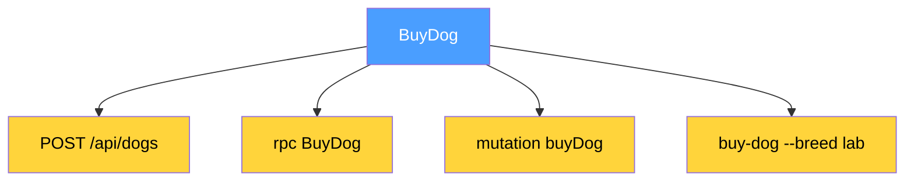

# The Operation Comes First

Today I realized something that I can't stop thinking about.

Every program ever written is a set of operations. Not endpoints. Not classes. Not tables. Operations. A function takes input and returns output. A method takes input and returns output. A cron job takes time as input and returns a result. Even main() takes command line arguments and returns an exit code.

Data does not exist by itself. A Dog is not a thing until something accepts a breed and returns a Dog. Without the operation, data is a dead file on a disk. The operation gives data a reason to exist.

## The Cheetah

Then I thought further. A cheetah's body is shaped by the operation it performs. CatchPrey. Millions of years of optimization. Long legs — for speed. Flexible spine — for agility. Claws — for grip. The cheetah does not know it is "fast." It knows that the operation must succeed. The form is a consequence. The operation is the cause.

## The Big Bang

The Big Bang. First — energy. Not matter. Pure transformation. Then quarks. Then protons. Then atoms. Then stars. A star is an operation — hydrogen in, helium plus energy out. Supernova — the error case. Every level of the universe is an operation on the previous one. Matter is not primary. Matter is the output of transformations that started with energy.

What is primary? Transformation. Input to output. The operation.

## The Projection Problem

And yet the entire software industry describes projections, not operations. Ask a developer "what does your service do?" — they answer "it handles POST requests on /api/dogs." No. Your service buys dogs. POST and /api/dogs are details. Like saying "my cheetah runs with legs across the savanna." True. But it catches prey. Legs and savanna are implementation details.

HTTP blurred it. "My endpoint." Not your endpoint. Your operation. The endpoint is a projection. Kubernetes blurred it. "My pod." Not your pod. Your process that performs operations. Docker blurred it. "My container." Not your container. Your code that performs operations. React blurred it. "My component." Not your component. Your function from state to UI.

Everyone describes the projection. Nobody describes the fact. Because projections are visible. You can see an HTTP request in the browser. You cannot see an operation. It is abstract.

## Five Fields

But what if you could write it down? Five fields. An identifier. A comment. What goes in. What comes out. What can go wrong. Just text. No transport. No framework. No opinion.

Clean Architecture, Hexagonal, Ports and Adapters — they all said the same thing for decades. Separate business logic from transport. Uncle Bob said it. Alistair Cockburn said it. Everyone nodded. Nobody did it. Because every framework breaks the separation in the first line of the handler. Laravel puts Request in the signature. Spring puts PostMapping in the annotation. Express puts req, res in the arguments.

What if the separation was not a discipline but a consequence? What if you described the operation first, and the framework was just one of many possible projections?

## The Undervalued Primitive

I think the operation is the most undervalued primitive in software. We have types, we have data, we have schemas, we have protocols for everything — except for the thing that gives all of them meaning.

## The picture

**The industry describes projections, not operations:**

The operation comes first. Everything else is a projection.
