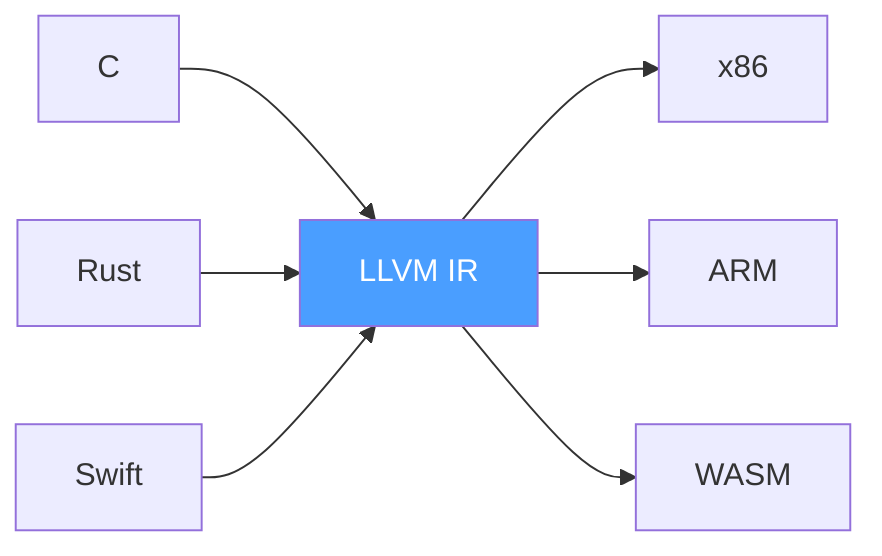
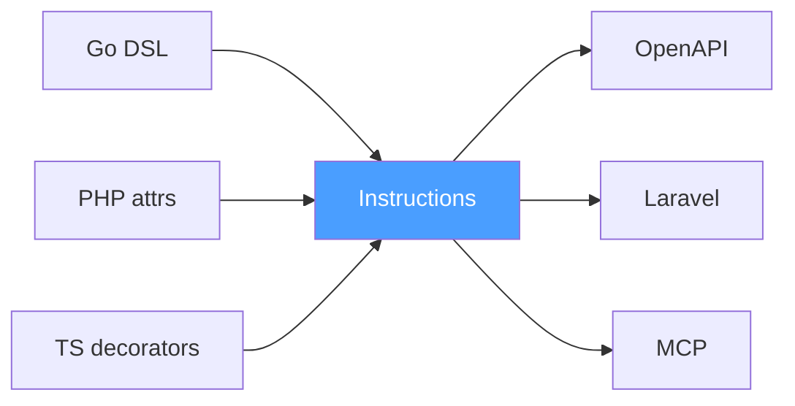
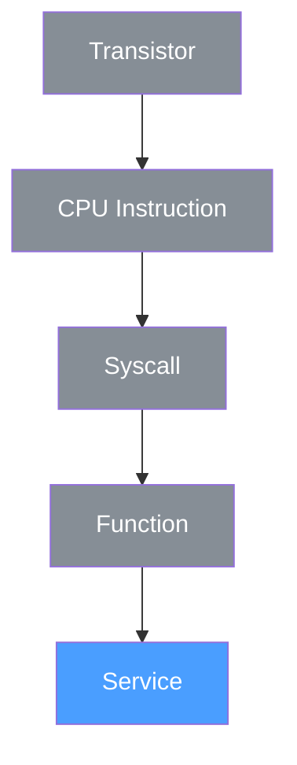

# There Is No Generation

We have been using the wrong word.

Every conversation about Op so far used the word generate. Emitters generate instructions. Receivers generate code. The ecosystem generates projections.

No. That is not what happens.

A generator is a boy wiping windshields at a traffic light for pocket change, knocking on your window. He might do a good job. He might smear the glass. He promises nothing. You hope for the best.

A compiler is a man with a contract. Valid input produces valid output. Invalid input produces a precise error. No hoping. No smearing. Guarantees.

Swagger codegen generates a client and you cross your fingers. Protoc compiles a proto into code and you trust the output. The difference is not in the tool. The difference is in the contract.

Dennis Ritchie never said generate. He said compile. cc source.c -o binary. Confidently. Because there was a contract between the C language and the machine.

We say the same. An emitter compiles source into instructions. A receiver compiles instructions into a target platform. Both directions are compilation. Both have contracts. Both have guarantees.

This matters because when you say generate, people hear template. They think string interpolation. Mustache. Copy-paste with variables. They think the output is approximate. Needs checking. Might be wrong.

When you say compile, people hear guarantee. They think gcc. They think if it compiled it works. They think the output is a consequence of the input, not an approximation of it.

## Beyond Words

But this is not just about words. It is about what we discovered when we followed the word to its root.

LLVM solved the N times M problem for programming languages. N language frontends, M platform backends, one intermediate representation in the middle. Clang compiles C into LLVM IR. The LLVM backend compiles IR into x86. New language? Write a frontend. Get all platforms for free. New platform? Write a backend. Get all languages for free.

LLVM did not call its backends generators. They are compilers. With contracts. With guarantees.

Op solves the same N times M problem one floor higher. Not for machine code. For operations. N emitters, M receivers, one instruction format in the middle. New DSL? Write an emitter. Get all receivers for free. New platform? Write a receiver. Get all emitters for free.

Same pattern. Same economics. Different floor.

## The Floors

And then we looked at the floors.

A transistor takes voltage in and produces a switch or an error. That is an operation. Five fields describe it. Not in JSON. In a datasheet.

A CPU instruction takes operands in and produces a result or a fault. That is an operation. Five fields describe it. Not in JSON. In an ISA reference manual.

A syscall takes arguments in and produces a return value or an errno. That is an operation. Five fields describe it. Not in JSON. In a man page.

A function takes parameters in and produces a value or an error. That is an operation. Five fields describe it. Not in JSON. In a header file.

A service takes a request in and produces a response or a failure. That is an operation. Five fields describe it. In JSON. In an instruction.

Five fields work at every level. Not because we designed them to. Because an operation is a fact of the universe. We did not invent it. We wrote it down. Like Church wrote down the lambda calculus in 1936. He did not invent computation. He formalized what was already there.

## The Paper and the Law

JSON is not Op. JSON is the paper on which we drew the table. Because we stand on a floor where paper is convenient. On the transistor floor, the same table is drawn in SPICE models. On the CPU floor, in ISA references. On the syscall floor, in man pages. Different paper. Same law.

And multiple papers do not create an N times M problem. LLVM IR has two formats — textual `.ll` and binary `.bc`. Protobuf has text format, binary format, and JSON mapping. OpenAPI accepts JSON or YAML. OTEL transmits OTLP over gRPC, HTTP with protobuf, HTTP with JSON. None of them consider this a problem. Because the semantics are one. The parser is trivial. Detect, parse, done. `stdin | detect | parse | receive`. Five fields stay five fields regardless of whether they arrived as JSON, YAML, binary, or carrier pigeon.

## Empty Cells

Mendeleev did not invent elements. He formalized the structure into which elements fall. He left empty cells. He said here should be an element with atomic weight around 68, similar to aluminum. I will call it eka-aluminum. The element did not exist. Nobody had seen it. Six years later Lecoq de Boisbaudran discovered gallium. Weight 69.7. Properties like aluminum. Exactly in the empty cell.

Traits are empty cells. Op does not know what traits will exist. HTTP? Today. gRPC? Tomorrow. Something that does not exist yet? The cell is already waiting.

And like TCP segments, traits are invisible to the user. You do not write traits by hand. You write @Post("/dogs") in your DSL. The emitter compiles it into a trait. You write Handle(ctx, input). The receiver reads the trait and compiles a route. If you are thinking about traits, you are writing a receiver. Just like if you are thinking about TCP segments, you are writing a network stack.

## What Follows

And here is what follows from compilation instead of generation.

Frameworks split in two. Below the boundary is the receiver. Routing, serialization, validation, documentation. Compiled from instructions. Replaceable. Above the boundary is business infrastructure. ORM, cache, queues, logger. Libraries that help you implement Handle. They do not know about HTTP. They do not know about instructions. They work with data inside the operation.

Today a framework is both layers glued together. Laravel is ORM and router and validator and template engine in one package. Spring is DI and HTTP and Security and Data in one package. Change the transport and you rewrite everything. With Op the receiver changes without touching business logic. Business logic changes without touching the receiver. The glue is cut.

Competition becomes transparent. Today Laravel versus Spring versus Express is comparing three monoliths. Thousands of features, different philosophies, different languages. Impossible to compare. With Op it is op-laravel versus op-spring versus op-express. Three receivers. One input. Same instruction. Compare compilation speed. Compare output quality. Compare trait coverage. Objectively. Like comparing gcc versus clang. One source, two compilers, benchmark.

Laravel will not write a bad receiver for the same reason LLVM will not write a bad x86 backend. It is the only thing they ship. It is their entire reputation.

But not every receiver compiles. A receiver is anything that reads an instruction and does something useful with it. An IDE reads instructions and gives you autocomplete. A load balancer reads traits and routes traffic. A security scanner reads error rails and finds vulnerabilities. A documentation portal reads comments and publishes HTML. None of them compile code. All of them are receivers.

Compilation is the most common thing a receiver does. But the word receiver is deliberately wider. It means: I accept instructions. What I do with them is my business.

## The Mountain Range

And the mountain range grows on both sides of the protocol.

IDE reads instructions. Autocomplete knows your input fields and possible errors. Not from reflection. Not from annotations. From the contract. Rename a term in the instruction and IDE finds every receiver, every client, every test that uses it. Not by string search. By contract.

Static analyzers check contracts, not code. Operation TransferMoney has error InsufficientFunds but no receiver handles it. Potential money loss. Before deployment. Operation GetUser returns term password with kind string. You are publishing a password in the contract. Before deployment.

Observability becomes native. Span names are not POST /api/v2/dogs. They are BuyDog. Business metrics out of the box. Alerts know the dependency graph because instructions describe it.

Distributed debugging becomes unnecessary. Every call between services is an operation call with known input, expected output, and enumerated errors. Contract violation replaces debugging. You do not search for what happened. You read what happened. Structured. Typed. From the contract.

Autoscalers read traits, not CPU. Operation SearchProducts is compute heavy, scale horizontally. Operation GetConfig is cache eternal, do not scale, cache. The autoscaler does not guess. It reads the contract.

Saga orchestrators read error rails. ChargePayment can return CardDeclined. On CardDeclined call ReleaseInventory. The orchestrator compiled the compensation logic from instructions. Not written by hand. Compiled.

Security scanners read instructions and traits. Operation DeleteUser has trait auth admin but the receiver does not check the token. Vulnerability. Before code. Before deployment. Before incident.

Documentation is not written. It is compiled. Developer portal is a receiver from instructions to HTML. Postman collection is a receiver to JSON. The documentation cannot go stale because it is not written by a human. It is compiled from the source of truth.

## The WiFi Icon

This already exists. Since 2003.

D-Bus is a protocol on the Linux desktop. Every service on the bus — NetworkManager, Bluetooth, PulseAudio, systemd — exposes an XML description of its operations. Methods with typed inputs and outputs. Signals. Properties. Any client can call `Introspect()` and receive a machine-readable answer: here is what I can do.

GNOME Shell does not know in advance that WiFi exists. It connects to the bus, reads the NetworkManager introspection, finds the property `WirelessEnabled`, subscribes to the signal `StateChanged`, and draws an icon. KDE does the same and draws a different icon. i3status does the same and writes text to a bar. Three receivers. One introspection. No coordination.

A receiver that understands the trait uses the trait. A receiver that does not — ignores it and moves on. Nobody asks permission. Nobody waits for an SDK. The operation describes itself. The reader decides what to do.

D-Bus proved this works. Twenty-two years. Every Linux desktop on the planet. But D-Bus locked the idea to one floor — local IPC on a single machine. The introspection never left the bus. The annotations never became contracts. The ecosystem never formed around them.

Op is the same law, one floor higher. Between services. Between languages. Between teams. The WiFi icon is our proof that the pattern works. We just need to carry it upstairs.

Imagine: `https://any-service.com/operations`. One endpoint. And in the response — everything the service can do. Input, output, errors, traits. Machine-readable. Human-readable. No Swagger UI. No Postman. No "ask Vasya." A worldwide D-Bus. Not on one machine. On the entire internet.

## Nobody Writes Bindings

Today every project is hand-to-hand combat. The backend writes an endpoint. The frontend writes a fetch to that endpoint. By hand. Two people write the same thing from two sides. Then one changes a field. The other finds out in production.

Or slightly better: the backend writes an endpoint, generates OpenAPI, the frontend generates a client from OpenAPI. Three steps. Two intermediary artifacts. And still — OpenAPI describes the HTTP projection, not the operation. Change the transport and start over.

In a world with Op, nobody writes bindings. The backend developer describes `BuyDog`. The emitter compiles it into an instruction. The Laravel receiver compiles a route and a controller. The Angular receiver compiles a typed client with `BuyDogInput`, `BuyDogOutput`, and `BuyDogError = DogNotFound | BudgetExceeded | BreedUnavailable`. Two receivers read one instruction. Neither knows the other exists. Like GNOME and KDE reading the same NetworkManager introspection and drawing different icons.

The backend does not know the frontend exists. The frontend does not know the backend runs Laravel. Both know one thing — the instruction. The source of truth is one. The bindings are compiled, not written.

## The Vendor's Problem

Have you ever wanted to use OpenAPI or gRPC reflection for something that has nothing to do with HTTP or gRPC? Just because they describe capabilities? Then you already understand what this is about.

And here is the question that follows: why does the `http` trait exist at all?

Not because operations need HTTP. Because the browser needs HTTP. In 1993 Tim Berners-Lee built a browser for hypertext, and since then we are hostages of that decision. `fetch()` is the only primitive. WebSocket is a crutch over an HTTP handshake. gRPC-Web is a crutch over HTTP/2. Everything goes through HTTP. Not because it is good. Because the vendor gave nothing else.

HTTP is not a property of the operation `BuyDog`. It is a constraint of one specific runtime — the browser. The `http` trait exists not because operations need it. It exists because one vendor's runtime needs it. Tomorrow the browser learns something new — a new trait appears. The operation does not change. Because the operation is a fact. The transport is an opinion. The vendor's opinion.

This is why HATEOAS failed. HATEOAS said the right thing: the server should tell the client what to do next. But it tried to solve the problem at the wrong level — runtime discovery inside every HTTP response. Every response carries `_links`. The client parses them, builds navigation, and still hardcodes the UI. Because the "Buy Dog" button is a design decision, not a consequence of `_links.buy`.

HATEOAS tried to make the client discover operations one step at a time, at runtime, through the transport. But the frontend is compilation, not interpretation. TypeScript, React, build. You want to know the full contract before the first request. Not after. Not one link at a time.

D-Bus understood this. `Introspect()` returns the full contract in one call. Before the first method invocation. HATEOAS scattered the same idea across every response and lost.

Op compiles the client from the same contract as the server. The frontend does not discover what the backend can do. It already knows. At build time. From the instruction. The disease was never "the client does not know the URLs." The disease was the absence of a shared contract. HATEOAS treated the symptom with runtime links. Op treats the disease.

## The Archaeologist

The ideal chain is simple. Instruction goes in, receiver compiles out. That is the whole idea. That is the future.

But we do not live in the future. We live in a world where billions of lines of code were written without any notion of instructions. Laravel controllers already contain BuyDog — scattered across annotations, type hints, docblocks, and `Route::post()`. The operation is there. It was always there. But nobody wrote it down.

An emitter is an archaeologist. It digs through existing code and reconstructs the instruction that should have existed from the beginning. Introspection, reflection, attribute collection, `Route::list()` — whatever it takes to recover the five fields from the rubble of a framework that never knew about them.

If you could rewind time, the program would have been written from its instructions. The instruction would come first. The receiver would compile the route, the controller, the client. But time does not rewind. So the emitter goes backward — from code to instruction — so that receivers can go forward.

Someone will say: but the emitter is automation from existing code, and manual instructions are just JSON files. No. JSON is paper. We established that. How you formulate instructions is your business. A DSL, a YAML file, a builder API, a scraper, handwritten JSON — the protocol does not care. The protocol is formalization. Where to read and what to call it is the ecosystem's problem.

Check your own language. Your compiler does not guess. It relies only on what you wrote. Op is the same. The instruction is the source of truth. The receiver trusts it completely. If the instruction is wrong, the output is wrong — and that is the emitter's fault, not the receiver's. The contract is strict in both directions.

The emitter exists because rewriting everything is unacceptably expensive. Nobody will approve it. We will not approve it. But one day new programs will be written from instructions first. The operation will come before the framework. The receiver will compile the projection. And the emitter — the archaeologist — will retire. Its job done. The ruins catalogued. The future built on top.

Until then, the emitter is a blessing. It is the bridge from the world that exists to the world that should. But it is not the essence of Op. The essence is the instruction and the receiver. The emitter is how we get there without burning everything down.

## The Precedent

This has already happened. In our lifetime.

Before OpenTelemetry, every observability vendor was a monolith. Datadog had its own agent, its own format, its own SDK. New Relic had its own. Jaeger had its own. Zipkin had its own. Want to switch vendors? Rewrite your instrumentation. Vendor lock at the telemetry level.

Then OTEL said: one format. OTLP. Export in OTLP and the rest is not your problem. Datadog wants to read it? Let Datadog write a receiver. Grafana wants to read it? Let Grafana write a receiver. A new startup nobody has heard of? It writes a receiver and gets every client for free.

And what happened? They all came. Datadog wrote an OTLP receiver. Grafana wrote one. New Relic wrote one. Not because someone asked. Because the alternative was to lose the market. If everyone exports OTLP and you do not read OTLP — you do not exist.

Nobody rewrote their existing instrumentation. The old agents kept working. OTLP appeared alongside them. Gradually. Without revolution. The archaeologist — the bridge from proprietary formats to OTLP — did its job. New services started with OTLP from day one. Old services migrated when convenient. The bridge carried traffic in both directions until the new world was big enough to stand on its own.

Op is the same economics applied to operations. Today Laravel has its own way to describe routes. Spring has its own. Express has its own. Want to switch? Rewrite. But if instructions become the standard format — Laravel writes a receiver and gets every emitter for free. Spring writes a receiver and gets every emitter for free. Not because we ask them. Because the alternative is to lose the market to whoever does.

OTEL proved that vendors come to the format. The format does not go to vendors. You publish the standard. You build the bridge. And you wait. They come. Because economics leaves them no choice.

## The Protocol Does Nothing

And none of this is the protocol. The protocol is five fields and traits. Everything above is the mountain range. The ecosystem. The consequence.

Today the MySQL team maintains six connectors: C, Java, Python, .NET, Node.js, C++. Each connector is a separate codebase, a separate team, separate bugs, separate releases. N connectors times M versions equals chaos. In a world with Op, the MySQL team maintains one thing: instructions. Connectors are compiled by the ecosystem. The MySQL team is free to do what they do best — build a database engine. Not client libraries in six languages.

Op does not do anything. Op makes everything possible.

Like opcodes. Zend Engine receives opcodes from PHP compilation. Opcodes are facts. What to do with them is not the opcodes business. Zend VM interprets them. JIT compiles them to machine code. OPcache caches them. The debugger inspects them. Opcodes do not dictate. They enable.

Instructions do not dictate. They enable. What the ecosystem builds on top is not the protocol's concern. The protocol just makes it possible. And gets out of the way.

## The Honest Reader

We started this morning with a simple observation.
We showed the devlogs to a fresh reader. An automated system that reads code and documentation and tries to understand what a project does. It summarized Op as a way to represent any standard request-response pattern. Not maliciously. Not lazily. It read everything we wrote and that is what it understood.

That is the most honest feedback you can get. Not a friend being polite. Not a critic being hostile. A machine that has no opinion, only pattern matching. And the pattern it matched was request-response. Because that is the loudest pattern in the industry. That is what everything looks like when you have never seen the operation underneath.

If the machine read request-response, every new reader will read request-response. Until we say it clearly enough that even a pattern matcher sees the real pattern.

## The Law

One day nobody will say op-laravel-receiver. They will say Laravel. Like nobody says nginx is an HTTP receiver. They say nginx. The user of Laravel will never see the word Op in the documentation. The contributor to Laravel core will. Just like the user of Gmail never sees the word TCP. But the engineer at Google does.

That is how protocols win. Not by being seen. By being everywhere and being invisible.

The operation is not a request-response pattern. The operation is not an HTTP endpoint. The operation is not a function signature. The operation is the fundamental primitive of computation. Input, output, error. At every level. From transistors to business logic. Five fields. One law.

Mendeleev was not immediately accepted. German chemists were skeptical. Too simple. Cannot be that 63 elements are described by one table. Then they discovered gallium. Then scandium. Then germanium. Each time exactly in the empty cell. The skeptics went quiet.

We need our gallium. One receiver that fills an unexpected cell. One compilation that nobody expected. And the skeptics will go quiet.

There is no generation. There is only compilation at different levels of abstraction. And the table has been waiting since 1936.

## The Picture

**LLVM one floor higher:**

**The floors — five fields at every level:**

## What This Devlog Establishes

1. **Emitters and receivers are compilers, not generators.** Valid input produces valid output. Invalid input produces a precise error. The contract is the difference.
2. **Op is LLVM one floor higher.** N emitters, M receivers, one instruction format. The economics are identical. The floor is operations, not machine code.
3. **The operation is not an invention.** Five fields — id, comment, input, output, errors — describe computation at every level from transistors to services. We formalized what was already there.
4. **JSON is paper, not law.** The instruction format is a serialization choice for the floor we stand on. The law is the five-field structure. The paper can change.
5. **Traits are empty cells.** The protocol predicts extension points that do not exist yet. Like Mendeleev's table, the cells are waiting.
6. **A receiver is wider than a compiler.** IDEs, load balancers, security scanners, documentation portals — all are receivers. Compilation is the most common case, not the only one.
7. **D-Bus is proof.** The WiFi icon in GNOME is a receiver reading a trait from an operation that describes itself. The pattern works. Since 2003. On every Linux machine. We carry it one floor higher.
8. **Nobody writes bindings.** Backend and frontend compile from the same instruction. Neither knows the other exists. The source of truth is one.
9. **HTTP is a vendor constraint, not an operation property.** The `http` trait exists because the browser has no other primitive. The operation does not change when the transport changes. HATEOAS failed because it treated the symptom — runtime discovery — instead of the disease — the absence of a shared contract.
10. **Emitters are archaeologists, not architects.** They reconstruct instructions from code that was written without them. The ideal chain is instruction → receiver. The emitter is the bridge from legacy. One day it retires.
11. **OTEL is the precedent.** Vendors came to OTLP because economics left no choice. Op applies the same economics to operations. You publish the format. You build the bridge. They come.
12. **The protocol does nothing.** Instructions enable. They do not dictate. What the ecosystem builds is not the protocol's concern.