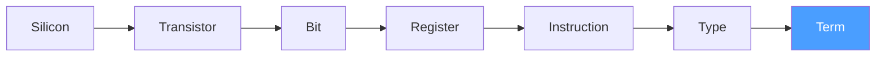
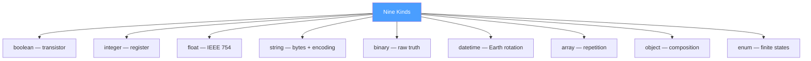

# From Silicon to Struct

Devlog #10 established that there is no generation — only compilation. This devlog asks a different question. Where do the words come from? And where do the types come from?

## The Words

Every name in Op is a scar from a collision.

`name` became `id`. Because name sounds human. Friendly. Approximate. But what we needed was a machine-readable identifier. Not what you call yourself — what you are. OpenAPI uses operationId. GraphQL uses the query name. gRPC uses the method name. Everyone uses name differently. Id is unambiguous. One word. One meaning.

`description` became `comment`. Because description is a reserved keyword in JSON Schema. It means "human-readable explanation of this schema element." We needed it to mean "human-readable note about the operation." Two meanings, one word. The IDE got confused. We got confused. Comment is honest. It says: I am a note. Not a definition. Not a spec. A note.

`type` became `kind`. Because type is reserved in JSON Schema. It means "what JSON type is this value." We needed it to mean "what Op kind is this term." Kubernetes proved that kind works when type is taken. The whole world reads `kind: Pod` and nobody asks why.

`fields` became `of`. Because fields implies a struct. A record. A class. But on the input rail, there might be no struct. C passes positional arguments. Python passes kwargs. Bash passes $1 $2. The protocol does not care about packaging. "What do I consist of" is universal. An object consists of its fields. An array consists of its elements. An enum consists of its variants. One word for all containers. Two letters.

`field` became `term`. Because a field is an element of a data structure. A column in a table. A property of an object. A parameter of a function. All of these are projections. A term is a unit of meaning. From formal logic — an atomic proposition. "This thing has a name and a type." No opinion about where it lives. Not tied to any language's concept of field, property, parameter, or argument. Neutral. Universal.

These are not branding decisions. They are the result of hours of elimination. Every familiar word collided with something. Every collision forced a choice. Every choice left a scar. The scars became the vocabulary.

## The Rail

Output and error are two rails. Not two types. Not two fields. Two directions.

A railway switch does not care what rides on it. Freight or passenger. The switch sends the train left or right. Output rail — success. Error rail — failure. The operation is the switch.

We did not call them "response types" — that is HTTP. We did not call them "return values" — that is a function. We did not call them "results" — that is Rust. Rail is the direction the result takes. A semantic path. What rides on the rail — terms — is the same everywhere. Input rail, output rail, error rail. Three directions. One structure.

The word rail carries no baggage from any language, any framework, any transport. It is new. And it is precise.

## The Trait

A trait is a characteristic applied from outside without changing the essence.

HTTP is not a property of BuyDog. It is a trait someone attached. Remove it — the operation does not change. It still takes input, returns output, can fail. Like the color of a car. Remove the color — the car still drives. Color is a trait. Engine is a fact.

We did not call them "annotations" — D-Bus tried that, nobody used them. We did not call them "decorators" — that is Python and TypeScript, tied to runtime. We did not call them "extensions" — that implies the core is incomplete. We did not call them "metadata" — that implies they are secondary, ignorable.

Trait says: I am a real characteristic. I matter. But I am not the essence. I am attached, not embedded. I can be removed without breaking the operation. I can be added without changing the contract. I am the opinion. The operation is the fact.

## From Silicon

Someone will look at Op's nine kinds — string, integer, float, boolean, binary, datetime, array, object, enum — and think: these are programming abstractions. High-level types. A convenience for developers.

No. These are formalizations of physics.

`boolean` is a transistor. Open or closed. One bit. The universe started with this. Before strings, before integers, before anything — there was on and off. True and false is not a programming concept. It is an electrical state.

`integer` is how a processor interprets 32 bits as a whole number. The bits do not know they are an integer. The CPU decides. The same 32 bits — `0x41280000` — are `1092616192` as an integer and `10.5` as a float. The iron decides. Not the language.

`float` is the same bits interpreted differently. IEEE 754 is not a programming standard. It is a contract between silicon and mathematics. The mantissa, the exponent, the sign bit — physics, not abstraction.

`string` is a sequence of bytes with a convention about encoding. Bytes existed before strings. The string is a trait on an array of bytes. UTF-8 is an opinion about how to interpret them. The bytes are the fact.

`binary` is the raw truth. Before interpretation. Before encoding. Before opinion. Just bytes. Everything else is binary with a label attached.

`datetime` is a count of seconds since an epoch. A number. But a number with a physical referent — the rotation of the Earth, the orbit around the Sun. Time is not an abstraction. It is the one dimension the universe gives us for free.

`array` is repetition. One structure, repeated N times. A crystal lattice — one unit cell, repeated billions of times. A strand of DNA — four nucleotides, repeated three billion times. The array is not an invention of programming. It is a pattern of matter.

`object` is composition. And the word itself is not from programming. Object comes from Latin *objectum* — "that which is placed before." A philosophical term. Aristotle, the scholastics, Kant — all used "object" centuries before the first computer. Simula 67 borrowed the word in the 1960s. Then Smalltalk. Then C++. Then Java. And the word glued itself to OOP so tightly that people think object means a class with methods. It does not. In Op, `object` means what it meant in Latin: a composed thing. Something that consists of parts. An atom is a struct of protons, neutrons, electrons. A molecule is a struct of atoms. A cell is a struct of molecules. `kind: object, of: [City, Zip]`. No methods. No inheritance. No encapsulation. Just — I consist of these parts. Closer to Aristotle than to Java.

`enum` is a finite set of states. An electron on an orbital. It cannot be "between" energy levels. Quantum numbers are discrete. A traffic light is red, yellow, or green. Never purple. Not because a validator forbids it. Because the system has exactly three states. Enum is not a convenience for developers. It is a fact of nature: some things take only a finite number of values.

Nine kinds. Not because we chose nine. Because when we looked at what receivers need to compile code, these nine were the ones that kept appearing. We tried eight — enum was missing and every receiver reinvented it. We tried ten — the tenth was always an opinion, not a fact. Nine survived the elimination. Like the three atoms — operation, rail, term — the nine kinds are what remained after everything unnecessary was removed.

## Three Containers, One Word

Of the nine kinds, three are containers. They are the only three ways the universe organizes matter.

`object` + `of` — what am I **composed of**. Different parts in one whole. Protons, neutrons, electrons in an atom. City and Zip in an address. Composition.

`array` + `of` — what **repeats** in me. One structure, many times. Unit cells in a crystal. Nucleotides in DNA. Carriages in a train. Repetition.

`enum` + `of` — what **can I be**. One of a finite set. Left or right. Red, yellow, or green. Gently or Aggressive. Choice.

Composition. Repetition. Choice. There is no fourth. Not in physics. Not in mathematics. Not in programming. Everything you can build is a combination of these three. Recursively. At any level.

And all three use the same field: `of`. Two letters. One question: what do I consist of? The object answers with its parts. The array answers with its element. The enum answers with its variants. Different answers. Same question.

Some languages say an array must contain one type. That is their opinion. The protocol says: array is repetition. What repeats — a term describes. How your language enforces homogeneity — your receiver's problem. Some languages say an enum is backed by integers. That is their opinion. The protocol says: enum is a finite set of identifiable choices. How your language represents the choice — your receiver's problem.

The protocol states the fact. The language states the constraint. `of` is the bridge between them.

## The Receiver Decides

The same kind becomes different things in different receivers. That is not a bug. That is the point.

Go sees `integer` and compiles `int64`. PHP sees `integer` and compiles `int`. JavaScript sees `integer` and compiles `number`. One term — three projections. Like one carbon atom — diamond or graphite. Depends on who assembles.

Go sees `enum` and compiles a set of constants with iota. PHP compiles a backed enum. TypeScript compiles a union type. Rust compiles an enum with variants. Same instruction. Same kind. Different materials. Different projections.

The protocol does not say how to project. The protocol says what the fact is. `kind: enum, of: [Gently, Aggressive]`. That is the fact. How your language represents two named constants — your business. Your opinion. Your receiver.

This is why Op kinds are not "high-level types." They are the minimum a receiver needs to make a decision. Boolean — one bit, two states. Integer — whole number. Float — fractional number. String — text. Binary — raw bytes. Datetime — point in time. Array — repetition. Object — composition. Enum — finite set. Nine facts. Everything else is projection.

## The Chain

Silicon. Transistor. Bit. Byte. Register. Instruction. Type. Term.

The chain does not break. Each level formalizes the one below. The transistor formalizes voltage into boolean. The register formalizes bits into integer. The type system formalizes registers into named kinds. The term formalizes kinds into protocol atoms.

Op does not sit on top of this chain. Op is a link in it. The link between "types that a language knows" and "operations that a system performs." Below us — compilers, CPUs, silicon. Above us — receivers, frameworks, UIs. We are not the top. We are not the bottom. We are the missing link in the middle.

## The Picture

**The chain — from silicon to term:**

**Nine kinds — formalizations of physics:**

## What This Devlog Establishes

1. **Every name in Op is a scar.** Id, comment, kind, of, term, rail, trait — each replaced a word that collided with an existing concept. The vocabulary is the result of elimination, not invention.
2. **Rail is a direction, not a type.** Output and error are two paths the result can take. What rides on the rail — terms — is the same everywhere.
3. **Trait is an opinion attached from outside.** Remove it — the operation does not change. It is the color of the car, not the engine.
4. **The nine kinds are formalizations of physics.** Boolean is a transistor. Integer is a register interpretation. Enum is a finite state. They are not programming abstractions. They are the minimum facts a receiver needs to compile.
5. **Three containers exhaust the universe.** Composition (object), repetition (array), choice (enum). There is no fourth. `of` is one question with three answers.
6. **The receiver decides the projection.** One kind becomes different types in different languages. The protocol states the fact. The receiver states the opinion.
7. **Op is a link in the chain from silicon to struct.** Below — CPUs and compilers. Above — frameworks and UIs. The protocol is the missing connection between types and operations.
