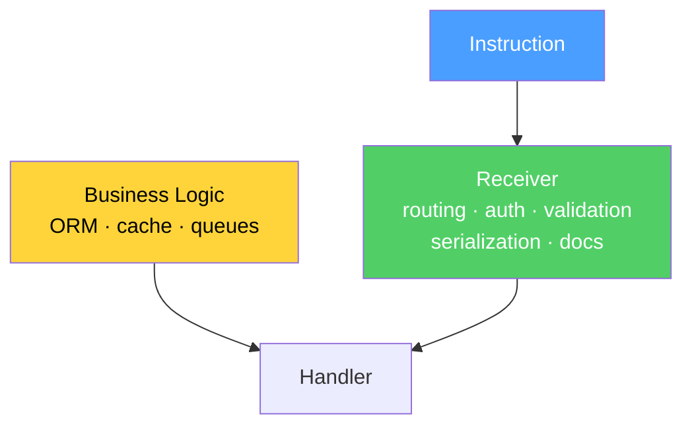
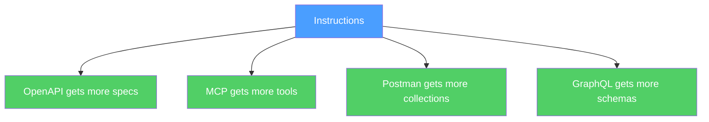

# The Conference

We imagined a conference. Not a friendly one. A room full of architects, frontend leads, DevOps engineers, security auditors, and skeptics. We put Op on stage and opened the floor.

Every question that followed was an attempt to break it. Every answer revealed something we had not articulated before. This devlog is the record of what survived.

## The Redirect

Someone from the frontend row grabbed the microphone.

"How do I do a redirect in my use case?"

You do not. A redirect is an HTTP opinion about what happens after an operation. Your use case is WashDog. It washed the dog. It returned `WashDogOutput(clean: true)`. Done. Its job is finished.

Where to redirect the user after washing — that is the receiver's decision. The HTTP receiver can return 302. The CLI receiver prints "Done." The WebSocket receiver sends an event. Each in its own way.

If you need a redirect — it is a trait. `http/onSuccess: redirect:/dogs/42`. The receiver reads it. The handler never knows.

If you are doing redirects inside your handler — you are not writing business logic. You are writing an HTTP controller and calling it a use case. The framework taught you to mix them. Op unmixes them.

## The Auth

"I used to call `auth()->user()`. How do I get the current user now?"

Where does `auth()->user()` get its knowledge? From a cookie. Or a Bearer token. Or a session. All of these are HTTP. The transport leaked into your use case. You did not notice because Laravel made it convenient. But convenient is not correct.

Who calls the operation — that is a fact. How they authenticated — that is the transport's opinion. Cookie, JWT, API key, mTLS — these are ways to prove identity. The use case does not need the method. It needs the result.

The handler receives `ctx.caller()`. Not `auth()->user()`. Not `Request::user()`. Not `SecurityContextHolder.getContext()`. The operation context. Clean. No transport.

The receiver already figured it out. The HTTP receiver read the Bearer token, validated it, extracted the user, placed it in the context. The CLI receiver read `--user-id` from arguments. The gRPC receiver extracted it from metadata. The cron receiver set the system user.

`auth()->user()` is not business logic. It is Laravel telling you "I know who you are because I read a cookie." The use case does not need to know about cookies. It needs to know who called the operation. These are different things.

## The Compiled Wrapper

"So it is all Laravel's job to compile the wrapper for me?"

Yes. Exactly. That is its only job now.

Today Laravel does two things: the wrapper and business infrastructure — Eloquent, Cache, Queue. All in one package. Glued together.

In a world with Op, the Laravel receiver does only the wrapper. Read the `http` trait — compile a route. Read the `cli` trait — compile an artisan command. Read the `auth` trait — wrap in middleware, place caller in context. Read `resilience/rateLimit` — wrap in throttle. Wire everything to your handler.

That is the entire receiver. Routing, authentication, validation, serialization, error handling — compiled from the instruction.

Eloquent, Cache, Queue — those are libraries. They stay. You use them inside your handler. They do not know about HTTP. They do not know about instructions. They work with data. As before.

Today a framework is receiver plus libraries in one box. Tomorrow the box is cut. The receiver — separate. The libraries — your choice. The receiver is replaceable. The libraries are yours.

## The Stream

"How do I do streaming?"

Streaming is when an operation returns output not once but many times. In portions. Over time. But the fact remains: the operation takes input, returns output, can fail. Five fields. Nothing changed.

That the output arrives in portions — that is how the result is delivered. Not what the result is. A trait.

The handler yields. The HTTP receiver sees `delivery/mode: stream` and compiles SSE. The gRPC receiver compiles server stream. The WebSocket receiver compiles push. Each in its own way. The handler does not know. The handler yields.

Streaming is not a special case. It is a trait on an ordinary operation. Five fields. One handler. Delivery — the receiver's opinion.

## The Echo Room

"I used to do Laravel Echo with channels, authorization, presence rooms. I cannot imagine this as a use case."

A channel is routing. `orders.{orderId}` is the same thing as `POST /orders/{orderId}`. A route. A trait.

Channel authorization is auth middleware. The receiver checks whether the caller has the right to listen to this operation. The same `auth` trait. The same wrapper.

Private versus presence — type of channel. Transport opinion. Trait.

The handler yields order updates. That is all it does. No channel. No Echo. No Pusher. No Redis. The Laravel Echo receiver reads the instruction, sees the websocket traits, compiles `Broadcast::channel(...)`, authorization, subscription. Wires the handler.

And then the trick. The same handler, the same instruction — but a different receiver. Mercure. Or SSE. Or gRPC stream. The same yield. Different transport. The handler never knew.

## The Transport Swap

"If WebSocket is replaced with polling — is that not a cascade change in the frontend?"

Zero changes.

The backend changed a trait. The frontend receiver recompiled the client. Inside `listenOrderUpdates` there is now `setInterval` plus `fetch` instead of WebSocket. The frontend code:

```typescript
const updates = api.listenOrderUpdates({ orderId: "42" });
updates.on("data", (event) => {
    updateUI(event.status, event.timestamp);
});
```

Not a single line changed. Because the frontend never knew it was WebSocket. It called an operation. The operation did not change. Input the same. Output the same. Errors the same. The trait changed. The trait is the receiver's business. Not the userland's.

Like replacing Wi-Fi with Ethernet. You open Gmail. It works. You did not notice. Because you never worked with Wi-Fi. You worked with the internet.

## The Frontend That Forgot HTTP

"So the frontend does not deal with transport at all? What does its work look like now?"

The frontend calls operations. Not endpoints. Not URLs. Not methods. Operations.

The frontend receiver compiles a typed client from the instruction. `BuyDogInput`, `BuyDogOutput`, `BuyDogError = DogNotFound | BudgetExceeded | BreedUnavailable`. Autocomplete. Exhaustive error matching. Compiled. Not written by hand.

The frontend developer does not know whether it is REST, WebSocket, SSE, or gRPC underneath. Does not need to. The client is compiled from the instruction. The transport is inside. Invisible. Like TCP is invisible when you open Gmail.

The interview question changes. It used to be "Have you worked with WebSocket?" — testing knowledge of transport. Now: "How did you handle all errors of the operation?" — testing knowledge of the contract.

The frontend developer stops being a transport specialist. Becomes an operation specialist. Not "I know fetch, WebSocket, SSE, gRPC-Web." But "I know how to call an operation, handle output, handle every error."

Transport is the plumber's knowledge. The operation is the architect's knowledge. The frontend grows one floor higher.

## The Rebellion

The room went quiet for fifteen minutes. Whispers. Then the whispers became unbearably loud. It began.

**"I used to control my middleware! Write my own! HTTP cache! Shared auth! And now you want us to put everything in the instruction?"**

You continue to write middleware. You continue to write cache. You continue to control the order. Nothing is taken away.

Op does not forbid middleware. Op says: the fact of the operation is in the instruction. The opinion of how to serve it is in the receiver. The receiver is you. Your Laravel. Your middleware. Your order.

The instruction does not replace the DSL. The instruction is under the DSL. You write `Route::post('/dogs', ...)->middleware('cache:3600')`. The emitter compiles it into an instruction with a trait. The receiver compiles it back. Your DSL stays. You do not even notice.

**"Do you know how much work you have added for us?"** — Laravel.

No. We removed work.

Today Laravel maintains routing, middleware, validation, serialization, documentation, error handling, authorization, rate limiting, broadcasting, CLI, scheduling — all written by hand. Every feature — separate code. Separate tests. Separate bugs.

With Op, the Laravel receiver compiles half of this from the instruction. Does not write. Compiles. Route — compiled. Input validation — compiled. Error handling — compiled. Documentation — compiled.

Laravel stops writing boilerplate. Laravel starts writing a compiler. Once. Well. And every user gets a perfect wrapper. Not copy-paste from documentation. Compiled.

LLVM did not add work for Clang authors. LLVM removed work. Clang stopped thinking about x86, ARM, MIPS. Clang thinks only about C to IR. Backends think about IR to platform. Each does one thing. Well.

**"What if someone edits the instruction and does not recompile? That is a fact mismatch!"** — DevOps.

What if someone edits `main.go` and does not compile? That is a mismatch with the binary.

You do not deploy `main.go`. You deploy the binary. CI compiles, tests, deploys. Nobody edits the binary by hand.

Same thing. The instruction is source. The compiled code is artifact. CI pipeline: emit, validate, compile, test, deploy. Invalid instruction — red. Valid — compile. Tests pass — deploy. Tests fail — red.

Editing the instruction and deploying outside CI is like patching a binary in production by hand. Possible. But that is not the protocol's problem. That is a process problem. Solved the same way — CI, code review, protected branches. Nothing new.

## The Skeptics

**"This is just another OpenAPI."**

Open the OpenAPI specification. `paths`, `methods`, `parameters in: query`, `responses` keyed by HTTP status codes. Remove HTTP — nothing remains. OpenAPI is a projection of operations onto HTTP. That is its nature. Not a flaw.

Op describes operations. Remove HTTP — everything remains. Input, output, errors, comment, id. Five fields. Add HTTP — a trait appears. Add gRPC — a trait appears. Add CLI — a trait appears. The operation did not change.

OpenAPI is a map of one city. Op is a coordinate system on which you can draw any city. OpenAPI can be a receiver of Op. `op-receiver-openapi` reads instructions — compiles `openapi.yaml`. They are not competitors. OpenAPI is one of many projections.

**"What if the protocol dies?"**

The protocol is five fields. Text. Not a server. Not a SaaS. Not a subscription. There is nothing to die. The file `instruction.v1.json` lives in your repository. Git stores it forever. Even if tomorrow GitHub disappears, the author disappears, everything disappears — the file is yours. Readable. By a human. By a machine. In fifty years.

CORBA died because it required an ORB runtime. Server down — everything down. Op requires nothing. A file. Read it with anything. `cat instruction.json`. What can die in `cat`?

**"Vendor lock on Op."**

Vendor lock happens when you cannot leave. When your data is in a proprietary format. When migration costs a million.

The instruction is an open format. Readable without an SDK. Readable without a receiver. Readable with your eyes. Want to leave — take your files. They are yours. Apache 2.0.

Vendor lock is when Laravel holds your routes in `routes/web.php` in its own format and you cannot move them to Express without rewriting. That is vendor lock. Op is the way out of it.

## The Architecture Questions

**"Microservices and Op."**

Each microservice publishes its instructions. `UserService` — 12 operations. `OrderService` — 8 operations. Between services — not "I call POST /users/42." But "I call operation GetUser." The receiver decides how to deliver. The service mesh reads instructions. Knows the dependency graph. Not from tracing. From the contract. Before the first request.

**"Monolith and Op."**

One receiver, many operations. 200 instructions inside one Laravel. Routes compiled. CLI compiled. Documentation compiled. Want to extract `PaymentService` into a microservice? Take its instructions. Write a separate receiver. The instructions did not change. The contract did not break. Monolith to microservices without rewriting contracts.

**"Event-driven architecture."**

An event is an operation without a response. `OrderPlaced`. Input — order data. Output — empty rail. Errors — empty rail. Trait: `delivery/mode: event`, `messaging/broker: kafka`, `messaging/topic: orders.placed`. The handler reacts. The Kafka receiver compiles a consumer. The RabbitMQ receiver compiles a different consumer. Same instruction. Different transport.

**"CQRS — are command and query different operations?"**

Yes. Literally. `BuyDog` — command. Has input, output, errors. Changes state. `GetDog` — query. Has input, output, errors. Does not change state. The difference — a trait. `cqrs/type: command`. `cqrs/type: query`. A receiver that understands CQRS separates them into write model and read model. A receiver that does not — ignores the trait. Both are operations. Five fields. One structure.

**"Sagas and compensations."**

The saga orchestrator is a receiver. It reads instructions. Sees the error rail. `ChargePayment` can return `CardDeclined`. On `CardDeclined` — call `ReleaseInventory`. The compensation is compiled from instructions. Not written by hand. The orchestrator knows all errors of all operations. From the contract. Not from documentation that someone forgot to update.

## The Security Questions

**"Injection through traits."**

A trait is a key-value string. The receiver parses it and decides what to do. If the receiver takes `http/path: /dogs/{id}` and concatenates it into SQL — that is the receiver's bug. Like a compiler bug. Not the protocol's bug.

But Op makes auditing easier. A security scanner is a receiver. It reads all traits of all instructions. Sees `http/path` with `{id}` — checks that the receiver parameterizes, not concatenates. Automatically. On all operations. Before deployment.

Today a scanner searches for SQL injection in code with heuristics. With Op — the scanner reads the contract and checks facts. Not heuristics. Facts.

**"Secrets in instructions."**

Never. The instruction is a contract. Public. Like an OpenAPI spec. Like a proto file. You do not put a password in a proto file. You do not put a password in an instruction.

The instruction says: `auth: bearer`. Does not say which token. Says the mechanism. The secret is in env. In vault. In runtime. Not in the contract. The contract describes the shape of the lock. Not the key.

## The DX Questions

**"Migrating an existing project."**

The archaeologist. `artisan op:dump`. Gradually. Alongside existing code. Without revolution. 80% automatically. 20% — you refine. Like migrating to TypeScript. You do not rewrite everything. You add types file by file. Endpoint by endpoint. Operation by operation.

**"Onboarding a new developer."**

Today: "Read the documentation. No, not that one, it is outdated. Ask Vasya, he knows. No, Vasya is on vacation. Look at Swagger. No, Swagger lies. Look at the code."

With Op: "Open `instructions/`. Here are all operations. Here is input. Here is output. Here are errors. Here are traits. Write a handler. The wrapper will compile."

The instruction is documentation that cannot go stale. Because it is the source. Not a derivative.

**"Local development without a receiver."**

The handler is a pure function. Input to output. Run it without a receiver. Test it without a receiver. Mock it without a receiver.

```
output, err := handler.Handle(ctx, BuyDogInput{Breed: "labrador"})
```

No HTTP. No framework. No receiver. A function. Call it — get a result. The receiver is needed for deployment. Not for development.

## The Ecosystem Questions

**"Conflict between two receivers."**

Two receivers do not conflict. They do not know about each other. `op-receiver-laravel` compiles PHP. `op-receiver-express` compiles JavaScript. From the same instruction. Independently. Like gcc and clang do not conflict. Both compile C. Each in its own way.

Two receivers for the same platform? Community versus official? Competition. Not conflict. One source, two compilers, benchmark. The better one wins. The user chooses.

**"Community vs official receivers."**

Community first. Always. Linux started with community. Docker started with community. Kubernetes started with community.

Then official. When the vendor sees the community receiver gaining users. Laravel will not write an official receiver out of altruism. Laravel will write it when the community `op-receiver-laravel` hits 5000 stars and Laravel realizes: either we do it better, or we lose control of the DX.

## The Philosophy Questions

**"Op vs MCP."**

MCP — Model Context Protocol. Anthropic. Describes how an LLM calls tools. Tied to AI.

An MCP tool is an operation. Input, output, description. Five fields. MCP could be a receiver of Op. `op-receiver-mcp` reads an instruction — compiles an MCP tool definition. The AI gets all operations of your service. Automatically. From the same contract that compiled the HTTP route and the CLI command.

MCP is a projection onto AI. Op is the fact. They are not competitors. MCP is another empty cell waiting for a receiver.

**"Op vs AsyncAPI."**

AsyncAPI is OpenAPI for events. Channels, messages, bindings. Tied to messaging. Remove Kafka — little remains.

Op describes operations. An event is an operation with an empty output rail. How to deliver — a trait. AsyncAPI could be a receiver. `op-receiver-asyncapi` reads instructions with messaging traits — compiles `asyncapi.yaml`.

The pattern is the same. OpenAPI, AsyncAPI, MCP, GraphQL schema — all projections. Op is the coordinate system. There will be as many projections as needed. The coordinate system is one.

## The Multiplier

And here is what the crowd did not ask but should have.

Anthropic spent two years on MCP. Built an ecosystem. Thousands of tools. And Op arrives. Anthropic tenses: "Another standard? A competitor?"

No. The opposite.

Today everyone who wants an MCP tool writes it by hand. Describes the schema. Describes parameters. Describes return types. For every tool. By hand.

With Op — every operation in the world that has an instruction automatically becomes an MCP tool. `op-receiver-mcp` compiles it. Not one tool. All of them. At once.

A Laravel app with 200 operations? `artisan op:dump | op-receiver-mcp`. 200 MCP tools. Without a single line of code. Anthropic got 200 new tools in its ecosystem. For free. Without work. Without evangelism.

Without Op: Anthropic convinces every developer to write an MCP tool by hand. Slow. Expensive. Every time from scratch.

With Op: Anthropic convinces one person to write `op-receiver-mcp`. Once. And every operation in the Op ecosystem automatically becomes an MCP tool. Not dozens. Thousands.

Op is not a competitor. Op is a multiplier. Every existing ecosystem gets more content. For free. From one source of truth.

This works for everyone. OpenAPI gets more specs. Postman gets more collections. GraphQL gets more schemas. gRPC gets more services. Every ecosystem grows from Op.

Companies will earn more. Not because Op is generous. Because the cost of integration drops to zero. One instruction — every projection. The economics are not debatable. They are arithmetic.

## The Shipping Container

This has happened before.

Malcolm McLean. 1956. He watched dockers unload a ship. Crates, sacks, barrels — every cargo unique. Every port — its own rules. Every ship — its own layout. He said: what if the box is one? Standard size. Standard fittings. The crane lifts it from the truck — puts it on the ship. Lifts it from the ship — puts it on the train. Nobody opens the box. Nobody knows what is inside. Not their business.

Ports rebelled. Dockers rebelled — losing jobs. Unions rebelled. Shipping companies rebelled — need to rebuild ships. "We already work fine! Why change!"

McLean went bankrupt. Twice. The man who changed global trade could not make money from it. But the container won. Because economics. Loading costs dropped tenfold. World trade grew exponentially. Amazon, Walmart, global supply chains — all standing on a standard box.

The container does not know what is inside. The instruction does not know what is in the handler. The container is standard on the outside. The instruction is five fields. The crane does not open the container. The receiver does not open the handler. The port processes the container without knowing the contents. The receiver compiles the wrapper without knowing the business logic.

Every port used to be unique. Every framework is unique today. The container made ports interchangeable. Op makes receivers interchangeable.

The dockers rebelled not because the container was bad. But because the container made their work unnecessary. Manual loading — unnecessary. Manual bindings — unnecessary. Manual documentation — unnecessary. Manual validation — unnecessary.

Rebellion is a sign that you hit the right nerve.

## The Invisible Trait

Nobody forces a developer to know about a throttle trait. Nobody forces a developer to know about any trait.

The developer operates the DSL provided by the vendor or the ecosystem. `Route::post(...)->middleware('throttle:60')`. That is all they see. That is all they need. The emitter compiles it into a trait. The receiver reads the trait. Components that understand each other through a shared trait — cooperate. Components that do not — ignore each other. Silently. No errors. No configuration. No awareness required.

The developer writes in their language. The ecosystem handles the rest. Like you do not configure TCP when you open a browser. You just open it. Someone configured TCP. Not you.

## The Hamster Wheel

"Will the industry get dumber if all bindings are compiled for them?"

Did the industry get dumber when it stopped writing assembly? No. It went forward. It built operating systems, databases, browsers, neural networks — things that are impossible in assembly. Not because assembly is bad. Because the floor was too low.

Did the industry get dumber when compilers started optimizing? No. Engineers stopped counting registers and started designing systems.

The industry will not get dumber. It will step out of the hamster wheel. Stop plugging adapters into adapters. Stop writing the same fetch call for the thousandth time. Stop maintaining six client libraries for one database.

If the industry were getting dumber from automation, tRPC would not exist. gRPC would not exist. GraphQL codegen would not exist. The trend is clear: automatically receive what you deserve in 2026. Typed clients. Exhaustive errors. Compiled documentation. Not as a luxury. As a baseline.

Those who understand the operation as a protocol — they dive into the low level. Like language authors dive into compilers, runtimes, garbage collectors. That is the low level of the new floor. Everyone else works one floor higher. Writing handlers. Solving business problems. Not plumbing.

The floor rises. The industry does not get dumber. It gets free.

## The Law and the Gallium

After the conference we sat in an empty room and realized something.

CORBA tried to become the glue. It said: here is the glue, apply it. WSDL tried to become the format. It said: here is the format, adopt it. Both commanded. Both died.

Op is not glue. Op is gravity. It does not get applied. It acts. Whether you want it or not. The operation exists in every program right now. Without Op. A Laravel controller is an operation. An Express handler is an operation. A Go function is an operation. They already exist. Op does not create them. Op writes them down.

Like the multiplication table. It is everywhere. In every calculator, every processor, every neural network. But it does not control. It is simply true. Everyone uses it. Not because someone commanded. Because the alternative is to calculate incorrectly.

This is not a command. This is a proof. Church did not command computation. He proved it. The law does not need adoption. It needs demonstration.

And adoption depends on exactly one thing. The usefulness of writing an emitter depends on the existence of one killer receiver. Not ten receivers. One. The one that makes people say: "Wait, I got this for free? From one instruction?"

After that — chain reaction. Someone writes an emitter for Laravel because they want that receiver. Someone writes an emitter for Spring because they want that receiver. Every emitter makes every receiver more valuable. Every receiver makes every emitter more valuable. Network effect.

Church proved the lambda calculus in 1936. Adoption started when McCarthy wrote Lisp in 1958. Twenty-two years. Not because the proof was weak. Because the world needed one working example that people could touch.

The law is proven. The gallium is next.

## The Picture

**The framework splits in two:**



**Op is a multiplier, not a competitor:**



## What This Devlog Establishes

1. **The handler is a pure function.** Input to output. No transport. No framework. No opinion. The separation that Clean Architecture promised for twenty years is not a discipline — it is a construction.
2. **The receiver compiles the wrapper.** Routing, auth, validation, serialization, rate limiting, error handling — all compiled from the instruction. The framework's only job.
3. **Transport is invisible to the userland.** Frontend does not know WebSocket from polling. Backend does not know HTTP from CLI. The handler yields. The receiver delivers.
4. **Trait swap is not a cascade change.** Change the transport — recompile. Zero lines changed in userland. Like replacing Wi-Fi with Ethernet.
5. **Op does not compete with existing ecosystems.** OpenAPI, AsyncAPI, MCP, GraphQL — all become receivers. Each gets more content. Op is a multiplier, not a competitor.
6. **Companies earn more.** Integration cost drops to zero. One instruction — every projection. The economics are arithmetic.
7. **Rebellion is a signal.** Every standard that won — USB, TCP/IP, the shipping container, C compiler — faced the same rebellion. "I will lose control." No. You will lose the monopoly on the interface. Control over the implementation stays yours.
8. **Traits are invisible to the developer.** The developer writes in their DSL. The emitter compiles traits. The receiver reads traits. Components cooperate through shared traits or ignore each other. No awareness required.
9. **The industry does not get dumber.** It gets free. The floor rises. tRPC, gRPC, GraphQL codegen — the trend is clear. Automatically receive what you deserve in 2026. Op is the next step, not the exception.
10. **Op is gravity, not glue.** The operation exists in every program already. Op does not create it. Op writes it down. Like the multiplication table — it does not control. It is simply true.
11. **Adoption depends on one killer receiver.** One receiver that makes people say "I got this for free?" After that — chain reaction. Network effect. The law is proven. The gallium is next.
12. **The protocol does not need defenders.** It needs honest enemies. Every question that tried to break it made it stronger. The answers were already inside the five fields.
