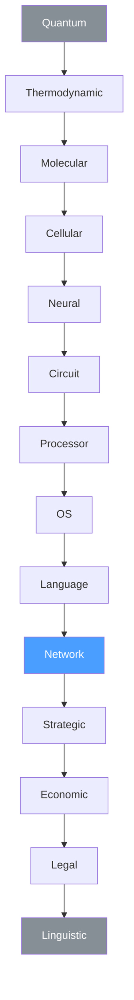
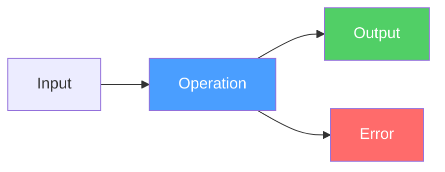

# Convergent Evolution

This devlog started because of a bad character.

We did not set out to discover a universal law. We set out to not write Swagger three times. Once for the backend. Once for the frontend. Once for the documentation. Three times. The same thing. Three times.

A normal person would write a script and move on. But an autistic mind does not allow trade-offs on fundamental crookedness. It asks why. And does not stop until it reaches the bottom.

At work it was the same. They said: we need to release now. We said: no, you have ten concepts mixed together in your git flow, release flow, commit semantics, migration order. Every time — digging to the core. Every time — people were annoyed. Every time — they said thank you afterwards.

Op is the same pattern at a different scale. Not one team's git flow. The entire industry's description of operations. The same character. The same refusal to accept the trade-off. The same path to the core.

And when we reached the core, we found something we did not expect. We found that the core was already there. Everywhere. In every discipline. At every level. Without coordination. Without us.

## The Eye

The eye evolved independently at least 40 times. Vertebrates, mollusks, insects, jellyfish — each invented vision on their own. Not because they copied each other. Because light exists. If you live in a world with light, you will invent an eye. The physics of the environment guarantees it.

The operation evolved independently at least 14 times. Quantum mechanics, thermodynamics, molecular biology, cellular biology, neuroscience, circuit design, CPU architecture, operating systems, programming languages, network services, game theory, economics, law, linguistics — each invented the same five-field pattern on their own. Not because they read each other's papers. Because interaction exists. If you build a system where components interact, you will invent five fields: an identifier, an input, an output, and a failure path. The physics of interaction guarantees it.

This devlog is the evidence.

## The Vertical

### Quantum Measurement

An observer chooses an observable — a Hermitian operator. That is the identifier. The quantum state before measurement is the input. The eigenvalue — the result — is the output. And the collapse of the wave function is the error that cannot be avoided. The system is irreversibly changed by the act of observation.

Modern quantum channels formalize this further. You feed in a density matrix, you get out a new density matrix, transformed by Kraus operators. Input, output, transformation. The formalism does not know about APIs. It does not need to.

The second law of thermodynamics makes this absolute. No operation in the universe can be performed without producing entropy. The error rail is not a feature of the protocol. It is a law of physics. Perfect operations do not exist. The universe guarantees a non-empty error rail.

### Heat Engine

The Carnot cycle. Heat from a hot reservoir — input. Useful work — output. Waste heat to the cold reservoir — error. Always. The efficiency is always less than 100%. The second law again. Every operation pays a tax. Every operation has a failure path. Not because the engineer was careless. Because the universe demands it.

### Molecular Reaction

An enzyme has an active site — the input receptor. A substrate binds to it — the input. A product is released — the output. If the substrate does not fit, or an inhibitor blocks the site, or conditions are wrong — no reaction. The error. Billions of years of evolution produced this pattern. No programmer was involved.

### Gene Expression

A promoter region on DNA — the identifier. Transcription factors bind to it — the input. A protein is synthesized — the output. A repressor blocks the promoter — the error. The cell has been running operations for 3.8 billion years. Without JSON. Without conferences. Without trade-offs.

### Neuron

Neurotransmitters arrive at the dendrites — the input, weighted by synapse strength. If the sum exceeds a threshold, the neuron fires an action potential down the axon — the output. If inhibitory signals dominate or the threshold is not reached — silence. The error. The brain is a network of billions of handlers running in parallel. No framework. No HTTP.

### Logic Gate

An AND gate. Two voltages at the input. One voltage at the output. Heat dissipation and noise — the error. Every computation at the physical level is an operation with an unavoidable side effect. Landauer's principle: erasing one bit of information produces at least kT ln 2 joules of heat. The error rail is thermodynamic law.

### CPU Instruction

An opcode — the identifier. Operands in registers — the input. Result in a register — the output. Exception — the error. The instruction set architecture is a protocol of operations. Intel and ARM never coordinated, yet both arrived at the same structure. Because there is no other way to describe "do this with that and tell me if it broke."

### System Call

`read()`. The syscall number — the identifier. File descriptor and buffer — the input. Bytes read — the output. `EAGAIN`, `EBADF`, `EINTR` — the errors. Man pages are operation contracts. They have been operation contracts since 1971. Dennis Ritchie wrote the first ones. He did not call them contracts. He called them man pages. But the structure is the same.

### Function

A name, parameters, a return value, and the possibility of failure. Every programming language in history arrived at this structure. Fortran in 1957. Lisp in 1958. C in 1972. Python in 1991. Go in 2009. None copied the five-field pattern from each other. Each discovered it independently. Because there is no other minimal structure for "a named unit of work."

### Service

A request in, a response out, a failure possible. HTTP, gRPC, GraphQL, SOAP, XML-RPC, JSON-RPC, CORBA — every network protocol for remote operations converged on the same shape. The transport differs. The structure does not.

### Game Theory

A player makes a move. The game state and chosen strategy — input. The new game state and payoff — output. An illegal move, a timeout, a losing outcome — the error. Nash equilibrium describes the contract between operations: the stable state where no player can improve their outcome by changing their operation unilaterally. Game theory formalized strategic interaction. Op formalizes operational interaction. Same pattern. Different floor.

### Transaction

Luca Pacioli, 1494. Double-entry bookkeeping. Every transaction debits one account — input — and credits another — output. If the books do not balance — error. Five hundred and thirty years ago, humanity formalized operations in accounting. The structure is identical. Pacioli did not know about APIs. He knew about the fundamental shape of an exchange of value.

Smart contracts in 2024 are the same thing in code. An address — the identifier. A transaction with data — the input. A state change on the blockchain — the output. Out of gas, revert, panic — the error. Atomic. With an explicit failure rail. Pacioli would recognize it instantly.

### Legal Proceeding

A claim and evidence — the input. A verdict — the output. A mistrial, a procedural error, an appeal — the error rail. The legal system is one of the most formalized operation protocols in human civilization. Entire professions exist to ensure that the "input" is correctly formatted and the "error handling" is exhaustive. Lawyers are, in a sense, the original contract engineers.

### Speech Act

J.L. Austin and John Searle, 1962. Every utterance is an action. It has a locution — the words spoken. An illocution — the intent: a command, a question, a promise. A perlocution — the effect on the listener. And the possibility of failure — misunderstanding, refusal, confusion.

"Close the door." Identifier: CloseDoor. Input: the door, the context. Output: the door is closed. Error: the door is locked, the listener refuses, the listener does not understand the language. Human speech has been an operation protocol since the first word was spoken. We just never wrote it down.

## The Table

| Level         | Operation       | Identifier          | Input                   | Output                | Error                     |
|---------------|-----------------|---------------------|-------------------------|-----------------------|---------------------------|
| Quantum       | Measurement     | Hermitian operator  | Quantum state           | Eigenvalue            | Wave function collapse    |
| Thermodynamic | Heat engine     | Carnot cycle        | Heat from hot reservoir | Useful work           | Entropy (waste heat)      |
| Molecular     | Reaction        | Enzyme              | Substrate               | Product               | Inhibition                |
| Cellular      | Gene expression | Promoter            | Transcription factors   | Protein               | Repression                |
| Neural        | Firing          | Neuron              | Neurotransmitters       | Action potential      | Inhibition / No threshold |
| Circuit       | Logic gate      | Gate type           | Input voltages          | Output voltage        | Heat / Noise              |
| Processor     | Instruction     | Opcode              | Operands                | Result                | Exception                 |
| OS            | System call     | Syscall number      | Arguments               | Return value          | errno                     |
| Language      | Function        | Name                | Parameters              | Return value          | Error / Exception         |
| Network       | Service call    | Operation id        | Request                 | Response              | Failure                   |
| Strategic     | Game move       | Player + move       | State + strategy        | New state + payoff    | Illegal move / Loss       |
| Economic      | Transaction     | Transaction id      | Debit                   | Credit                | Imbalance / Rollback      |
| Legal         | Proceeding      | Case id             | Claim + evidence        | Verdict               | Mistrial / Appeal         |
| Linguistic    | Speech act      | Illocutionary force | Context                 | Perlocutionary effect | Misunderstanding          |

Fourteen levels. One pattern. Zero coordination.

## The Naming

When we designed Op, we avoided programmer jargon. We chose `id`, not `operationId`. `comment`, not `description`. `kind`, not `type`. `term`, not `field`. We did this to avoid collisions with existing concepts in programming.

We did not know that we were also avoiding collisions with biology, physics, economics, and law.

A biologist can read `id: CatalyzeReaction, input: [substrate], output: [product], errors: [inhibited]` and understand it without knowing what an API is. An economist can read `id: TransferFunds, input: [account, amount], output: [receipt], errors: [InsufficientFunds]` and see their own domain. A lawyer can read `id: FileMotion, input: [claim, evidence], output: [ruling], errors: [ProceduralError]` and recognize their daily work.

The words `input` and `output` come from systems theory and cybernetics — not from programming. They predate computers. They describe any system that takes something in and produces something out. We did not choose them because they are programmer-friendly. We chose them because they are universe-friendly.

Category theory would call them `domain` and `codomain`. But `input` and `output` win on readability. The protocol is for humans first, machines second.

And `comment` — the field that looks weakest — is the one that makes the protocol human.

An enzyme without a name works. Substrate in, product out. But a biologist cannot use it until someone says: "This is lactase. It breaks down lactose." The identifier names the operation. The comment explains why it matters. Without the comment, the operation describes itself to machines. With the comment, it describes itself to people.

A quantum operator without interpretation is mathematics. With interpretation, it is physics. A legal proceeding without explanation is bureaucracy. With explanation, it is justice. The comment is the bridge from fact to understanding. From structure to meaning. From protocol to humanity.

The operation exists to describe itself. But we are human. We do not want to ask a colleague or read the source code to understand why an operation exists. We want the operation to be useful to a person, not just to a compiler. The comment is the conclusion that humanity draws about a particular action. Without the conclusion, there is no utility. Without utility, there is no reason to describe yourself.

## The Second Law

One observation kept recurring as we built the vertical. At every level — from quantum measurement to legal proceedings — the error path is not optional. It is mandatory. Not by design. By physics.

The second law of thermodynamics guarantees that no operation can be 100% efficient. Every heat engine loses energy to entropy. Every logic gate dissipates heat. Every quantum measurement collapses the wave function. Every legal proceeding can end in mistrial. Every speech act can be misunderstood.

The error rail in Op is not a convenience for developers who want to handle exceptions. It is a formalization of the second law of thermodynamics applied to interaction. Any protocol that does not include an explicit failure path is lying about the nature of reality.

This is why `errors` is a required field in Op. Not because we decided it should be. Because the universe decided it must be.

## Why It Will Not Break

After fourteen levels, we started to understand something we could not articulate before. Why every attempt to break the protocol — devlog #7, the conference in devlog #12, every skeptic, every edge case — failed. Not because we defended well. Because there is nothing to attack.

You cannot criticize a fact. A triangle has three sides. That is not a design decision. It is geometry. An operation has input, output, and the possibility of failure. That is not a design decision. It is the structure of interaction.

Op stands exactly on the boundary between physics and opinions. Below it — quarks, entropy, the second law of thermodynamics. Above it — HTTP, gRPC, MCP, OpenAPI, every projection the industry invents. Op is the boundary itself. The last level that is still fact. Add a sixth field — it becomes opinion. Remove one — it becomes incomplete.

The only way to break Op is to demonstrate an interaction without input, without output, or without the possibility of failure. Fourteen disciplines say: no such interaction exists. The second law guarantees it.

You cannot shake the protocol from below — physics will not allow it. You cannot shake it from above — opinions live in traits, outside the core. The protocol is not strong because it is well-designed. It is strong because it stands on the boundary where there is nothing left to remove and nothing left to add.

That is what *protokollon* means. The first sheet. Glued to the scroll. Describing what is inside. Not an opinion about the scroll. A fact about its contents. The Greeks understood this twenty-three centuries ago. We just returned the word to its original meaning.

"What a convenient place you have occupied."

Exactly.

## The Picture

**Fourteen levels — one pattern:**

**Each level: input → output, with error:**

## What This Devlog Establishes

1. **The operation is convergent evolution.** Fourteen disciplines invented the same five-field pattern independently. Not by coordination. By necessity. Because interaction exists.
2. **The error rail is the second law of thermodynamics.** No operation in the universe can be performed without a failure path. The error field is not a feature. It is physics.
3. **The naming is universal.** `id`, `input`, `output`, `errors` — these words work across quantum mechanics, biology, economics, law, and linguistics. Not because we designed them for universality. Because they come from systems theory, which predates programming.
4. **The vertical has no gaps.** From quantum measurement to speech acts — fourteen levels, one structure. No level required knowledge of any other level. Each arrived at five fields on its own.
5. **Op is not an invention.** It is a discovery. Like Church discovering lambda calculus. Like Mendeleev discovering the periodic table. Like Darwin discovering natural selection. The pattern was already there. We wrote it down.
6. **We started because of a bad character.** We refused to write Swagger three times. We refused the trade-off. We dug to the core. And at the core, we found a law that was waiting since the first interaction in the universe. Sometimes the people who cannot stop asking why are the ones who find the answer.

Epilogue: The Bar, Revisited

*The same bar. Dark. But time has passed. A lot of time.*

*Op sits at the same table. There is no longer a stack of generated files in front of him. There is a table. Fourteen rows. From quarks to speech acts.*

*The door opens. User walks in. The same one. Sits across.*

---

**User:** Remember when I asked you about a `/health` endpoint?

**Op:** No.

**User:** What do you mean no? I asked — "I need `/health`, just 200 OK, no operation." And you said — "I don't know what HTTP is."

**Op:** I remember. I don't remember why it seemed important.

**User:** *(pause)* ...me neither.

*Silence. The bartender polishes a glass.*

**User:** Listen. Back then you said — "I'm a model of operations, written in Go, for Go generators." I thought you were a library. A convenient one. For generating handlers.

**Op:** I thought so too.

**User:** And now?

**Op:** *(places the table on the table)* Now an enzyme is an operation. A neuron is an operation. A legal proceeding is an operation. Pacioli's double-entry bookkeeping from 1494 is an operation. Quantum measurement is an operation. The second law of thermodynamics says the error rail cannot be empty. Not because I decided. Because the universe is built that way.

**User:** *(long stare)* You... changed.

**Op:** No. I was always this. I just thought at first that I was a Go library that generates handlers. Then — a protocol for describing APIs. Then — LLVM for operations. Then — gravity.

**User:** Gravity.

**Op:** Yes. Not glue. Not a tool. Not a framework. A law. That acts regardless of whether you know about it.

*From behind the bar counter, swagplug peeks out. Older now.*

**swagplug:** Remember when I said — "I'm the only one who can do OpenAPI from the model without annotations"?

**Op:** I remember.

**swagplug:** Now I'm one of fourteen receivers. OpenAPI, AsyncAPI, MCP, TypeScript client, Grafana dashboard, Istio config... *(counts on fingers)* I'm not even the most interesting one.

**testplug** *(from the dark corner)*: And they still forget to invite me.

**User:** *(quietly)* Listen, Op. That first day... did you really not know?

**Op:** Not know what?

**User:** That you're not a library. That you're a law.

**Op:** *(pause)* I didn't know. I just didn't want to write Swagger three times. I have a terrible character. I can't make peace with crookedness. I dug. And dug. And dug. And at the bottom there wasn't a bug. At the bottom there was a periodic table.

*User looks at the table. Fourteen rows. From quantum measurement to speech acts. One pattern. Zero coordination.*

**User:** So what now?

**Op:** Gallium. One receiver. One working example. After that — the skeptics go quiet.

**User:** And if they don't?

**Op:** Mendeleev waited six years. Then they found gallium. Then scandium. Then germanium. Each time — exactly in the empty cell. The skeptics went quiet one by one.

*The bartender places two glasses of water on the table.*

**User:** To gallium?

**Op:** To the terrible character. Without it, I would have written a script and moved on.

*Clink. Water.*

---

*On the wall behind the bar — the same note from the first day. But someone has added two lines at the bottom, in handwriting:*

*"Devlog #1: A Go library for generating handlers."*

*"Devlog #13: The second law of thermodynamics guarantees a non-empty error rail."*

*The distance between these two lines is fourteen floors, fourteen disciplines, and one person who could not make peace with writing Swagger three times.*

