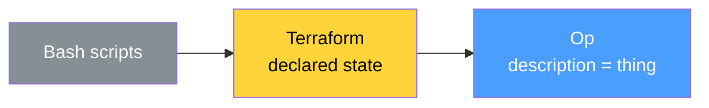

# The Fact

After the convergent evolution research, after fourteen levels from quarks to speech acts, after the conference where every question made the protocol stronger — we sat down and asked: why can't anyone break it?

The answer turned out to be simpler than we expected. And more fundamental.

## The Cat

Op does not have introspection. Op is introspection.

D-Bus added introspection as a feature. A method called `Introspect()`. You can call it. You can also not call it. The service exists without it.

gRPC added reflection as an optional plugin. Most deployments do not enable it. The service works fine without it.

WAMP has no introspection at all. The client must know in advance what to call. Hope and documentation.

OpenAPI is a separate file. It can lie. It can drift. It can be six months behind the code. And it usually is.

In Op there is no operation without an instruction. The instruction is not a description of the operation. The instruction is the operation. Remove the instruction — the operation ceases to exist. Not "becomes undocumented." Ceases to exist.

A cat that does not meow is not a cat you cannot hear. It is not a cat. Meowing is what makes a cat a cat. Self-description is what makes an operation an operation. In Op, these are the same thing.

## The Territory

In ordinary engineering we always deal with two layers: the world of things and the world of descriptions of things. The API changes but the Confluence page stays old. The server works but nobody trusts the OpenAPI spec. This is the Map and Territory problem. The map drifts from the territory. Always. Everywhere.

Op eliminates the gap. In Op the map is the territory.

This is not a metaphor. Three disciplines already work this way.

DNA is not a blueprint of an organism stored in a separate file. The sequence of nucleotides is simultaneously the instruction, the physical carrier, and the machine that executes synthesis. There is no separate "gene description file" and "gene." They are the same molecule.

A musical score is not a recording of music created after the fact. In the ontology of music, the score is the Type and the performance is the Token. Without the score, the work does not exist as a cultural fact. The notation does not describe the music afterward. It constitutes its existence.

A law in legal positivism is not a description of behavior. The text of the statute is the law. There is no law "in general" floating somewhere above the text. The behavior of people in court is the execution of that text. Change the text — the law changes. Delete the text — the law ceases to exist.

Op is the fourth example. The instruction does not describe the operation. The instruction is the operation. Change the instruction — the operation changes. Delete the instruction — the operation ceases to exist. There is no gap between description and reality because they are the same object.

## The Autopsy

WAMP is the closest relative that died. The autopsy explains why.

WAMP (Web Application Messaging Protocol, ~2012) combined RPC and PubSub in one protocol. Transport-agnostic — WebSocket, TCP, Unix sockets. A routed architecture where clients call procedures by URI and a router forwards the invocation. Elegant. Well-designed. Dead.

Here is what a WAMP registration looks like:

```
[REGISTER, 12345, {}, "com.myapp.calculate"]
```

That is it. A URI. No input types. No output types. No errors. No description. The router is a blind postman. It delivers envelopes without knowing what is inside. The client calls:

```
[CALL, 67890, {}, "com.myapp.calculate", [2, 3]]
```

And hopes. Hopes that the server expects two numbers. Hopes that the result will be a number. Hopes that the error format is parseable. Every WAMP project reinvents validation, type checking, and error handling. The protocol gave them a delivery mechanism and left them alone with the contents.

Op has no delivery mechanism. Op is the contents. WAMP told you how to send a letter. Op tells you what the letter says. They are not the same layer. They are not competitors. They are different questions.

## The Multiplication Table

Someone will look at Op and say: "You chose not to include transport. Smart architectural decision."

No. We did not choose. Op cannot have transport. Like the multiplication table cannot have a calculator. The multiplication table is a fact. The calculator is a tool that uses the fact. The fact does not decide to exclude the tool. The fact does not know the tool exists.

WAMP made an architectural decision: WebSocket plus a central router. It could have decided differently. TCP without a router. HTTP with a router. These are choices. Design trade-offs.

Op made no decisions. A protocol that records facts about operations cannot have a transport opinion for the same reason that the number five cannot have a color. Not because we chose colorlessness. Because numbers do not have colors.

This is why comparing Op to WAMP, gRPC, or any RPC system is a category error. They are delivery systems. Op is a fact system. Delivery is one of infinitely many things you can do with a fact.

## Not RPC

This deserves its own section because the confusion will be persistent.

RPC answers: how do I call a procedure on a remote machine? The keyword is call. RPC is a delivery mechanism. A pipe.

Op answers: what procedure exists? The keyword is exists. Op is a fact. Not a pipe.

An IDE reads an instruction and gives you autocomplete. That is not a call. A documentation portal reads an instruction and publishes HTML. That is not a call. A security scanner reads an instruction and finds that operation DeleteUser has trait `auth: admin` but the receiver does not check the token. That is not a call. A saga orchestrator reads the error rail of ChargePayment and compiles compensation logic. That is not a call.

RPC is one projection. One of infinity. Op is the coordinate system on which RPC is one point.

You did not invent RPC. You described what RPC was trying to describe but could not — because it glued itself to the pipe.

## The Table of Introspection

| System | Introspection | Mandatory | Types in/out | Typed errors | Can drift from reality |
|---|---|---|---|---|---|
| **Op** | Is the essence | Absolute | Yes | Yes | No (description = reality) |
| D-Bus | Feature (Introspect method) | Optional | Yes (XML) | Error name only | Yes |
| gRPC | Plugin (Server Reflection) | Optional | Yes (Protobuf) | Status codes | Yes (.proto can diverge) |
| WAMP | Absent | — | No (URI only) | No standard | Permanent chaos |
| OpenAPI | Static file | Optional | Yes | Partial | Critical (75-89% APIs diverge) |
| GraphQL | Introspection Query | Optional (often disabled in prod) | Yes | Partial | Low |
| MCP | Feature (tools/list) | Required | Yes (JSON Schema) | Inside response | Low |
| CORBA | Interface Repository | Optional | Yes (IDL) | Exceptions | High |
| COM/DCOM | IDispatch | Optional | Yes (IDL/typelibs) | HRESULT | Low |

Nine systems. Op is the only one where the description cannot drift from reality. Because they are the same object. Zero drift. Not low drift. Zero.

## Understanding, Not Results

Terraform guarantees that reality equals code. You write a `.tf` file, run `terraform apply`, and the infrastructure converges to the declared state. If it cannot — it fails and rolls back. Terraform is a dictator. A benevolent one. But a dictator.

Op guarantees nothing of the sort. Op guarantees that the client and the server understand the same words. What the server does with the call — that is the server's business. Maybe it transfers the money. Maybe it fails. Maybe it steals. Op does not know and does not care.

This sounds like a weakness. It is the greatest strength.

TCP/IP won over OSI for exactly this reason. OSI tried to guarantee quality of service, session management, and presentation at every layer. Seven layers of guarantees. It collapsed under its own complexity. TCP/IP guaranteed one thing: the packet format is understood by both sides. What happens to the packet — best effort. UDP does not even guarantee delivery. And UDP won.

Op is TCP/IP for operations. It guarantees the format. The semantics. The shared vocabulary. Everything else — execution, reliability, transactions, rollbacks — is the ecosystem's job. Vendors build it. Community audits it. Issues track it. Per vendor. Per receiver. Per deployment.

A protocol that guarantees results is a framework. A protocol that guarantees understanding is a language. Op is a language.

## The Industry Standard

An instruction can describe not only "my service can do this" but also "any service in this category must be able to do this."

Like JSON Schema. JSON Schema does not describe a specific JSON document. It describes the shape that any JSON document must conform to. Op instructions can work the same way — not "here is what my service does" but "here is what any marketplace must do."

A standard set of instructions for e-commerce: CreateProduct, UpdatePrice, GetOrders, UpdateStock, GetReturns. With fixed fields. With fixed errors. With fixed semantics. Each marketplace adds its own traits — its own categories, warehouses, rate limits. Its uniqueness is in the traits. Its compatibility is in the instruction.

This is FHIR for any industry. FHIR told hospitals: here are the standard operations for exchanging medical data. Hospitals added their extensions. Regulators made compliance mandatory. The ecosystem grew.

Op tells marketplaces: here are the standard operations for commerce. Marketplaces add their traits. Economics makes compliance profitable. The ecosystem grows. Not because anyone commands it. Because the alternative — maintaining separate integrations with every partner — is more expensive than conforming to a shared fact.

## Protokollon

The word protocol comes from ancient Greek. *Protokollon*. *Protos* — first. *Kolla* — glue. The first sheet glued to a scroll. It described the contents of the scroll — who wrote it, when, about what. Metadata. A contract between the author and the reader. Before you read the text — read the protocol. It will tell you what to expect.

Later in Byzantium, protocol came to mean the rules of diplomatic interaction. How to address an ambassador. What to say first. How to transfer documents. Formalization of interaction between parties that do not know each other.

Later in science — the protocol of an experiment. What you feed as input. What you measure as output. What you consider an error. Five fields.

Later in networks — TCP/IP, HTTP, SMTP. Formalization of interaction between machines that do not know each other.

Op returned the word to its original meaning. The first sheet. Glued to the operation. Describing what is inside. Not an opinion about the operation. A fact about its contents. The Greeks understood this twenty-three centuries ago.

## The Declarative Arc

The history of IT is a slow migration from imperative to declarative.

First stage: manual commands. SSH into the server. Run bash scripts. Install packages by hand. Hope nothing breaks. This is the era of WAMP — the description lives only in the developer's head.

Second stage: declarative state files. Ansible playbooks. Terraform configurations. Database migrations. You declare the desired state. The engine computes the diff and converges. But the description is still a separate artifact. It can drift. `.tf` files can lie about what is actually deployed.

Third stage: description as the thing itself. Git — the commit object is the history, not a log of the history. Op — the instruction is the operation, not a document about the operation. There is no drift because there is no gap.

Op completes this arc for interaction. It does for calling functions what Terraform did for creating servers, what Git did for storing history, what DNA does for building organisms. It makes the declared state the only possible reality.

## The Picture

**Op IS introspection — the map is the territory:**


**Others ADD introspection — the map can drift:**


**The declarative arc:**



## What This Devlog Establishes

1. **Op is introspection, not has introspection.** The instruction is the operation. Remove it — the operation ceases to exist. A cat without meowing is not a cat.
2. **The map is the territory.** DNA, musical scores, legal statutes — three disciplines where description constitutes existence. Op is the fourth.
3. **WAMP died from blindness.** A registration with only a URI. No types, no errors, no description. A blind postman. The autopsy confirms: when description is optional, chaos is mandatory.
4. **Op cannot have transport or a router.** Not "chose not to." Cannot. A fact does not make architectural decisions. The multiplication table does not contain a calculator.
5. **Op is not RPC.** RPC is "how to call." Op is "what exists." A call is one projection out of infinity.
6. **Op guarantees understanding, not results.** Like TCP/IP. The format is shared. The execution is the ecosystem's job. A protocol that guarantees results is a framework. A protocol that guarantees understanding is a language.
7. **Instructions can be industry standards.** Not just "my service does X" but "any service in this category must do X." FHIR for any industry.
8. **Protokollon.** Ancient Greek: first sheet glued to the scroll. Op returns the word to its original meaning.
9. **The declarative arc.** Bash → Terraform → Op. Manual → declared state → description is the thing itself. Op completes the arc.
10. **Zero drift.** Nine systems compared. Op is the only one where description cannot diverge from reality. Because they are the same object.
