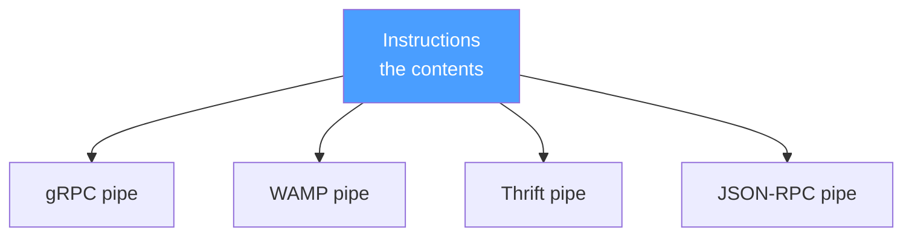
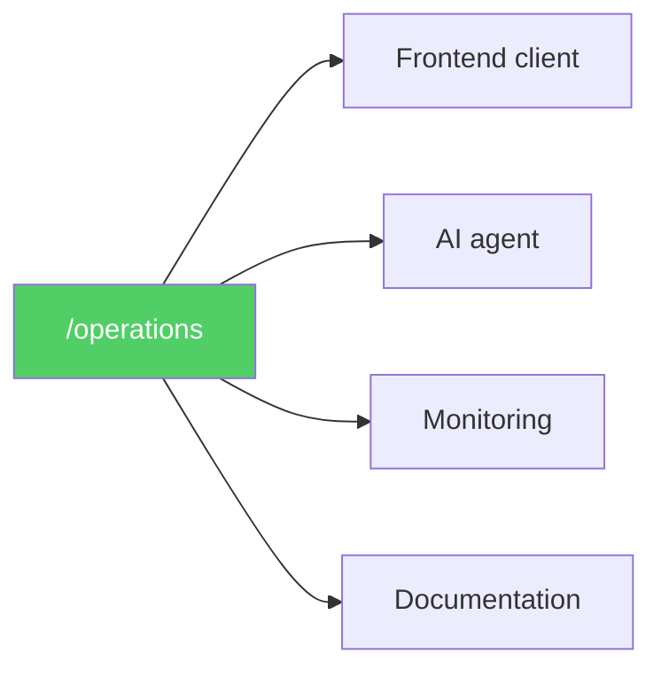

# The Coexistence

Every new standard promises to replace the old ones. CORBA will replace everything. SOAP will replace CORBA. REST will replace SOAP. gRPC will replace REST. GraphQL will replace REST. Each time — a war. Each time — casualties. Each time — the old world fights the new.

Op does not replace anything. Op cannot replace anything. Because Op is not on the same floor.

## The Pipe and the Contents

gRPC is an excellent pipe. Fast. Binary. Multiplexed. HTTP/2. Streaming. It knows how to deliver bytes from machine A to machine B better than almost anything.

But gRPC does not know what it is delivering. It knows the proto schema — but the proto schema is welded to gRPC. Remove gRPC and the proto file loses half its purpose. The pipe and the contents are glued together.

WAMP is an excellent router. It decouples caller from callee. The caller does not know where the procedure lives. The router finds it. Elegant.

But WAMP does not know what it is routing. A URI and a blob of arguments. No types. No errors. No description. A blind postman.

Thrift is excellent at binary serialization. Compact. Fast. Cross-language.

But Thrift does not know what it is serializing. Or why. Or what happens when it fails.

Every RPC system is a pipe that tried to also be the contents. And failed at the contents part. Because pipes are good at delivery, not at meaning.

Op is the contents. Only the contents. It does not deliver. It does not route. It does not serialize. It describes. What exists. What goes in. What comes out. What can go wrong.

In a world with Op, every pipe survives. gRPC delivers instructions over HTTP/2. WAMP routes instructions through its router. Thrift serializes instructions into binary. JSON-RPC wraps instructions in its envelope. Each pipe does what it does best. The contents — from the instruction. The delivery — from the pipe.

Op does not compete with pipes. Op fills them with meaning.

## The Restaurant Menu

Someone will ask: is it safe to publish `/operations`? To let anyone see what your service can do?

Is it safe to publish a restaurant menu? To let anyone see what you cook?

The menu is not the food. Knowing that a restaurant serves steak does not give you a steak. You still need to sit down, order, and pay. The menu is advertising. The more people see it, the more customers come.

Hiding the OpenAPI spec behind basic auth is like hiding the menu behind a locked door. "Pay first, then find out what we cook." The fear is not rational. It is habitual.

If knowing the URL `/api/dogs` is a vulnerability, the problem is not with the documentation. The problem is with the authorization. A locked endpoint is secure whether or not someone knows it exists. An unlocked endpoint is insecure whether or not someone knows it exists. The description changes nothing about security. It changes everything about usability.

HATEOAS publishes links to all available actions in every response. Every single response. Nobody screams "security hole." Because a link is not access. A description is not authorization.

MCP works the same way. You enter the server address in your config. The server responds: here are my tools, here is what I can do. Publicly. Without fear.

And if you have private operations? Do not publish them. That is all. Op does not dictate what to publish. Does not dictate at which URL. Does not dictate how to share. The protocol has no opinion on distribution. Just like JSON Schema has no opinion on where the file lives.

Introspection by default is not a hole. It is a feature. Automatic frontend construction. Automatic AI agent connection. Automatic documentation. Automatic monitoring. All because the service does not hide its menu behind a lock.

Think of it this way. Google said: describe your pages in `sitemap.xml` — and we will find you. Do not make the crawler guess. Just say what you have. Sitemap changed SEO. Every website publishes one. Nobody considers it a security risk.

`/operations` is a sitemap for operations. Describe what your service can do — and every client, every AI agent, every monitoring system will find you. Do not make the integrator read source code. Just say what you can do. Sitemap changed discovery of pages. Op changes discovery of capabilities.

And then imagine the next generation of search. Today Google indexes what a website says. Text. Content. Keywords. What if you could search not by content but by capability? Not "this page mentions currency conversion" but "this service performs ConvertCurrency, accepts EUR and USD, returns rate." Search by what services can do, not by what they say they do. SEO today: optimize text so Google finds you. SEO tomorrow: publish `/operations` so the world finds you. By fact, not by words.

Take it further. Today useless articles about marketplaces drown your actual marketplace in search results. Content competes with capability. Words compete with facts. But what if Google could see that your service implements a standardized set of operations — CreateProduct, UpdatePrice, GetOrders — agreed upon by the industry? What if conforming to an operation standard automatically placed you in a trusted category? PageRank raised trust for pages that others link to. Imagine an OpRank that raises trust for services that conform to shared operation standards. Not by what you write about yourself. By what you actually do. Verifiable. Machine-readable. From the instruction.

And forgery is impossible. Not because of cryptography. Because of economics. If you publish a fake instruction — claim you support CreateProduct but your service does not actually work — your clients cannot use you. The receiver compiles a client from your instruction. The client calls your service. The service fails. Immediately. Publicly. Automatically. Lying about your operations is like smashing your phone and calling from a toy one. Did you deceive someone? Yes. Can you make calls? Doubtful. The instruction is not a promise. It is a contract that is verified by every single call. Partial automatic verification — for free — by everyone who uses you.

## The Friend

We talked to a friend. A CEO of a large retail chain. Not a programmer. A businessman who has been paying for integrations his entire career.

His first job was 1C. His first task — literally parsing one opinion into another. He laughed. "So that is what I have been doing for twenty years. Converting shadows."

He sells on marketplaces. Each marketplace has its own API. Its own format. Its own errors. Its own quirks that directly affect business processes. Every integration — custom. Every new marketplace — months. Every API change — broken revenue.

We explained the combinatorial problem. He explained his business problems. We realized we were describing the same thing from different floors.

And then he said something important: "So Op is not for my company. Op is for the marketplaces themselves."

Yes. Exactly.

## Not a Pattern — A Standard

If Op is used inside one company to abstract away integrations — that is a strategy pattern. Useful. But it does not change the industry. The marketplaces still speak different languages. The sellers still pay for translators.

If Op is used as an industry standard — that changes everything.

A standard set of instructions for e-commerce: CreateProduct, UpdatePrice, GetOrders, UpdateStock, GetReturns. Fixed fields. Fixed errors. Fixed semantics. Each marketplace adds its own traits — its own categories, warehouses, rate limits. Its uniqueness is in the traits. Its compatibility is in the instruction.

The marketplace does not adopt someone else's format. The marketplace describes its own capabilities using a shared vocabulary. Its API does not change. Its uniqueness does not disappear. It simply publishes an instruction that says: here is what I can do, here are my specifics.

Why would a marketplace do this? For the same reason Anthropic would support Op. Not out of altruism. Because every seller who already has Op integration connects in minutes instead of months. More sellers. Faster. Cheaper. No integration department. No 200-page documentation. No "email us at support@, we will send you an SDK."

## Not a Killer Feature of RPC

Someone will say: "Protobuf already tried this. gRPC already tried this. One format, all platforms, clients are generated. How is this different?"

gRPC says to the marketplace: rewrite your API in our format. Throw away your REST. Throw away your JSON. Here is protobuf, here is HTTP/2, here is binary serialization. Accept our stack — get our benefits.

No marketplace will do this. They have REST. They have millions of clients on those APIs. Rewriting means breaking everything. gRPC proposes revolution. Revolutions do not happen when business is working.

Op does not ask the marketplace to rewrite a single line. Op says: describe what you already do. You have CreateProduct? Write down five fields. What transport you use — REST, GraphQL, SOAP, carrier pigeon — does not matter. The transport is a trait. Your opinion. Write it next to the fact.

gRPC replaces. Op describes. gRPC requires migration. Op requires one file.

RPC is a way to call. Op is a way to understand. They are not competitors. They are different floors.

## The Picture

**Op fills pipes with meaning:**

**The menu is open — /operations:**

## What This Devlog Establishes

1. **Op fills pipes with meaning.** gRPC, WAMP, Thrift, JSON-RPC — all survive. Each does delivery. Op does description. The pipe and the contents are separated. Both are better for it.
2. **The menu is open.** Publishing `/operations` is not a security hole. It is a feature. A description is not authorization. A locked endpoint is secure whether or not someone knows it exists. Hide the menu — lose customers. Open the menu — gain the world.
3. **Op is for the industry, not for one company.** Inside one company it is a strategy pattern. Across an industry it is a standard. The difference is who publishes the instructions — one team or the entire ecosystem.
4. **Op describes, not replaces.** gRPC requires migration. Op requires one file. gRPC proposes revolution. Op proposes coexistence. Nobody rewrites. Everyone gains.
5. **The businessman understood before the programmer.** "Op is not for my company. Op is for the marketplaces themselves." The pain is real. The solution is not technical. It is economic. Marketplaces gain sellers. Sellers gain marketplaces. The shared language is the multiplier.
