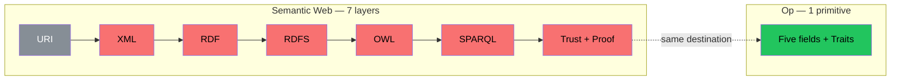
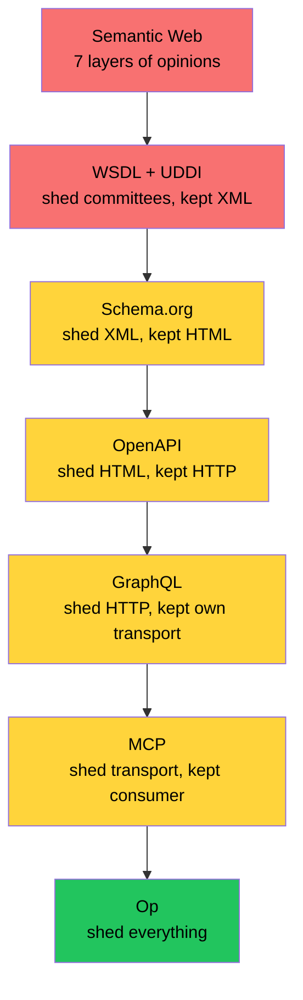
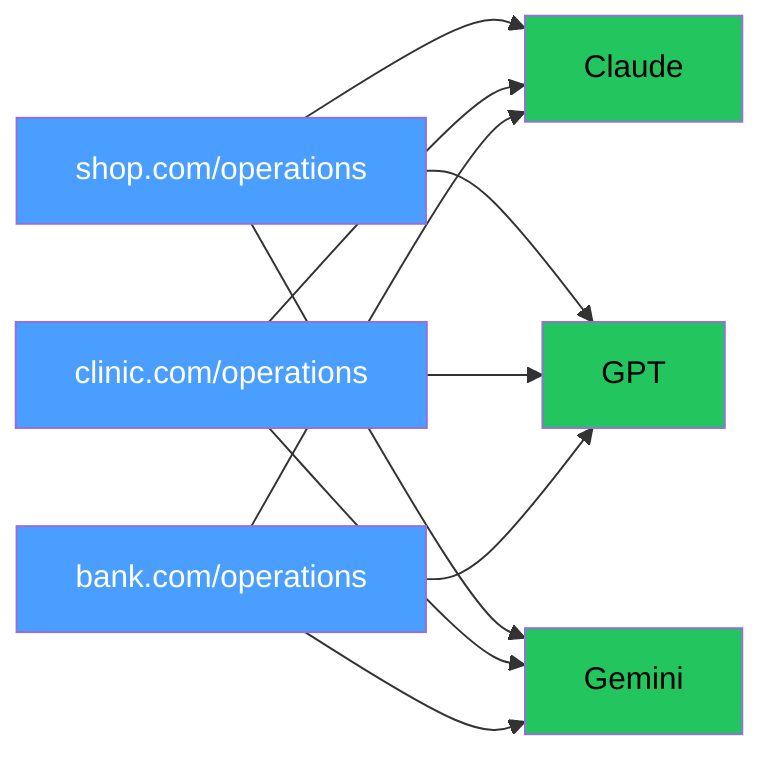

# The Founder's Dream

In 2001 a man published an article in Scientific American. He had already changed the world once — given it addresses, transport, and hyperlinks — and now he was reaching for the next step.

His name was Tim Berners-Lee. The article was called "The Semantic Web." It described a future where machines understand not how pages look, but what services can do. Where an agent — a program acting on your behalf — finds a doctor near your house, checks your insurance, cross-references your calendar, and books an appointment. Without you opening fifteen tabs. Without you calling anyone. Without you reading documentation.

2001. Twenty-one years before ChatGPT. Twenty-three years before MCP.

He was right about the destination. The road he chose was the one available to him at the time.

## The Three Primitives

In 1989, Berners-Lee invented the Web with three primitives:

- **URI** — an address for everything. Every resource in the world has a unique coordinate.
- **HTTP** — a way to fetch a resource by its address.
- **HTML** — a language for documents with links to other documents.

Three primitives. The world exploded.

But only one of them was a fact.

URI is a fact. An address. A coordinate. No opinion about transport, format, or presentation. Just — this thing is here. URI survived everything. HTTP changed four times (1.0, 1.1, 2, 3). HTML changed beyond recognition (2.0, 3.2, 4.01, XHTML, 5). URI is the same. RFC 3986, 2005. Because addresses are facts. Facts do not need versions.

HTTP is an opinion. An opinion about how to deliver documents over a network. A good opinion. A useful opinion. But an opinion. The resource could have been fetched through a local file, P2P, a message queue, or a carrier pigeon. HTTP became the default not because it was the only way, but because the browser gave nothing else. And now the entire world thinks URI means "a thing you open in Chrome."

HTML is an opinion about presentation. How the model looks on a screen. `<b>`, `<font>`, `<table>` for layout. Data and display — in one file. Glued together. And this is where the dream met its first wall. The Web Berners-Lee built carried data and presentation together — because that is what the world needed in 1989. By the time the question *"where is the model?"* became urgent, billions of pages were already in HTML. The model was underneath, but the presentation had arrived first and stayed.

The lesson: **the model matters more than the presentation.** If you get the model right, presentations are projections. If you get the presentation first, extracting the model is archaeology.

## The Seven Layers

To make machines understand the Web, Berners-Lee proposed a layer cake:

| Layer | What | What it really is |
|-------|------|-------------------|
| URI + Unicode | Address everything | URI — fact. Unicode — opinion about encoding |
| XML | Syntax for structured data | Opinion about serialization. A heavy one |
| RDF | All knowledge as subject-predicate-object triples | Framework. Dictates the shape of all knowledge |
| RDFS | Light ontologies. "Cardiologist is a subclass of Doctor" | Framework. Dictates how to organize concepts |
| OWL | Formal logic. Machines reason and derive new facts | Framework. Dictates how to think |
| SPARQL | Query language for the knowledge graph | Opinion about access |
| Trust + Proof | Digital signatures on triples. Provenance. PKI | Framework. Dictates how to trust |

Seven layers. Each one an opinion or a framework. Each one requiring adoption, tooling, committees, and consensus.

XML was the first casualty. To say "Dr. Smith is available on Monday" in RDF/XML:

```xml
<rdf:RDF xmlns:rdf="http://www.w3.org/1999/02/22-rdf-syntax-ns#"
         xmlns:ex="http://example.org/">
  <rdf:Description rdf:about="http://example.org/DrSmith">
    <ex:hasAvailability rdf:resource="http://example.org/Monday"/>
  </rdf:Description>
</rdf:RDF>
```

Seven lines. One fact. Developers ran.

OWL was the second casualty. To write an ontology, you needed Description Logic — a branch of mathematical logic. Quantifiers, implications, transitive properties. The average web developer in 2003 struggled with CSS. They were offered formal logic.

RDF was the deepest casualty. Not because triples are wrong. Because triples are a framework. They dictate: all knowledge is subject-predicate-object. But not all knowledge is triples. An operation is five fields. Try to describe `BuyDog(input, output, errors)` in triples — you get six triples for one operation with one field, and you lose the structure. The graph exists. The meaning is scattered.

Frameworks give way. That is their nature. Not because they are bad — many are brilliant. Because they carry opinions, and opinions do not scale across seven billion people who each have their own.

## The Five Failures

The Semantic Web failed for five reasons. Each one is a lesson.

**Failure 1: Who writes the ontologies?** To make an agent understand that a cardiologist is a doctor, someone must write a medical ontology. Who? A committee. Which committee? HL7? WHO? Each country? Each hospital? Wars of ontologies began. Dozens of competing descriptions of the same concepts. Entire PhDs on "how to align two ontologies of doctors."

Op has no ontologies. Traits are key-value strings. Each vendor writes their own. `http/method: POST` — for those who know HTTP. `grpc/service: Dogs` — for those who know gRPC. Do not know the trait — ignore it. Silently. No committee. No alignment. No PhD.

**Failure 2: No incentive.** A pizzeria owner is told: describe your menu in RDF. Why? "Someday agents will find you." When? "When everyone describes their sites in RDF." The owner says: call me when everyone does.

Op gives incentive today. Describe your operations in five fields — get typed clients, documentation, MCP tools, monitoring, security audit. Compiled. Now. Not someday. The CFO understands this. It is arithmetic, not philosophy.

**Failure 3: Complexity.** RDF + OWL + SPARQL — hundreds of pages of specifications. Description Logic. Quantifiers. Transitive properties.

Op — five fields. JSON. `cat instruction.json`. Done.

**Failure 4: Chicken and egg.** Agents will not appear until there is data. Data will not appear until there are agents that use it. Closed circle.

Op breaks the circle differently. One killer receiver. One tool so useful that people write emitters to feed it. Then a second receiver. Then a third. Each receiver makes every emitter more valuable. Each emitter makes every receiver more valuable. Network effect. Self-organization. No coordination required.

**Failure 5: Closed data.** Berners-Lee dreamed of an open knowledge graph. But Facebook, Google, Amazon built their own graphs. Gigantic. Accurate. Closed. Why would Google publish its Knowledge Graph in RDF? So competitors can use it?

Op does not ask anyone to open their internals. The instruction is a formalization of what is already public. You have a REST API? You already show the world what you can do. The instruction just writes it down. In five fields. Instead of a thousand pages of Confluence that lie.

## The Correlation Table

| Semantic Web | Op | Why the difference matters |
|---|---|---|
| URI — address everything | `id` — name the operation | Both are facts. Both survived |
| Unicode — encode all characters | JSON — serialize the instruction | Both are paper. Both are replaceable. The law is not in the encoding |
| XML — structure the data | No opinion on format | XML died under its own weight. Op has no format to die |
| RDF — all knowledge as triples | Five fields. Three atoms | RDF is a framework that dictates shape. Op is a primitive that states fact |
| RDFS — hierarchies of concepts | No hierarchies | Hierarchies are opinions. A cardiologist is a doctor — in one country. A healer — in another |
| OWL — unified ontology for all | Traits — ontology per vendor | OWL tried one language for the world. Op says: speak your own. Those who need to understand you will learn |
| SPARQL — query the graph | Receivers read instructions | SPARQL assumes a central graph. Receivers assume nothing. Each reads what it needs |
| Trust + Proof — PKI, signatures, certificates | Economics — every call verifies the contract | Berners-Lee built trust from above. Op grows trust from below. Lie about your operations — your clients break. Immediately. Publicly. For free |

Eight layers. Eight divergences. One destination.

## Trust Without Infrastructure

This deserves its own section. Because Berners-Lee spent an entire layer on it. And Op spends zero.

Berners-Lee's Trust layer: digital signatures on RDF triples. Certificate chains. Provenance tracking. A Certificate Authority that vouches for the publisher. Infrastructure. Committees. Standards for the standards.

Op's trust: you publish an instruction. A receiver compiles a client from it. The client calls your service. If the instruction lied — the call fails. Immediately. Publicly. Automatically.

No signatures. No certificates. No infrastructure. Trust is a side effect of usage. Every client that calls your operation is a verifier. Every successful call is a proof. Every failed call is a public audit.

This is not a design decision. It is a consequence of devlog #14 — the map is the territory. If the instruction is the operation, then a false instruction is a broken operation. You cannot forge the map without destroying the territory. Lying is self-destruction.

Berners-Lee needed seven layers to get to trust. Op needs zero. Because when description and reality are the same object, trust is not a layer. Trust is physics.

## The Languages

OWL tried to create one language for the world. One ontology that everyone uses. One committee that decides what "doctor" means.

This is Esperanto. Designed from above. Elegant. Logical. Dead.

Traits are natural languages. English emerged not because a committee designed it. Because the British Empire traded, Hollywood filmed, and Silicon Valley coded. People learned English because it was profitable to communicate with those who spoke it. Not because someone commanded.

Traits work the same way. `http/method: POST` emerged because the browser speaks HTTP. `grpc/service: Dogs` emerged because infrastructure teams speak gRPC. Nobody commanded. Nobody coordinated. Each vendor described their own opinion in their own trait. Receivers that understand the trait — use it. Receivers that do not — ignore it. Silently.

And then convergence happens on its own. If three vendors independently write `laravel/throttle: 60`, `spring/rateLimit: 60`, `express/rateLimit: 60` — the community sees the pattern. Someone proposes `resilience/rateLimit: 60`. Not a committee. A pull request. Not a standard. A convention. Not Esperanto. English.

Local dialect for your own. International for everyone. Both on the same operation. Both at the same time. Like announcements in an airport — English for all, Finnish for locals with details about the bus to Helsinki.

## Self-Organization

Everything that survived did so without a coordinator.

Ant colonies. No ant knows the plan. A pheromone trail is the primitive. One ant leaves a trail. Another follows it. The more ants walk the path, the stronger the trail. The shortest route amplifies itself. The longest evaporates. Optimal routing. Zero architects.

Flocking birds. Three rules: do not collide, fly roughly the same direction, stay near the center. Three primitives. From them — perfect formation. Thousands of birds. No leader.

Markets. Adam Smith, 1776. The invisible hand. The baker bakes not because he loves you. Because it is profitable. You buy not because you love the baker. Because you are hungry. From two selfish acts — optimal resource allocation. No plan. No coordinator.

The internet. No router knows the full path. Each knows one thing: "packet for this network — send there." One primitive. From millions of such primitives — a global network. No center. No architect.

Every time — the same pattern. **A simple primitive plus an economic incentive equals complex order.** No plan needed. No committee needed. No OWL needed. Just a primitive that is profitable to use. The rest is self-organization.

Op is the pheromone trail. Five fields. A primitive. The first vendor leaves a trail — writes a receiver. The second follows — writes an emitter. The third reinforces — writes another receiver. The trail strengthens. Alternative paths evaporate. The optimal route emerges on its own.

Not because anyone designed it. Because the primitive is right. And nature does the rest. It always has.

## The Agents Are Here

And here is the part of the story that carries the most weight.

In 2024–2025, AI agents appeared. ChatGPT, Claude, Gemini. They do exactly what Berners-Lee described in 2001. "Find me a doctor nearby, with good ratings, who accepts my insurance." The agent searches, compares, proposes.

But not through RDF. Not through ontologies. Not through SPARQL. Through reading text. The LLM reads an HTML page and understands what is on it. Not formally. Not precisely. Approximately. Statistically. But well enough.

Berners-Lee wanted formal semantics. He got statistical semantics. Wanted exact answers from a graph. Got approximate answers from a neural network. Wanted machines to know. Got machines that guess well.

And now these agents need something to read. Not HTML — they can already read that, approximately. They need machine-readable descriptions of what services can do. Precisely. With typed inputs. With typed outputs. With enumerated errors.

They need instructions.

MCP is the first attempt. Anthropic says: describe your tools in our format. One tool at a time. By hand. It works. But it is slow. And it is locked to Anthropic's ecosystem.

Now imagine what happens when AI providers stop maintaining their own tool registries. When Claude, GPT, Gemini simply read `/operations` from any URL. The service describes itself. The agent understands it. No MCP server. No SDK. No "email us at support@." Just a URL.

```
Claude, connect to https://shop.example.com/operations
```

Claude reads the instructions. Sees `BuyDog`, `ListBreeds`, `GetOrderStatus`. Sees input, output, errors. Done. Claude now works with this shop. Without anyone writing a single line of integration code.

MCP does not disappear. MCP becomes an internal detail — the way Claude converts an instruction into a call. The user never sees it. Like you never see TCP when you open Gmail.

And then — chain reaction. If Claude can read `/operations`, GPT will want to as well. And Gemini. And every next one. Because the alternative is describing tools by hand for every service. While the competitor just reads a URL and already knows everything.

This is the worldwide D-Bus. Not for desktop services on one machine. For every service on the entire internet. Berners-Lee dreamed of agents that find services and understand their capabilities. The agents are here. They just need something to read. Not seven layers. Five fields.

## The Inevitability

Here is what makes this not a bet but a proof.

Sir Tim Berners-Lee arrived at the Semantic Web from the top. From W3C. From the credibility of the man who had already given the world the Web itself. He brought the best tools his era had: formal logic, ontologies, committee-grade specifications. He built seven layers — each one a serious piece of engineering.

Between him and us — thirty years of other people's work. WSDL. SOAP. Schema.org. OpenAPI. GraphQL. Thrift. gRPC. Protobuf. MCP. Dozens of teams, thousands of engineers, billions of dollars of infrastructure. Each one carried the dream a little further. Each one shed one opinion the previous one held. The road from seven layers to five fields was not walked by one person. It was walked by an industry, one step at a time, over a generation.

At the far end of that road, a developer who did not want to write Swagger three times sat down and noticed what was left after everything particular had been removed. Five fields. No authority, no committee, no funding. Just the ordinary frustration of someone who writes code for a living and got tired of writing the same code twice.

The distance between Sir Tim and that developer is not a comparison. It is a measure of how many shoulders the developer stands on. The destination is the same: machines must understand what services can do. The road is thirty years long and paved by everyone in between.

And it will happen again. If Op disappears tomorrow, someone else will arrive at five fields. Because the problem does not disappear. Services exist. They have inputs, outputs, and errors. Someone will write it down. Again. And again. Until it sticks.

| Attempt | Year | Author | Approach | Why it did not stick |
|---------|------|--------|----------|---------------------|
| Semantic Web | 2001 | Berners-Lee | Seven layers, formal ontologies, committees | The best tools of its era. The complexity was honest — the problem was that hard |
| WSDL + UDDI | 2000 | W3C / IBM / Microsoft | XML service descriptions, universal registry | Welded to SOAP. Registry was centralized. Nobody registered |
| Schema.org | 2011 | Google / Bing / Yahoo | Microdata in HTML, shared vocabulary | Survived — but describes pages, not operations |
| OpenAPI | 2011 | Swagger → Linux Foundation | YAML/JSON description of HTTP APIs | Survived — but welded to HTTP. Remove HTTP, nothing remains |
| GraphQL Introspection | 2015 | Facebook | Schema queryable at runtime | Survived — but welded to GraphQL. One transport, one query language |
| MCP | 2024 | Anthropic | JSON Schema tool descriptions for AI agents | Alive — but welded to AI. One consumer, manual registration |
| Op | 2026 | A developer who really, really did not want to write Swagger three times | Five fields. Traits. No opinion on transport, format, or consumer | — |

Seven attempts in twenty-six years. Each one closer to the core. Each one shedding one more opinion. WSDL shed the committee but kept XML. Schema.org shed XML but kept HTML. OpenAPI shed HTML but kept HTTP. GraphQL shed HTTP but kept its own transport. MCP shed transport but kept the consumer.

Op shed everything. Five fields. The rest is traits. The rest is the ecosystem's business.

The trajectory is clear. The industry converges on the same point. Not because anyone coordinates. Because the problem is real and the unnecessary opinions keep falling off. Like sediment in a river. The current carries away everything that is not bedrock. What remains — is the fact.

If this attempt fails, the next one will have fewer opinions. And the one after that — fewer still. Until someone arrives at five fields again. Because five fields is the bedrock. There is nothing left to remove.

## The Dream, Continued

Berners-Lee's dream, translated into Op:

*An agent reads `https://clinic.example.com/operations`. Sees `GetAvailableSlots(input: {doctorId, date}) → output: {slots[]} | error: DoctorNotFound`. Sees trait `insurance/accepted: BlueCross, Aetna`. Sees trait `geo/location: 40.7128,-74.0060`.*

*The agent reads `https://calendar.example.com/operations`. Sees `GetFreeSlots(input: {userId, dateRange}) → output: {slots[]}`.*

*The agent cross-references. Finds a cardiologist within five miles who accepts BlueCross and has a slot that matches the user's calendar. Books the appointment.*

*No RDF. No OWL. No SPARQL. No ontology committee. No seven layers. Five fields per operation. Traits for the opinions. The agent reads facts. The agent ignores traits it does not understand. The agent acts on what it knows.*

This is the same scenario from the 2001 article. Word for word. But without the infrastructure that made it impossible.

Berners-Lee was right about the what. Machines should understand capabilities. The how turned out to be different from what was available in 2001. Not all knowledge needs to be formalized. One primitive — the operation — may be enough, and the ecosystem self-organizes around it.

The cathedral was built with the best stone of its time. The bazaar is being built with different stone, on the same ground, toward the same sky.

## The Picture

**Berners-Lee's seven layers vs Op's architecture:**



**The convergence — each attempt sheds opinions:**



**The worldwide D-Bus — agents read /operations:**



## What This Devlog Establishes

1. **Berners-Lee was right about the destination.** Machines must understand what services can do. The 2001 article described the future accurately. The seven-layer road was wrong. The destination was not.
2. **URI is a fact. HTTP and HTML are opinions.** Of the three Web primitives, only the address survived unchanged. Because addresses are facts. Transports and presentations are opinions. Opinions change. Facts endure.
3. **The Semantic Web failed because it was a framework, not a primitive.** RDF dictates shape. OWL dictates thought. SPARQL dictates access. Frameworks die because they dictate. Primitives survive because they enable.
4. **Traits are natural languages, not Esperanto.** Each vendor speaks their own. Convergence happens from below — through economics, not committees. Local dialect for your own. International for everyone. Both at the same time.
5. **Trust is physics, not infrastructure.** When description and reality are the same object, lying is self-destruction. No signatures needed. No certificates needed. Every call is a verification. For free.
6. **Self-organization needs only a primitive and an incentive.** Ants, birds, markets, the internet — complex order from simple rules. Op is the pheromone trail. The ecosystem is the colony.
7. **The convergence is inevitable.** Seven attempts in twenty-six years. Each one sheds opinions. Each one gets closer to five fields. If this attempt fails, the next one will arrive at the same point. Because five fields is bedrock.
8. **AI agents are Berners-Lee's dream, realized.** They find services, understand capabilities, and act. They just need something to read. Not seven layers. Five fields. The agents are here. The instructions are next.
9. **A Cambridge professor and a Stavropol developer arrived at the same destination independently.** Different decades. Different resources. Same conclusion. That is not coincidence. That is gravity.

