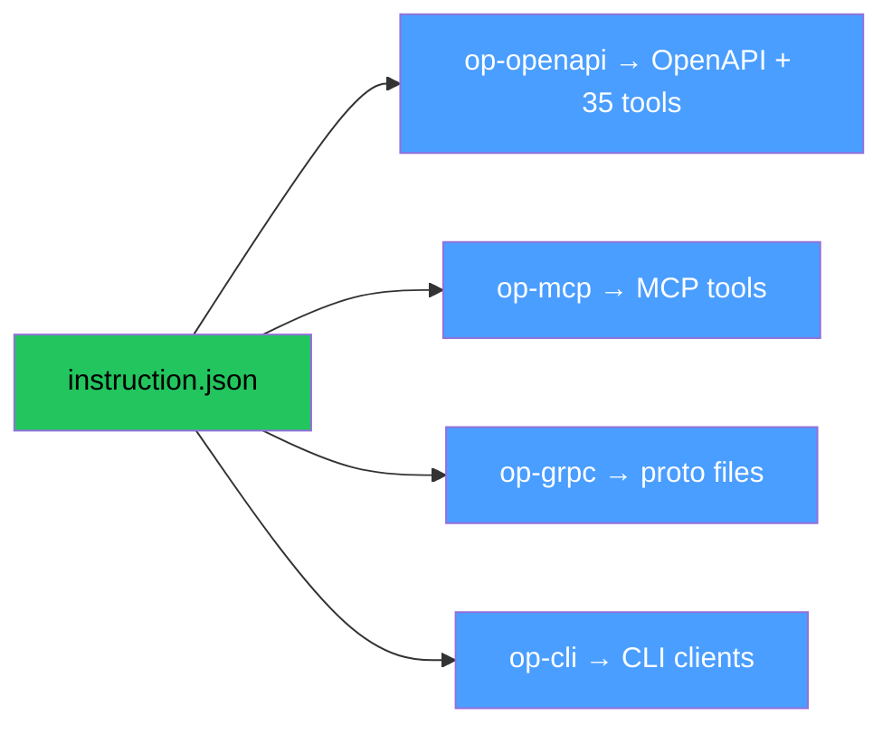
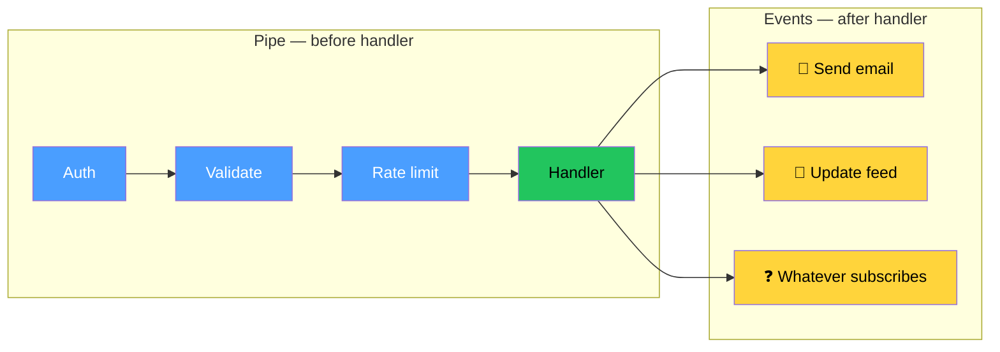
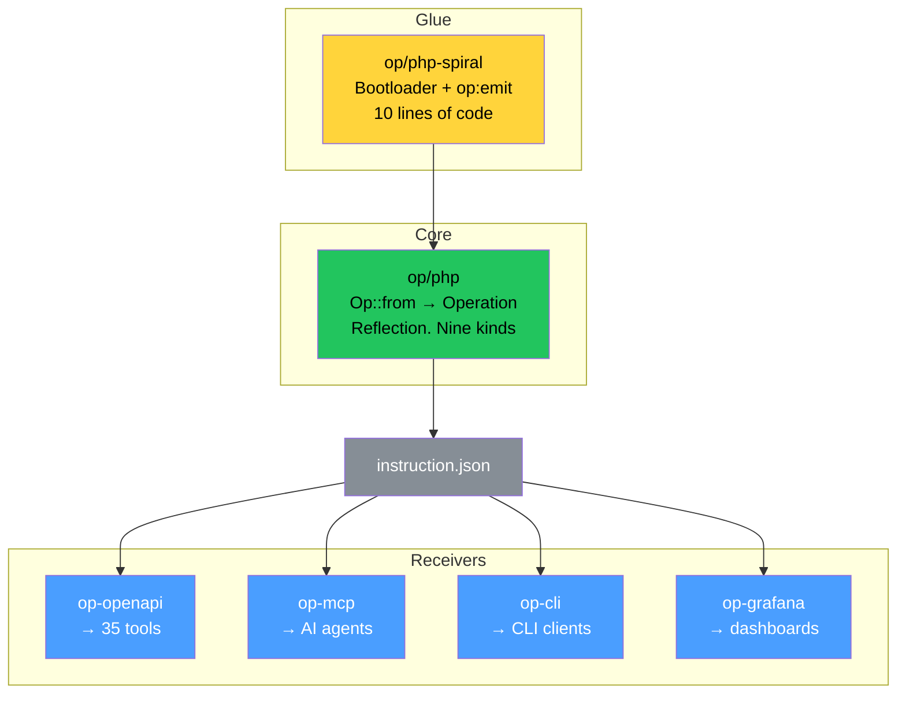

# The Gallium

We spent sixteen devlogs building the theory. Five fields. Traits. Convergent evolution. The second law of thermodynamics. Berners-Lee's dream. All true. All proven. All useless without one working example.

This devlog is about finding that example. And about everything we discovered along the way.

## The Paradox

We started with the obvious question. How does Op fit into the real world? Not theory. Real vendors. Real frameworks. Real money.

Take Laravel. The most popular PHP framework. Millions of users. Thousands of packages. A complete ecosystem. What does Op give Laravel?

Nothing it does not already have.

Laravel already generates routes. Laravel already validates input. Laravel already serializes output. Laravel already has Swagger through third-party packages. Laravel already has MCP through composer require. Laravel does not need Op to do what it already does.

So why would Laravel care?

One word. Interoperability.

Laravel can publish /operations. One endpoint. Everything the service can do. Machine-readable. In five fields. And from that moment every tool in the world that reads instructions can use it. TypeScript clients compile automatically. AI agents see the service without registration. Documentation cannot go stale. Monitoring speaks business language. Partners integrate in minutes instead of months.

Laravel does not change. Laravel does not break. Laravel does not rewrite. Laravel publishes one endpoint. And gains the entire catalog. For free.

But here is the catch. Laravel publishes /operations but writes its own transport bindings by hand. Routes in routes/web.php. Middleware in kernel. Validation in FormRequest. All by hand. All can drift from the published instruction.

Can Laravel lie? Yes. Like OpenAPI lies. Like D-Bus can lie. The instruction is not the operation in Laravel. The instruction is a description of the operation. Two objects. They can drift.

## The Trust

And this is where the economics enter.

How much does it cost to lie?

When nobody reads /operations the cost is zero. Lie all you want. Nobody checks. Like OpenAPI that nobody reads. It lies for years. Nobody notices. Nobody cares.

When one frontend team reads /operations the cost is one bug report. From Dima. Who will fix it after lunch.

When a thousand AI agents read /operations the cost is a thousand lost sales. Silently. To the competitor. Because Claude does not file bug reports. Claude does not ask Vasya. Claude reads the contract literally. The contract says the field is not required. Claude does not send the field. The server returns 422. Claude tells the user the service does not work. The user goes to the competitor. The money is gone. You do not even know you lost a customer. Because Claude does not write to your support. Claude just leaves.

The strength of the contract is not a property of the protocol. The strength of the contract is a function of the ecosystem. Number of consumers times cost of one broken call. At N equals zero drift is free. At N approaching infinity drift is economic suicide.

Zero drift is not a design decision. Zero drift is the limit of a function.

Berners-Lee wanted to build trust from above. Certificates. Signatures. PKI. Seven layers. Expensive infrastructure.

Op grows trust from below. Zero infrastructure. Every consumer is a verifier. Every successful call is a proof. Every failed call is a public audit. The cost of lying grows with every new consumer. Not because someone tightens the screws. Because economics.

And rehabilitation is instant. Google forgives in a week. Maybe. An AI agent forgives in thirty seconds. Because the next user already asked buy me a dog. The agent calls. Works? You are back. Does not work? Next call. Next check. Gravity is not vindictive. You fall. You stand. You walk. It does not remember you fell.

## The Swagger Comparison

|  | Swagger down | /operations down |
|--|-------------|-----------------|
| **Who notices** | Petya the frontend dev | Every AI agent, every compiled client, every dashboard |
| **Response time** | After lunch | Instant. Automated. Cascading |
| **Responsible party** | Petya the backend dev | The vendor |
| **Scale of loss** | One cigarette break | Cosmic |
| **Nature** | Documentation | Infrastructure |

Swagger died. The frontend developer went to smoke. Came back. Fixed it after lunch.

/operations died. The entire network built on capability inspection died. Every AI agent that relied on the contract got errors. Every compiled client broke. Every monitoring dashboard showed garbage.

This is not a difference in degree. This is a difference in kind. Swagger is documentation. /operations is infrastructure. Breaking documentation is embarrassing. Breaking infrastructure is catastrophic.

## The Vasya Problem

Someone will ask. What if Vasya publishes garbage in /operations? Fake operations. Wrong types. Lies.

What happens when Vasya creates a website with garbage in sitemap.xml? Google crawls it. Finds that the URLs do not work. Lowers the trust of the entire domain. Vasya disappears from search. Forever.

Same thing. Claude reads /operations from Vasya. Calls BuyDog. Gets 500. Marks the service as unreliable. Next user asks to buy a dog. Claude goes to the competitor. Vasya is invisible.

The protocol is stupid. Five fields. Does not check. Does not punish. Does not think. The ecosystem checks. Every call. Every time. Automatically.

Vasya is not fighting the protocol. Vasya is fighting every consumer that reads /operations. And there are more consumers than Vasyas.

Programs do not benefit from lying. If they are vendors. Because every lie is verified by every call. Automatically. For free. Lying about your operations is like smashing your phone and calling from a toy one. Did you deceive someone? Yes. Can you make calls? Doubtful.

## No Emitters No Receivers

We kept saying emitter and receiver in previous devlogs. As if these were roles. Categories. Job titles.

They are not.

Nobody calls nginx an HTTP receiver. Nobody calls gcc a machine code emitter. They are just tools. That read something and produce something.

Same with Op. There are no emitters and receivers. There are tools that use instructions. A framework reads an instruction and compiles a route. A documentation portal reads an instruction and publishes HTML. A security scanner reads an instruction and finds vulnerabilities. A CLI tool reads an instruction and builds commands. The same binary can read instructions from one source and produce instructions for another. In the same process.

The words emitter and receiver were useful for explanation. For understanding the flow. But they are not roles. They are directions. Relative to the instruction. Like input and output are directions relative to the operation. Not properties. Directions.

## The Trait Economy

OTEL is not a separate receiver. OTEL is a competitive advantage of the framework.

A framework competes by trait coverage. How many well-known dialects does it understand? Support otel/* traits and your users get observability compiled from the contract. Support cli/* traits and your users get a CLI client compiled from the contract. Support auth/* traits and your users get authentication middleware compiled from the contract.

The framework that understands more dialects wins more users. Not because Op commands it. Because economics. The user chooses the framework that gives more for free. More traits understood means more artifacts compiled means less manual work means more users.

OTEL does not write a receiver. OTEL publishes a trait specification. Here are the trait names. Here is what they mean. Here is how to use them. And every framework that supports those traits gets OTEL instrumentation for free. OTEL gets instrumentation in every framework without writing a single line of code for each one. One specification. M frameworks. N plus M.

Traits are well-known dialects. Like OTEL semantic conventions. Like HTTP headers. Like IANA media types. Not vendor logic. Not framework opinion. Common ontologies. Shared vocabulary. A reference. Not a registry. Not a committee. A git file. Fork it. Change it. Propose a PR. Or ignore it and write your own traits.

The protocol does not care about the reference. The protocol is map string any. Put whatever you want. The reference says if you want op-cli to understand you use cli/command. Not must. If you want.

A reference file is not centralization. It is convenience. Remove the reference. The protocol works. Like README is useful but code works without it.

## Why Not OpenAPI

Someone will ask. OpenAPI already exists. It has thirty-five tools. Swagger UI. Redoc. openapi-generator. Schemathesis. Prism. Why not just use OpenAPI as the standard for operations?

Because OpenAPI is not a standard for operations. OpenAPI is a standard for HTTP APIs. These are different things.

Open the OpenAPI specification. paths. methods. parameters in query. responses keyed by HTTP status codes. Remove HTTP and nothing remains. The keys of the format are HTTP concepts. The structure of the format is HTTP structure. You cannot describe a gRPC service in OpenAPI without pretending it is HTTP. You cannot describe a Kafka event. You cannot describe a CLI command. Because the skeleton is HTTP.

This is not a flaw. OpenAPI does what it was designed to do. Describe HTTP APIs. Brilliantly. With a massive ecosystem. But HTTP APIs are one projection of operations. Not all projections.

Proof. Seven giants wrote seven formats because OpenAPI did not fit.

| Giant | Need | What OpenAPI gives | What they wrote |
|-------|------|--------------------|-----------------|
| Anthropic | Tools for AI agents | HTTP endpoints | MCP |
| Google AI | Functions for language models | Paths and methods | Function calling schema |
| Amazon | Operations across transports | HTTP only | Smithy |
| Facebook | Flexible client queries | Fixed response schemas | GraphQL |
| Google infra | Fast binary RPC | Text JSON HTTP | protobuf + gRPC |
| CNCF | Event descriptions | Request-response | CloudEvents |
| Community | Async APIs | Synchronous HTTP | AsyncAPI |

Seven giants. Seven formats. Each written because OpenAPI is HTTP and their world is not.

## The Converter Zoo

So the industry builds converters. OpenAPI to MCP. OpenAPI to gRPC. gRPC to OpenAPI. A patchwork of bridges between islands.

We researched the real state of affairs. Six formats. Thirty directed pairs. About ten are covered by tools. Twenty are holes. And even the covered ones lose information.

| From ↓ \ To → | OpenAPI | gRPC | GraphQL | AsyncAPI | MCP | CloudEvents |
|----------------|---------|------|---------|----------|-----|-------------|
| **OpenAPI**    | —       | ⚠️    | ⚠️       | ❌        | ❌   | ❌           |
| **gRPC**       | ⚠️       | —    | ❌       | ❌        | ❌   | ❌           |
| **GraphQL**    | ❌       | ❌    | —       | ❌        | ❌   | ❌           |
| **AsyncAPI**   | ❌       | ❌    | ❌       | —        | ❌   | ❌           |
| **MCP**        | ❌       | ❌    | ❌       | ❌        | —   | ❌           |
| **CloudEvents**| ❌       | ❌    | ❌       | ❌        | ❌   | —           |

✅ lossless — ⚠️ lossy — ❌ no converter

gRPC to OpenAPI loses streaming completely. Typed errors become generic HTTP status codes. OpenAPI to gRPC requires manual editing of the generated proto file. Not production ready. OpenAPI to GraphQL creates an imitation that pretends to be GraphQL but does not give its advantages. AsyncAPI to OpenAPI has no official converter at all. MCP to OpenAPI has no real code generator. GraphQL to anything outside GraphQL has nothing.

This is not an ecosystem. This is a patchwork quilt sewn with rotten thread.

But the deeper question is not why the converters are bad. The deeper question is why vendors do not write official converters.

Google does not write an official gRPC to OpenAPI converter. Because that would mean acknowledging OpenAPI as an equal or superior standard. For Google this is ideologically unacceptable. They promote their own stack.

Anthropic does not write an official MCP to OpenAPI converter. Because MCP is not HTTP and should not pretend to be.

Amazon does not write an official Smithy to OpenAPI converter that preserves all information. Because Smithy is their world and OpenAPI is someone else's.

Vendors do not write converters not out of laziness. Out of structural impossibility. Accepting OpenAPI as a hub means accepting HTTP as the universal transport. No vendor that has invested in a non-HTTP protocol will do this. Ever.

You cannot take a projection as a standard. A standard can only be what stands before the projection.

## The Neutral Ground

Op does not ask any vendor to accept anyone else's opinion. Op does not contain opinions. Five fields. id comment input output errors. No paths. No methods. No status codes. No protobuf. No GraphQL queries. No Kafka topics. Nothing.

A vendor describes their operations in five fields. Adds their own opinion in traits. grpc/service for gRPC. http/method for HTTP. mcp/tool for MCP. messaging/broker for Kafka. Each vendor speaks their own dialect. Nobody else's.

The gRPC vendor does not become OpenAPI-compatible. The MCP vendor does not become gRPC-compatible. Each becomes Op-compatible. Which means nothing more than writing five fields plus their own traits.

And from that one file every projection compiles automatically.



Each projection reads the traits it understands and ignores the rest.

One file from the vendor. Every projection from the ecosystem. The vendor does not build bridges to other islands. The vendor describes the mainland. The bridges are already built.

## The Smithy Lesson

Amazon tried this. Smithy describes operations separately from transport. The http trait is an annotation. Remove it and the operation stands. Sound familiar?

Smithy failed outside Amazon for three reasons. First it belongs to Amazon. Vendors do not trust a standard owned by a competitor. Second it is complex. Hundreds of pages of specification. Third it has no killer use case outside AWS.

Op must avoid all three. First it belongs to nobody. Apache 2.0. Fork it. Second it is simple. Five fields. cat instruction.json. Third the killer use case is Spiral. The gallium.

## The Gallium

We needed a working example. One framework where Op::from works through Reflection without archaeology. Where handlers are already clean functions. Where transport is already outside. Where types are already on the surface.

| Framework | Handlers | Types | Transport | Op::from |
|-----------|----------|-------|-----------|----------|
| **Laravel** | Controllers welded to HTTP | Hidden behind magic (FormRequest, Eloquent, DogResource) | Welded to routes/web.php | Needs a mini compiler. Scramble: 3 years, still incomplete |
| **Symfony** | FormBuilder hides types in builders | TextType::class — 3 levels of indirection to say `string` | EventDispatcher killed the pipe | Needs an archaeological expedition |
| **Spiral** | Clean functions | Typed DTOs, union return types | Outside through interceptors (RoadRunner) | Works through Reflection. Out of the box |

We looked at Spiral.

Handlers are clean functions. Input is a typed DTO. Output is a return type. Errors are union types. Transport is outside through interceptors. Multiple transports through RoadRunner. HTTP gRPC CLI queues WebSocket. All from the same handler. Types are on the surface. PHP Reflection sees everything.

Op::from(BuyDogAction::class). Reflection reads the invoke method. Parameter type is BuyDogInput. Return type is BuyDogOutput or DogNotFound or BudgetExceeded. Attributes give traits. Done. Five fields. No archaeology. No static analysis. No three years of work.

Spiral is the only PHP framework where this works out of the box. Not because Spiral was designed for Op. Because Spiral was designed correctly. Clean architecture. Separation of concerns. Typed contracts. The framework was ready for Op without knowing Op existed.

But we did not stop at PHP. We looked at the broader landscape. FastAPI extracts types from Python type hints but is welded to HTTP. tRPC gives end-to-end type safety but is welded to TypeScript. NestJS has decorators and a Swagger module but is welded to HTTP. Huma extracts OpenAPI from Go structs but is welded to HTTP. Ktor has OpenAPI plugins but requires manual annotations. Phoenix has no operation introspection at all. Every framework we examined either lacks introspection or welds it to one transport or one language or one platform.

And Spiral is far from the top of PHP framework rankings. Not Laravel. Not Symfony. Not the framework recruiters ask about in interviews. But architecturally the most prepared for what comes next.

Others came close. gRPC has full introspection and typed errors through protobuf but the description is welded to the serialization format. Remove protobuf and nothing remains. Encore has full application introspection and even an MCP server but it is welded to the Encore platform. Vendor lock. You cannot take their introspection and use it in your own project.

Spiral plus Op is introspection without welding. Not welded to a serialization format. Not welded to a vendor platform. Not welded to a transport. Five fields. Open format. Apache 2.0. The description belongs to nobody. And therefore works for everybody.

## The Pipe

Symfony made a choice. Events instead of pipes. Subscribe to an event. Maybe you get called. In what order depends on priority. Who else subscribed you do not know. What will happen you hope.

This is wrong. Not because events are wrong. Because the choice is wrong. Pipe and events are not competitors. They are different tools for different jobs.



Pipe before the handler. Auth then validate then rate limit then handler. Predictable. Linear. Testable. Op::from sees the entire pipeline.

Events after the handler. dog.bought then send email. dog.bought then update feed. dog.bought then whatever someone subscribes to. Extensible. Decoupled. Third parties connect without changing the core.

Pipe is fact. Events are opinion. Both needed. Both at the same time. One does not exclude the other.

Spiral has interceptors. That is a pipe. Spiral has events. That is extensibility. Both. Correctly.

## The Name

Spiral calls its input class RequestFilter. Because HTTP contaminated the thinking. When you think input data you think request. When you think request you think filtering. RequestFilter. Logical. And wrong.

Because it is Input. Not Request. Not Filter. Input to the operation. That can come from HTTP. From CLI. From gRPC. From a queue. From a carrier pigeon. Input does not know where it came from. Input knows what it is.

The same contamination that devlog eleven documented. Every name in Op is a scar from a collision. description became comment because description is reserved. type became kind because type is reserved. fields became of because fields implies a struct.

RequestFilter should become Input. With a deprecated tag on the old name. Every time the IDE shows a strikethrough RequestFilter with a hint Use Input instead a developer thinks differently. Without devlogs. Without quantum mechanics. Just the IDE suggesting the right word.

A virus of correct thinking. Through a deprecated tag.

## The Architecture



op/php is the core. Stupid. Useful. Not fragile. Op::from takes a class and returns an Operation. Through Reflection. Nine kinds map one to one to PHP types. String to string. Int to integer. BackedEnum to enum. DTO to object. Recursive. The core does not know about any framework.

op/php-spiral is thin glue. A Bootloader. A command. op:emit. It knows Spiral. It knows the router. It knows where handlers are registered. It walks through them and calls Op::from for each one. Ten lines of code.

op-openapi is the bridge to the old world. One converter. instruction.json to openapi.yaml. And through that one file thirty-five tools light up. Swagger UI. Redoc. openapi-generator. Orval. Schemathesis. Prism. WireMock. oasdiff. 42Crunch. Spectral. Client generators for every language. Documentation engines. Mock servers. Security scanners. Contract testers. Breaking change detectors. All of them read OpenAPI. All of them work with Op through one converter. Not because they know about Op. Because they know about OpenAPI. And Op knows how to speak OpenAPI.

op-mcp is the bridge to the new world. Direct converter. instruction.json to MCP tool definitions. No OpenAPI intermediary. Because MCP is not HTTP and should not pretend to be. AI agents read operations. Not endpoints.

op-cli reads cli/* traits and compiles a command line client. op-grafana reads otel/* traits and compiles a monitoring dashboard. Each tool reads the traits it understands. Ignores the rest. Nobody knows about each other. Everybody knows about five fields.

## The Unix Pipe

```bash
any --help | man-to-op | op-mcp
```

Three stages. Each one a separate responsibility. The help output is raw text. man-to-op parses the text and outputs instruction.json. op-mcp reads instruction.json and outputs MCP tool definitions. Op is not a program in the pipe. Op is the format that flows through it.

Op is not a parser. Op is not a validator. Op is not MCP. Op is the pipe. The fact between source and consumer. Left side does not know about right side. Right side does not know about left side. Both know one thing. Five fields.

Douglas McIlroy conceived the pipe in 1964. Programs connected through text. Each does one thing. Universal interface.

Op is the same. Programs connected through instructions. Each does one thing. Universal interface. Same law. Different floor.

Man pages are the first instructions. Dennis Ritchie wrote the first one in 1971. He just did not know.

## The Catalog

A vendor releases hyperpooperserver. The industry does not ask for an SDK. Does not ask for documentation. Does not ask do you have a Go client.

The industry asks one thing. instruction.json where?

The vendor publishes instruction.json. From that moment the entire catalog opens.

instruction.json goes to op-openapi and thirty-five tools light up. Documentation. Clients. Tests. Mocks. Security scans. Breaking change detection. Goes to op-mcp and AI agents see the service. Goes to op-cli and the CLI client is ready. Goes to op-test and contract tests run automatically. Goes to op-mock and the frontend team starts working before the backend is written. Goes to op-diff and breaking changes are detected automatically.

The vendor did not write a single client. Not a single SDK. Not a single line of documentation. Published one file. The entire catalog opened.

Like USB. The manufacturer releases a device. The industry does not ask do you have a driver for Windows for Mac for Linux. The industry asks USB? Yes. Works everywhere.

instruction.json is the USB port for software. Plug in. It works. Everywhere. With everything. Without drivers. Without SDKs. Without email us at support we will send documentation.

The vendor does not build an ecosystem. The vendor plugs into the ecosystem. With one file.

And then the magic. Any service that published /operations gets a CLI. Instantly.

```bash
curl https://stripe.com/operations | op-cli > stripe
./stripe charge-create --amount=5000 --currency=usd

curl https://github.com/operations | op-cli > gh
./gh repo-create --name=my-project --private

curl https://openai.com/operations | op-cli > openai
./openai chat-complete --model=gpt-4 --prompt="hello"
```

Not written by Stripe. Not written by GitHub. Not written by OpenAI. Compiled from instructions. With autocomplete from input rail. With help text from comment. With error messages from error rail. With auth flags from auth/* traits. One pipe. Any service. Any API. Instantly.

## The Side Effects

The world changes as an uncontrollable side effect. Op did not plan any of this. Op is five fields. JSON. Stupid protocol.

But when the operation becomes a fact and the fact becomes public and publicity becomes a standard the world reorganizes around the fact. Not because someone planned it. Because economics.

We are not saying any of this is good or safe. We are saying this is what N plus M makes possible. The side effects of a universal format are not always comfortable. They are always real.

MySQL publishes instructions for its operations. Claude reads them. Claude queries the database directly. Without a backend. Without an API. Without a controller. MySQL to instruction to MCP to Claude. The CRUD backend that just proxies JSON from the database to the API is no longer needed for this class of tasks.

Any CLI program that has --help already has instructions. Just nobody parsed them into five fields. any --help piped through a parser piped through Op piped through op-mcp. Every program on Linux becomes an AI tool. Without changing the program.

Requirements for transport and bindings decrease. Requirements for operations and the model increase. The general level of programmers increases dramatically and begins to push engineering progress to a new floor. Not another level of abstraction that everyone hates. A new level of decomposition. Divide and conquer.

HTTP is not a fact. HTTP is an accident that became a standard. Like QWERTY. Like VHS. The machine started spinning. Op cuts this accident away from the fact of the operation. With a trait. An opinion that can be removed. And the operation does not change.

Programming finally moves forward. Exits the hamster wheel. Like C did when it separated source from binary. Programs stop bringing profit to garbage companies that just move JSONs and parse things. The floor rises. The industry does not get dumber. It gets free.

And one more thing that disappears. The concept of frontend. In the old world there is frontend and backend. Two camps. Two languages. A bridge between them called Swagger that lies. In the new world there is no frontend and backend. There is the operation and N clients that call it. The browser is a client. The terminal is a client. Claude is a client. Another service is a client. A mobile app is a client. A Grafana dashboard is a client. All equal. All read the same instruction. All get a typed contract. Nobody learns the API through Swagger. Nobody binds through transport. Everyone speaks the same language with any program. The word frontend implies there is a backend. Two camps. Op dissolves the camps. There is the operation. And there are presentations. As many as needed. Each compiled from the same five fields.

## The Formula

N plus M works even when you start alone. The formula does not depend on the size of the ecosystem. It depends on the architecture.

One emitter plus three receivers equals three integrations. Add a second emitter and all three receivers work with it automatically. Six integrations for one unit of work. Add a fourth receiver and both emitters feed it. Eight integrations. The formula works at any scale. Even when N and M are written by the same person.

Today the ecosystem is small. One person draws the table. One person digs the mines. One person will be the first user. Tomorrow someone writes op/php-laravel. Ten lines of glue. Laravel gets all receivers for free. Someone writes op-postman. All emitters get Postman collections for free.

The formula does not care who writes the code. The formula cares that the instruction is in the middle. Five fields. The rest is arithmetic.

## What This Devlog Establishes

Every vendor gets exactly what is profitable for them. Laravel gets interoperability. MySQL stops maintaining six connector teams. AI agents see services without registration. Nobody gives more than they want. Nobody gets more than they need.

There are no emitters and receivers. There are tools that use instructions. The same binary can read and write instructions in different moments. Like nginx is not an HTTP receiver. Just nginx.

Trust is economics not infrastructure. The strength of the contract equals the number of consumers times the cost of one broken call. At N approaching infinity lying is economic suicide. Zero drift is not a design decision. It is the limit of a function.

Swagger down versus /operations down is a difference in kind not degree. Swagger is documentation. /operations is infrastructure. Breaking documentation is embarrassing. Breaking infrastructure is catastrophic.

You cannot take a projection as a standard. A standard can only be what stands before the projection. OpenAPI is a projection of operations onto HTTP. Seven giants proved this by writing seven formats because OpenAPI did not fit their world.

Vendors do not write converters not out of laziness but out of structural impossibility. Accepting OpenAPI as a hub means accepting HTTP as the universal transport. No vendor that invested in a non-HTTP protocol will do this.

Traits are well-known dialects. http cli otel auth resilience. Common ontologies. Like OTEL semantic conventions. A reference file is not centralization. It is a git file. Fork it or ignore it. The protocol is map string any. The reference is convenience.

Spiral is the gallium. The only PHP framework where Op::from works through Reflection without archaeology. Others came close. gRPC welded introspection to protobuf. Encore welded it to a platform. Spiral plus Op welds it to nothing. Open format. No lock.

Pipe and events are both needed. Pipe before the handler for predictability. Events after the handler for extensibility. Symfony killed the pipe. The correct answer is both.

op-openapi is the bridge to the old world. One converter opens thirty-five tools. op-mcp is the bridge to the new world. Direct conversion without HTTP intermediary. Together they cover the entire spectrum from legacy documentation to AI agents.

The vendor publishes one file and gets the entire catalog. instruction.json is the USB port for software. CLI proxy explorer tests mock diff monitoring. All already written. For instructions not for the vendor.

Op is the Unix pipe for operations. any --help piped through man-to-op piped through op-mcp. Three stages. Each a separate responsibility. Left side does not know about right side. Dennis Ritchie wrote the first emitter in 1971.

The world changes as an uncontrollable side effect. Op did not plan to kill CRUD backends. Op gave MySQL the ability to describe itself. Claude read it. CRUD died. Not a new level of abstraction. A new level of decomposition. Divide and conquer.

N plus M works even when you start alone. The formula does not depend on ecosystem size. It depends on architecture. One emitter plus three receivers equals three integrations. The formula works at any scale.

The gallium is next. Not three galliums. One. Spiral. One framework. One Op::from. One demo. After that the skeptics go quiet. One by one.