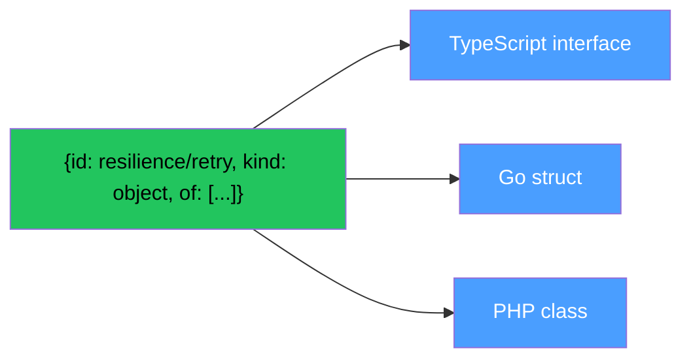
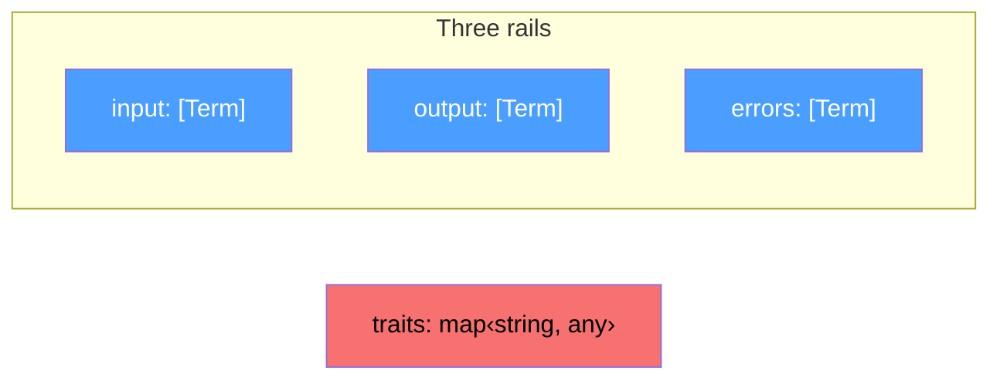
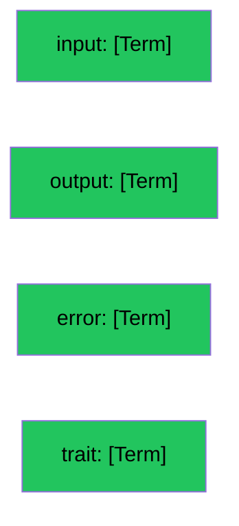

# The Fourth Rail

This devlog exists because of one question from a friend.

[Dima](https://github.com/GurovDmitriy) looked at the instruction format. Five fields. id comment input output errors. Plus traits as a separate object. A map of strings to anything. And he asked: why is trait different from the rest?

Input is a rail. An array of terms. Each term has an id. Optionally a kind. Optionally a value. Optionally children through of. Recursive. Clean. Structured.

Output is the same. Error is the same. Three rails. One format.

And then traits. A map. Unstructured. Untyped. A bag. The only part of the protocol that does not follow its own rules.

Dima said: trait is a characteristic of the operation. Like input is the data going in. Like output is the data going out. Like error is what can go wrong. Trait is what the operation is like. Its character. Why does character get a different format than data?

He was right.

## The Unification

Trait is the fourth rail.

Not a map. Not a bag. An array of terms. The same structure as input. The same structure as output. The same structure as error.

Before:
```
id:      BuyDog
comment: Purchase a dog
input:   [{id: breed, kind: string}, {id: budget, kind: integer}]
output:  [{id: dogId, kind: string}]
errors:  [{id: DogNotFound}, {id: BudgetExceeded}]
traits:  {http/method: POST, http/path: /dogs, auth/type: bearer}
```
After:
```
id:      BuyDog
comment: Purchase a dog
input:   [{id: breed, kind: string}, {id: budget, kind: integer}]
output:  [{id: dogId, kind: string}]
error:   [{id: DogNotFound}, {id: BudgetExceeded}]
trait:   [{id: http/method, value: POST}, {id: http/path, value: /dogs}, {id: auth/type, value: bearer}]
```

Four rails. One format. Term everywhere.

## The Rename

errors became error. traits became trait.

Not because plural is wrong. Because each field is a rail. A direction. Not a collection.

Input is not inputs. It is the input rail. The direction data enters. Output is the output rail. The direction data exits. Error is the error rail. The direction failure takes. Trait is the trait rail. The direction character is expressed.

Four directions. Four rails. Singular. Like the protocol itself. Minimal.

## The Value

Every term has an id. That is required. Everything else is optional.

kind says what type of data this is. string integer float boolean binary datetime array object enum. Nine kinds from physics.

of says what this term consists of. Children. Recursion. Composition repetition choice.

value says what the concrete value is. A specific datum. Not a type. A value.

Value is the most neutral word for what is here. From mathematics. From logic. From philosophy. A variable has a value. A term has a value. An expression evaluates to a value.

In the trait rail value carries the opinion:

```
{id: http/method, value: POST}
```

POST is the value of the trait. The opinion. The character. Not a type. A specific value.

In the input rail value carries the default:

```
{id: breed, kind: string, value: labrador}
```

labrador is the default value of the input. A specific datum.

Same field. Same meaning. Every rail. Value is universal.

## The Kind in Traits

A simple trait needs no kind:

```
{id: http/method, value: POST}
```

POST is obviously a string. No ambiguity.

But a complex trait benefits from kind:

```
{id: resilience/retry, kind: object, of: [
  {id: maxAttempts, kind: integer, value: 3},
  {id: backoff, kind: enum, of: [{id: linear}, {id: exponential}]},
  {id: delayMs, kind: integer, value: 1000}
]}
```

Without kind the reader does not know how to parse the trait. Is it a string? An object? An array? Kind resolves the ambiguity. Just like in input and output.

Kind in traits is optional. Like everywhere. But when present it enables something new.

## The Compilation

If trait is a rail of terms with kind and of then traits can be compiled. Into typed configurations. Into SDK classes. Into IDE autocomplete.



From the trait definition above a TypeScript compiler produces:

```typescript
interface ResilienceRetry {
  maxAttempts: number
  backoff: 'linear' | 'exponential'
  delayMs: number
}
```

A Go compiler produces:

```go
type ResilienceRetry struct {
  MaxAttempts int
  Backoff     Backoff
  DelayMs     int
}
```

A PHP compiler produces:

```php
class ResilienceRetry {
  public int $maxAttempts;
  public Backoff $backoff;
  public int $delayMs;
}
```

Three languages. One trait definition. Three typed configurations. Compiled. Not written by hand.

The developer writes:

```php
Trait(Resilience\Retry::new(maxAttempts: 3, backoff: Backoff::Exponential))
```

Not a string. Not a map key. A typed object. With autocomplete. With validation at compile time. IDE catches the error before runtime. Because the trait has a kind. Because the trait has structure. Because the trait is a term.

## The Dialect Reference

Well-known dialects are documented in a reference. A git file. Not a registry. Not a committee.

The reference defines traits with their kind and of. From the reference SDK compilers produce typed classes for every language. One reference. N languages. N plus M.

The reference is not the protocol. The protocol is four rails of terms. The reference is convenience. Remove the reference and the protocol works. Like README is useful but code works without it.

But with the reference every trait is typed. Every dialect is structured. Every SDK has autocomplete. The developer never writes a raw string for a well-known trait. The developer writes a typed object that the reference defined and the SDK compiled.

## The Breaking Change

This is a breaking change. errors becomes error. traits changes from map to array of terms. The JSON structure changes.

But the clay is not yet a pot. The protocol is forming. Version one is not released. There is nothing to break because there is nothing in production. The time to make breaking changes is now. Before the clay hardens.

And this breaking change makes the protocol simpler. Not more complex. Simpler. One format instead of two. One parser instead of two. One validator instead of two. One Op::from instead of two.

When simplification adds power that is a sign you found the real structure. Four rails. One format. Zero exceptions. That is the real structure. It was always there. Dima saw it first.

## The Picture

**Before: three rails plus a bag.**



**After: four rails. One format.**



Same Term everywhere. Same id. Same kind. Same value. Same of. Same recursion. Same validation. Same compilation.

## What This Devlog Establishes

Trait is the fourth rail. Not a map. An array of terms. Same format as input output and error. Four rails. One structure.

Singular names. input output error trait. Each is a direction not a collection. Like the protocol. Minimal.

Value is universal. The most neutral word for what is here. Works in every rail. In input it is a default. In trait it is an opinion. Same field. Same meaning.

Kind in traits enables compilation. Simple traits need no kind. Complex traits with kind and of compile into typed configurations in any language.

The dialect reference compiles into typed SDKs. One reference file. N languages. The developer writes typed objects not raw strings.

The clay is not yet a pot. Breaking changes are free before version one. This one makes the protocol simpler and more powerful at the same time.

Dima saw it first. A fresh pair of eyes asked one question and unified the entire protocol. The answers were already inside the five fields. Someone just had to ask.