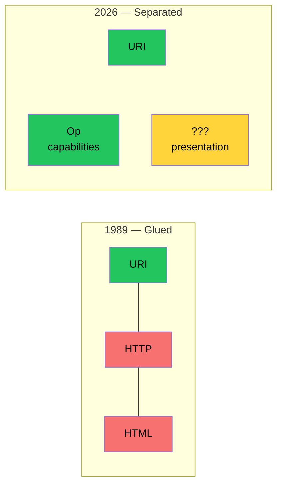

# The Missing Format

This devlog is a prediction. Not an implementation. Not a specification. A prediction.

We are convinced that a layer is missing. We are not sure what it looks like. We know it must exist. Like Mendeleev knew eka-silicon must exist before anyone found germanium. The cell is empty. The properties are predicted. The element is not yet discovered.

## The Two Sins

In 1989 Berners-Lee gave the world three primitives. URI HTTP HTML. The world exploded.

URI is an address. A coordinate. A fact. It survived everything. HTTP changed four times. HTML changed beyond recognition. URI is the same. RFC 3986. Because addresses are facts. Facts do not need versions.

HTTP is an opinion about delivery. A good opinion. A useful opinion. But an opinion. The resource could have been fetched through a local file or a message queue or a carrier pigeon. HTTP became the default because the browser gave nothing else.

HTML is an opinion about presentation. How the model looks on a screen. Data and display in one file. Glued together. And this is what killed the dream from inside. Berners-Lee created a Web where data and presentation are inseparable. Then said we need to separate them. But the train had left.

Op addresses the first sin. HTTP becomes a trait. An opinion attached from outside. Remove it and the operation stands. The model is freed from the transport.

But the second sin remains. Presentation has no protocol. HTML is the only format for describing how things look. And HTML is welded to the browser. To the DOM. To CSS. To JavaScript. To thirty-seven years of legacy.

## The Agreement

| Domain | Format | Atom | Universal? |
|--------|--------|------|------------|
| Fonts | .ttf / .otf | Bezier curves | ✅ Every renderer on every platform |
| Images | PNG / JPEG / WebP | Color matrix | ✅ Every device decodes |
| Video | H.264 / H.265 / VP9 / AV1 | Compressed frames | ✅ Hardware and software |
| 3D | glTF | Triangle meshes | ✅ Unity, Unreal, Blender, browsers |
| Audio | MP3 / AAC | Compressed samples | ✅ Every speaker |
| **UI** | **???** | **???** | ❌ **No universal format** |

UI did not agree.

| Framework | Platform lock |
|-----------|-------------|
| HTML | Browsers only |
| SwiftUI | Apple only |
| Jetpack Compose | Android only |
| GTK | Linux only |
| WinUI | Windows only |
| Flutter | Own Skia renderer |
| Qt | Own engine |

Seven formats. Seven platforms. Seven prisons. No .ui file that every device renders natively.

Every other domain of human-computer interaction has a universal format. UI is the only one that does not.

## The Cell

The empty cell has properties. Like Mendeleev predicted the weight and behavior of eka-silicon before germanium was found.

The missing format must describe intention not visualization. Not draw text in 24px bold. But this is a heading and it is important. The renderer decides how to show it. A screen draws pixels. A speaker reads aloud. A Braille display raises dots. Same intention. Different channels. No channel left behind.

For example. A sighted user sees a green button labeled Buy. A blind user hears Buy button. A user with a Braille display feels the raised dots for Buy. Not because someone added aria-label as an afterthought. Because the format describes the intention. The renderer chooses the channel. Accessibility is not a patch. It is a primitive.

The missing format must separate structure from style. Like Op separates the operation from the transport. The structure is fact. A form with two fields and a button. The style is opinion. Green button with 8px border radius. Fact in the core. Opinion in the traits. Same pattern as Op.

For example. A PP trait could work like an Op trait. structure/flow: vertical is a fact about layout. style/color: green is an opinion about appearance. Remove the style traits and the structure stands. Like removing http/* traits from an Op instruction. The operation stands. The presentation stands.

The missing format must be deeper than components. Box is not a primitive. Box is a library built on primitives. Like a function is not a CPU instruction. A function is a composition of instructions. The real primitives are lower. Bezier curves. Composition. Intention. The atoms from which any component can be built.

For example. Every successful visual format found its atoms. TrueType found Bezier curves for glyphs. PNG found color matrices for images. glTF found triangle meshes for 3D. The missing format must find atoms for UI. What they are is an open question. But they exist. Because every UI ever built shares common structure. Something is repeated across all of them. That something is the atom.

## The Convergence

Seven UI frameworks arrived at the same pattern independently.

| Framework | Container | Text | Input | Action |
|-----------|-----------|------|-------|--------|
| SwiftUI | VStack | Text | TextField | Button |
| Jetpack Compose | Column | Text | TextField | Button |
| Flutter | Column | Text | TextField | ElevatedButton |
| WPF XAML | StackPanel | TextBlock | TextBox | Button |
| React JSX | form | h1 | input | button |
| Svelte | — | h1 | input | button |
| Ink (terminal) | Box | Text | TextInput | — |

Seven syntaxes. One pattern. Container. Text. Input. Action. Vertical flow.

Convergent evolution. Again. Like seven giants wrote seven formats for operations because OpenAPI did not fit. Seven frameworks wrote seven syntaxes for presentation because no universal format exists.

The pattern is there. The atoms are there. Nobody wrote them down. Yet.

## The Risk

The missing format risks becoming CORBA. Because UI is more subjective than operations.

An operation has input and output. Fact. Nobody argues. A button should be red or blue. Opinion. Every designer argues.

If the missing format bakes opinions into the core it will die. Like CORBA died from too many opinions in the standard. Like the Semantic Web died from too many layers.

The test is simple. If every designer agrees it is fact. Put it in the core. If even one designer disagrees it is opinion. Put it in a trait. When in doubt put it in a trait. Always.

Op survived because we never added a sixth field. Every time we wanted to we put it in a trait instead. The missing format will survive only if it is equally ruthless about its core.

## The Prediction

We predict the cell. We do not fill it.

URI remains. The address. The only fact Berners-Lee got right from the start.

Op replaces what HTTP tried to be. A description of capabilities. Without transport opinion. Five fields. Fact about the operation.

The missing format replaces what HTML tried to be. A description of presentation. Without renderer opinion. Fact about how to show.

Together they complete the dream. Machines understand what services can do through Op. Machines understand how to show it through the missing format. Humans see the result through whatever device they hold. Or hear it. Or feel it. No channel excluded.

This is the same scenario from Berners-Lee's 2001 article. But without seven layers. Without RDF. Without OWL. Without XML. Two protocols. Two facts. One address. Three primitives. Separated. Finally.

Who fills the cell is an open question. It might be Dima. It might be someone else. It might take years. Mendeleev waited six years for gallium. The cell waited. Patiently. Because empty cells do not expire. They just wait for someone stubborn enough to dig.

## What This Devlog Establishes

The empty cell exists. Fonts images video 3D audio all have universal formats. UI does not. The missing format is the last gap in human-computer interaction.

The missing format describes intention not visualization. Not how it looks. What it means. The renderer decides the channel. Sighted. Blind. Deaf. All equal. Not through patches. Through primitives.

Structure and style separate like operation and transport. Structure is fact. Style is opinion. Same pattern as Op. Fact in the core. Opinion in traits.

The primitives are deeper than components. Box is a library not a primitive. The real atoms are lower. Bezier curves. Composition. Intention. What exactly they are is an open question.

Seven frameworks converged on the same pattern. Container. Text. Input. Action. The atoms are there. Nobody wrote them down.

The risk is CORBA. If opinions enter the core the format dies. The test is simple. Every designer agrees then fact. One disagrees then trait.

This is a prediction not an implementation. We predict the cell. We do not fill it. Like Mendeleev predicted eka-silicon. The properties are known. The element is not yet found. The cell waits.
