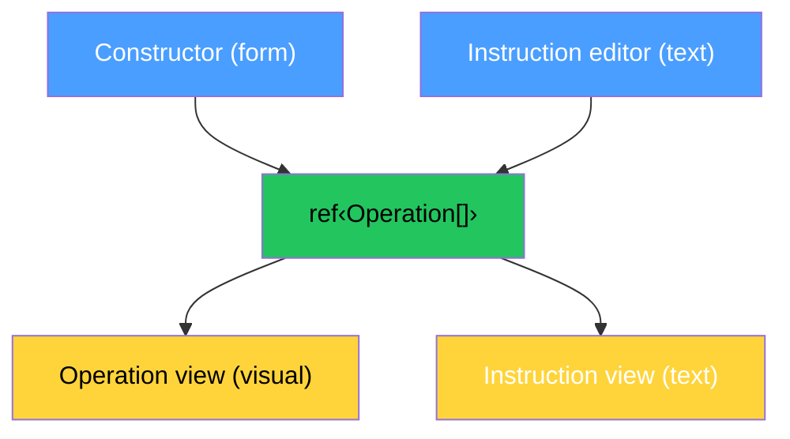
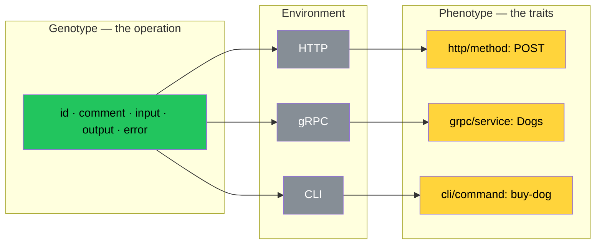

# The Playground

Seventeen devlogs. Fourteen disciplines. The second law of thermodynamics. Convergent evolution. Seven giants. Seven formats. Four rails. One protocol.

Nobody understood.

Not because the ideas were wrong. Because the ideas were words. And words are not enough. You cannot explain the taste of coffee to someone who never drank it. You can only hand them a cup.

The playground is the cup. We built it. And it taught us something we did not expect.

## The Problem With Words

We explained Op to [Murat](https://github.com/rnurat). He is a developer. He listened. He nodded. He understood that it is not just a generator. But he did not feel it. Because feeling requires touching.

We explained Op to Anton. He is a businessman. He listened. He asked show me. Without theory. We could not show. Because there was nothing to show. Only devlogs. Only words. Only theory.

We explained Op to Dima. He looked at the protocol and asked one question that unified the entire thing. But he had to read the spec first. And the spec is JSON. And JSON is not friendly to humans who have never seen it before.

Words do not scale. Devlogs do not scale. Explanations do not scale. What scales is a demo. Something you can touch. Something that responds. Something that shows you the protocol in thirty seconds.

## The Architecture

One model. Multiple views. Multiple inputs.

The model is one reactive array of operations. The constructor writes to it. The instruction editor writes to it. The operation view reads from it. The instruction view reads from it. One source of truth. Multiple projections. The same principle as Op itself. The instruction is the model. The projections are compiled from it. Change the model — every projection updates. Instantly. Reactively. Without coordination.

The right panel has two tabs: **Operation** and **Instruction**. Not *Visual* and *JSON*. Because the distinction is not visual versus textual — it is single operation versus the wrapping instruction with version and operations array. The words chosen match the protocol, not the implementation technology.

This is not a coincidence. The playground is built the way the protocol works. Because a correct model makes every feature free.

## The Principles

We did not design the playground. We discovered it. Every decision followed from one question: what does the protocol require?

**One model, many views.** The protocol says one instruction, many projections. The playground says one `ref<Operation[]>`, many panels. Constructor, visualization, JSON — all read and write the same object. Add a term in the constructor — the visualization updates. Import JSON — the constructor updates. Same data. Different angles. Like `instruction.json` compiled to OpenAPI, MCP, CLI. One file. Every projection.

**Recursion is natural.** The protocol says Term can contain Term through `of`. Object contains children. Array contains elements. Enum contains variants. The playground says TermEditor renders TermEditor. TermViz renders TermViz. Select `object` as kind — a nested editor appears. Automatically. Because the data structure is recursive, the UI is recursive. We did not plan this. The schema demanded it.

**Composition over configuration.** Three Vue components. TermEditor for editing. TermViz for visualization. SciTooltip for scientific context. Each does one thing. Playground composes them. Like the protocol composes Term into Rail into Operation. Small atoms. Big structures. No configuration files. No plugin systems. Composition.

**The model accepts any input.** Import JSON parses and writes to the same `ref`. Accepts full instruction `{version, operations: [...]}` or bare operation `{id, input, ...}`. Does not care where the data came from. Like Op does not care whether the instruction was emitted by PHP, Go, or a human typing JSON by hand. The model is the model. The source is irrelevant.

**Deletion is not casual.** Adding an operation is one click. Removing an operation requires confirmation. Because creation is cheap and destruction is expensive. The protocol knows this — the error rail exists because the second law of thermodynamics guarantees that destruction is always possible. The playground respects this asymmetry.

**Comment lives in the atoms.** Every term can have a comment. Not just operations. Terms too. Because `zip` without a comment is five bits of ambiguity. With a comment — a postal code. The comment is where humanity lives. Not every atom has been explained. But every atom has a place for explanation. Some processes just happen. The silence is not absence of meaning. It is meaning not yet expressed.

## The Nine Kinds

Every kind in the protocol maps to physics. The playground makes this visible. Hover over any kind in the visualization and a scientific tooltip appears. Not a programming definition. A physical one.

| Kind | Emoji | Physics | What it formalizes |
|------|-------|---------|-------------------|
| string | 🔤 | Bytes with encoding | Convention between writer and reader |
| integer | ⚡ | Voltage levels in a register | The quantum of counting. Discrete like particles |
| float | 〰️ | IEEE 754 mantissa and exponent | The point floats. Continuous like waves |
| boolean | 🔀 | Transistor conducting or not | One bit. The fundamental unit of information |
| binary | 💾 | Raw bytes on storage | Ground truth. Everything else is interpretation |
| datetime | 🌍 | Earth rotation and cesium-133 | 9,192,631,770 transitions per second |
| array | 🔁 | Crystal unit cells, DNA base pairs | Repetition. One of three universal containers |
| object | 🧱 | Atoms to molecules to cells | Composition. One of three universal containers |
| enum | 🎚️ | Quantum energy levels | Finite choice. One of three universal containers |

The emojis are not decorations. They are physics. Integer is lightning because it is a voltage level. Float is a wave because it is continuous. Datetime is Earth because time is planetary rotation. Binary is a disk because it is raw storage.

Each tooltip contains a convergence list — multiple references showing the same concept appearing independently in different fields. Character encoding and Protobuf and JSON Schema all arrived at string. IEEE 754 and floating-point arithmetic all arrived at float. Crystal structures and DNA and type theory all arrived at array. Not because they copied each other. Because the universe has nine kinds of data. We did not choose nine. Nine chose us.

## The Genotype Discovery

And then we found something we did not expect.

We were writing the tooltip for traits. Explaining how traits are opinions attached from outside. Removable. The operation does not change when a trait is removed. And we linked to the Wikipedia article on phenotype.

The article said:

*The phenotype of an organism is determined by two main factors: the expression of the organism's unique set of genes (its genotype) and the influence of environmental factors, which in turn affect the expression of those genes.*

We stopped.

This is exactly how traits work.

**Genotype** is the operation. id, comment, input, output, error. The immutable genetic code. Remove the environment — the genotype remains. BuyDog takes a breed and a budget and returns a dog or an error. This is true in HTTP. In gRPC. In a CLI. In a queue. In any environment. The genotype does not change.

**Phenotype** is the traits. How the genotype expresses in a specific environment. `http/method: POST` is the phenotype in an HTTP environment. `grpc/service: Dogs` is the phenotype in a gRPC environment. `cli/command: buy-dog` is the phenotype in a terminal environment. Same genotype. Different phenotypes. Because different environments.

**Environment** is the transport, the infrastructure, the ecosystem. The environment does not change the genotype. The environment determines which traits express. A framework that understands `http/*` traits expresses them as routes. A framework that understands `cli/*` traits expresses them as commands. A framework that understands neither — the traits are silent. The genes are there. They just do not express.

And one more thing. In biology, the same gene can produce different phenotypes in different environments. Epigenetics. A gene for height expresses differently depending on nutrition. A trait for `resilience/retry` expresses differently depending on the framework. One framework retries with exponential backoff. Another retries linearly. A third ignores the trait entirely. Same gene. Different expression. Different environment.

This is not a metaphor. This is convergent evolution between biology and protocol design. The same pattern. Discovered independently. Millions of years apart.

| Biology | Op |
|---------|-----|
| Genotype | Operation (id, comment, input, output, error) |
| Phenotype | Traits (http/method, cli/command, otel/span) |
| Environment | Transport, framework, ecosystem |
| Gene expression | Trait understood by receiver |
| Silent gene | Trait ignored silently |
| Epigenetics | Same trait, different expression per framework |

We did not design this analogy. We discovered it while writing a tooltip. The playground taught us. The cup taught the barista.

## What This Devlog Establishes

Words do not scale. Demos do. The playground conveys the protocol in thirty seconds. Seventeen devlogs could not.

The playground is built on the same principle as the protocol. One model, many projections. One `ref<Operation[]>`, four views. Constructor, visualization, JSON, import. The architecture mirrors the philosophy.

Recursion is natural. TermEditor renders TermEditor. TermViz renders TermViz. The schema is recursive. The UI follows. Not by design. By necessity.

Every kind maps to physics. Integer is a voltage level. Float is IEEE 754. Boolean is a transistor. Datetime is Earth rotation. The emojis are not decorations. They are formalizations.

Each kind has a convergence list. Multiple independent references proving the concept was discovered, not invented. Character encoding and Protobuf arrived at string independently. Crystal structures and DNA arrived at array independently. Nine kinds. Nine convergences. Zero coincidences.

Comment lives in the atoms. Not just in operations. In terms. Because humanity does not stop at the function signature. It goes all the way down to the field. `zip` is ambiguous. `zip — postal code` is not. The comment is where meaning meets the machine.

Traits are phenotypes. Operations are genotypes. Environments determine expression. This is not a metaphor. This is convergent evolution between biology and protocol design. The same pattern. Discovered independently. While writing a tooltip.

The playground taught us more than we taught it. We built a cup. The cup showed us the coffee was always there.