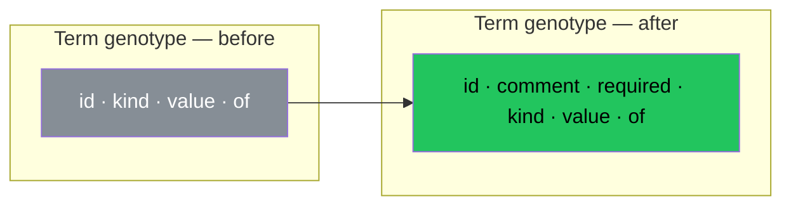

# The Atoms Speak

We built a playground. A visualizer. A tool to touch the protocol. And the protocol changed under our hands. Not because we planned it. Because when you look at something closely enough, you see what was always missing.

This devlog documents three changes to the schema that emerged from building the playground. Each one was discovered, not designed.

## Comment Enters the Atom

The operation always had a comment. A human-readable note. The bridge from machine name to human meaning. But the term did not.

We were building the fixture for the playground. Six operations. A dog shop. And we wrote a term:

```
{id: 'zip', kind: 'string'}
```

And stopped. Zip. What is zip? A postal code? A ZIP archive? A compression algorithm? A verb meaning to move fast?

The machine knows it is a string. The machine does not know what it means. Only a human knows. And the human has nowhere to write it down.

So we added comment to Term.

```
{id: 'zip', kind: 'string', comment: 'Postal code, not an archive'}
```

Five bits of ambiguity resolved. Not by a type system. Not by a naming convention. By a human writing a sentence.

Every term has meaning. Not every meaning has been expressed. Comment is optional not because some terms lack meaning — but because some meanings have not yet been found. The silence is not absence. It is meaning not yet spoken.

| Before | After |
|--------|-------|
| Term: id, kind, value, of | Term: id, **comment**, kind, value, of |
| Meaning lives only in id | Meaning lives in id and comment |
| `zip` — ambiguous | `zip` — "Postal code, not an archive" |

## Required Enters the Atom

We were looking at the BuyDog operation in the playground. Input rail: breed, budget, express, deliveryAddress, preferredSize.

And we realized: breed is not the same as preferredSize. Breed is oxygen. Without it the reaction does not proceed. PreferredSize is a catalyst. It helps, but the reaction works without it.

The protocol had no way to express this. A term was either on the rail or not. Present or absent. But in every real system — in every function, every API, every chemical reaction — some inputs are mandatory and some are optional.

In chemistry: combustion requires oxygen (mandatory) and may use a catalyst (optional). In a function: `divide(a, b, precision?)` — a and b are required, precision is not. In an HTTP request: the path is required, the query string is not.

This is not a design decision. This is physics. Some reagents are necessary for the reaction. Some are not. The protocol was lying about this by omitting it.

So we added required to Term.

```
{id: 'breed', kind: 'string', required: true}
{id: 'preferredSize', kind: 'enum', of: [...]}
```

breed is oxygen. preferredSize is silent — absent required means optional. Not because it has no role. Because the reaction proceeds without it.

| Semantics | Chemistry | Protocol |
|-----------|-----------|----------|
| **Must be present** | Oxygen in combustion | `required: true` |
| **Helps but not necessary** | Catalyst | `required` absent or `false` |
| **Absence = optional** | No catalyst added | No required field |

The default is silence. Silence means optional. Explicit `true` means the contract is violated without this term. Explicit `false` means "I thought about it and decided it is not required." Three states from one boolean and one absence.

## The Genotype Grows

Devlog twenty discovered that operations are genotypes and traits are phenotypes. The environment determines which traits express.

These two changes — comment and required — are mutations in the genotype. The genetic code of the term grew two new genes:



Comment is the gene for self-description. Required is the gene for necessity. Both were always needed. Both were silent. The playground made them speak.

And like all genetic mutations — these are backward compatible. Old instructions without comment and required still parse. The new genes are recessive. They express only when present. Silent when absent. The old genotype is a subset of the new one. Evolution, not revolution.

## The Schema

The full Term after both changes:

```
{
  "id":       "breed",
  "comment":  "Exact breed name, e.g. labrador",
  "required": true,
  "kind":     "string",
  "value":    "labrador",
  "of":       [...]
}
```

Six fields. Only id is required. Everything else is optional. Because not every atom has been fully described. Some are just beginning to speak.

| Field | What it is | Required |
|-------|-----------|----------|
| id | Machine name | Yes |
| comment | Human meaning | No — silence is not absence |
| required | Physical necessity | No — absence means optional |
| kind | What kind of data | No — but needed for value and of |
| value | A specific datum | No — needs kind |
| of | Children (composition, repetition, choice) | No — needs kind |

## What This Devlog Establishes

Comment entered the atom. Every term can now carry human meaning. Not every term will. Some processes just happen. But the place for meaning exists. `zip` is no longer ambiguous.

Required entered the atom. Every term can now express physical necessity. Breed is oxygen — the reaction fails without it. PreferredSize is a catalyst — helpful but not required. The protocol no longer lies about the nature of inputs.

Both changes are backward compatible. Old instructions parse without modification. The new fields are recessive genes. They express when present. Silent when absent. Evolution, not revolution.

The playground caused these changes. We did not plan to modify the schema. We planned to visualize it. But visualization demands truth. And the schema was not telling the whole truth. The atoms were silent about meaning and necessity. Now they speak.

Three devlogs. Three discoveries. Devlog eighteen — Dima saw that trait is the fourth rail. Devlog twenty — the playground revealed that traits are phenotypes. Devlog twenty-one — the playground revealed that atoms need voice and necessity. Each discovery came from looking. Not from planning. The protocol teaches those who build with it.
