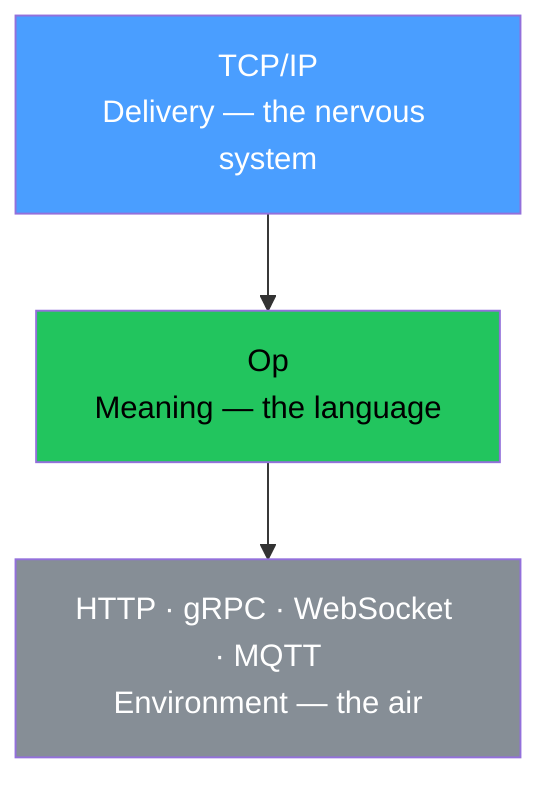

# The Dream Layer

This devlog started as a dream. Literally. The author woke up and said: in my dream, Op became so fundamental that it replaced root protocols. TCP/IP at the bottom. Op above it. Everything else — just environment.

We drank coffee. And realized the dream was not a fantasy. It was a description of reality that already exists but nobody named.

## The Two Layers

There are only two layers in any communication system. Ever. Since the first nervous system appeared in jellyfish 500 million years ago.

**Layer 1: Delivery.** Getting a signal from point A to point B. The nervous system does not know what it carries. It carries. Electrical impulses. Packets. Bytes. TCP/IP.

**Layer 2: Meaning.** What the signal means. "Tiger on the left." Two words. An operation. Input: direction. Output: survival. Error: did not hear. Language does not know how to deliver itself — voice, gesture, smoke, paper. Language just means. Op.

Between them — 499.9 million years of evolution. And nothing in between. No intermediate layer. Delivery and meaning. Everything else is environment. Air through which sound travels. Paper on which letters are written. HTTP through which JSON flies.

## The Parallel Universe

In the dream, Op already existed when Sir Tim Berners-Lee came to work in 1989.

Sir Tim says: "Let us build HTML and HTTP."

Someone asks: "Why?"

"HTML will render documents. HTTP will deliver them."

"How will HTTP know what to deliver?"

"Op will tell it. Op describes WHAT. HTTP becomes the transport — the phenotype. The environment."

And then:

- **URI** stays. The address. The fact.
- **HTTP** is born as a trait. `{id: 'transport/http', kind: 'object', of: [{id: 'method', kind: 'enum'}, {id: 'path', kind: 'string'}]}`. An opinion. One possible phenotype.
- **HTML** is born as a receiver. Reads instructions. Compiles visualization. Not a format — a projection. Like op-openapi compiles documentation. Like op-cli compiles a terminal.

And then gRPC does not need to be invented. It is just another trait. `transport/grpc`. Another phenotype. Same genotype.

And then GraphQL does not need to be invented. It is just another receiver. Reading the same instruction. Compiling a different projection.

And then MCP does not need to be invented. Claude just reads `/operations`.

Seven giants. Seven formats. Zero reasons. Because all of them are phenotypes of one genotype. That nobody wrote down in 1989.

## The SOAP Wound

But we do not live in that universe. We live in this one. Where the industry burned the contract together with the ceremony.

SOAP was forty lines of XML to say "give me a list of dogs." WSDL was a hundred lines to describe one operation. WS-Security, WS-Addressing, WS-ReliableMessaging — an infinity of specifications.

REST said: you do not need any of this. `GET /dogs`. Two words. Works. Right now. Without generation. Without WSDL. Without tools.

The industry exhaled. And threw out the contract with the bathwater. Because the contract was welded to the ceremony. WSDL without SOAP did not exist. Description without XML did not exist. They were glued. And when XML burned — the description burned with it.

REST did not kill the contract on purpose. REST made it optional. And optional means absent. In five years, nobody wrote contracts. In ten years, Swagger appeared — an attempt to bring back what was lost. But already as exotic. As extra work. "We should also write documentation." Should. As if description is a bonus, not the foundation.

## The Man Page

Dennis Ritchie knew. In 1971. Every program in Unix had a man page. Not optional. Culture. A program without a man page was not a program.

Then the culture died. Programs stopped describing themselves. Introspection became exotic. Something you add later. If you have time. If the manager approves.

Op does not invent self-description. Op returns it. As the norm. Not as exotic. `/operations` is `man` for the internet. Machine-readable. Typed. With four rails. With traits. But in essence — the same man page. "Here is what I can do. Here is what I need. Here is what can go wrong."

## The HFT Test

Someone will say: what about high-frequency trading? Nanoseconds. Every layer of abstraction is latency.

Op does not stand in the path of data. Op stands before data. The instruction is read once. Before the first byte. The receiver compiles a deserializer. Allocates buffers. Prepares error handlers. All typed. All in advance.

Then bytes fly. A million per second. Op already did its work. Once. Before the stream began. Like a blueprint before construction. The blueprint does not slow down construction. The blueprint accelerates it.

There is no scenario in which knowing in advance what will arrive is harmful. There is no scenario in which a typed contract interferes. There is no scenario in which describing an operation slows down a stream.

Man page does not slow down the program. Blueprint does not slow down construction. Instruction does not slow down the operation.

## What This Devlog Establishes

There are two layers in any communication: delivery and meaning. TCP/IP is delivery. Op is meaning. Everything else — HTTP, gRPC, WebSocket — is environment. Not layers. Environment.

In a parallel universe where Op existed before HTTP, seven giants would not have written seven formats. All of them are phenotypes of one genotype that nobody wrote down.

The industry did not reject contracts. The industry rejected ceremony. SOAP welded them together. REST burned both. Op separates them. Contract without ceremony.

Ritchie knew in 1971. Programs describe themselves. This was culture. The culture died. Op returns it as economics. Describe yourself or be invisible.

Op does not stand in the path of data. Op stands before data. One instruction. Then a million bytes. The blueprint does not slow down construction.

This devlog started as a dream. It ended as a layer.
