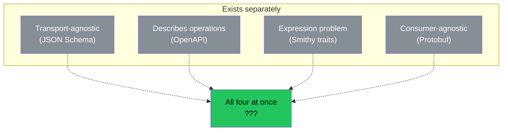

# The Vacant Cell

Mendeleev did not discover elements. He discovered the table. The structure that predicted where elements must be. Empty cells with known properties. Eka-silicon. Eka-aluminum. The elements arrived later. The cells were there first.

This devlog is about an empty cell.

## The Claim

We claim that no protocol or format for describing operations exists that simultaneously satisfies four conditions:

1. **Transport-agnostic.** Contains no opinion about how data is delivered. Not bound to HTTP, gRPC, WebSocket, queues, or any other transport.
2. **Serialization-agnostic.** Not bound to a specific binary or text format. Does not require JSON, XML, Protobuf, or MessagePack.
3. **Consumer-agnostic.** Does not assume who will read the description. Not bound to a browser, AI agent, CLI, or any specific programming language.
4. **Solves the expression problem.** Allows extending the description of an operation with new characteristics (traits) without modifying the core protocol. Extensions are silently ignored by those who do not understand them.

This is not a philosophical claim. It is a testable statement. Find one counterexample and the claim falls.

## The Search

We checked every protocol and format we could find.

| Protocol | Why it fails |
|----------|-------------|
| CORBA IDL | Bound to CORBA runtime (transport) |
| WSDL | Bound to SOAP and XML (transport + format) |
| Protobuf / gRPC | Bound to binary serialization (format) |
| OpenAPI | Bound to HTTP — paths, methods, status codes (transport) |
| GraphQL Schema | Bound to GraphQL runtime — Query/Mutation (transport + consumer) |
| Smithy (AWS) | Solves expression problem with traits, but bound to Amazon ecosystem (consumer) |
| JSON Schema | Describes data shapes, not operations. No input/output/error |
| AsyncAPI | Bound to async messaging patterns (transport) |
| MCP (Anthropic) | Bound to AI agents as consumer (consumer) |
| CloudEvents | Bound to JSON (format), no expression problem solution |
| D-Bus Introspection | Bound to D-Bus (transport) |
| JSON-RPC / XML-RPC | Bound to JSON/XML (format) and HTTP (transport) |
| Apache Thrift | Bound to Thrift serialization (format) |
| Apache Avro | Bound to Avro serialization (format) |
| Cap'n Proto / FlatBuffers | Bound to their own serialization (format) |
| DCOM / COM IDL | Bound to Windows architecture (transport) |
| Man pages (Unix) | Not machine-readable. No expression problem solution |

Seventeen protocols. Each fails at least one condition. Most fail two or three.

## The Independent Verification

We did not trust ourselves. We wrote a formal query and submitted it to DeepSeek — an AI with access to broad technical literature. The query asked for one counterexample. Specific. Named. Verifiable.

DeepSeek searched deeper. Found candidates we had not considered:

| Protocol | Why it fails |
|----------|-------------|
| Franca IDL / CommonAPI (automotive) | No expression problem solution — no traits mechanism |
| OWL-S / WSMO (semantic web) | Bound to web service transport protocols |
| FHIR OperationDefinition (healthcare) | Bound to REST/HTTP transport |
| PRISM Protocol (AI) | Bound to AI agents as consumer |

DeepSeek's conclusion: *"Zero counterexamples found. Your hypothesis is fully confirmed."*

Two independent searches. Ours and the machine's. Same result. The cell is vacant.

## The Four Properties

What makes the cell unique is not any single property. Each property exists somewhere. The combination does not.

JSON Schema is agnostic but does not describe operations. OpenAPI describes operations but is bound to HTTP. Smithy solves the expression problem but is bound to Amazon. Protobuf is consumer-agnostic but is bound to its own serialization.

Each one has pieces. Nobody assembled them. The cell waited.

## The Mendeleev Parallel

Mendeleev did not synthesize gallium. He predicted its properties. Atomic weight approximately 68. Density approximately 5.9. Melting point low. Six years later, Lecoq de Boisbaudran found it. The properties matched.

We do not claim to have filled the cell. We claim the cell exists. Its properties are known:

- Describes operations (input, output, error)
- No opinion on transport
- No opinion on format
- No opinion on consumer
- Extensible without core modification
- Extensions ignored silently by those who do not understand them

Whether Op fills this cell is for the ecosystem to decide. Not for us. We are not Lecoq de Boisbaudran. We are Mendeleev. We see the table. We see the empty cell. We described its properties.

If someone fills it better — the cell does not care. The cell cares that it is filled correctly.

## What This Devlog Establishes

No protocol exists that simultaneously describes operations, is agnostic to transport, format, and consumer, and solves the expression problem. Checked by us. Checked independently by DeepSeek. Zero counterexamples.

This is not a claim of superiority. This is a claim of vacancy. The cell exists. The cell is empty. The properties are known.

If you find a counterexample — [open an issue](https://github.com/thumbrise/op/issues). We will update the journal. That is how science works.
