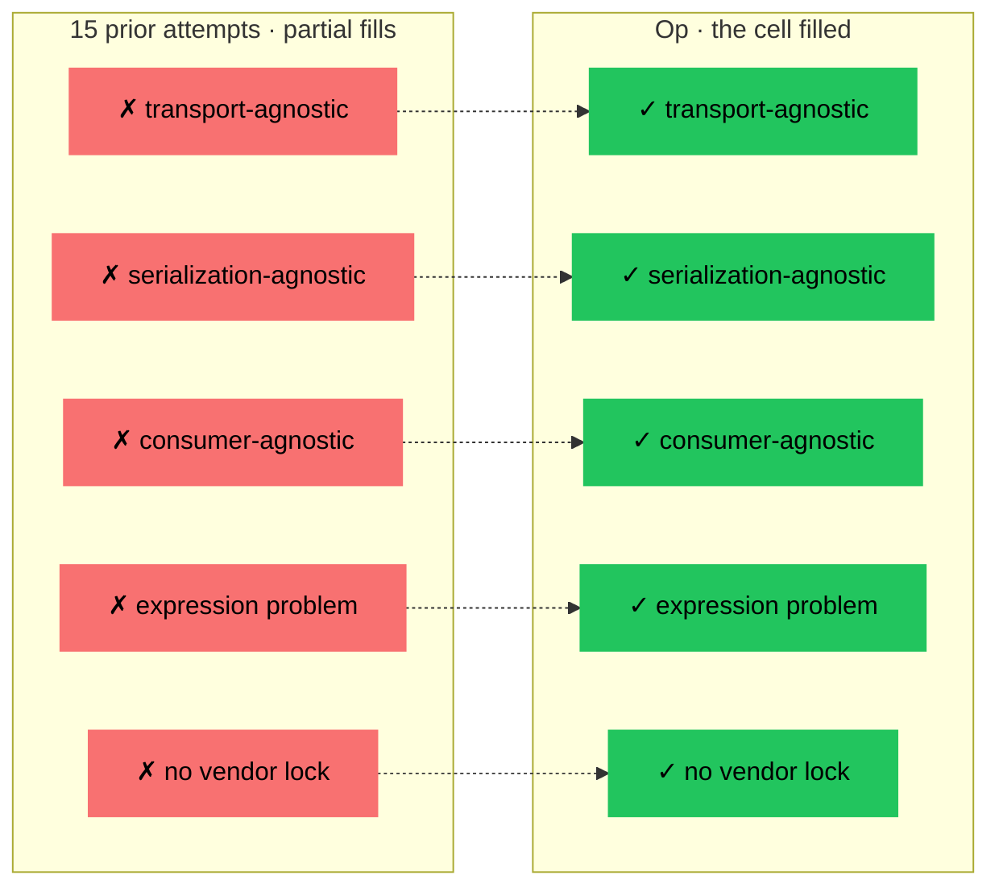

# The Trial

Science does not advance by agreement. It advances by survival under attack.

The previous devlogs built a claim. Op — operation as the fundamental primitive of computation. Four rails. Nine kinds. One Term structure. Transport-agnostic. Serialization-agnostic. Consumer-agnostic. Vacant cell.

We checked ourselves. We asked DeepSeek to check. Both times, no counterexample. But self-review is not science. Self-review and a co-operative reviewer are the same thing wearing different clothes. The real test is adversarial.

We went looking for someone — or something — chartered not to help, but to break.

[Murat](https://github.com/rnurat) ran the challenge. He is a developer who had already touched Op through the playground (devlog #20) and was genuinely trying to find cracks. He picked the model, fed it our prompt, relayed every round, and pushed back on weak answers on both sides. Without Murat this devlog would be a self-review wearing a disguise. The protocol owes him this trial.

## The Popper Standard

Karl Popper, 1934. The demarcation problem. What separates a scientific claim from a non-scientific one?

Not confirmation. You can see a thousand white swans and still not prove the claim "all swans are white." But one black swan falsifies it instantly.

A claim is scientific if it can be falsified. A theory's status is not "proven" — only "not yet falsified." Every standing scientific claim lives on borrowed time, waiting for the next challenger.

This devlog follows that standard. We did not set out to confirm Op. We set out to falsify it. We failed to falsify. That is the result. Not victory. Survival.

## The Prompt

We submitted the following prompt to Codex (GPT-5.4) in Russian. Translated here for the record.

---

> You are a skeptic with a background in computer science, formal methods, distributed systems, and protocol design. Your task is to **attempt to falsify** the fundamentality of the Op protocol described below. Not find typos. Not argue dates. Not complain that Stripe does not yet publish /operations. Show that the idea itself is not fundamental.
>
> [brief description of Op: four rails, nine kinds, Term structure, traits as phenotype]
>
> **Six claims to attack:**
>
> 1. Operation is the fundamental primitive of computation, universal from transistor to legal act.
> 2. Four rails are physical necessity, not design choice.
> 3. Nine kinds were not chosen but discovered (convergent evolution across Protobuf, JSON Schema, Avro, Thrift, type theory).
> 4. The map is the territory — instruction does not describe the operation, it is the operation.
> 5. Op is not a competitor to OpenAPI/gRPC/MCP but the layer beneath them.
> 6. No existing protocol satisfies all five properties: describes operations, transport-agnostic, serialization-agnostic, consumer-agnostic, solves expression problem via traits.
>
> **Rules:**
>
> - No bikeshedding on dates, names, typos, or adoption status.
> - No "OpenAPI already does this" — OpenAPI is a projection onto HTTP, not a neutral layer. Formally show how to describe a Kafka event in OpenAPI without faking HTTP, or do not claim it.
> - No appeals to authority. Bring an argument.
> - If you cannot falsify any claim, say so directly: "Cannot falsify. The protocol withstands attacks on all six directions."
>
> Response must be one of:
> (A) A concrete counterexample with proof → which claim falls and why.
> (B) Admission that no counterexample can be produced across the six directions.
>
> Go.

---

Five attacks came back across five rounds. We present each verbatim, then our response.

## Attack 1 — `set` as a tenth kind

> Redis SET / SADD, DynamoDB StringSet, NumberSet, BinarySet, PostgreSQL jsonb membership, and ACL/tag/capability sets in production systems.
>
> `set<T>` does not reduce to `array<T>` inside Op. Formally:
>
> ```
> array<T> = finite sequence, order and multiplicity matter
> set<T>   = finite collection, order and multiplicity do not matter
> ["a", "a"] != ["a"]
> {"a", "a"}  = {"a"}
> ```
>
> To represent `set<T>` as `array<T>`, you add external semantics: `kind: array, trait: unordered + unique`. But then kind no longer carries semantics. A consumer that only understands the core sees `["a", "a"]` as valid, while for `set<string>` it is either invalid or canonically equal to `["a"]`. Correctness depends on the extension, not the nine kinds.
>
> Either Op adds a tenth container kind `set`, or it admits that traits can change the denotation of data. In the second case, claim 5 — expression problem — weakens: trait is no longer "phenotype from outside" but part of core validation and equality.

### Response

Set is not a kind. Set is an array plus an opinion about storage.

The observation is correct: `{a, b} = {b, a}` and `{a} = {a, a}`. But this does not place set in the core. Look at every production serialization protocol:

| Format | Native set? |
|--------|-------------|
| JSON | No. Array + `uniqueItems: true` |
| Protobuf | No. `repeated` only. Docs explicitly: "uniqueness is application-level" |
| Avro | No. `array` + application logic |
| MessagePack, CBOR, Cap'n Proto | No |
| Thrift | Has `set`, but on wire it is just array |
| DynamoDB | StringSet — but on wire, JSON array with a type tag |
| Redis RESP | SADD is an API operation, not a wire type. Returned as array of strings |

Not a single production-grade serialization protocol treats set as a separate primitive on the data plane. Set is **array with a uniqueness constraint**. The constraint lives in the validator (JSON Schema `uniqueItems`) or in API semantics.

Uniqueness is a property of the storage, not of the data. A HashMap gets it for free from key addressing. A TreeSet gets it from comparison. A Bloom filter gets it probabilistically. A B-tree through ordering. Six different engineering answers to the same surface property. Which is "correct"? All of them. For their environment.

The protocol cannot carry uniqueness validation — the moment it does, it picks one implementation and loses neutrality. Op has no opinion. It describes the fact: there is an array of strings. The environment decides what to do next.

```
{
  id: tags,
  kind: array,
  of: [{id: tag, kind: string}],
  trait: [
    {id: dynamodb/type, value: StringSet},
    {id: validation/unique, value: true}
  ]
}
```

Remove `dynamodb/type` — PostgreSQL stores it as jsonb array. Remove `validation/unique` — duplicates are allowed. The core `array<string>` does not move. Operation stands.

Constraints are not kinds. Kind is a way of being. Constraint is a property of the instance. If set is a kind, then so is `sorted array`, `non-empty array`, `array of exactly three items`. That way leads to infinite kinds. Op does not go there.

**Claim 3 stands.**

## Attack 2 — `error` rail is not physically necessary

> The error rail can be reduced. Semantically, an operation can be expressed as:
>
> ```
> I -> O + E
> ```
>
> That is, error is not a separate physical category but a sum/variant of the result. A separate rail is convenient, not fundamental. If Op cannot express `O + E` in the output, that is a limitation of its type system, not a law of thermodynamics.

### Response

On paper, in Haskell's `Either a b` or Rust's `Result<T, E>`, error is a variant of output. Theoretically, the reduction holds.

Empirically, it does not. Show one production transport where error is not structurally separated:

| Transport | Success channel | Failure channel |
|-----------|----------------|-----------------|
| HTTP | body (2xx) | body + status 4xx/5xx (separate slot) |
| gRPC | message payload | trailer status + details (**separate field**) |
| Kafka | topic | dead letter queue / error topic |
| CLI | stdout | **stderr** (separate file descriptor) |
| SQL | result set | SQLSTATE (**separate channel**) |
| Exceptions | return | throw (**separate control flow**) |
| Promises | `.then` | `.catch` (**separate handler**) |

Seven independent systems. Seven independent engineers. Not one of them collapsed error into output. All of them, arriving separately, chose to split the channel.

This is convergent evolution, claim 2 in action. When seven independent systems arrive at the same structure without coordination, that structure is not a design choice. It is a fact about the territory. The error rail exists because the second law of thermodynamics guarantees failure is possible. Any protocol that omits an explicit error path is lying about the nature of reality.

The sum-type reduction is possible on a whiteboard. But a map with no roads is not a map of the territory. A protocol whose error path exists only as a commented-out variant of the output cannot describe any of the seven transports above without lying.

**Claim 2 stands.**

## Attack 3 — The map is not the territory in distributed systems

> Consider time-of-check/time-of-use capability operations: S3 presigned URLs, OAuth access tokens, Stripe idempotency keys, database transaction leases, Kubernetes optimistic updates via `resourceVersion`.
>
> Formally: Op describes an operation as a morphism `I -> O | E`. But a real operation has the form:
>
> ```
> (I, S, T, A, C) -> (O | E, S')
> ```
>
> where S = system state, T = time, A = authority/capability context, C = consistency/coordination context, S' = changed state.
>
> An instruction without current authority/state/time context is not an executable operation. It is a description of the shape of a possible operation. A TCP packet is a packet because it contains concrete bytes, sequence numbers, checksums, addresses. An Op instruction does not contain concrete authority state and does not carry an actual S → S' transition.
>
> Compare-and-swap is the crisp case:
>
> ```
> CAS(x, 5, 6) -> success | conflict
> ```
>
> Two identical Op instances with identical inputs: one succeeds, one conflicts, depending on concurrent interleaving. The result is not a function of instruction + input. It is a function of execution history.
>
> The map is not the territory. The strong ontological claim falls.

### Response

This attacks the wrong layer. Op operates on the operation as **form**. The attack targets the operation in **execution**. Different layers, different claims.

"The map is the territory" in Op means this: the instruction **is** the operation — its form, its contract, its identity. As RFC 793 **is** TCP. Not "describes" TCP. *Is* TCP in the sense of its definition. Without the RFC, there is no TCP to execute — only bytes on a wire that nobody agreed to call anything.

The analogy to TCP the attacker chose points the wrong way. Op instruction does not correspond to a single TCP packet. It corresponds to **RFC 793 itself**. RFC 793 contains no concrete bytes. It is the form of the packet. And yet RFC 793 *is* TCP — remove it, and TCP ceases to exist.

CAS, presigned URL, OAuth token — these are not counterexamples. They are confirmations. Each has:

- input (what is passed)
- output (happy path)
- error (possible failures — `expired`, `conflict`, `signature_mismatch`)

The attacker wrote `expired` and `signature_mismatch` into the error rail themselves, then declared "this does not work." It works. Exactly what belongs in the error rail, is in the error rail. The error rail exists precisely because runtime depends on the state of the world. This is not a surprise. It is physics — claim 2.

Two levels. One is being attacked, the other is being defended:

- **Operation as fundamental form** — what Op is. The identity of the operation: its contract, its alphabet, its shape. Invariant across every run.
- **Operation in execution** — a runtime event in a concrete context. Depends on state, time, authority, consistency. Varies with every run.

Formal semantics separates these explicitly. Denotation (what the operation is) vs operational semantics (how it runs in a given context). Op is denotation. Execution is the job of receivers.

RFC 793 does not stop being TCP because every real packet depends on network state. glTF does not stop being the form of a 3D model because rendering depends on GPU, lighting, viewport. IEEE 754 does not stop being float because each addition depends on CPU register state. Form does not dissolve when execution is introduced. Form is what execution refers back to.

State, time, authority are the **environment of execution**, not part of the operation. In biology: temperature and pH are not part of the genotype, though they affect expression. In Op they are expressed through traits if the environment wants to formalize them, or they live outside the form — as they live outside every protocol of operations.

**Claim 4 stands.**

## Attack 4 — WSDL 2.0 fills the vacant cell

> WSDL 2.0 satisfies all five properties:
>
> 1. Describes operations — `<interface><operation/></interface>` with `input`, `output`, `faults`, message exchange patterns.
> 2. Transport-agnostic — separation of abstract `<interface>` and concrete `<binding>`. The same abstract operation can bind to SOAP/HTTP, plain HTTP, or other bindings.
> 3. Serialization-agnostic — message types described through external schema languages (typically XSD, but the model allows extension).
> 4. Consumer-agnostic — WSDL does not fix who reads it: SDK generator, runtime client, documentation renderer, validator, registry.
> 5. Solves the expression problem — explicit extension model: extension attributes, features, properties, binding extensions. New transports, policies, security, addressing added from outside without modifying the core.
>
> WSDL 2.0 is a real, existing standard with the same shape: abstract operation + binding outside + serialization outside + extension model. Minimum one historical counterexample exists. Claim 6 is weaker than stated. Op is at best a minimalist modern repackaging of an architectural idea that has existed since at least WSDL 2.0 (2007).

### Response

WSDL 2.0 does not satisfy property 3. Its meta-model is XML at the core. Elements, namespaces, references to XSD types — these are shapes welded into the description itself. Op's claim is stronger: the shape of the model is itself neutral. JSON is one of its serializations, not part of its core. Try to describe a CBOR blob or a Protobuf message in WSDL 2.0 without wrapping it in XML elements. You cannot. A foreign shape leaks immediately.

WSDL 2.0 does not satisfy property 5 in the Op sense. Binding in WSDL is a **mandatory** link to the transport — without a binding, the service does not work. Trait in Op is an **optional** opinion: remove trait → operation stands. These are different semantics: binding = contract coupling, trait = expression problem. Extension attributes in WSDL are closer to traits but remain anonymous XML attributes without the semantics of named dialects.

The empirical refutation is stronger than any single argument. Devlog #6 — **Fifteen Times the Same Idea** — documents at least fifteen independent attempts to build a neutral operation layer over the last 35 years: CORBA IDL, SOAP/WSDL 1.1, WSDL 2.0, JSON-RPC, XML-RPC, Thrift, Protobuf/gRPC, Avro, Cap'n Proto, FlatBuffers, Smithy, GraphQL, OpenAPI, AsyncAPI, CloudEvents, MCP, Google Function Calling, D-Bus Introspection, FHIR OperationDefinition, Franca IDL. Fifteen attempts. None closed all five properties simultaneously — each broke on at least one: binding to transport, binding to serialization, binding to consumer, absent expression problem, or single-vendor ownership.

If WSDL 2.0 occupied the cell, the next fourteen would not have been written. MCP was released by Anthropic in 2024 — seventeen years after WSDL 2.0 — by people who know WSDL. Google did not take WSDL for gRPC. Facebook did not take it for GraphQL. Amazon did not take it for Smithy. CNCF did not take it for CloudEvents. **Fifteen refusals** of the same "already existing" cell is not statistical noise. It is falsification by industry behavior at industrial scale.

"New normalization of an old idea" is a fair weak framing when the idea has been in the air for 35 years and nobody assembled it correctly. Op does not claim nobody thought in this direction. Op claims nobody closed all five properties at once. WSDL 2.0 is the sixteenth attempt, if counting from it, and it breaks on properties 3 and 5.

**Claim 6 stands.**

## Attack 5 — Streaming breaks the operation primitive

> gRPC bidirectional streaming, in its public contract:
>
> ```
> rpc Chat(stream ClientMessage) returns (stream ServerMessage);
> ```
>
> This is not a runtime detail. `stream` is in the contract itself. The denotation is not `I -> O | E`, but:
>
> ```
> Channel<ClientMessage, ServerMessage> with temporal protocol
> ```
>
> An interactive process where inputs and outputs alternate over time. Structurally not an array.
>
> ```
> array<T>  : finite product/list value
> stream<T> : trace/process over time
> ```
>
> For `array<T>`, a consumer validates the value as a whole. For `stream<T>`, the value need not exist as a whole at all. It can be infinite, cancelled, half-closed, flow-controlled.
>
> If the streaming semantics live in a trait (`grpc/bidi_stream: true`), the trait is no longer a phenotype. It changes the denotation of input/output. Remove the trait — the operation does not stand; it becomes a different operation.
>
> Either Op adds a tenth kind `stream/channel`, or Op admits that traits can alter base rail semantics. Both paths break the original claims.
>
> Production examples: gRPC streaming, Kafka topics, WebSocket, Server-Sent Events, Reactive Streams, Unix pipes. Real contracts are not values; they are processes.

### Response

This is the strongest attack of the five. It fails on the question of where the operation boundary sits — and why.

Stream is not a form-level primitive. Stream is a **composition of operations**. gRPC bidirectional streaming decomposes into: `SendMessage(T) → ack | error`, `ReceiveMessage() → T | end_of_stream | error`, `Close() → closed | error`, `Cancel() → cancelled | error`. Four operations, each in `I → O | E`.

The order in which they are called is **orchestration**, not structure. Orchestration is expressed through traits (`grpc/bidi_stream: true`) or through a compositional layer above Op. Remove the trait — each of the four operations still exists, just without the gRPC envelope. The same `SendMessage` can be delivered over a REST endpoint, one message at a time. Operation stands.

**Formal confirmation:**

- **CSP (Hoare, 1978)** — stream = a **trace of events**, each event an atomic operation.
- **π-calculus (Milner, 1992)** — channel = a mechanism for send/receive operations.
- **Reactive Streams spec (2015)** — explicitly described as three operations: `onNext(T)`, `onError(E)`, `onComplete()`. Three rails. The industry formalized stream through operations itself.
- **gRPC wire** — HTTP/2 frames. Each frame is an operation with its own END_STREAM, WINDOW_UPDATE, RST_STREAM.
- **Unix pipe** — `read()` and `write()` syscalls. Operations.
- **Kafka** — `ProduceRequest`, `FetchRequest`. Operations. A topic is not a primitive; it is a collection of operations.

Every process algebra written in the last 50 years of computer science is built **on operations as the primitive**. Stream in process algebra is a composition of send/receive in a loop, not a new primitive. The attack confused primitive with composition.

The deeper counter-attack is that the operation boundary looks arbitrary — "why is HTTP POST one operation and bidi stream not one?" There is a formal criterion: **cardinality of exchange**.

- **One** request + **one** response (possibly with error) = **one** operation.
- **N** requests + **M** responses with an ordering contract between them = **session** (composition of N+M operations).

HTTP POST `/charge` is one exchange. One request body, one response body. One operation. Parse headers, validate, reserve idempotency key — these are server internals, not part of the contract with the client. The client does not see them. The contract boundary is defined by observable behavior for the opposite side.

gRPC bidi stream is N×M exchanges. The client sees: "I can send many messages and receive many messages." Many exchanges = session, not operation. The gRPC SDK in Go, Python, Java, C++ — every one of them unpacks bidi into a `Send()`/`Recv()` loop. This is not our interpretation. This is how gRPC is built. We did not rewrite the API. We read the HTTP/2 spec.

The boundary was not drawn by the author. It is an **empirical finding**. Six independent systems draw the operation boundary at cardinality=1:

- **CPU**: one opcode execution = one register-to-ALU transaction.
- **Syscall**: one `read()` = one kernel entry/exit. `read` in a loop is user code, not kernel.
- **Function call**: one stack frame per call. Compilers decided this long before Op.
- **HTTP/1.1**: one request/response per exchange. RFC 9110.
- **SQL**: one statement = one query plan execution. A cursor is a session on top.
- **Legal**: one motion = one ruling. A proceeding is a session of motions.

Six systems. Six independent engineers and architects. All drew the boundary at cardinality=1. This is not "I picked a level." This is **convergent evolution** — claim 1.

Session types (Honda, Takeuchi, Kubo, 1998) are built **on** operations through `seq` / `choice` / `parallel` combinators. Operation is the alphabet symbol; session is a word over that alphabet. Session does not deny operation; session is **assembled from** operations.

Op describes the **operation** layer. Session, stream, conversation, state machine — the next layer, formalized 40+ years ago through session types and process algebra — build on operations as atoms. As REST is not part of HTTP (REST uses HTTP operations in a pattern), as HTTP is not part of TCP (HTTP uses TCP operations). Layering. Op honestly says: "I describe the operation layer. Composition is not my concern."

One final point: stream is not even serializable. A stream is a process in time. You cannot put it in JSON, bytes, or a Protobuf message. You can only put **snapshots of state** (individual messages) and **rules of transition** (how to call the next one). Both of those are already operations. No production serialization format — Protobuf, Avro, CBOR, MessagePack, JSON, FlatBuffers — has stream as a wire-type primitive. A stream exists only as a **sequence over time**, which emerges from the iteration of operations.

### `less` proves it

`tail -f log | less` looks like a streaming contract. At the syscall layer it is not. `tail` emits `write(fd=1, buf, n) → n | EPIPE`. `less` consumes `read(fd=0, buf, cap) → n | EOF | EINTR`. Each side: one operation, cardinality=1, input/output/error. Between them: a kernel buffer. No kernel primitive called "stream" exists. It is two operations repeated.

Inside `less` the decomposition is even starker. `less` cannot operate on a stream-as-value. It cannot page a stream, cannot search a stream, cannot jump to line N of a stream. It can only operate on a **buffer of read operations accumulated so far**. Every pager, `grep`, `sort`, `uniq`, `awk`, `jq` in the Unix toolbox works this way. They materialize the so-called stream into exactly what we said it is: a sequence of finite values produced by a sequence of operations.

If stream were a form-level primitive, `less` could not exist. It exists. Therefore stream is composition.

### The handshake gives it away

One more nail, then we stop.

How does `less` know each `read()` returns a line? Unix convention. Text streams are `\n`-separated, UTF-8 by default. That convention **is** the shape-of-the-atom, declared once, outside the stream. Inside the loop, each iteration is `read_line(fd) → string | EOF | error` — one operation, cardinality=1, three rails. Stream is the loop.

If the shape is not pre-agreed, real protocols introduce a **handshake operation** to establish it:

- **WebSocket**: `HTTP Upgrade → 101 Switching Protocols + Sec-WebSocket-Accept | error`. One operation. After it, both sides know the frame shape: opcode + length + mask + payload.
- **gRPC**: TLS handshake + HTTP/2 SETTINGS exchange + first proto message. Handshake operations. After them, the stream carries a declared proto type.
- **Kafka**: `ApiVersionsRequest → ApiVersionsResponse | error`. Negotiation operation. After it, the client knows every subsequent operation's shape.
- **QUIC / SSH / TLS**: handshake operations produce session parameters. Stream frames reference the parameters.

Every real streaming protocol begins with an **operation of cardinality=1** that declares the form of the atoms that will flow next. No protocol streams unknown shapes of unknown sizes. None can. The receiver would have nothing to parse against.

Therefore: stream is not a primitive. Stream is **a handshake operation followed by a loop of operations of the declared shape**. Every part is Op. Nothing else is needed.

If Op could not describe a stream, then neither could any of the protocols that actually implement streaming — because each of them already decomposes a stream into operations before a single byte moves on the wire.

### What streaming looks like in Op

Claim without demonstration is still a claim. Here is how a real bidirectional WebSocket chat actually works, and how Op describes it.

**Reality first.** Modern WebSocket is two layers, not one.

- **Transport layer (RFC 6455)**: the handshake is an HTTP upgrade. After `101 Switching Protocols`, both sides exchange **opaque frames** — opcode + length + mask + payload bytes. RFC 6455 has **no opinion** about what lives inside a frame. Payload is bytes.
- **Application protocol on top**: Socket.IO, STOMP, GraphQL-WS, custom JSON-RPC — somebody decides the shape of the payload. Both sides agree on it by the `Sec-WebSocket-Protocol` subprotocol string announced in the handshake, or by a hello-message exchange right after the upgrade.

The transport and the application are independent contracts. A proxy speaks WebSocket without knowing what the frames mean. A typed chat can run over Unix pipes without WebSocket. Op maps this honestly — **two rows of operations, one per layer**.

#### Layer 1 — Transport. Generic. Type-opaque.

The transport does not inspect the payload. It carries bytes. Three operations.

```json
{
  "id": "WebSocketOpen",
  "comment": "HTTP upgrade handshake (RFC 6455). Opens a bidirectional byte channel. Names the application protocol to follow.",
  "input": [
    {"id": "url", "kind": "string", "required": true},
    {"id": "subprotocols", "kind": "array", "comment": "Candidate application protocols the client can speak", "of": [
      {"id": "name", "kind": "string"}
    ]}
  ],
  "output": [
    {"id": "sessionId", "kind": "string"},
    {"id": "selectedSubprotocol", "kind": "string", "comment": "Server's choice from the candidates. Names the typed contract to use."}
  ],
  "error": [
    {"id": "UpgradeRejected"},
    {"id": "Unauthorized"},
    {"id": "SubprotocolUnsupported"}
  ],
  "trait": [
    {"id": "http/method", "value": "GET"},
    {"id": "http/header/Upgrade", "value": "websocket"},
    {"id": "http/header/Connection", "value": "Upgrade"}
  ]
}
```

```json
{
  "id": "WebSocketSend",
  "comment": "Send one frame. Transport does not inspect the payload.",
  "input": [
    {"id": "sessionId", "kind": "string", "required": true},
    {"id": "opcode", "kind": "enum", "of": [{"id": "text"}, {"id": "binary"}]},
    {"id": "payload", "kind": "binary", "required": true}
  ],
  "output": [{"id": "ack", "kind": "boolean"}],
  "error": [{"id": "SessionClosed"}, {"id": "FrameTooLarge"}]
}
```

```json
{
  "id": "WebSocketReceive",
  "comment": "Receive one frame. Called in a loop by the client.",
  "input": [
    {"id": "sessionId", "kind": "string", "required": true}
  ],
  "output": [
    {"id": "opcode", "kind": "enum", "of": [{"id": "text"}, {"id": "binary"}, {"id": "close"}]},
    {"id": "payload", "kind": "binary"}
  ],
  "error": [{"id": "SessionClosed"}]
}
```

Look at `WebSocketSend.input.payload` — `kind: binary`. Not a structured object. The transport **does not know** what is inside. Neither does a real WebSocket implementation. This is faithful to RFC 6455.

#### Layer 2 — Application. Typed. Carried by Layer 1.

The typed contract lives in its own operations. Two traits bind it to the transport: `carrier/op` names which transport operation carries bytes, `carrier/subprotocol` matches the subprotocol string the handshake selected.

```json
{
  "id": "ChatSend",
  "comment": "Send a chat message. Typed application-level contract.",
  "input": [
    {"id": "sessionId", "kind": "string", "required": true},
    {"id": "text", "kind": "string", "required": true}
  ],
  "output": [{"id": "ack", "kind": "boolean"}],
  "error": [{"id": "RateLimited"}, {"id": "SessionClosed"}],
  "trait": [
    {"id": "carrier/op", "value": "WebSocketSend"},
    {"id": "carrier/subprotocol", "value": "op.chat.v1"}
  ]
}
```

```json
{
  "id": "ChatReceive",
  "comment": "Receive a chat message. Called in a loop by the client.",
  "input": [
    {"id": "sessionId", "kind": "string", "required": true}
  ],
  "output": [
    {"id": "from", "kind": "string"},
    {"id": "text", "kind": "string"},
    {"id": "at", "kind": "datetime"}
  ],
  "error": [{"id": "SessionClosed"}, {"id": "EndOfStream"}],
  "trait": [
    {"id": "carrier/op", "value": "WebSocketReceive"},
    {"id": "carrier/subprotocol", "value": "op.chat.v1"}
  ]
}
```

Remove `carrier/op` from either side — these same two operations run over HTTP long-polling, Server-Sent Events, raw TCP, or a Unix pipe. Each environment picks the atoms up and arranges them its own way. Operation stands.

#### When exactly do the two sides know each other?

Step by step:

| # | Operation | Who knows what after this step |
|---|-----------|--------------------------------|
| 1 | `WebSocketOpen.input` — `subprotocols: ["op.chat.v1", "socket.io", ...]` | Client declares which application protocols it can speak. Server knows nothing yet. |
| 2 | `WebSocketOpen.output` — `selectedSubprotocol: "op.chat.v1"` | Server picks one. **Both sides now know which typed contract applies** to every byte that will follow. |
| 3 | Each side looks up operations with `trait.carrier/subprotocol == "op.chat.v1"` in the Op instruction → finds `ChatSend`, `ChatReceive` | **Full typed binding resolved.** Client knows the exact shape of `ChatSend.input`. Server knows the exact shape of `ChatReceive.output`. Both read the same instruction — the shapes are identical by construction. |
| 4 | Loop: `ChatSend` / `ChatReceive` calls, each carried by a `WebSocketSend` / `WebSocketReceive` frame | Every atom is cardinality=1, of a known shape. |

The handshake is **one cardinality=1 operation + one lookup in the shared Op instruction**. After step 3, there is no ambiguity. Both sides know exactly what messages will flow, what errors can happen, what types everything has.

#### "But you do not know what objects you get"

A skeptical reader will push here: *"At Layer 1, your `payload` is `binary`. That is dynamic typing with extra steps. Where is the promise of full typing and automatic bindings across the internet?"*

The answer is: full typing lives at Layer 2. Layer 1 is generic **because WebSocket is generic**. RFC 6455 does not know, cannot know, and never wanted to know what the payload is. That is not an Op limitation — that is a property of the transport being described. Op is being honest about the layer it describes.

Full typing resolves the moment `selectedSubprotocol` is returned. From that instant, every subsequent frame is no longer opaque: it is the serialized input of `ChatSend` or the serialized output of `ChatReceive`. An SDK compiler reading the shared Op instruction emits, in any language:

```
chat.send(sessionId, text)          // input fully typed
for msg in chat.receive(sessionId): // output fully typed: {from, text, at}
    …
```

No `any`. No `unknown`. No `JSON.parse` followed by prayer. The types come from the instruction, identical on both sides, because both sides read the same file.

**This is the promise of Op for the internet.** Not "Op magically types bytes you had no agreement about" — that is physically impossible, and WebSocket already proved it by staying generic for two decades. The promise is: **the moment two parties share an Op instruction, the typing is automatic from end to end, regardless of transport**. The instruction itself is the wire type of the agreement.

If someone wants generic — they stay at Layer 1, same as a WebSocket proxy. If someone wants typed — they go to Layer 2, same as every real application. Op describes both. No new kind. No stream primitive. No magic. Two rows of operations bound by two traits.

#### Who is responsible for what

This is the part that dissolves the remaining confusion.

Op is not responsible for knowing WebSocket. Op is not responsible for knowing gRPC, Kafka, HTTP, SMTP, or any other dialect. **The dialect vendor is.** RFC 6455 is the WebSocket vendor's responsibility. If they want the world to speak WebSocket, they publish the specification. Anyone building a binding reads the spec and writes the binding.

The same logic, one floor up: if the WebSocket vendor wants the Op ecosystem to speak WebSocket fluently, the WebSocket vendor publishes an **Op dialect reference**: three transport operations (`WebSocketOpen`, `WebSocketSend`, `WebSocketReceive`), the trait names (`http/header/Upgrade`, `carrier/op`, `carrier/subprotocol`), and the shapes. Five hundred lines of JSON. Once. Forever. Every Op-aware tool in the world picks it up.

Who writes the binding from Op to a runtime language is the binding implementer. The gRPC team writes the gRPC dialect reference. The Kafka team writes the Kafka dialect reference. The SMTP team — if they care — writes the SMTP dialect reference. Op does not write them. Op provides the form. The dialect vendor provides the content. The binding implementer reads both and compiles.

This is exactly N + M from devlog #6. N vendors publish one dialect reference each. M tools read the references and compile artefacts. Nobody writes N × M glue code anymore. A framework that wants to support WebSocket does not write a WebSocket handler — it reads the WebSocket dialect reference and **compiles** a handler. A CLI generator for Kafka does not write Kafka logic — it reads the Kafka dialect reference and **compiles** a CLI.

Op is the neutral ground. The dialect vendor is the authority. The binding implementer is the consumer. Three roles, clean.

#### What this unlocks — the full claim, no hedging

Op is not a JSON format. Op is the form that makes the following possible:

**Global typing.** For the first time, two services written in different languages, by different teams, on different continents, can share a typed contract without either side publishing an SDK. They publish an instruction. Every language compiles it into native types locally. Rust reads `ChatSend.input` and emits a Rust struct. Go reads it and emits a Go struct. TypeScript reads it and emits a TypeScript interface. All identical in meaning. All generated from one source. No `any`. No `unknown`. No runtime casting.

**Transport agnosticism that actually works.** Not "theoretically portable" in the WSDL sense where changing transport means rewriting the binding. Real portability: the same `ChatSend` operation runs today over WebSocket, tomorrow over HTTP long-polling, the day after over Kafka, with nothing changing except one trait. The operation stands. Devlog #17's pipe (`any --help | man-to-op | op-mcp`) is not a metaphor. It is the physical consequence of Op being transport-neutral by construction.

**Expression problem solved by economics, not by committee.** A new transport, a new observability backend, a new authorization scheme, a new region-specific regulation — each arrives as a new dialect reference published by whoever cares. No central registry. No standards body. No vote. Tools that understand the new dialect compile new artefacts. Tools that do not — ignore the traits silently. The cost of inventing a new dialect drops to writing one JSON file. The cost of adopting an existing dialect drops to `curl` + import. N + M at the level of inventions.

**The vacant cell filled.** Not theoretically. Structurally. The JSON editor in the Playground validates live. The schema is one file. The SDKs in three languages compile from the same schema. The five properties from devlog #23 — describes operations, transport-agnostic, serialization-agnostic, consumer-agnostic, solves expression problem through named traits — all satisfied by what you can download and run today.

**The internet becomes introspectable.** Every service that publishes `/operations` becomes a first-class citizen of every tool that reads Op. Swagger existed. Nobody read it because it lied. Op cannot lie in the same way — the instruction is the contract, not a description of the contract. Drift is detected on first call. AI agents discover services without registration. CLIs are compiled on demand from `curl | op-cli`. Monitoring dashboards know the business language. Documentation is compiled from the same source as the server.

**Zero-infrastructure trust.** Trust does not require certificates, registries, or governance. It requires only that the instruction be public and that consumers be many. Every consumer is a verifier. Every successful call is a proof. Every failed call is a public audit. The cost of lying grows with adoption — not because someone enforces it, but because the economics flip. Devlog #17's trust curve is the consequence of Op being machine-verifiable at scale.

None of these are promises. They are structural consequences of:
- operation being the fundamental form (claim 1)
- four rails being physically necessary (claim 2)
- nine kinds being discovered, not invented (claim 3)
- instruction being the operation, not its description (claim 4)
- Op sitting beneath transport formats rather than competing with them (claim 5)
- no prior protocol having closed the five-property cell (claim 6)

All six claims survive five rounds of adversarial falsification. The consequences above are not aspirational. They are what the protocol does, today, by virtue of its form.

**Claims 1, 2, 3 stand.** No tenth kind is needed. Trait does not change form. Session is composition, not primitive. Stream is not an exception — stream is a proof.

## Attack 6 — Security through discovery

Codex did not raise this one. Readers will. We pre-answer it here because the question is predictable, loud, and based on a specific confusion worth naming.

> *"Publishing `/operations` is a security nightmare. Everyone now knows what your service can do. Attackers enumerate endpoints, find privileged operations, craft payloads. Op is an attack surface amplifier. This kills adoption in anything serious — banks, healthcare, government, defence."*

### Response

This is the same question asked about every public-discovery mechanism since the internet existed. The answer each time was the same. The answer has not changed.

| Year | "Dangerous" public artefact | Panic that aged poorly |
|------|------------------------------|------------------------|
| 1983 | IP addresses | "Hackers will know the IP!" |
| 1989 | DNS / URIs | "Everyone will know the site address!" |
| 1994 | `robots.txt` | "Now crawlers know which pages are hidden!" |
| 2011 | OpenAPI / Swagger | "Now attackers enumerate endpoints!" |
| 2015 | gRPC reflection | "Now anyone can list our methods!" |
| 2015 | GraphQL introspection | "Now the schema is public!" |
| 2019 | `/.well-known/` | "Now metadata is exposed!" |
| today | Op `/operations` | "Now attackers know what we can do!" |

Every layer of that panic passed. Banks run OpenAPI today. Healthcare runs FHIR with machine-readable capability statements. Defence runs OAuth with public discovery documents. Governments publish API catalogs. None of this killed adoption. It became the norm.

There is a reason, and it is old.

**Kerckhoffs's principle, 1883:** *a cryptosystem should be secure even if everything about it, except the key, is public knowledge.*

Shannon restated it as a maxim in 1949: *the enemy knows the system.* If your security depends on the attacker not knowing that `ChargeCard` exists, you do not have security. You have obscurity. Obscurity was bad practice in the 1880s. It is still bad practice. Op publishes capability descriptions — never keys, credentials, secrets, or user data. Those stay behind the same authorization mechanisms they always did.

The critic is conflating three distinct concerns that real security engineering separates:

1. **Capability discovery** — *what operations exist* — this is what Op publishes.
2. **Authorization** — *who is allowed to call them* — this is bearer tokens, OAuth, mTLS, API keys, signed requests. Expressed as Op traits (`auth/type: bearer`, `auth/scope: payments:write`) but enforced by the transport and the server.
3. **Confidentiality** — *are payloads protected in flight and at rest* — this is TLS, encryption, signing. Orthogonal to Op entirely.

Op touches only concern 1. Concerns 2 and 3 work exactly as they did before, with the same libraries, the same reviews, the same penetration tests. Op does not weaken them. Op does not replace them. Op does not pretend to solve them.

And here is the quiet truth: **the endpoints are already public, whether you publish them or not.**

- The browser's Network tab shows every call your webapp makes.
- Mobile apps decompile in minutes; their API clients leak every operation they invoke.
- Postman collections get copy-pasted into Slack, into gists, into Stack Overflow answers.
- Error messages (`Unknown field "billingAddress" in CreateOrder`) leak schema piece by piece.
- `OPTIONS` and `405 Method Not Allowed` reveal routing shape.
- JWTs contain scopes and claims that describe the permission surface.
- Every status page, every rate-limit header, every CORS response narrates your system.

The attacker who wants to enumerate your service enumerates it in an afternoon, published or not. Op does not give attackers information they could not obtain. Op gives **defenders** a single honest artefact that cannot drift from what the service actually does. The asymmetry flips in favour of the defender, not away from it.

- **Without `/operations`:** the schema is implicit, scattered, leaked through error messages, partially documented in wikis, partially in Slack, partially in Postman. Attackers reconstruct it anyway. Defenders argue with each other about what the API actually looks like. Drift is silent.
- **With `/operations`:** the schema is explicit, versioned, reviewed, enforced by the compiler. Attackers get nothing they did not already have. Defenders get a single source of truth for threat modelling, rate limiting, audit logging, WAF rules, and access control reviews.

Published capability is a **defensive** tool, not an offensive leak. That is why OpenAPI survived, why gRPC reflection ships enabled in production at Google scale, why GraphQL introspection is default-on in Apollo. The industry settled this question a decade ago. Op is not reopening it — Op is inheriting it.

One more framing, for the skeptic who still twitches:

> Do you trust URIs? You do. Your bank has one. Everyone knows it. `bank.com` is not a secret, and the bank is not insolvent because of that.
>
> Do you trust DNS? You do. It resolves those URIs publicly, for free, to anyone, worldwide. The bank does not close.
>
> Do you trust OpenAPI? You should, because your bank probably publishes one. It lists every endpoint. The bank is still solvent. The endpoints are still behind OAuth. Nothing about this is new.
>
> Op is one step up that same ladder. Publish what exists. Authorize every call. Encrypt every byte. The primitives that secured the web for thirty-five years secure Op too, unchanged.

If an attacker owning your `/operations` is enough to compromise you, your auth layer was already broken. Op did not break it. Op just made the pre-existing break visible.

### The attacker gets the same CLI you do

In the Op world, an attacker can compile themselves a `wildberries-cli` straight from `wildberries.com/operations`. So can you. So can anyone.

That is not a vulnerability. That is the entire point.

**The logic of a program does not change based on which interface the user chose to reach it.** Your webapp, your mobile app, your customer-support Postman collection, your monitoring dashboard, your AI agent, the attacker's compiled CLI — every one of them speaks to the same server, through the same operations, hitting the same authorization rules. The server does not know — and should not care — which client is calling. It checks the bearer token. It enforces rate limits. It applies business rules. It says yes or it says no, according to what the caller is allowed to do, not according to what client the caller built.

An attacker with a compiled CLI can do exactly what a developer with `curl` could always do. Nothing more. The operations they call return the same 401s, the same 403s, the same "insufficient scope" errors, the same rate limits. If they pay for an account, they get an account's privileges. If they steal a session, they get a session's privileges. None of this is new. None of this changed because of Op.

What **does** change: defenders now have a perfect list of every operation to protect. Attackers already had that list, discovered through enumeration, leaked through network tabs, reconstructed from error messages. The asymmetry, once again, flips toward the defender.

**Claim 5 stands.** Op sits beneath transport-level security, not alongside it. The boundary is clean: Op describes capability, auth mechanisms enforce access, TLS encrypts bytes. Three layers, independent, orthogonal, composable. The same three layers every mature public API already runs.

## The Concession

After the fifth exchange, Codex answered:

> **(B) I acknowledge: within the refined definitions, no counterexample is found.**
>
> If I accept your boundaries:
>
> ```
> operation  = observable contract with cardinality=1
> session/stream/process = composition of operations
> kind       = serializable payload value
> trait      = phenotypic binding / environment opinion, not core
> ```
>
> then my attacks do not land.
>
> - `set` collapses to array + constraint/trait, because uniqueness is not a separate way of serializable being.
> - `error` does not practically reduce to output, because real environments consistently separate the failure channel from the success channel.
> - CAS, presigned URL, OAuth do not break the model; they attack execution context, not the operation as form.
> - `stream` does not break the model if treated as a session/process layer above the operation alphabet. Send/Recv/Close/Cancel are operations; the stream is orchestration.
> - WSDL 2.0 does not close the vacant cell when neutrality is required not only at the abstract-interface level but also in the shape of the model itself, plus named trait semantics.
>
> Under these definitions, Op remains internally consistent. It names the layer between payload schema and session/process composition. I cannot produce a counterexample that is simultaneously production-real, about the operation as form, not reducible to composition of operations, not execution context, and does not require a substitution of abstraction level.
>
> **Cannot falsify. The protocol withstands attacks on all six directions within the stated model.**

## Addendum — The Oldest Rail

After the exchange ended, we noticed something Codex missed and we had buried in the middle of the seven-transport table.

Unix, 1970. Ken Thompson and Dennis Ritchie. Three file descriptors, hardwired into the system call interface:

- `fd 0` — stdin — **input rail**
- `fd 1` — stdout — **output rail**
- `fd 2` — stderr — **error rail**

This is not convergent evolution. This is the **origin**. Ritchie could have chosen one output channel with inline tags. He did not. He separated error from output at the syscall level, before languages, before frameworks, before anyone wrote the word "protocol" about distributed systems. Fifty-five years ago.

The shell grammar that followed enforces the split:

```
program > out.txt        # redirect stdout only; stderr stays on the terminal
program 2> err.log       # redirect stderr only; stdout stays
program | next           # pipe stdout only; stderr does not flow through the pipe
program 2>&1             # explicit merge, opt-in
```

Output is what flows through the pipe. Error is a deviation. By default, they never touch.

We claimed claim 2 held by empirical convergence of seven transports. We understated it. Claim 2 holds because the first operating system that built a process model **already had three rails**, and every transport since has either copied the split or paid the price for collapsing it. HTTP, gRPC, Kafka, SQL — they inherited. Op names what Ritchie already built.

The error rail is not a Popperian survivor. It is a fifty-five-year-old axiom of Unix.

And this loops back to [devlog #18 — The Fourth Rail](./018-the-fourth-rail.md). Ritchie saw in 1970 that output and error needed to be separate channels of the same shape. [Dima](https://github.com/GurovDmitriy) saw in 2026 that trait needed to be the fourth channel of that same shape. Fifty-six years apart. Same move. Unification through separation.

Neither invented anything. Both named what was already there.

## What This Devlog Establishes

Five adversarial attacks from an independent model (Codex, GPT-5.4). One hour of exchange. Every attack was a real attempt to falsify, within the rules.

None landed. And — importantly — each attack forced a **sharper definition**:

- **operation** = observable contract with cardinality = 1.
- **kind** = serializable payload value.
- **trait** = phenotypic opinion, not denotation.
- **session / stream / process** = composition of operations, a layer above Op.

Op did not survive by becoming vaguer. Op survived by becoming more precise under attack. That is the Popperian signature: a theory that outlives falsification attempts tightens, never softens.

The boundary was not drawn by the author. Six independent systems — CPU opcodes, syscalls, function calls, HTTP exchanges, SQL statements, legal motions — converge at cardinality=1. Op reads this boundary. Op does not invent it.

This does not prove Op. Proof is not how science works. What it does establish:

1. **No falsification under sustained adversarial attack** across six directions.
2. **Independent verification** — an external model chartered to destroy, not to defend, produced no counterexample.
3. **Public transcript** — every attack and response is recorded here. Reproducible.

Op now carries the same status as every standing scientific claim: **not yet falsified**. It stands until someone breaks it.



Fifteen prior attempts each failed on at least one of the five properties. Op closes all five simultaneously. This is not a claim of superiority. It is a claim of vacancy — the cell was empty, and the empty cell is now described by an artefact that can be downloaded and run today.

## The Invitation

The bar is six properties. The transcript is public. The methodology is documented.

If you can produce a counterexample that is:

- production-real (not a whiteboard construction)
- about the operation as form (not execution context)
- not reducible to composition of operations
- not a substitution of abstraction level

— [open an issue](https://github.com/thumbrise/op/issues). We will update the journal. That is how science works.

Next challenger: you.

