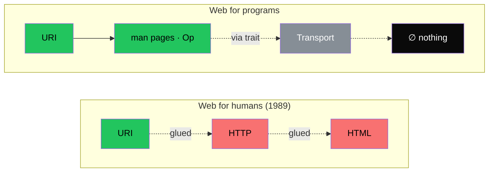

# The Manifesto

## The Blind Spot

Every attack on streaming, session, channel — these are made of messages. You cannot say "stream of X" without X being a primitive that exists before the stream. The attacker wrote `rpc Chat(stream ClientMessage)` — and already used an atom called `ClientMessage`, a payload with input shape and expected acknowledgement. An operation with cardinality=1. The primitive was there, in the attack itself, hidden by the word "stream".

Everyone uses the operation primitive. Nobody names it. Ritchie used it when he wrote `write()` in 1971. Cerf used it when he wrote TCP in 1974. Fielding used it when he wrote REST in 2000. Every engineer at Google, Anthropic, Facebook, Amazon uses it every day. It is the alphabet of the messages they send. It is so obvious nobody bothered to spell it.

Mendeleev did not invent the elements. Chemistry knew sodium behaved like potassium for a century before him. He named the pattern. The chemistry did not change. The ability to describe it did.

Op names the operation. The computation does not change. The ability to describe it does.

## Standing on Their Shoulders

Compilers already solved the problems the web community is still inventing.

What is programming? Interaction between components. Components at wildly different levels of abstraction. Every level a reflection of engineering progress. To stand on the shoulders of the fathers — not to deny their contribution, not to mock it, but to stand proudly on what has already been proven.

You have to see those proofs. Not just say *"we are tired of XML and SOAP, let us invent a between-computer assembly language."* You have to answer the question: **what were XML and SOAP solving?**

Pause. Think.

What is the difference between your language calling a low-level function, and your program calling an application on another computer?

The second one rides on a networking breakthrough. TCP/IP. Sir Tim's dream is unreachable as long as program-to-program communication is described by its delivery method rather than its intent.

What are compilers for? To close off what has already been answered. What has already been agreed upon.

And it is not about transport.

What is transport? A way to deliver intent.

What is the difference between two programs talking locally through a pipe and two programs talking across continents?

Physical separation. The network adds its own rules to the game. The network is always hostile.

But your own computer is hostile too. Murphy's law works at every layer of abstraction, in every law of the universe.

Engineering is not *"now we need to send a request over the internet to another app."* Engineering is formalizing transport as just another binding for the program — the same kind of binding you `import` in PHP or attach as a `git` extension.

What does a compiler need from a programmer to successfully compile?

What does a compiler need to successfully compile a program that lives on the other side of the world?

Is there any real difference for the compiler?

Does RPC already do this? No. Remote Procedure Call is an attempt to standardize operation by imposing its own opinion about transport. A compiler must be interoperable — that is why it cannot live inside one specific set of transports.

What a compiler needs first is to know which function your program wants to call.

Flip it upside down.

What a compiler needs first is to know what the remote program on the other side of the world can do.

It is not about what you want. It is about what that program out there offers. Everyone doing their own job. For every job to be part of the shared work, there has to be a foundation. A common language. One that carries no opinion.

If space engineers reinvented low-level details every time, no human would have flown to space.

Web development is missing its space engineers. It is missing an exchange programme, if we may call it that. And the worst part is that the layers of web development stacked on top of each other are so numerous that a space engineer who wandered in would hear: *"Things are done this way here, you do not understand, there are nuances here, do you even know how many? This is its own world, its own rules."* Out of politeness, they would leave. And think: *"There must really be special nuances there. I will not interfere."*

And the hamster keeps writing a parser for a presentation, dumping JSON into a database.

Handing that JSON to another hamster through `Http::get("/trash")->middleware("basic")`.

The second hamster keeps writing `fetcher()->milliardConcreteTransportParametersInsteadApplicationIntention(...)`.

The third gets jealous and writes a generator of their own standard from the data the second one keeps in the database.

The fourth says *"you did not optimize the transmission enough"* and writes a binary protocol.

The fifth says *"you are not automated enough"* and writes a huge Java framework that compiles every possible language with byte-delivery rules specific to their own business.

When every hamster could have simply asked: **"What can you do? What do you hold? May I use it?"**

Every hamster could have said: *"I invented an efficient algorithm for authorization. Transport-free. An algorithm! Here is an implementation you can use."*

Every transport could have said: *"I invented a very efficient way to carry bytes. Here is my dialect. You can plug it in. I vouch for it as a vendor."*

Every program could have said: *"Here is my set of operations. Intercontinental `man` pages. Dependent on no one's opinion. No one's problems can be considered uniquely specific. No one's nuances must be special or especially complicated when they touch the fundamental meaning of the internet."*

Everything that touches your business, solve at the business layer. Transport is not your business problem. Transport is the problem of URI + HTTP + HTML — of the triplet where the model was lost at conception. Nothing in that triplet is a model. Only URI is. And without the operation, a model alone is a hamster that hanged itself somewhere in a shed. Maybe someone finds it. Nobody promises. Nobody even knows whether it is worth walking into the shed at all.

The SEO engineers of the world's large companies volunteered to check every shed for usefulness. They raise to the top whatever looks relevant. Those algorithms deserve respect, like everything the web community has built before us and in parallel with us. We respect the contribution to the shared work, every attempt that let us see the foundation of the operation in cross-section. But the truth is plain: Sir Tim's dream is not only his. Some of us refuse to pretend otherwise.

We need more research. More sharp questions. We need to take every complex, argued, even brilliantly engineered transport-layer solution and look at it in cross-section through Op — to see, beside the ingenuity and the high technology, whether there is something resembling an XY problem underneath. Sometimes. Not always. But sometimes.

If the world of the internet can be rebuilt without a revolution, from the bottom up, without authority, through working examples alone — that is already a good start.

**Business solves business algorithms. Open-source web vendors solve theirs. Let us agree on a common language without forcing anyone.** Self-organisation is, we believe, the sign of a correct primitive. A colony gathers only around a pheromone everyone understands without dispute.

A Linux utility does not care who invokes its `man` page, who calls it with `--help`.

The `|` pipe operator does not care who is on its left, who is on its right.

The operations protocol does not care what surrounds it.

Gravity does not care why that hamster decided to hang.

Global network.

It is not URI + HyperText**Transfer**Protocol + HyperText**Markup**Language.

For programs, it is a different set entirely.

It is **URI + `man` pages + Transport + nothing**.

---

Op does not validate. Op does not check. Op does not guarantee.

Op **is** the form of the operation.

---
