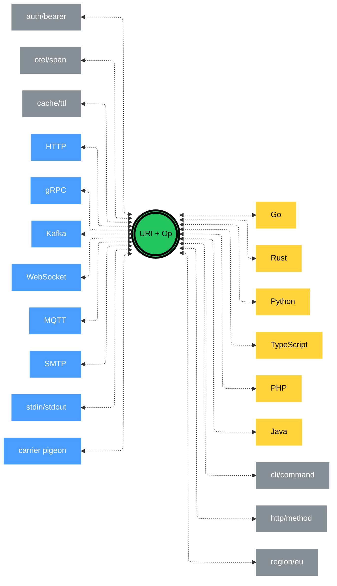
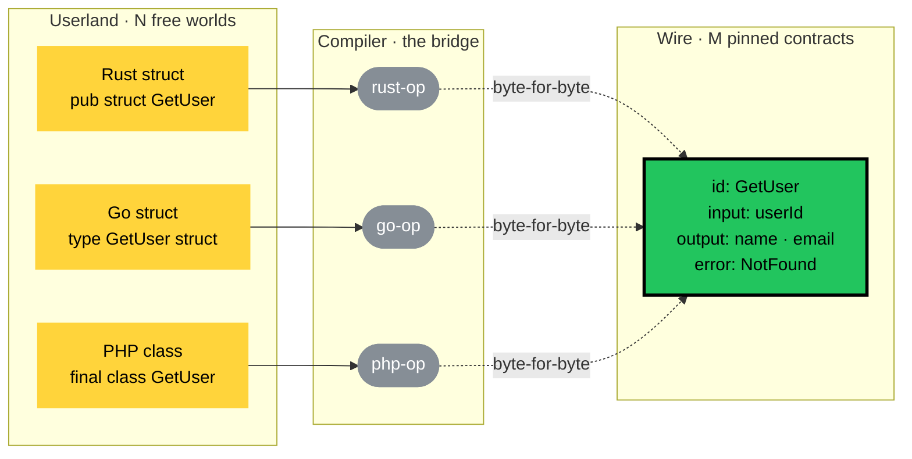

# The Compilers

## N Worlds, M Contracts



The core is two atoms: **URI + Op**. Nothing else. Around it — transports, languages, traits, opinions of every colour and semantics, all mixed together. The core does not know them. The core does not want to know them. Each transport is an opinion that lives next to the core, not inside it. Each language is a userland world that binds through its compiler, then walks away. Each trait is a dialect someone published, used by whoever cares.

The binding cannot send anything that was not in the contract. The problem is already solved — it was solved the moment the compiler replaced the human as the author of the wire.

There is no single "userland world" and no single "wire contract." There are **N userland worlds** — one per language, one per framework, one per platform — each with its own identifier rules, its own package conventions, its own idioms. And there are **M contracts** — one per operation, with its own wire names, its own rails, its own traits. N and M grow independently. They do not need to agree on anything except at the compiler boundary, where every userland world binds to every relevant contract through a compiler that copies wire names byte-for-byte from the instruction.

Look at how an instruction with a deliberately hostile identifier resolves:

```
id: "Hello I am some junk with ...spaces  .  . and dots!!! )))"
kind: object
```

Is this a valid term? Inside Op — yes. The core Op format places no opinion on identifier shape. The transport binding decides: if the transport allows that string on the wire, the operation flies. If not, the failure happens during the handshake, not later. JSON over HTTP would accept this. A binary protocol with strict identifier grammar might reject it at handshake time. That is the transport vendor's call, not Op's.

Now look at what the compiler produces in userland. The PHP-compiler might emit:

```
\MyBindings\Wildberries\Some\Handler
\MyBindings\Wildberries\Some\HelloIAmSomeJunkWithSpacesAndDotsInput

$h = new Handler()
$input = new HelloIAmSomeJunkWithSpacesAndDotsInput()
$output = $h->handle($input)
```

A Rust-compiler emits different names. A TypeScript-compiler emits different names again. Every compiler is free to pick userland identifiers that fit its language. That is not a coordination problem — it is a private decision of each implementer.

Why does this not break anyone?

Because the compiler emits whatever it likes in userland, but on the wire it sends exactly what Op named. Byte for byte. The pigeon flies with the field named `"Hello I am some junk with ...spaces  .  . and dots!!! )))"` regardless of what the Rust struct was called locally. The userland name is freedom for the implementer. The wire name is copied, not chosen.

N worlds. M contracts. The compiler is the bridge between any userland world and any contract, and the bridge has exactly one rule: userland is free, wire is pinned to the instruction. That is why consistency scales independently on both axes. It is not a human agreement. It is a property of how compilers work.

## Rigidity Is a Compile-time Property

A skeptic will ask: *"How do you evolve the schema? If everything is compiled, adding a field must be painful."*

The question contains the usual confusion. Let us pull it apart.

### The false axis: static vs dynamic, compile-time vs runtime

People argue about schema "hardness" along two axes: static vs dynamic typing, compile-time vs runtime checks. Both axes are distractions. Neither of them is what "hard" means in practice.

What is **hard** is what is enforced **now**, right where you are. What is **soft** is what you fix every day, in every service, by hand. Bindings. Mappers. Adapters. Glue code. Validators copy-pasted across repositories. That is the softness. Not dynamic typing — the **repair work that dynamic typing produces**.

MongoDB is the most instructive case. "MongoDB has no schema." False. MongoDB has a schema. It is not *absent* — it is *scattered*. It lives in every place your application code reads `doc.user_id` and expects it to exist, in every query, in every index, in every aggregation pipeline. You did not trade one explicit schema for zero schemas. You traded one explicit schema for a hundred implicit ones, distributed across your codebase, none of them queryable, none of them versionable, none of them refuseable at compile time. The "softness" is a story the marketing tells. The reality is softness you pay for every day.

Op is the opposite move. One instruction. One place. Compilers look at that one place and either succeed or refuse.

### Evolution: the approach does not change

Nothing new to learn. Evolution rules are the same everywhere:

- **Add an optional field** → forward-compatible. Old consumers ignore it. New ones see it.
- **Remove a field** → break. Requires a new version.
- **Change a field's type** → break. Requires a new version or a new operation entirely.

Protobuf, Avro, Thrift, Cap'n Proto — every mature wire format converged on these three rules. Kafka with Schema Registry enforces them. Postgres with migrations plays by them. Even REST with its header-based versioning plays by them. Four different transports, one evolution rulebook.

Op inherits this rulebook wholesale. It does not invent a new discipline. It reuses the one teams already practise. Adding a field to an instruction is the same mental move as adding a column to a Postgres table with a default, or adding a field to a Protobuf message, or adding a property to a Kafka Avro schema. Same rules. Same intuition. Same review checklist. The medium changed, the method did not.

### What compiles, what refuses

Because the rules are the same, the refusals are the same — and they happen at **compile time**, not runtime.

A C compiler targeting ARMv7 cannot emit x86-only instructions. It refuses. Not at the device, under a user, at night — at your build step, on your machine, before anything deploys. The failure is loud, local, and immediate.

An Op compiler targeting a specific transport behaves the same way. Consider this instruction:

```
{
  "id": "Hello I am some junk with ...spaces  .  . and dots!!! )))",
  "kind": "object",
  "of": [...]
}
```

Is this valid? It depends on the compiler and its target:

- A JSON-over-HTTP compiler accepts it. JSON object keys allow any string. The pigeon flies with `"Hello I am some junk..."` as the key, byte-for-byte.
- A TOML compiler refuses. TOML does not allow unquoted keys with spaces, and even quoted keys follow a grammar. `toml-op-compile` prints an error and stops. Not "we will try at runtime." Not "the server will reject this." An **error at compile time**.
- A Protobuf compiler refuses too — Protobuf field names must match `[A-Za-z_][A-Za-z0-9_]*`. Same compile-time failure.
- A CBOR compiler accepts, like JSON.

Whose problem is the refusal? Not Op's. Op has no opinion on identifier shape. The **transport binding** has the opinion, because the transport has a grammar, and the binding is the translator. If you wrote identifiers that do not fit the target transport's grammar, you have the same problem as writing C that does not fit ARMv7. You change the instruction, or you target a different transport.

Nothing about this is a property of Op. It is a property of how compilers work when they target real machines — or in this case, real wire formats.

### Softness lives where the check is scattered

The true axis is not static vs dynamic. Not compile-time vs runtime. It is:

**Is the check done once, in one place, with one compiler? Or is it scattered across a thousand hand-written bindings, each slightly wrong in its own way?**

Op picks the first. Every mature wire format that came before it — Protobuf, Avro, Thrift, Cap'n Proto — picked the first too. The only thing Op adds on top is: **transport-agnostic**. Protobuf is compile-time-checked and single-source — within the gRPC/Protobuf ecosystem. Avro is compile-time-checked and single-source — within the Kafka/Avro ecosystem. Op is compile-time-checked and single-source — across all transports, because the transport is a trait, not a baked-in assumption.

You do not lose evolution flexibility by moving to compile-time. You gain it. Because now every evolution check is caught before deploy, by the same rules everyone already knows.

### Adoption flows to the least-opinionated transport

One more consequence falls out of this for free.

If a TOML compiler refuses Op identifiers with spaces, and a JSON compiler accepts them, **Op does not lose adoption. TOML does.**

The reason is ecological, not technical. Op is neutral. Transports are opinions. Every opinion narrows the set of instructions a transport can carry. The tighter the opinion, the smaller the niche. Over time, adoption flows to the transport with the fewest arbitrary restrictions, because that is the transport every instruction can use.

Ask the question a transport must answer: *"What do you give? What do you cost?"*

- **TOML** — gives human-readable configs. Costs: no spaces in keys, limited nesting, no arbitrary identifiers. Narrow niche. Survives where humans edit the file.
- **JSON** — gives universal tooling, any-character keys, any-depth nesting. Costs: verbose, text-only. Wide niche. Default for machine-to-machine.
- **CBOR / MessagePack** — gives compactness, binary efficiency, roughly JSON-equivalent expressiveness. Costs: not human-readable. Wide niche where bandwidth matters.
- **Protobuf** — gives strong typing and code-gen velocity inside one vendor's ecosystem. Costs: field-name grammar, field-number discipline, wire tied to `.proto`. Narrow but deep niche.

None of these opinions is wrong in its niche. That is the point. Each transport sells a trade: "accept my restrictions, receive my benefit." Ecosystems self-select — TOML wins configs, JSON wins APIs, CBOR wins constrained devices, Protobuf wins high-throughput RPC.

Op plays under all of them. It is the layer that does not choose. When an instruction has an identifier TOML cannot carry, the sensible move is not to rewrite the instruction — it is to use a transport that can carry it. The instruction is the fact. The transport is the opinion. Opinions compete. Facts do not.

This is exactly how ants pick a pheromone. Not by committee. By local decisions summing to a global choice. The most-adopted transport wins not because someone declared it canonical, but because the sum of individual choices — *"I need keys with spaces, I pick JSON"* — concentrates traffic there. A less-opinionated transport always has a wider addressable audience than a more-opinionated one, all else equal. Over time, that is the transport the colony gathers around.

Op's job is not to pick for them. Op's job is to stay neutral enough that the picking is possible at all. The day a transport's opinions start costing more than its benefits, adoption drains away from it — not from Op. Op stays. Op is the floor everyone stands on while the transports compete overhead.

## The Compilers We Stopped Noticing



Three different userland shapes. Three different compilers. One wire contract. The compiler is a byte-for-byte bridge — whatever names `GetUser` has in Rust, Go, or PHP, the payload that leaves the process is exactly what the instruction declared.

Sixty years ago, programmers wrote assembly. Skeptics said you cannot hand that over to a compiler — the compiler does not know the nuances, produces slow code, cannot match what a human understands about the CPU. Compilers won. Not because they became smarter. Because they **removed a class of decisions**: register allocation, calling conventions, stack alignment. Today nobody reads assembly except debuggers and compiler writers. The wire format of the CPU is still there, still deterministic. Nobody writes it by hand.

The same transition is happening at the next layer.

For twenty years we have been writing HTTP payloads by hand. `{"user_id": 1}`. Choosing naming conventions per team. Reconciling `camelCase` vs `snake_case` in code reviews. Writing custom serializers to bridge Jackson and Pydantic. Debugging `400 Bad Request` because one side sent `userId` and the other expected `user_id`.

Op ends this. Not by enforcement. By **removing a class of decisions**:

- "what to name the wire key" — answered by the instruction
- "`camelCase` or `snake_case`" — answered by the instruction
- "include `null` or omit" — answered by the instruction
- "date format ISO-8601 or epoch" — answered by the instruction

An Op compiler takes the instruction and emits code for every language. Userland names are free — they are the implementer's opinion. Wire names are pinned — they are copied byte-for-byte from the instruction. There is no human in between to make inconsistent choices.

This is why the new world is a world of **compilers, not generators**.

A generator produces a scaffold that humans touch up. Two runs with slightly different opinions produce two different drafts. `openapi-generator` has dozens of templates and flags precisely because its output is assumed to be edited. That is why SDK fragmentation exists.

A compiler produces a final artefact. Two runs with the same input produce the same output. Changing the output means changing the input. `gcc hello.c` always emits the same ELF. Nobody hand-edits the binary. Nobody meaningfully can.

Op compilers work like `gcc`. The instruction is source. The SDK is the compiled artefact. Consistency is not a social contract. It is a property of how compilers work.

We stopped reading assembly because compilers solved the problem. The same is about to stop about wire protocols. We stop looking at JSON bodies, at gRPC frames, at WebSocket payloads — not because they disappear, but because they become what assembly is to C: the deterministic output of a compiler, below the layer humans touch.
