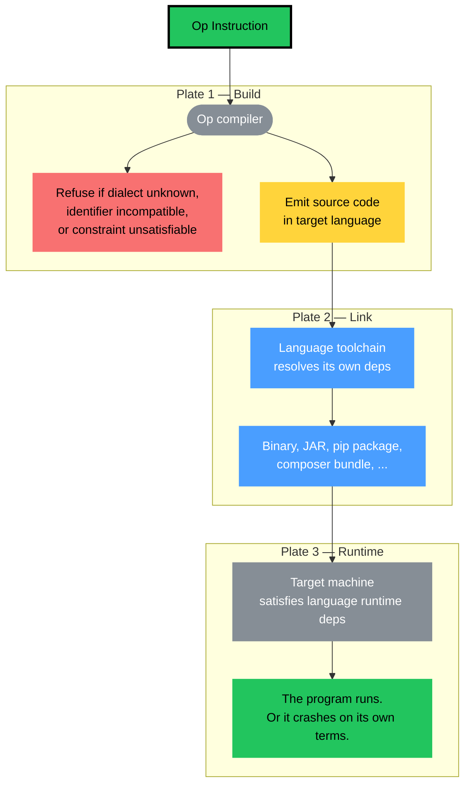

# Build, Link, Runtime

A reader asks a good vermicelli question. *"PHP crashes at runtime if `curl` is missing in the system. Go just ships with everything in the binary. How does an Op compiler behave? What if the target machine lacks the tool the binding needs?"*

The question mixes three concerns. Let us put them on separate plates.

## Plate 1 — Build time

The Op compiler reads the instruction and emits code. What it emits depends on what it knows how to emit.

Take `go-op-http` as an example. It sees an operation with `trait: http/method: POST`. It emits Go code that uses `net/http` from the standard library:

```go
// emitted by go-op-http
resp, err := http.Post(url, "application/json", body)
```

At this step, only one thing is checked: **can this compiler emit this trait for this target?**

- Knows HTTP → emits.
- Sees `smtp/from` → does not know → **compile error**. Loud, local, immediate. Exactly like `gcc -march=armv7` refusing x86 opcodes.
- Sees an identifier TOML cannot carry → `toml-op-compile` refuses — also at build time.

The compiler never pretends. It either succeeds or it refuses.

## Plate 2 — Link time

Now the emitted code refers to libraries. Each language resolves those references differently:

| Language | How the emitted code gets its HTTP |
|---|---|
| **Go** | `net/http` is stdlib. Nothing to resolve. Static binary, zero deps. |
| **Rust** | `reqwest` / `hyper` are statically compiled in. Zero deps. |
| **Java** | Uses JDK's `HttpClient` (Java 11+). Depends on the JRE being installed. |
| **PHP** | Uses `curl_exec()` → links against `ext-curl`. Extension must be built with PHP. |
| **Node.js** | Uses global `fetch` (Node 18+). No deps. |
| **Python** | Uses `urllib` (stdlib) or `requests` (installed via `pip`). |

This is **not Op's problem**. This is how each language has worked for decades. If you build a Go program, you get a single binary. If you build a PHP package, you declare `ext-curl` in `composer.json`. Op compilers emit code for the host language, and the host language's linker handles its own mess.

## Plate 3 — Runtime

Finally, the emitted program runs on a target machine. It needs the same things any program in that language needs:

- A **Go** binary needs nothing. Drop it on any Linux box. It runs.
- A **PHP** script needs `php` and `ext-curl` installed on the host. Without `ext-curl`, PHP throws a fatal error the first time `curl_exec()` is called — **early in module initialization, not deep in a request**. You learn about it the moment the process starts.
- A **Java** jar needs a JRE.
- A **Python** script needs `python3` and whichever libraries you declared.

Op does not change any of this. It does not weaken it. It does not strengthen it. It simply emits code for a language, and the language carries its deployment rules with it. Same Dockerfile. Same `apt install`. Same `composer require`. Same intuition your team already has.

## Can an Op compiler fail at compile time?

Yes. Three honest failure modes:

1. **Unknown dialect.** Compiler has no emitter for the trait it sees. `smtp/from` in a compiler that only speaks HTTP → **refused**.
2. **Identifier incompatible with target transport.** Spaces in a TOML key, non-ASCII in a Protobuf field name → **refused**.
3. **Constraint unsatisfiable on the target.** `kind: float` for a transport without floats, `required` on a rail the binding cannot express → **refused**.

All three fail **at build time**. None of them escapes to runtime. Just like any type-aware compiler.

## What the Op compiler explicitly does not check

- **Is the target machine reachable?** — deployment concern, not Op.
- **Is `curl` installed?** — OS concern, not Op.
- **Is the network firewall open?** — ops concern, not Op.
- **Does the user have an API key?** — authorization concern, not Op.

These live in Dockerfiles, systemd units, CI pipelines, Ansible roles, Kubernetes manifests — exactly where they have always lived. Op does not reach into that world, and that world does not reach into Op.

## Why this is the right boundary

The Op compiler sits at one clean layer: **turning instructions into native types and call stubs**. Nothing more.

- If it reached down into link time, it would need to know how every package manager in every language works. It would break when any of them updates.
- If it reached down into runtime, it would need to reason about filesystems, processes, network conditions, and clock skew. It would become an operating system.

Instead it stops at the build boundary — where it has all the information it needs (the instruction) and produces a deterministic artefact (source code for a specific target). Everything past that is the host language's job, and the host language has had decades to figure it out.

**Op is not guilty.** It does its one job. The pasta never crosses plates.

## Three plates, one meal



Op touches only the first plate. The other two are the same plates every production deployment has always had.

That is the whole point.

**Op does not validate. Op does not check. Op does not guarantee. Op is the form of the operation.**
