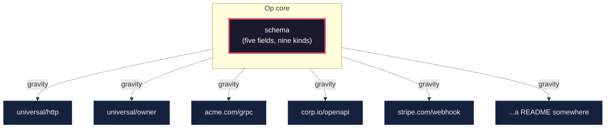
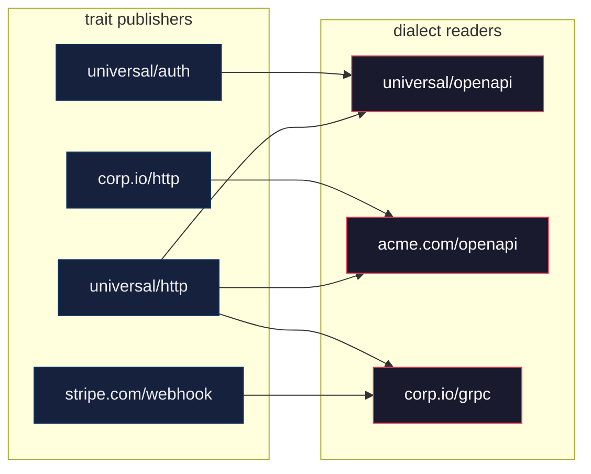

# Dobby Is Free

The cleanup of PR #16 started as hygiene. License headers. A typo in test data. A folder rename. Six hours later we had not touched a single line of code. We had discovered what `universal/` is. And what it is not.

## Why owner is a trait, not a core field

Someone new to Op might ask: why is `owner` a trait? Grouping operations into classes, modules, tags — surely that is fundamental?

No. And the answer is not preference. The answer was worked out across twenty-seven devlogs.

The core of Op is what survives convergent evolution across fourteen disciplines (#13). Five fields. Nine kinds. One Term structure (#8). Everything else is opinion. `owner` is opinion. Useful opinion — we wrote a vendor for it — but opinion.

A protocol that bakes opinions into its core stops being a protocol. It becomes a framework. OpenAPI did this with `tags`. Protobuf with `service`. gRPC with `package`. Each carries that decision as debt across every binding, forever.

Op will not. The core does not know about grouping. The core does not know about HTTP. The core does not know about auth. These are vendor concerns — publicly declared, publicly replaceable, economically driven. If a reader suggests `owner` should be a core field, they have not yet read the previous twenty-seven devlogs. The door is open. Read them.

## Tony Tam did not ask permission

Wordnik, 2010. Tony Tam wrote Swagger because his company needed to describe an API. No committee granted him a layer over HTTP. The world picked it up because it was useful.

In the world of Op, the same mechanic. Instructions exist. The world turns to the OpenAPI author and asks: *do you eat instructions?* If no, a competitor who does will eat him. That pressure is economic, not architectural. Op does not require participation. Op simply exists, and gravity forms around it.

## Op divides the world in two

Core (schema) and everything else (vendors). Op does not know its vendors. The connection is economic, not technical. Gravity, not API.

The arrows are dotted because there is no API. Op does not call vendors. Vendors do not register with Op. They orbit by economic interest. If a vendor stops being useful, the orbit decays and nobody notices.

## Dialect is semconv, not contract

A vendor's dialect is a public declaration of orientation — *"I read this URI as this"* — not a contract. Like OpenTelemetry's semconv.

`acme.com/openapi` reading `github.com/thumbrise/op/universal/http` is valid by default. No permission required. Cross-reading produces the N+M effect from #24 — network effect, not architecture.

Arrows go wherever the reader declares orientation. A vendor can read another vendor's URI without asking. A URI can be read by vendors its author never heard of. Dialect is declaration, not contract — so every intersection is free to form.

## First vendors, not a standard library

`universal/owner`, `universal/http`, `universal/auth`, `universal/openapi` are four vendors we wrote as first inhabitants. Ritchie's first compiler. Catalyst, not monopolist.

A URI is a name. A vendor may also treat it as an address pointing at their repo — that is an anthill convention, not a protocol requirement. We reserve `github.com/thumbrise/op/universal/*` for ourselves. Not as privilege. As a starting gravity well. One day `universal/` will fall out of dialect usage, displaced by better vendors. The URI will remain as a mark of first-arrival. Nobody will orient to it.

That is the success condition. Not adoption. Obsolescence.

## A vendor can be a README

The barrier to entry is a markdown file.

To add a concept to OpenAPI, you go through the TSC. To add a plugin to Protobuf, you write a code generator. To add a service to gRPC, you implement an interface. To add a vendor to Op, you write a README.

Declare your URI. Describe your traits. Publish the file. You are a vendor. The world of Op can read you.

We chose to do more — dialect documents, constants for Go and PHP, a compiler for OpenAPI. That is our convenience, not a requirement. Your vendor can be smaller. Your vendor should be smaller, if that is enough.

This is how we know Op is a protocol, not a platform. Platforms demand conformance. Protocols demand only a name and a declaration.

## Generality as vendor discipline

A vendor that enumerates every case is a standards committee in disguise. Our `universal/*` vendors publish shapes, not enumerations.

`universal/http` will not publish `http/timeout`, `http/idempotency-key`, `http/cache-control`. Something like `HttpHeaderTrait: anything` — one shape, interpretation delegated. `universal/auth` — `AuthTrait: enumtype`, not a trait per scheme. The exact set is unsettled. The principle is.

A vendor with five shapes can be surpassed. A vendor with five hundred opinions becomes infrastructure, and infrastructure does not retire. We want to retire.

## Dobby is free

Our goal is to be surpassed. When `corp.io/http` is better than ours, victory. When the OpenAPI author natively consumes op instructions and our `universal/openapi` becomes a museum piece, perfect victory.

## What this devlog establishes

- Op core = schema. Nothing else.
- Vendors are participants with economic interest, not architectural layers.
- `universal/*` is bootstrap, not a standard library.
- Dialect = public declaration of orientation, semconv-style.
- Cross-reading of dialects across vendors is valid by default.
- Our vendors publish shapes, not enumerations. Generality keeps us replaceable.
- A vendor can exist as a single README.md. The barrier to entry is a published declaration, nothing more.
- Our vendors are expected to be surpassed. Replacement is success.

Op is not a library. Op is gravity. We dropped four small stones to prove the field exists. Pick them up. Throw them better. Dobby is free.
