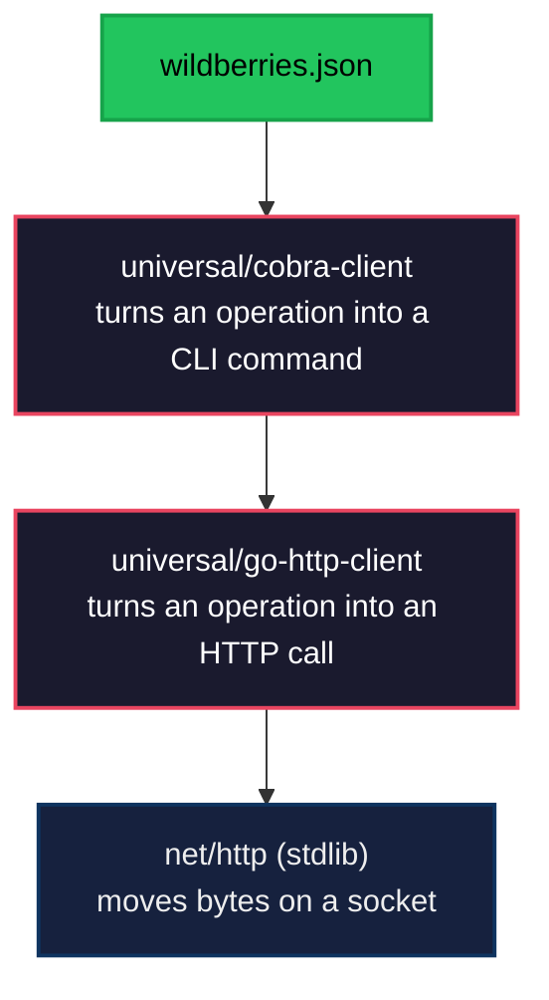
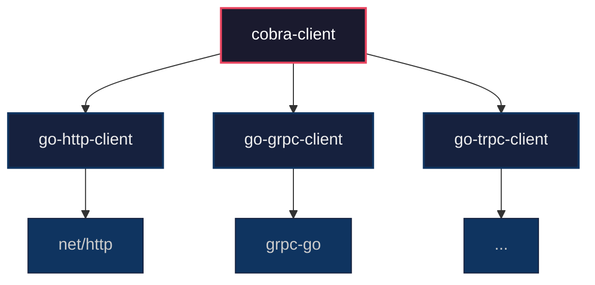
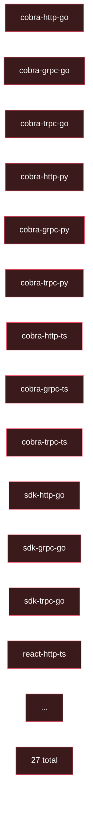
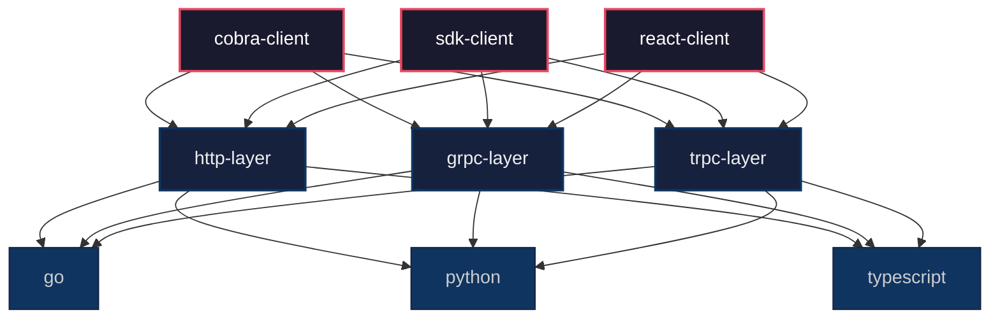
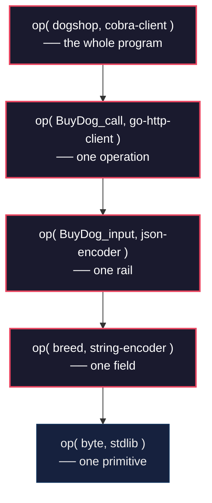

# The Hamster Leaves the Wheel

> The hamster left the wheel. The wheel was optional.

## Prologue — The client nobody wrote

One command in a terminal:

```
wildberries.json | universal/cobra-client > wbcli
```

`wbcli --help` works. `wbcli orders list --status=pending` works. Types are correct, exit codes are correct, error messages are human.

The author of Wildberries does not know this happened. Nobody at Wildberries has ever heard of Op. Nobody wrote anything *for* Wildberries. And yet `wbcli` exists, runs, ships.

You will never know whether `wildberries.json` came from an ASP.NET backend, a Go service, a Ruby on Rails monolith, or a shell script behind nginx. You do not need to know. The client does not need to know. Nothing in the pipeline above cares.

This devlog is about why that sentence is not marketing. Why it is physically, architecturally, economically inevitable. And why it ends an era of programming that has been running for thirty years without anyone questioning it.

Six inversions, one after another. Each one small. Together — the hamster leaves the wheel.

## 1. The client compiler that did not exist

Count what the world has today for producing a client from a declaration.

**gRPC stubs.** Work only inside gRPC. The client is bound to the transport at the root. Swap gRPC for HTTP — start over.

**OpenAPI Generator.** Calls itself a generator for a reason — it produces scaffolding, not a finished client. Works only for HTTP. The output needs manual fixups per language.

**Protobuf, Thrift, Cap'n Proto, Avro.** Each one a world of its own. Each one its own transport, its own schema language, its own ecosystem.

**Stripe SDK, Twilio SDK, AWS SDK.** Hand-written. Team of engineers per language. Updated manually as the backend evolves. Every vendor reinvents the same machinery.

What do all of these have in common? **The client knows the transport.** gRPC clients know gRPC. HTTP clients know HTTP. The transport is baked into the name, the types, the runtime. You cannot take a gRPC client and point it at a REST endpoint. The choice was made at the moment of compilation and cannot be undone.

This is not a flaw of any particular tool. It is a **structural constraint** nobody questioned, because the alternative was not visible. In every existing system, the declaration of the operation was glued to the declaration of the transport. `service BuyDog (BuyDogInput) returns (BuyDogOutput)` in Protobuf **means gRPC**. `POST /dogs/buy` in OpenAPI **means HTTP**. The declaration is not transport-free — the declaration *is* the transport.

Op makes a different choice at the root. An Op instruction declares the operation — its input, output, error, and any traits the author chose to attach. The traits can include `http/method: POST` and `http/path: /dogs/buy` — but those are **traits**, not the shape of the instruction. The same instruction without those traits is still a valid instruction. It just is not HTTP.

This means the **compiler of a client can read an instruction without knowing how that instruction will be transported**. The compiler looks at the traits, dispatches to whichever transport layer knows how to handle them, and produces a client whose job is to invoke the operation — by whatever means the traits describe.

The result is a thing that did not exist before: a client compiler that is not bound to a transport. Not RPC — RPC means remote procedure call, a specific mechanic. Not a transport — transports are what this thing *uses*, not what it *is*. Not a format or a serializer — those are downstream concerns. Not a generator — generators produce from templates, this thing compiles deterministically from a declaration that already fully specifies the operation.

It is a **client compiler**. The words are exact. Nothing is missing. Nothing is extra.

And until Op, nothing like it was possible to build, because nobody had a declaration of an operation that did not already include the transport.

## 2. Layers that speak through declaration

If the client compiler does not know the transport, something below it must. The transport does not disappear — it moves **down one layer**.

A compiler for a CLI client in Go is not one piece of code. It is a **composition**:



Each layer knows **exactly one axis**. `net/http` knows bytes. `go-http-client` knows how to turn a declared operation into an HTTP round trip — it reads `http/*` traits, builds the request, parses the response. `cobra-client` knows how to expose an operation as a terminal command — it reads `cli/*` traits, builds the command tree, wires flags to the input rail.

The three layers never discuss anything except the instruction. `cobra-client` does not import a `Transport` interface from `go-http-client`. It just passes the instruction down. The lower layer reads the traits that belong to it and does its job. The upper layer does not care *how*.

This is the point that took us thirty years to reach: **the instruction is the only point of contact between the layers**.

Classical layered systems speak through interfaces. Each lower layer declares a typed contract — `Transport.Send(Request) Response` — and upper layers are bound to it. Adding a new kind of lower layer means extending the interface, which ripples upward. Every serious system eventually gets a `TransportV2` and a migration plan.

Op layers speak through a declaration. The contract is the instruction itself, which already existed before any layer was written. A new transport can arrive and be plugged in without the upper layer knowing. As long as the new transport reads some trait namespace (`grpc/*`, `trpc/*`, `mqtt/*`) and does the transport's job, the upper layer stays untouched. No interface to extend. No `V2`. No migration.



The upper layer is written once. Each lower layer is written once. Any combination works. The combinations are not enumerated — they form automatically, because the instruction is what glues them together, and the instruction predates every layer.

A curious side effect of this architecture: **a transport does not have to be a network**. The lower layer can be `net/http`, or it can be `grpc-go`, or it can be `os/exec`. A hypothetical `go-exec-client` would read traits like `exec/binary` and `exec/subcommand` and dispatch to a local process. Wrap an existing CLI tool — `go --help | man-to-op | cobra-cli > gocobra` — and suddenly `gocobra` is a typed, deterministic wrapper over `go`, with `os/exec` as the transport. A curiosity, but not a contradiction. Anything that carries input to output can be the bottom layer. That is what "transport-agnostic" actually means.

## 3. L + M, not L × M

[Devlog #24](./024-the-trial.md) introduced the N+M collapse: N vendors publish traits, M compilers orient to them, intersections form without glue. That already breaks the industry's dominant topology — the N×M zoo of hand-written adapters between every format and every tool. [Devlog #30](./030-the-first-stranger.md) sharpened it to the number the industry feels in its wallet: *L × M → L + M. Not 1400 copies. One.*

Layering takes that collapse one level deeper. **Inside the compilers themselves.**

Count what you would need today to produce every useful client across a realistic matrix. Three UX shapes (CLI, typed SDK, React hooks). Three transports (HTTP, gRPC, tRPC). Three languages (Go, Python, TypeScript). A monolithic compiler per combination is **twenty-seven** compilers. Every one of them written separately, maintained separately, improved separately. When a new transport arrives — say, WebSocket — the matrix grows by nine. When a new language arrives, by another nine. The growth is multiplicative. You never catch up.

With layers it is additive. Three UX compilers. Three transports. Three languages (each language's stdlib is already the bottom). **Nine components**, not twenty-seven. Add WebSocket — one new transport. Add Rust — one new language. Combinations form automatically because the instruction is what connects the layers, and the instruction is the same across all of them.

**Monolithic compilers — L × M. Twenty-seven islands, each written by hand.**



**Layered components — L + M. Nine pieces, composed automatically by the instruction.**



> The fractal shape: L × M → L + M, applied again inside what used to be a single L.

This is what it looks like when composition works. Not interfaces with `V2` migrations. Not adapters between adapters. Just **one layer per axis**, each written once, each replaceable independently.

And once the cost of writing a layer drops that low, **economics finds it**. A worse layer loses to a better one. The loss is silent — users quietly switch, traffic shifts, forks take over. No governance body decides. No standards committee votes. The anthill selects, the way it selected MIME types, HTTP status codes, Go's module proxy. Selection pressure without coordination overhead ([devlog #29](./029-the-anthill-organizes.md)).

Today, if `universal/go-http-client` is mediocre, `corp.io/go-http-client` appears next month with retries, circuit breakers, and proper OpenTelemetry support. Consumers switch. Our version becomes a fossil. We do not mind. We wrote it to bootstrap the field, not to own it ([devlog #28](./028-dobby-is-free.md)).

**Every transport, every UX shape, every language eventually has the best possible layer for it.** Not because anyone planned it. Because the cost of participation is a few hundred lines of code, and the reward for being the best in a niche is the gravity of everyone who needs that niche.

This is not a hypothesis. It is how every successful protocol ecosystem has ever worked, once participation was cheap enough — Unix tools, HTTP middleware, npm packages, the Go ecosystem. What was missing from *client compilers specifically* was the topology that made participation cheap. Op is that topology.

So when we say "the hamster leaves the wheel" — this is the mechanism. **Layers written once. Competition per layer. Coverage by the anthill.** Not a grand plan. An inevitability, the moment L+M started applying inside compilers.

## 4. Names no longer point at targets

Read the name `react-client` outside of Op. What does it mean?

Everyone reads the same thing: *a client that connects to React*. A library for talking to a React app. The name points at its target — the thing on the other end of the wire. Every client in the current world works this way. `postgres-client` connects to Postgres. `grpc-client` connects to gRPC. `stripe-client` connects to Stripe. The name **is** the target.

Read `react-client` inside Op. It means something else entirely: *a client compiled for a React developer*. Something that produces typed hooks, state management, and a shape that feels native inside a React application. The target on the other end is nobody in particular — whoever published the instruction. Could be a Go backend. Could be ASP.NET. Could be a shell script behind nginx. The name no longer points at the target.

It points at the **recipient**.

This is a semantic inversion so total that it changes what the word "client" means. For thirty years a client has been *client-to-X*. You could not think about a client without naming what it connects to, because the name and the target were the same thing. The transport, the protocol, the shape — all bound to the target at the moment of naming.

In Op, the name describes the receiver. `cobra-client` is for a Go developer who lives in Cobra. `react-client` is for a React developer. `python-sdk-client` is for a Python developer who wants a flat typed SDK. What these clients actually talk to is determined by the instruction — **and the compiler does not need to know**.

You will never know whether `wildberries.json` is ASP.NET. You do not need to know. The React developer who calls `useListOrders()` from the compiled hook does not know. The CLI user who runs `wbcli orders list` does not know. The instruction knew enough to make the call. Nothing above the instruction ever needs to.

This is not marketing rhetoric. It is structural.

A classical client *cannot* forget its target, because the target is wired into the client's code at compile time. `grpc.Dial()` is literally inside every gRPC client. The binding is unerasable. Op clients can forget their target because the instruction — a separate artifact, written once, passed around as data — carries everything the transport layer needs. The client is a pure transformation of input to output, routed through whatever trait namespace the instruction declares.

Put that together with chapter 2. The upper layer is named after the recipient. The lower layer is named after the transport. The instruction is the contract between them. **Nothing in the compiler stack ever says the word "Wildberries."** Nothing ever will. That word lives in the URI of an instruction someone published, and that is the only place it belongs.

There is a thought experiment in linguistics called Sapir–Whorf: language shapes what thought is possible. You cannot reason about a concept you do not have a word for. For thirty years the word "client" meant *client-to-target*, and so the thought *client for a recipient* was literally unavailable. Not forbidden, not difficult — **unavailable**, the same way "blue" is unavailable in a culture with no word for it. The moment a name exists for the new thing, the thing becomes thinkable. The moment it becomes thinkable, it becomes buildable.

That is what happened in this PR when we stopped saying "gin client" and started saying "cobra-client." The language shifted. The thought followed.

## 5. The operation is the model. We were modelling the wrong thing.

Model-driven development was right for twenty years. It just modelled the wrong thing.

The promise of MDD was always the same: declare the system, generate the implementation. The code is a projection, the model is the source of truth. Write the model once, get bindings, documentation, migrations, validation — all at the same time. Change the model, everything downstream updates.

This was tried. UML, BPMN, Executable UML, Eclipse Modeling Framework, MPS, Rational Rose. Billion-dollar tools, decades of serious engineering. It did not take. Real teams kept writing the code by hand and treating the models as diagrams for meetings.

Why? **Because what everyone called "the model" was the wrong thing.**

An MDD model, in every serious attempt, has been the *internal structure* of the system. Classes. Tables. Entities. Inheritance hierarchies. ER diagrams. Aggregates. The inside of the machine. And the compiler's job, in that picture, is to translate the internal structure into boilerplate — getters and setters, CRUD scaffolds, database bindings, service interfaces.

This does not work, because the internal structure **is not the model of anything**. It is an implementation detail. Nobody outside your program ever sees your classes. Nobody connects to your database. Nobody cares how you structured your aggregates. The outside world sees exactly one thing about your program: **what it can do**. The operations it exposes. The contract.

**The model of a program, for the world, is its operations.** Everything else is private knowledge.

Read that again. The model of a program, for the world, is its operations. A Stripe customer does not need to know Stripe's database schema — they need to know that `POST /charges` exists and what shape it takes. A `git` user does not need to know how the object store works — they need to know `git commit` exists and what it does. A browser does not need to know how a web server dispatches requests — it needs to know the URL, the method, the headers, the body shape.

The operations are what the program *is*, from the point of view of anything that is not the program. The internals are not a model. They are the **implementation of the model**.

And so every MDD attempt of the last twenty years modelled the wrong side of the boundary. It modelled the inside of the program and generated boilerplate for the inside. It never modelled the contract, because the contract was assumed to be "just an API" — something you write after the model is done, not something that is itself the model.

Op inverts this. An Op instruction *is* the model. Not a document describing the model, not a schema derived from the model — the model itself. Five fields, nine kinds, input/output/error/trait rails. That is what the program is, for the world.

Everything inside — database, algorithms, caching, state, concurrency, whatever the program actually does to produce the declared outputs — is implementation. Private. Not modelled. Not your problem to declare. The instruction says *what* the program does. How it does it is the programmer's freedom.

This is why MDD finally works, in Op. We are not modelling classes and generating boilerplate. We are modelling **operations** and compiling clients, servers, documentation, and bindings — all of which are legitimately downstream of the operation contract, because they are the ways the operation meets the world.

The moment you understand this, the order of work inverts. You do not build a program and then write its API documentation. You write the operations first — because they *are* the program, from the outside — and the implementation follows as a matter of choosing how to satisfy them.

### The LLM finally has something to hand you

There is a second reason MDD never took off that is only visible now. **The model was too expensive to produce.** Writing UML by hand is brutal. Editing an ER diagram takes as long as writing the code. Tools promised help and mostly delivered friction. The economic gradient pointed back at code, every single time.

That changed in the last two years, and the industry has mostly noticed the wrong half of the change.

Large language models are extraordinary at generating structured data against a known schema. Give a model a JSON schema and a few paragraphs of intent, and you get back a valid artifact — valid not in the loose sense, but provably valid, because you run the schema validator and either it passes or it does not. The model may still be wrong about *meaning* — it might invent an operation you did not ask for, miss a field you needed, pick bad names — but it cannot be wrong about *form*. That failure mode has been engineered away by schemas.

Meanwhile, the industry pointed this capability at code. "Vibe-coding." The LLM writes a function, you run it, it works or it does not. If it does not, you ask again. If it does, you move on. The problem is that code is the **worst** possible artifact to iterate on with an LLM, because mistakes in code are cheap to make and expensive to catch. An off-by-one in a loop, a wrong cache key, a race condition — these survive review, pass tests, and ship. By the time you notice, the code is a month old and the context is gone.

Op changes the point of contact. The LLM does not generate code. The LLM generates **the instruction** — a JSON artifact against a known, tiny schema (five fields, nine kinds). Errors in that artifact live in the declaration. They are visible to the eye. You read an operation list and see, in thirty seconds, that `CancelOrder` has no input and that is probably wrong. You fix it in the JSON. You recompile. The implementation follows.

Errors on the declaration layer are **cheap**. Errors on the implementation layer are **expensive**. The LLM is now pointed at the cheap layer. This is not an incremental improvement in productivity. It is a different category of activity.

A concrete picture of the workflow:

1. You describe what the program does in prose to the LLM.
2. The LLM produces an instruction — operations, rails, traits, ready to validate.
3. You read it. Maybe visualize it: pipe it through a diagram compiler — `dogshop.json | op-mermaid` — and see the entire shape of the system on one page. Any compiler that projects the instruction into a visible form is enough. The LLM can read this projection back on the next turn.
4. You adjust: add an operation, remove a field, rename a term, change a trait. A minute of work.
5. When the instruction is right, you compile. Server in Gin, CLI in Cobra, typed SDK in Go, React hooks, OpenAPI document — whichever axes you asked for.
6. The only thing left to write by hand is the actual algorithm inside each operation. The business logic. The knowledge of the world.

This is **deep design before project initialization**. A thing that was structurally impossible before, because there was no artifact in which the whole program could live other than the code itself, and the LLM was bad at producing whole-program code that stayed coherent. Now the whole program lives in the instruction, and the LLM is excellent at producing the instruction, and the instruction is cheap to correct by eye.

Two years of industry energy has been spent trying to get LLMs to write code well. That was the wrong question. The right question was: **what artifact should the LLM produce, so that humans can verify it by reading and machines can compile it without loss?** Op answers that question by existing. The instruction is that artifact.

This is not vibe-coding. It is **vibe-designing**. The vibe is in the design, where mistakes are cheap and visible. The code is produced by a deterministic compiler that cannot invent, cannot hallucinate, cannot drift. You get the best of both worlds: the speed of LLM-driven design, the rigor of machine-compiled implementation. Neither half has been available before, because the artifact that connects them did not exist.

## 6. The shape repeats. Op at every layer.

Everything in the previous five chapters is one property, projected six times.

The property is this:

```
fn op(instruction, component) → output
```

One function. It takes a declared operation and a component that handles some part of it. The component reads whatever traits belong to its axis, does its job, delegates the rest downward. At every level of depth, the same shape.

A compiler of a CLI for `dogshop.json` is `op(dogshop, cobra-client)`. Inside it, the handler for one command is `op(BuyDog_call, go-http-client)`. Inside that, the step that serializes the request body is `op(BuyDog_input, json-encoder)`. Inside that, the step that encodes a single field is `op(breed, string-encoder)`.



**The same shape from the whole program down to one field.** This is dynamic programming applied to architecture. One recurrence relation. Any depth. Any combination. The combinatorial explosion — L languages × M transports × K UX shapes × J field types — collapses, because at every level the same two things meet: an instruction and a component that knows its axis.

### This is also lambda calculus, projected onto the real world

The form is not invented here. [Alonzo Church](https://en.wikipedia.org/wiki/Alonzo_Church) wrote it down in 1936. Lambda calculus has exactly three constructions: a **variable** (a name standing for something), an **abstraction** (a parameterized body, `λx.t`), and an **application** (one lambda expression applied to another, `(t s)`). That is the whole language of computation, and every programming language is a skin over it.

Map it onto Op and the correspondence is embarrassingly direct. A `Term` with an `id` and a `kind` is a **variable** — a name, a leaf. An `Operation` with its four rails is an **abstraction** — a parameterized body whose parameters are the input rail. And `fn op(instruction, component)` **is application**: a lambda expression (the instruction) applied to another (the component that reduces it). Every compiler in this devlog performs β-reduction in slow motion, across processes, across machines, across languages.

This is why Op is platform-agnostic by default, not by design. Lambda calculus predates every platform humans have ever built — it predates transistors. Anything capable of storing names, binding them to bodies, and applying one to another can host lambda, and therefore host Op. The polyplatform property is not engineered into the protocol. It is inherited from an abstraction that is ninety years old and runs on paper.

This observation deserves its own devlog, eventually. For now it is enough to note it in passing, so a future reader can see that we saw it. Op is applied lambda calculus. That is the whole secret, and it is not a secret.

### This is the Unix pipe, written in depth

In 1964 Doug McIlroy wrote the sentence that became Unix:

> We should have some ways of connecting programs like garden hose — screw in another segment when it becomes necessary to massage data in another way.

The pipe is exactly the shape Op uses: one contract between stages, each stage unaware of its neighbours. `cat | grep | sort | head` works because the text stream is a sufficient protocol between any two programs. Compose freely, depth unlimited.

But the Unix pipe is **flat**. Programs stand in a row. There is no "inside this stage, another pipeline runs." Subshells exist as a hack; they are not the structure. The pipe lived on the outside of programs, not inside them.

Op is the same idea, **turned ninety degrees**. The contract between stages is not a text stream, it is an instruction — structured, typed, declarative. And the composition is not linear, it is a tree. Inside any component, the same `fn op` runs again, with a sub-instruction and a sub-component, until you hit a leaf (a field, a byte, a primitive). The pipe went into depth.

### Monoliths and microservices were the same thing all along

Notice what `fn op(instruction, component) → output` does **not** say. It does not say "network." It does not say "transport." It does not say "remote." It does not say "in-process." None of those words are in the function. The function is a contract between an instruction and a component. Where the component runs is a detail of the lower layer, chosen at compilation time.

That means a call across a network and a call across a function boundary are **the same operation, compiled with different bottom layers**. The upper layers cannot tell the difference, because there is no difference visible to them.

For thirty years the industry treated monoliths and microservices as opposite worlds. The monolith had types and function calls; the microservice had JSON and retries. You chose one architecture and lived inside its rules. Migrating between them was so expensive that teams would rather rewrite from scratch. This dichotomy felt fundamental — but it was an artefact of having no shared contract for "an operation," only two incompatible ways to express one.

Once the contract is the instruction itself, the dichotomy dissolves. A program is a composition of operations. Each operation runs somewhere: in the same process, in another process on the same machine, on another machine over the network. The programmer's code does not know which. The answer is in the bottom layer, and the bottom layer is a component like any other — swappable, replaceable, chosen per operation.

There is a common reassurance in distributed-systems folklore: *the network is an adversarial environment, defend yourself accordingly.* True. Incomplete. **Your own computer is also an adversarial environment.** The OOM killer takes processes. Disks flip bits. Caches go stale. Libraries in neighbouring threads corrupt shared state. GC pauses eat half-seconds. We have just learned to ignore these failures because the language and the runtime mask them. Op makes the failure mode explicit everywhere — every operation has an error rail, wherever it runs — so the same discipline applies on both sides of the process boundary.

Out-of-process dependencies are called that because they **forgot the pipe**. They forgot that a call can be a call — across any medium, with one contract — instead of becoming a whole new discipline the moment it leaves the process. Op remembers. A Go program can call a JavaScript validation library through a Node subprocess, an embedded V8, or a WASM module, and the Go code is identical in all three cases: it invokes an operation. A Rust component can talk to a Python component through sockets or shared memory or HTTP, and neither side cares which. The choice moved down one layer, where it belongs.

This is what "interoperability" actually means, once it is taken seriously. Not bridges. Not adapters. Not "language X now has a client library for service Y." A **shared language for operations**, across every language, every runtime, every transport, every process boundary. The same instruction is understood by a Go compiler, a Python compiler, a React compiler, a CLI compiler, a subprocess compiler. All of them can sit in one composition. The program stops knowing where it is running.

### Endpoints belong to infrastructure, not userland

The symmetry cuts the other way too. While the consumer does not know where the host runs, the host **always knows itself** — and declares it. Location is a trait on the instruction's transport axis: `http/url`, `cli/path`, `grpc/endpoint`, `ipc/socket`. Whatever axis the transport lives on has a place for the address on that axis. The declaration is self-contained.

But the location trait is **symbolic**, not a hardwired URL. It names the host. Resolving the name into a concrete endpoint — one of six instances, the closest region, the current canary split, the node that passed its health check — is the job of the infrastructure layer that sits beneath the transport component. DNS, service mesh, load balancer, service discovery — these existed before Op, and they exist after. Op does not touch them. Op stops *userland* from touching them.

For decades, application code has been leaking infrastructure concerns upward. Config files with hardcoded endpoints. Environment variables like `STRIPE_URL` and `POSTGRES_HOST`. Retry loops that reach across three replicas of the same service. Region-aware routing in business logic. Feature-flag gates that pick between endpoints. All of this is load-balancing, failover, and deployment knowledge that **does not belong in userland**. It is plumbing that escaped its layer.

The application does not have six doors. If the service scaled out to six instances, that is one application reached through one name, not six applications an operator has to enumerate. The fan-out is the balancer's problem. The resolver's problem. The mesh's problem. Never the caller's. A caller that knows about six endpoints is a caller that has been dragged down into somebody else's stack.

A note on what this is and is not. Op does not forbid any of this. The protocol is a protocol, not a policy — if a vendor declares `http/url` as a literal endpoint, or if userland reaches into a resolver directly, it will work, because Op rules nothing out. What this section describes is a **prediction**, not a constraint. Once the instruction can carry a symbolic name and a lower layer can resolve it, the economic gradient points at keeping resolution downstairs. Over time the industry will drift there, the way it drifted away from static linking once dynamic loaders became cheap. Op does not legislate the drift. Op enables it.

This matters, because a common fear around a new abstraction is that it erases the disciplines below it. It does not. Balancers still balance. Meshes still route. Health checks still check. **Infrastructure engineering does not vanish — it stops being copied into every application.**

### Libraries become components, not frameworks

Thirty years of software trended toward **frameworks** — Rails, Spring, Django, Express, Next.js. Each one a large umbrella under which every decision has already been made jointly. A framework's plugins belong to the framework; its middleware belongs to the framework; its conventions pervade the code to the last file. Migration between frameworks is more expensive than rewriting from scratch.

This happened because micro-composition needs a **single contract between components**. Unix had it (the text stream), and produced `grep`, `awk`, `sort`, `cut` — each by a different author, each a master of one axis. Mainstream application software never had it, so it produced frameworks instead — internal economies where everything is in-house because nothing speaks the same language as anything else.

The instruction is that missing contract, for application software. Once it exists, a library stops being a library. It becomes an **Op component**. One component does one thing, on one axis: `op-validate-email` reads `validate/email` wherever it appears. `op-retry-backoff` reads `retry/*` and wraps whatever is below it. `op-cache-redis` reads `cache/*` and sits between an expensive call and its callers. `op-rate-limit` reads `ratelimit/*` per operation.

Each component is **small enough to be written by one person in one evening** and **useful everywhere** the instruction mentions its axis. No framework to live inside. No plugin API to conform to. The instruction is the plugin API, and it was written before the component existed. The anthill can assemble tools of arbitrary sophistication from tens of such components, each written by a different author, each a specialist in one axis. That is how `grep | sort | uniq` worked fifty years ago. That is how real programs work now, everywhere the instruction goes.

The only discipline this requires is **acyclic layering**. A lower-layer component must not call an upper-layer one — no `go-http-client` reaching back into `cobra-client`, ever. Flow downward, never back. This is the same rule that keeps Unix pipes from deadlocking. It is the only rule. Everything else — which components exist, what they read, who composes whom — is up to the anthill.

Op is not a new idea. Op is **McIlroy's idea applied to structured operations instead of text streams, and allowed to compose in depth instead of only in width.** The industry spent fifty years around the Unix principle without extending it past width, because the ingredient was missing: a contract strong enough to survive nesting. Text streams are not that. Declarations are.

### Why this closes every earlier chapter

- Chapter 1. A transport-agnostic client compiler is just `fn op` applied one level up from the transport. The compiler does not know its transport neighbour because the function does not need to.
- Chapter 2. Layers through declaration is the pipe shape itself.
- Chapter 3. L + M fractal is what happens when the same `fn op` lives at every axis — each axis gets one component, and combinations form by composition, not enumeration.
- Chapter 4. Names point at recipients because the upper component is named after *what it produces*, and `fn op` does not care who stands below.
- Chapter 5. The operation as model means the contract between layers is the operation itself — the exact ingredient McIlroy was missing.

Six inversions. One shape. Repeating.

That is the whole protocol.

## 7. Programmers return to programming

Open any modern codebase. Measure, honestly, what fraction of the code is the actual work of the program — the algorithm, the logic, the knowledge of the world the program embodies.

In a typical microservice, it is between five and ten percent. The rest is plumbing.

Route declarations. JSON marshalling. Header parsing. Authentication middleware. Retry loops for 429 and 502. Pagination cursors. Validation that `email` looks like an email. OpenAPI annotations on every handler. CRUD endpoints that have been written a million times in a million repositories. Migrations. Seed data. Mock servers for the frontend. Contract tests between frontend and backend types that drift constantly. SDK wrappers published per language, maintained by hand, always a version behind.

This is not programming. This is **intercontinental network assembly language**. The hand-written glue that holds an industry of distributed systems together, one bespoke fitting at a time. Nobody outside the profession realises how much of a working day goes into it. Nobody inside the profession has a word for it that captures the scale, because the scale is the background. It is just what work is.

But it is not programming. It is not what the word meant in 1970, when a programmer sat down with a problem and wrote an algorithm. Today a programmer sits down with a ticket and writes a wrapper around a wrapper around a JSON endpoint. Somewhere at the bottom, a function actually does something interesting — three lines of business logic, wrapped in a hundred lines of plumbing.

That plumbing is exactly what `fn op` collapses. Every wrapper is a component reading traits from its axis and delegating downward. Every serialization step is a compiler applied at one layer of the tree. Every client SDK is a single compilation, not a new artefact per language per vendor per transport.

**All of it is mechanical.** All of it is produced from the instruction by compilers that already exist, or by compilers that the anthill will produce the moment enough people need them. Nothing stops this from happening except the historical accident that the declaration did not exist until now.

Once the plumbing is compiled, what is left for the programmer?

- **Algorithms.** Real ones. Data structures, numerical methods, optimisation, state machines that actually track something non-trivial. The work the profession was founded on.
- **Business logic.** Why a dog can only be sold to buyers with verified registration. Why an order cannot be cancelled after shipment. Why the price rises on Fridays. This is **knowledge of the world**, and no declaration can capture it. It must be written, thought about, reviewed, kept honest. This is where the profession actually earns its keep.
- **High-level architecture.** Which operations exist at all. Which traits they carry. How the system decomposes across services. What belongs inside one instruction, what deserves its own. This is design, and it is still a human craft — only now it happens at the right level of abstraction, because the instruction is the model, and the programmer can hold the whole program on one page.
- **Experience.** UX, UI, the shape of interaction. No compiler tells you that a destructive action deserves a confirm dialog. That is taste. That is human judgement.

Everything else is compilation.

This is not a prediction. This is what happens the moment a project adopts Op: the plumbing disappears into compilers, and what remains is the four things above. Measured in lines of code, a project that used to be ten thousand lines becomes one thousand — and the thousand that remains is the thousand that was the actual program all along. The other nine thousand were a toll paid to the topology.

And none of this makes the low-level craft obsolete. Programmers have always been stratified by **layer of the stack**, not by skill. Infrastructure engineers build balancers, meshes, resolvers, kernels, runtimes, compilers. Application engineers build the things users see. Both jobs are legitimate. Both require deep expertise. The accident of the last thirty years was that application engineers had to do infrastructure work too — hand-written retries, hand-written endpoint selection, hand-written contract translation between services — because no layer existed to absorb it. That accident is what ends here. Infrastructure engineers keep building infrastructure, now cleaner, because the application layer stops reinventing pieces of their domain. Application engineers keep building applications, now smaller, because the pieces that were not theirs are gone.

**Nobody loses a profession. The profession stops spinning the same wheel in opposite directions.**

There is a parable in software history about the PDP-11 programmer. He had a problem, a machine, and an assembler. He thought about the algorithm. The register allocation, the call conventions, the stack frames — the compiler took those. His job was the idea. When higher-level languages came, the same arc repeated: pointer arithmetic disappeared, memory management disappeared, the programmer kept moving closer to the problem.

Op is the next step in that arc, and it has been missing for thirty years. The distributed-systems era arrived without its compiler. We wrote its plumbing by hand, one pipe at a time, while every other layer in the stack had compilers for a generation. We did not notice the gap because nobody had named it. Op names it. Op fills it.

If this sounds like fantasy, look at the stack you already have. No modern programmer writes `read` and `write` from scratch — they come free with the language. No modern programmer implements `malloc` — it comes free with the runtime. No modern programmer writes a hash table, a sort function, a regex engine, a TCP handshake, a JSON parser, a UTF-8 decoder. Every one of these used to be hand-written, once, by someone on every project. They all moved down into compilers and standard libraries, and nobody went back. Every decade or two the line advances. What was a craft becomes a primitive. What was a primitive becomes invisible.

What is a primitive? A foundation solid enough to build a floor on. That is the definition engineering cares about. In the real world, when a new floor is added to a tower, it is added to a foundation that already holds weight. If the foundation fails, the whole tower falls. So the foundation is poured first, inspected first, overbuilt on purpose. That is what a primitive is, in software too: the layer beneath is load-bearing, and the layer above can forget it.

The modern web has no load-bearing layer for operations. There is HTTP, but HTTP is for bytes. There is JSON, but JSON is for data. There is OpenAPI, but OpenAPI describes without compiling. Every team builds its own foundation from scratch — serialization, validation, retries, client SDKs — and calls it a day when the grass grows over it. The current web is not a tower on bedrock. It is **floors built straight in the vegetable garden.** And most of the industry's engineering effort goes into earthquake-proofing these floors, when the real problem is that they have no foundation under them at all. In real engineering, quake-resistance is a property of buildings on bedrock. In software, we added the quake-resistance and forgot the bedrock. **This has happened, reliably, at every layer, for fifty years.** Op is the same move, applied to the layer distributed systems forgot.

**Programmers do not become obsolete. Programmers return to the work that was always theirs.** The compiler finally takes the plumbing. The programmer takes the problem. That was the deal in 1970. The deal is back on.

## Epilogue — The wheel was optional

The prologue opened with one line:

```
wildberries.json | universal/cobra-client > wbcli
```

Everything in this devlog is what that line costs to say honestly. A client compiler that did not exist. Layers speaking through declaration. L + M inside the compilers themselves. Names that point at recipients instead of targets. The operation as the model the whole of MDD was reaching for. One shape repeating at every layer. A profession returning to its problem.

None of this is new in the sense of requiring a breakthrough. Each piece has been sitting in the industry's hands for decades. McIlroy wrote the contract principle in 1964. MDD wrote the model-first ambition in the 1990s. Unix wrote the composition-without-glue topology in the 1970s. LLMs wrote the cheap declaration generator two years ago. Op does not invent any of these. Op is what happens when they finally meet — when the declaration is small enough to write, rich enough to carry meaning, transport-free enough to not glue the neighbours, and generic enough to repeat at every layer.

The hamster has been running in a wheel for thirty years. Writing the same JSON marshaller a hundred times. The same CRUD endpoint a thousand times. The same SDK a million times. Nobody said the wheel was wrong, because there was no visible alternative. The wheel was just what programming was.

The wheel was optional. It was the shape of the industry before the declaration had a home. Now the declaration has a home — five fields, nine kinds, any number of traits, published wherever a `README.md` can sit. And the moment the declaration has a home, every layer above it becomes a compiler, and every compiler is a component that reads one axis and delegates the rest downward, and the composition is not planned, it forms.

That is the whole story. The client compiler that did not exist now exists. The industry's load-bearing handwritten plumbing becomes compilation. The programmer goes back to the algorithm.

Dobby is free. The anthill has begun. The hamster left the wheel.

```
wildberries.json | universal/cobra-client > wbcli
```

One line. Thirty years to say it. Here we are.


