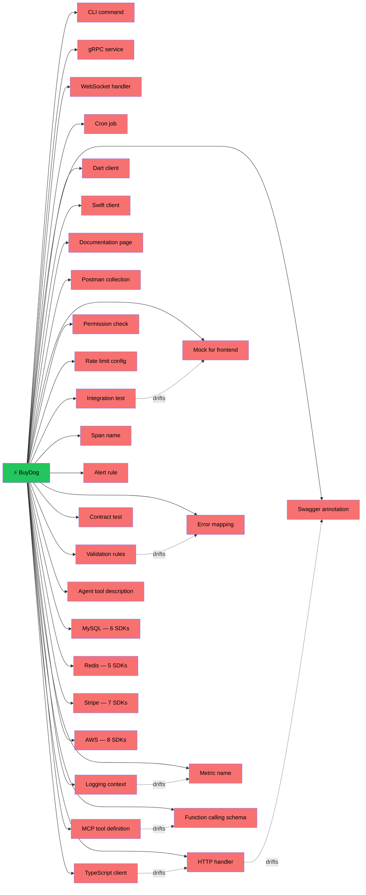
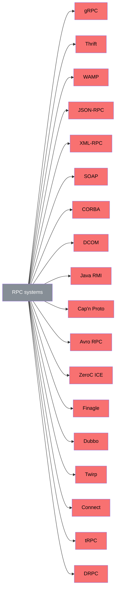
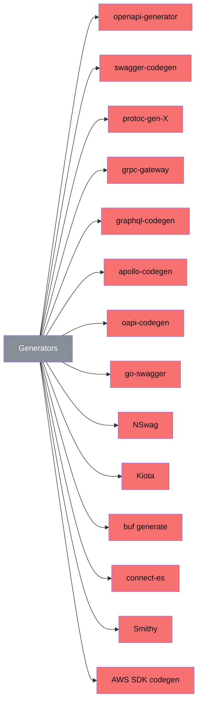
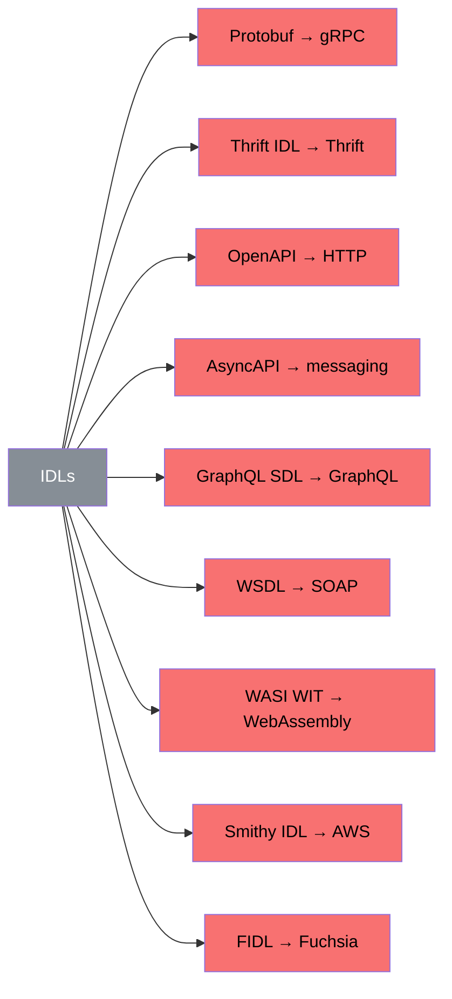
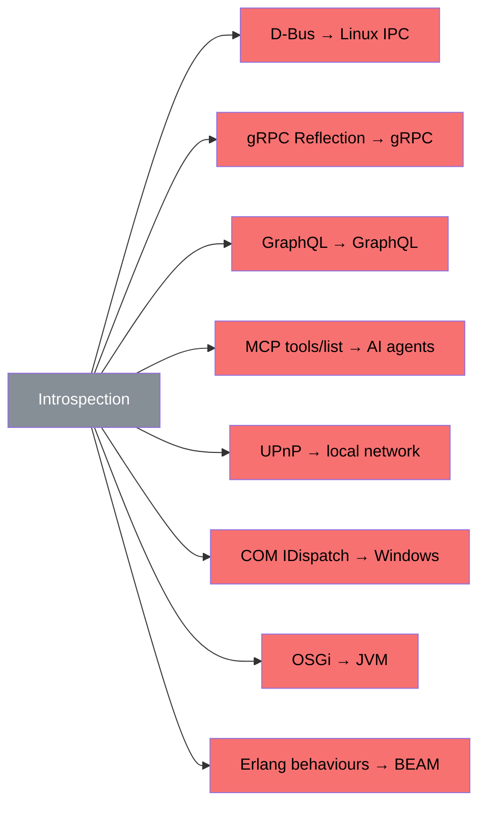
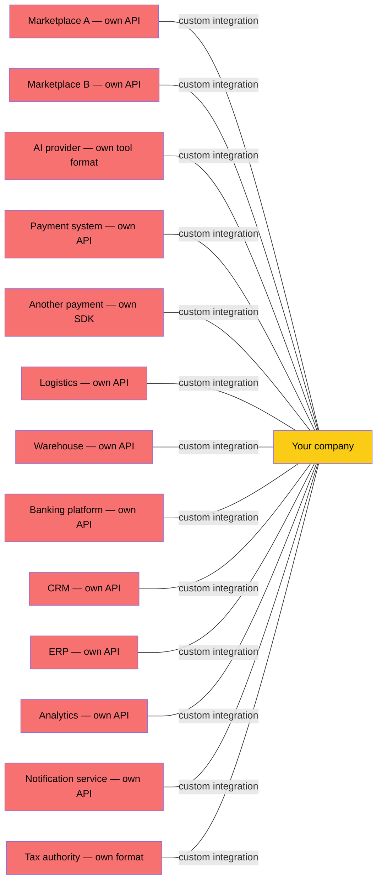
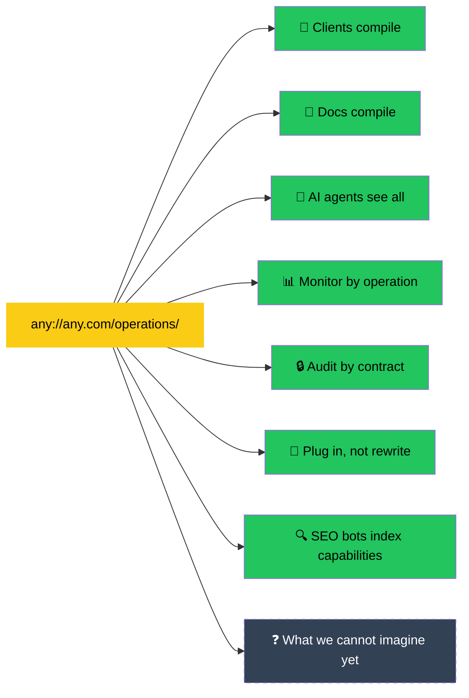

## The Problems

### The Same Thing, Written Many Times

Language does not matter — OCaml, Haskell, Go, PHP, Rust — the moment an operation touches the outside world, the same five fields are written again. A route. A schema. A client. A doc page. A CLI flag. A mock. A test. A metric. An MCP tool. An SDK per language. By hand. The copies drift. One changes — the others quietly lie. The drift surfaces in production.

This is not a tooling problem. This is the absence of a shared source of truth for what code can do.

### The Same Wheel, Re-shaped Many Times

Forty-nine systems. Four layers. Each one independently arrives at the same five fields — a name, an input, an output, and the possibility of failure — and carries them along with one transport, one language, one vendor, or one opinion on how granular each operation must be.

Eighteen RPC systems. Fourteen generators. Nine IDLs. Eight introspection mechanisms. And this is only what fit on the diagram. Each one approaches the same form. None of them names the form on its own — because the form on its own had not been a target.

### The Cost of a Missing Standard

Each partner publishes its own API. Each integration is written by hand. Each new partner takes months. Each API change ripples through the integrations downstream.

Marketplaces watch sellers drop off when the integration cost is too high. AI providers like Anthropic carry MCP tool adoption forward one tool at a time. Payment systems maintain SDK libraries in six languages — six codebases, six teams. Banks rebuild integrations with every new fintech partner.

The cost is not technical. It is economic. The cost is paid — in time, in people, in opportunities — for the work that a shared primitive would not require.

### Why the Form Stayed Hidden

The people who built gRPC, OpenAPI, GraphQL, MCP are brilliant. The form has been older than any of them, and harder to see than it is to use.

In 1989, the Web arrived with three primitives at once: URI, HTTP, HTML. Addresses, transport, presentation — all delivered together. The bundle was so useful and so fast that the model underneath it became part of the background, not part of the question.

Functions had five fields since Fortran in 1957. Syscalls had five fields since Unix in 1971. Every programming language, every CPU instruction set, every network protocol arrived at the same structure independently. The operation was already there — formalized, proven, universal. But after 1989 the line of sight from the model went through HTTP, and through HTML, and the model on its own stopped being a frequent target of inquiry.

Every framework, every RPC system, every generator since 1989 has rediscovered the same five fields. Not because engineers missed something. Because thinking starts with the transport and the presentation when those are the first things you reach for. The model lives underneath. It takes longer to come up.

## The Solution

```mermaid
graph LR
    subgraph "N emitters — describe once"
        E1[Go DSL]
        E2[PHP attributes]
        E3[TS decorators]
        E4[Rust macro]
        E5[Python decorator]
        E6[Handwritten JSON]
        E7[Scraped from existing code]
    end

    I[/"⚡ Op Instruction"/]

    subgraph "Frameworks — stop writing wrappers"
        R1[Laravel]
        R2[Express]
        R3[Spring]
        R4[Django]
        R5[Gin]
        R6[Fastify]
    end

    subgraph "Specs — stop maintaining by hand"
        S1[OpenAPI]
        S2[AsyncAPI]
        S3[GraphQL schema]
        S4[Postman collection]
        S5[WSDL]
    end

    subgraph "AI — stop registering tools one by one"
        A1[MCP tools]
        A2[Function calling]
        A3[Agent frameworks]
    end

    subgraph "Clients — stop writing SDKs in 6 languages"
        C1[TypeScript client]
        C2[Swift client]
        C3[Dart client]
        C4[Python client]
        C5[Go client]
        C6[Rust client]
    end

    subgraph "Infra — stop maintaining connectors"
        IF1["ClickHouse — 1 instruction, not 6 connectors"]
        IF2["MySQL — 1 instruction, not 6 connectors"]
        IF3["Redis — 1 instruction, not 5 connectors"]
        IF4["Stripe — 1 instruction, not 7 SDKs"]
        IF5["AWS — 1 instruction, not 8 SDKs"]
    end

    subgraph "Ecosystem — compiled, not written"
        EC1[Docs portal]
        EC2[IDE autocomplete]
        EC3[Security scanner]
        EC4[Monitoring dashboard]
        EC5[Saga orchestrator]
        EC6[Load balancer config]
        EC7[Contract tests]
    end

    E1 --> I
    E2 --> I
    E3 --> I
    E4 --> I
    E5 --> I
    E6 --> I
    E7 --> I
    I --> R1
    I --> R2
    I --> R3
    I --> R4
    I --> R5
    I --> R6
    I --> S1
    I --> S2
    I --> S3
    I --> S4
    I --> S5
    I --> A1
    I --> A2
    I --> A3
    I --> C1
    I --> C2
    I --> C3
    I --> C4
    I --> C5
    I --> C6
    I --> IF1
    I --> IF2
    I --> IF3
    I --> IF4
    I --> IF5
    I --> EC1
    I --> EC2
    I --> EC3
    I --> EC4
    I --> EC5
    I --> EC6
    I --> EC7

    style I fill:#facc15,color:#000,stroke:#facc15
    style E1 fill:#334155,color:#fff
    style E2 fill:#334155,color:#fff
    style E3 fill:#334155,color:#fff
    style E4 fill:#334155,color:#fff
    style E5 fill:#334155,color:#fff
    style E6 fill:#334155,color:#fff
    style E7 fill:#334155,color:#fff
    style R1 fill:#22c55e,color:#000
    style R2 fill:#22c55e,color:#000
    style R3 fill:#22c55e,color:#000
    style R4 fill:#22c55e,color:#000
    style R5 fill:#22c55e,color:#000
    style R6 fill:#22c55e,color:#000
    style S1 fill:#22c55e,color:#000
    style S2 fill:#22c55e,color:#000
    style S3 fill:#22c55e,color:#000
    style S4 fill:#22c55e,color:#000
    style S5 fill:#22c55e,color:#000
    style A1 fill:#22c55e,color:#000
    style A2 fill:#22c55e,color:#000
    style A3 fill:#22c55e,color:#000
    style C1 fill:#22c55e,color:#000
    style C2 fill:#22c55e,color:#000
    style C3 fill:#22c55e,color:#000
    style C4 fill:#22c55e,color:#000
    style C5 fill:#22c55e,color:#000
    style C6 fill:#22c55e,color:#000
    style IF1 fill:#22c55e,color:#000
    style IF2 fill:#22c55e,color:#000
    style IF3 fill:#22c55e,color:#000
    style IF4 fill:#22c55e,color:#000
    style IF5 fill:#22c55e,color:#000
    style EC1 fill:#22c55e,color:#000
    style EC2 fill:#22c55e,color:#000
    style EC3 fill:#22c55e,color:#000
    style EC4 fill:#22c55e,color:#000
    style EC5 fill:#22c55e,color:#000
    style EC6 fill:#22c55e,color:#000
    style EC7 fill:#22c55e,color:#000
```

**N + M instead of N × M.** One instruction format in the middle. New emitter — all receivers for free. New receiver — all emitters for free. The economics of LLVM applied to operations.

Write the operation once. The rest is compiled. Not generated — compiled. With contracts. With guarantees. Like `gcc`, not like Mustache.

## What This Unlocks

Every service describes itself. `any://any.com/operations/` — and in the response, everything it can do. A worldwide D-Bus. Not on one machine. On the entire internet.

- **Typed clients** in any language compile from the instruction. `BuyDogInput`, `BuyDogOutput`, `BuyDogError = DogNotFound | BudgetExceeded`. Exhaustive error matching. Autocomplete. Not written by hand. Not generated from shadows. Compiled from the source of truth.
- **Documentation** cannot go stale. It is compiled from the same instruction that the code uses. Change the operation — the docs change. Not because someone remembered. Because it is the same object.
- **AI agents** see every operation of every service. MCP tools, function calling, agent frameworks — all compiled from instructions. One `op-receiver-mcp` — and every operation in the ecosystem becomes an AI tool. Anthropic gets thousands of tools without evangelizing one by one.
- **Monitoring** speaks business language. Span names are `BuyDog`, not `POST /api/v2/dogs`. Alerts know the dependency graph from the contract. Before the first request.
- **Security** audits the contract, not the code. Operation `DeleteUser` has `auth: admin` but the receiver skips the check? Found before deployment. By a machine. From the instruction.
- **Integrations** between companies become plug-and-play. New marketplace? Plug in the receiver. New payment provider? Plug in the receiver. No months of custom development. No SDK in six languages. One instruction. Every projection.
- **Discovery** shifts from content to capability. Today search engines index what you say. Tomorrow they index what you can do. `/operations` is a sitemap for capabilities. Forgery is impossible: every client call verifies the contract.
- **What we cannot imagine yet.** Like Mendeleev's periodic table, Op does not need to know what will fill the empty cells. It only needs to guarantee that the structure is correct. The cells are waiting. See: [predicted elements](https://en.wikipedia.org/wiki/Mendeleev%27s_predicted_elements).

**The developer never sees Op.** Like you never see TCP when you open Gmail. The protocol is invisible. Vendors compile from instructions — their reputation depends on the quality. The developer writes business logic. Everything else is compiled.

## The Schema

Five fields. Three atoms. One JSON Schema.

[**instruction.v1.json →**](/schema/instruction.v1.json)

## Forget everything above

This was the bait. Lists. Diagrams. Forty-nine systems. Seven unlocks.
All of it true. None of it the point.

Op is not an optimization. Op is a form. Found through long subtractions.
Each subtraction made it more applicable. What remained was five fields.

The goal is not to remove boilerplate. The goal is for programs to
understand each other's capabilities. The consequences run wider than
what we can list today.

If you read this far — you are not a user. You are an early hand.
What is below is for those who want to understand.

- [The Devlog](/devlog/) — how the form was found.
- [The Conjecture](/reference/the-primitive-range-conjecture) — the law that holds it.
- [Tim's Dream](/dreams/) — a book about a world where it worked.
- [The Schema](/schema/instruction.v1.json) — the form itself.