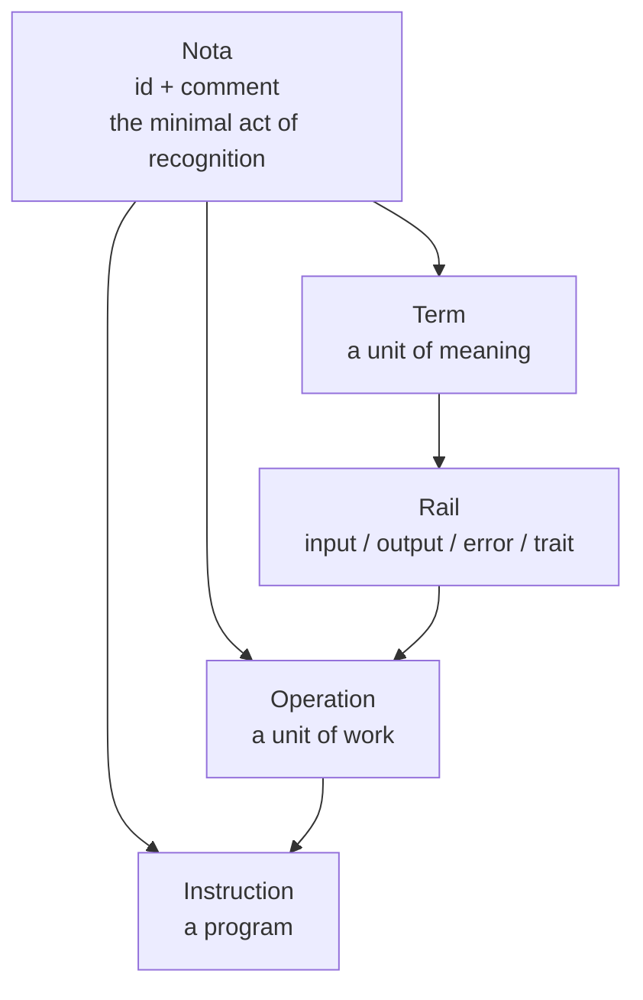

# The Codex

> *"A program without an instruction is not viable. An instruction without a program is not viable."*
>
> — From a discussion about schemas

## The Problem with the List

Take a long, careful look at the instruction schema. Forget for a moment that you already know what it is. Look at it as if you were seeing it for the first time.

You see a version. You see a list of operations. What you don't see is a name.

A list doesn't need a name. A list is just an ordered sequence of things. You can have a list on a scrap of paper and throw it away without ever giving it a title.

But this list is not a scrap of paper. This list is meant to be invoked. Shared. Published. Depended upon. Signed with a digital signature. Deployed into a running process. Distributed across a network of machines that have never met each other and have no context beyond what you give them.

How do you invoke a nameless thing? How do you depend on a thing you cannot name? How do you sign a thing that has no identity?

You can't. A program must be invoked. And you cannot invoke something you cannot name.

## The Problem with the Binary

For a long time, we thought of "the program" as a file. `main.go`. `index.js`. The compiled binary. The running process.

But a file is just a file. It doesn't carry its own identity. The identity is something we attach to it — a name in a package manager, a tag in a container registry, a unit name in a process supervisor. The program is not the binary. The program is what tells you what the binary is.

And what tells you what the binary is? A name. A description. A version. A list of what it can do.

That list of what it can do — those are operations. And the name, the description, the version — those are what we wrap around operations to make them into something you can find, understand, trust, and invoke.

We wrap them in an instruction.

## The Oldest Invention You Use Every Day

This is not a new problem. Humanity solved it two thousand years ago.

Before the codex — before the bound book — there was the scroll. A scroll is a continuous stream. It has no title on its cover, because it has no cover. It has no page numbers, because it has no pages. If you want to find a specific passage, you unroll the scroll until you find it. If you want to cite a passage, you quote the words around it and hope your reader has the same scroll.

A scroll works. It carries its content. But it is not addressable. You cannot point to a specific place in a scroll from another scroll. You cannot build an index. You cannot build a library catalog. A library of scrolls is not a library — it is a warehouse.

The codex gave us the cover. The title on the cover. The numbered page. The table of contents. The index. It made it possible to point at a piece of knowledge and say: *this, right here, chapter three, paragraph four.* It turned knowledge from a stream into a place.

Our instruction, before we gave it an identity, was a scroll.

## The Mutual Dependency

Now here is the thing we argued about:

A program is not an instruction. An instruction is not a program.

They are not the same thing. But one cannot live without the other.

A program without an instruction is a pile of code that no one can find, invoke, or trust. It exists in the dark. It has behavior, but no identity. It is a scroll in a warehouse — it contains something, but no one will ever read it because no one can find it.

An instruction without a program is a title with no pages. A cover with no content. A beautiful entry in a catalog that points to nothing. You can share it, you can name it, you can describe it — but there is nothing to invoke. It is a promise with no fulfillment.

A program without an instruction is not viable. An instruction without a program is not viable.

They need each other. And the way they need each other is strikingly familiar.

## The Turn

An `id` is a name for a machine. It is precise, unambiguous, and completely indifferent to human meaning. An `id` without a `comment` is a pointer to nothing — a machine address with no explanation.

A `comment` is an explanation for a human. It carries meaning, context, and the answer to "what is this for?" A `comment` without an `id` is a note floating in space — human knowledge that cannot be found.

An `id` without a `comment` has no meaning for a person. A `comment` without an `id` has no meaning for a machine.

They are not the same thing. But one cannot live without the other.

We already have a name for this mutual dependency. We already have a primitive for this exact relationship. We found it in Roman law, in musical notation, in diplomatic communication. We found it in every catalog, every registry, every taxonomy, every system of knowledge humanity has ever built.

We call it **Nota**.

## The Instruction as a Nota

An instruction is a Nota over a program.

It is the `id` that makes the program invocable by machines. It is the `comment` that makes the program understandable by humans. It is the act of recognition that turns a pile of operations into something you can find, trust, share, and depend on.

The program provides the operations — the work to be done. The instruction provides the identity — the name and the meaning that make the work discoverable.

Neither is whole without the other. Neither is useful without the other.

When we added `id` and `comment` to the instruction schema, we were not adding new fields. We were recognizing a pattern we had already discovered. We were seeing Nota where we had not seen it before.

## The Tree We Have Built



Look at this tree from the root to the crown.

Nota is the act of recognition — the `id` and the `comment` that together make something distinguishable and meaningful. It lives at the bottom of everything, because everything we build must first be recognized.

A Term carries a Nota. It is a unit of meaning, and it can only be understood because it has been named and described.

A Rail is a direction. It carries Terms, each of which carries a Nota. The direction gives context to the meaning, but it does not replace it.

An Operation carries a Nota of its own. It is a unit of work — named, described, with four rails that define its behavior. It is the heart of the system.

And the Instruction? The Instruction carries a Nota over the whole program. It is the name and the description that make the program invocable and understandable at the highest level.

Nota is how we recognize a Term. Nota is how we recognize an Operation. Nota is how we recognize a Program.

## What We Claim — And What We Do Not

We claim that a program is not an instruction, and an instruction is not a program. They are distinct. But they are not viable without each other.

We claim that this mutual dependency is the same pattern we already discovered in Nota: an `id` without a `comment` is meaningless to humans; a `comment` without an `id` is meaningless to machines. The relationship between program and instruction mirrors the relationship between `id` and `comment` itself.

We claim that by giving the instruction a Nota, we are not inventing a new primitive. We are applying the same primitive at a higher level of organization.

We do not claim to have invented the pattern. Humanity has always wrapped its knowledge in Nota — the codex, the catalog, the registry. We are simply the first to notice that the wrapper is the same thing as what it wraps.

## What Comes Next

The instruction schema now carries a Nota. The `$ref` chain is complete:

```
nota.v1.json
    ↑
rail.v1.json
    ↑
operation.v1.json
    ↑
instruction.v1.json
```

No duplication. No new primitives. Only recognition — at every level.

Nota is how we recognize.
Operation is how we work.
Instruction is how we share.
