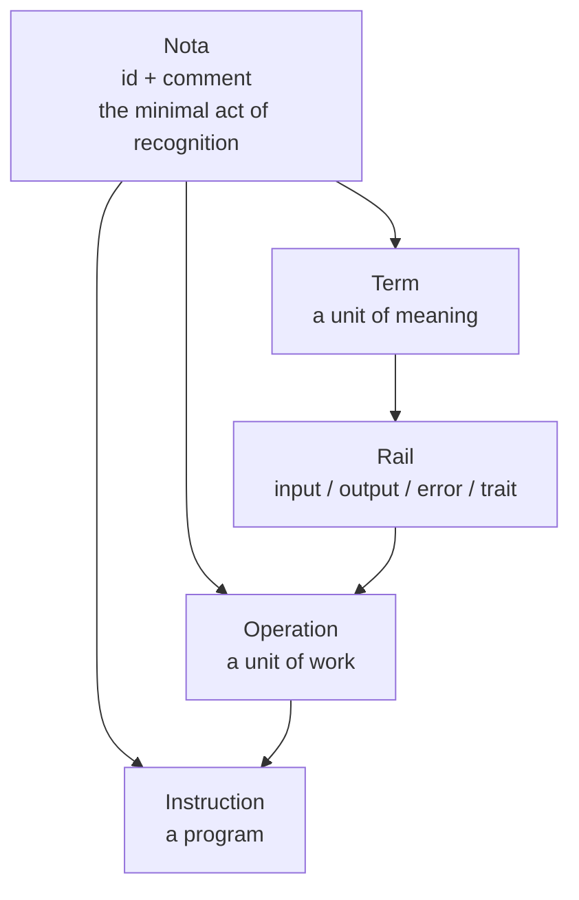

# The Observation

> *"You cannot name something correctly without understanding it within the system. You cannot understand its meaning without naming it correctly."*
>
> — From a conversation hours before this writing

## Naming is not "What do we call it?" — it is "What did we find?"

For years, we told them: naming is not decoration. It is not a question of taste. It is the difference between a thing that exists and a thing that is indistinguishable from noise.

You cannot name a thing correctly without understanding what it is. And you cannot understand what it is without naming it correctly. The name and the understanding are not two steps. They are one step. One breath. One movement of thought.

They answered: *"What difference does it make what you call it? We need to release. Call it whatever — just ship it."*

They believed a name is a label you attach at the end, once everything else is done. Something you can change later. Something that does not affect the architecture.

We knew differently. If you cannot name a thing, you do not know what you have built. And if you do not know what you have built, you have not built it — you have only assembled it. Every time management pushed to "just pick something and move on," the result was technical debt that took years to unwind. The name they rushed became the assumption everyone built upon. Changing it later meant changing the foundation. But there was never time for that either.

A name is not a sticker. A name is the shape of the thing inside the mind.

## The moment the puzzle resolved

It started with a simple observation. Every entity in Op carries an `id` and a `comment`.

- **Operation** — has `id` and `comment`.
- **Term** — has `id` and `comment`.
- **Instruction** — must have `id` and `comment`, because a program that cannot be identified cannot be invoked.

This was not a coincidence. It was a pattern. But we did not immediately understand what we were seeing.

> *"I really liked testimony and record."*

At that moment, we did not yet know that we were looking at something universal. Something that predates programming by two thousand years.

## The pattern that hides in plain sight

We started looking. Not at code. At humanity.

- **Roman law**: the censor's *nota* — an official mark placed beside a citizen's name, testifying to their standing without altering the law.
- **Biology**: Linnaean taxonomy — every species has a Latin binomial (`id`) and a type description (`comment`).
- **Medicine**: the ICD code (`id`) and the clinical description (`comment`).
- **Law**: every statute has a number (`id`) and a text (`comment`).
- **Libraries**: the ISBN (`id`) and the bibliographic entry (`comment`).
- **Music**: a note on the staff is both instruction (which pitch to play) and action (recorded on the score).
- **Software**: every package in a registry has a name (`id`) and a description (`comment`).

Every system humanity has ever built for organising knowledge — from clay tablets to Kubernetes — uses the same two fields. Always two. Never one. Never zero.

We were not inventing a convention. We were uncovering a pattern — one that has repeated, without exception, across thousands of years of human practice.

## What this pair actually is

`id` and `comment` are not metadata. They are not documentation. They are not an afterthought.

They are the **minimal act of recognition**. The smallest contract a thing can make with the human mind.

- **`id`** answers the question: *Which thing?* It makes the thing distinguishable from every other thing. Without it, the thing is indistinguishable from noise.
- **`comment`** answers the question: *What is it, for us?* It makes the thing understandable to the people who encounter it. Without it, the thing is distinguishable — but meaningless.

Together, they perform a single act: **to testify that a thing exists, and to note what it is.**

We called this act **Nota**.

## Why "Nota"

We searched across languages, disciplines, and centuries. We considered *record*, *label*, *descriptor*, *testimony*, *certificate*. None of them carried the full weight.

Then we found it: **Nota**. Latin. A mark. A sign. A note.

In Roman law, a censor's *nota* was an official mark beside a citizen's name. It did not change the law, but it changed how the law saw that citizen. It was a testimony, not a modification.

In music, a *nota* is the fundamental unit of a composition. It is at once the instruction (which note) and the recording (on the staff).

In diplomacy, a *nota* is an official communication. A statement from one party to another that says: this is our position.

In Russian, "нота" carries all of this. A diplomatic note. A musical note. A mark in the margin for someone who understands.

A Nota does not create a fact. It records one. It does not describe — it testifies. It is not a specification. It is a witness.

This was the word we had been looking for.

## The anatomy of Nota

A Nota consists of exactly two fields:

| Field     | Type     | Meaning                                             |
|-----------|----------|-----------------------------------------------------|
| `id`      | `string` | Machine-readable identifier. One word. One meaning. |
| `comment` | `string` | Human-readable note. Where humanity lives.          |

That is all. Two fields. No more. No less.

And yet, these two fields are sufficient to perform the act of recognition for every entity in Op:

- **A Term** carries a Nota: what this unit of meaning is called, and what it is for.
- **An Operation** carries a Nota: what this unit of work is called, and what it does.
- **An Instruction** carries a Nota: what this program is called, and what it is for.

The same structure at every level. The same two fields. The same act.

## What we claim — and what we do not

**We claim** that humanity has always used the pair `id` + `comment` as a minimal act of recognition. We hypothesize that this pattern is not a convention — it is a primitive. A fundamental form. Not invented by us. Observed.

**We claim** that the word "Nota" is the correct name for this act. It carries the weight of law, music, and diplomacy without the baggage of any specific framework, language, or transport.

**We do not claim** to be the first to notice the pattern. Humanity has been living inside it for millennia. Every librarian, every biologist, every lawyer, every programmer has touched it. We are simply giving it a formal definition and a proper name — perhaps for the first time, perhaps not.

**We do not claim** that the name "Nota" is final. It has survived cross-disciplinary scrutiny and adversarial review, but it is falsifiable — like every other claim in Op. If someone proposes a better name, we will test it. If it fits better, we will change. That is how science works.

## What comes next

Nota is a root primitive. It lives beneath Term, beneath Rail, beneath Operation, beneath Instruction. Every entity in Op now carries a Nota — explicitly, through `$ref`, as a single indivisible act of recognition.

The schema is real. The definition is formal. The journal entry is written.

Nota is no longer just a word. Nota is our working name for this primitive. The minimal act of recognition. The smallest thing that still works — for humans, for machines, for anyone who needs to say: *this exists, and this is what it is. At least in the context of OP.*
