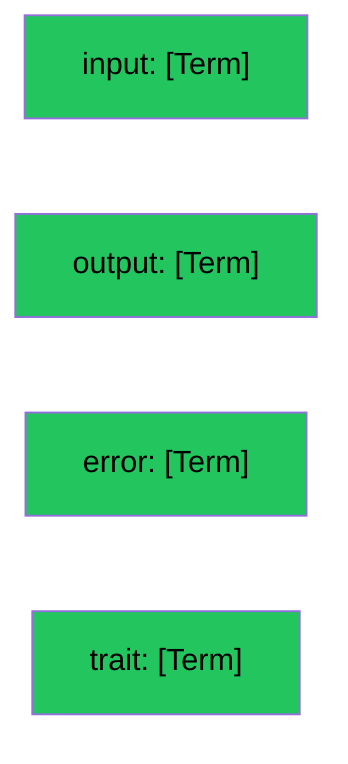

# The Rails

We spent 4 years finding the operation.

We spent 4 days finding the rails.

This devlog explains why one took forever and the other took nothing.

## The Operation Problem

The operation is the hard part. Not because it's complex — because it's new.

We looked at every system that ever existed. Quantum mechanics. Thermodynamics. Biology. Neurons. CPU instructions. Syscalls. Lambda calculus. REST. Game theory. Economics. Law. Linguistics. Cybernetics.

Thirteen domains. Every one of them has input, output, and failure. But none of them call it "operation." The word was missing. We had to find it, which meant we had to understand what we were looking for.

Four years.

## The Rail Problem

The rails are different.

Input. Output. Error. Trait.

We already knew these words. Everyone does. Every programmer has seen input and output. Every sysadmin has seen error codes. Every API designer has seen traits — they just called them headers or metadata or annotations.

[Dima](https://github.com/GurovDmitriy) saw that trait was a special case and asked: why? That question gave us four rails instead of three.

The rails were not a discovery. They were a recognition.

When we looked at what makes a system a system — any system, from a quantum measurement to a syscall — we kept seeing the same four directions:

- **In** — the data that arrives
- **Out** — the data that leaves on success
- **Fail** — the data that leaves on failure
- **About** — what the operation is like

We didn't invent these. We just named them.

## The Puzzle

We needed four names. We had four words. They fit perfectly.

```
input    — the in-rail
output   — the out-rail
error    — the fail-rail
trait    — the about-rail
```

No collision. No ambiguity. No fighting.

The operation was a puzzle we had to build from scratch. The rails were a puzzle we already had the pieces for — we just hadn't noticed they were lying on the table.

## The Format

Each rail is an array of terms. Same structure everywhere.



One format. Four directions. Term everywhere.

## The Asymmetry

Why does the operation take longer than the rails?

Because the operation is the new thing. It's the hypothesis that "operation" is the word for "a named interaction that takes input, produces output, can fail, and has character."

We had to prove that. With thirteen domains. With physics. With logic. With examples from every field that ever described a transformation.

The rails are just naming. We saw four directions. We named them. Done.

## What This Devlog Establishes

The rails came for free because they were always there. Input. Output. Error. Trait. Four words for four directions. Every system has them.

The operation came hard because it was the missing word. The word that ties all four rails together into one thing. The word that makes a pile of directions a coherent entity.

Four years for the operation. Four days for the rails.

The asymmetry is not a bug. It's a feature. It tells us we found something real — the operation was hard because it was new, and the rails were easy because they were always there.